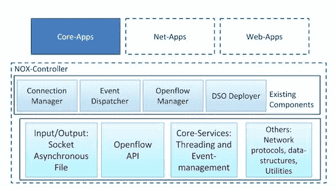

# SDN 系列第三部分:NOX，最初的 OpenFlow 控制器

> 原文：<https://thenewstack.io/sdn-series-part-iii-nox-the-original-openflow-controller/>

编者按:这是关于软件定义的网络的多部分系列的第三部分。可以找到该系列的其他帖子

[here](https://thenewstack.io/?s=sdn)

.

NOX 是最初的 OpenFlow 控制器。它充当网络控制平台，为网络控制应用程序的管理和开发提供高级编程接口。它的全系统抽象将网络变成了一个软件问题。

在我们深入探讨之前，让我澄清一下 NOX 版本:

[NOX](http://www.noxrepo.org/)——最初由 [Nicira Networks 开发，现在与 OpenFlow 一起归 VMware](https://www.vmware.com/products/nsx/) 所有——于 2009 年首次引入社区。这后来被分成多条不同的发展路线:

1.  [NOX classic](https://github.com/noxrepo/nox-classic) :这是自 2009 年以来在 GPL 下可用的版本。
2.  氮氧化物:“新氮氧化物”仅包含对 C++的支持，应用程序比 classic 少；然而，这个版本速度更快，代码库更好。
3.  POX:通常被称为 NOX 的兄弟。提供 Python 支持。

在本文中，为了保持一致性，每当我使用术语 NOX 时，我都称之为“新 NOX”。下表总结了 Nox classic 和 Nox 之间的差异。

NOX 旨在提供一个平台，使开发者和研究人员能够在企业网络中以开发新应用的形式进行创新。氮氧化物的应用通常决定了每个流量在网络中的路由或不路由。

## 氮氧化物结构

下图 1 描述了氮氧化物的结构。除了用于与 OpenFlow 交换机交互的 OpenFlow APIs 和 I/O 操作支持之外，NOX 核心还提供了帮助方法，如网络数据包处理、线程和事件引擎。

在顶部，我们有应用程序:核心，网络和网络。但目前的 NOX 版本，只有两个核心应用:OpenFlow 和 switch，网络和 web 应用都缺失。中间层显示了氮氧化物的固有成分。连接管理器、事件调度器和 OpenFlow 管理器是不言自明的，而动态共享对象(DSO)部署器基本上是扫描目录结构，查找作为 DSO 实现的任何组件。

我想强调的是，所有的应用程序都可以被看作是组件，正如上一节所描述的，所有的应用程序都继承自 component 类。因此，NOX 应用通常由提供所需功能的协作部件组成。简而言之，组件封装了 NOX 可用的特定功能。

[](https://thenewstack.io/wp-content/uploads/2014/12/SDN3.png)

图 1:氮氧化物结构

事件系统是 NOX 控制器的另一个重要概念。

事件代表网络中的低级或高级事件。通常，事件只提供信息，信息的处理被委托给处理程序。许多事件大致与网络上发生的可能与 NOX 成分有关的事情相关。这些组件通常由一组事件处理程序组成。从这个意义上说，事件驱动了 NOX 中的所有执行。

NOX 事件可以大致分为核心事件和应用事件。核心事件直接映射到受控交换机接收的 OpenFlow 消息，例如:

除了核心事件之外，组件本身可以定义并抛出更高级别的事件，这些事件可以由任何其他事件来处理。尽管 NOX 不包含任何此类应用程序事件，但考虑到它具有最小的应用程序集，NOX classic 具有各种事件，例如认证器应用程序的**主机事件**和**流事件**，以及发现应用程序的**链接事件**。

最后，我想强调一下 NOX 架构的一个重要功能——组件与核心之间以及组件之间的相互作用。NOX 包括一个称为容器的概念，也称为内核。内核不直接操作组件，而是操作组件上下文，组件上下文包含所有组件信息，包括组件实例本身。该对象包含用户为组件定义的解析配置和任何命令行参数。应用程序为容器提供了一个组件工厂。在加载组件时，容器通过调用 **get_factory()** 请求一个工厂实例，然后使用工厂构造(并销毁)所有组件实例。另一方面，为了访问容器和发现其他组件，容器为它们传递一个上下文实例。

## 运行氮氧化物

NOX 必须由 build/src 目录中的命令行调用。一般来说，启动控制器的命令是这样的:

```
./nox_core  [OPTIONS]  [APP[=ARG[,ARG]...]]  [APP[=ARG[,ARG]...]]...

```

例如，以下将启动 NOX，在端口 6633(OpenFlow 协议端口)上监听来自 OpenFlow 交换机的传入连接:

```
./nox_core  -v  -i  ptcp:6633

```

此时，NOX 的核心正在运行；然而，虽然开关现在可以连接到控制器，但 NOX 不会对它们施加任何行为。

NOX 旨在为整个网络提供控制逻辑，例如处理流量工程、路由、认证、访问控制、虚拟网络创建、监控和诊断。然而，NOX 本身不做这些事情。相反，它为执行有用功能的网络组件提供了编程接口。因此，为了赋予 NOX 网络生命，上面的命令中缺少的是 NOX 应该运行的组件。例如，下面的命令:

```
./nox_core  -v  -i  ptcp:6633  switch

```

将使交换机充当常规 MAC 学习交换机。

## Nox 开发应用程序(C++应用程序)

让我们使用 switch 程序(src/coreapps/)作为如何扩展 NOX 的示例。Switch 是一个非常简单的应用程序，它执行以下操作:

*   学习 MAC 地址。
*   如果目标地址已知，则添加流。

因此，交换机应用程序将对以下事件感兴趣:

*   每当数据路径(交换机)加入时。
*   每当数据路径(交换机)离开时。
*   包入。

类开关提供了一个简单组件的例子。所有组件必须具有以下结构:

```
class Switch   :  public Component

```

为了维护学习到的 MAC 地址，交换机需要一个表:

```
mac_table_map mac_tables;

```

**mac_table_map** 是一个 **hash_map** 来存储 **mac_address** ，将其映射到数据路径 id。

一个组件必须从一个类组件继承，有一个与 hub 的构造函数相匹配的构造函数，并包含一个带有外部链接的 **REGISTER_COMPONENT** 宏来帮助动态加载器。

```
REGISTER_COMPONENT(Simple_component_factory&lt;Switch&gt;,  Switch);

```

组件还必须有一个元。JSON 文件与组件驻留在同一目录中。启动时，NOX 在目录树中搜索元。JSON 文件，并使用它们来确定系统上可用的组件及其依赖关系。

方法“configure”和“install”在加载时调用——先配置后安装——用于注册事件和注册事件处理程序。

所有的应用程序将有以下两个重要的功能:

### 1.void configure()；

该函数通常负责注册必要的事件。如上所述，使用下面的 API 切换三个事件的寄存器:

```
register_handler("Openflow_datapath_join_event",  handle_datapath_join);

```

```
register_handler("Openflow_datapath_leave_event",   handle_datapath_leave  );

```

```
register_handler("ofp_packet_in",  handle_packet_in);

```

这些事件处理程序执行必要的动作。 **handle_datapath_join** 和 **handle_datapath_leave** 适当更新 **mac_tables** 。而 **handle_packet_in** 执行学习 MAC 地址和添加流的操作。下表总结了此处理程序使用的一些重要的 OpenFlow APIs:

### 2.void install() {}

在安装功能中执行的操作通常取决于应用。例如，一些应用程序可以启动任何线程或任何套接字操作。在交换机应用程序中，安装操作不包括任何操作。

总之，NOX 是一个开放源代码、开放流控制器，它为用 C++编写网络控制软件提供了一个良好而简单的平台。

<svg xmlns:xlink="http://www.w3.org/1999/xlink" viewBox="0 0 68 31" version="1.1"><title>Group</title> <desc>Created with Sketch.</desc></svg>