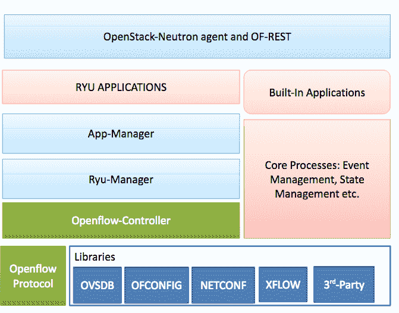
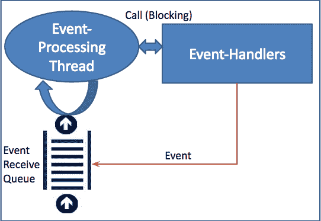

# SDN 系列第四部分:Ryu，NTT 实验室支持的功能丰富的开源 SDN 控制器

> 原文：<https://thenewstack.io/sdn-series-part-iv-ryu-a-rich-featured-open-source-sdn-controller-supported-by-ntt-labs/>

编者按:这是关于软件定义的网络的多部分系列的第四部分。该系列的其他帖子可以在这里找到[。](https://thenewstack.io/?s=sdn)

Ryū (竜 ) in Japanese stands for dragon, flow and a school of thought. In this article, we will discuss an SDN controller, Ryu, with a dragon in its logo, through which operations flow. Ryu is commonly referred to as component-based, open source software defined by a networking framework. It is implemented entirely in Python, and supported by NTT’s labs. Like other SDN controller frameworks, Ryu also provides software components with well-defined APIs that are exposed to allow developers to create new network management and control applications. One of the strengths of Ryu is that it supports multiple southbound protocols for managing devices, such as OpenFlow, Network Configuration Protocol (NETCONF), OpenFlow Management and Configuration Protocol (OF-Config), and others.

## Ryu 的建筑

就像任何 SDN 控制器一样，Ryu 也可以创建和发送 OpenFlow 消息，侦听 flow_removed 等异步事件，并解析和处理传入的数据包。下面的图 1 描述了 Ryu 控制器框架的架构:



图 1: RYU 架构

让我们看看该架构的一些重要组件。

### 柳库

Ryu 拥有令人印象深刻的库集合，从支持多种南向协议到各种网络包处理操作。关于南向协议，Ryu 支持 OF-Config、Open vSwitch 数据库管理协议(OVSDB)、NETCONF、XFlow (Netflow 和 Sflow)等第三方协议。Netflow 由 Cisco 和其他公司支持，并且特定于 IP。Netflow 和 Sflow 协议支持数据包采样和聚合，主要用于网络流量测量。第三方库包括 Open vSwitch Python 绑定、Oslo 配置库和一个用于 NETCONF 客户端的 Python 库。Ryu 数据包库帮助您解析和构建各种协议数据包，如 VLAN、MPLS、GRE 等。

### OpenFlow 协议和控制器

Ryu 支持 OpenFlow 协议直到最新版本 1.4。它包括一个 OpenFlow 协议编码器和解码器库。此外，Ryu 架构的关键组件之一是 OpenFlow 控制器，它负责管理用于配置流、管理事件等的 OpenFlow 交换机。OpenFlow 控制器是 Ryu 架构中的内部事件源之一。下表总结了 Ryu OpenFlow 协议消息、结构和相应的 API。

### 经理和核心流程

Ryu 管理器是主要的可执行文件。当它运行时，它侦听指定的 IP 地址(例如:0.0.0.0)和指定的端口(默认为 6633)。随后，任何 OpenFlow 交换机(硬件、Open vSwitch 或 OVS)都可以连接到 Ryu 管理器。应用程序管理器是所有 Ryu 应用程序的基础组件。所有应用程序都继承自应用程序管理器的 RyuApp 类。该架构中的核心流程组件包括事件管理、消息传递、内存状态管理等。有趣的是，Ryu 消息服务确实支持用其他语言开发的组件。

### RYU 北行

在 API 层，Ryu 包括一个 Openstack Neutron 插件，支持基于 GRE 的覆盖和 VLAN 配置。Ryu 还支持其 OpenFlow 操作的 REST 接口。此外，使用 WSGI(Python 中连接 web 应用程序和 web 服务器的框架)，可以很容易地将更新的 REST APIs 引入到应用程序中。

### RYU 应用程序

Ryu 分布着多个应用，比如一个 **simple_switch** ，路由器，隔离，防火墙，GRE 隧道，拓扑，VLAN 等。Ryu 应用程序是实现各种功能的单线程实体。Ryu 应用程序相互发送异步事件。Ryu 应用程序的功能架构如图 2 所示。



图 Ryu 应用程序的功能架构

每个 Ryu 应用程序都有一个事件接收队列，主要是 FIFO 来保持事件的顺序。此外，每个应用程序都包括一个线程，用于处理队列中的事件。线程的主循环从接收队列中弹出事件，并调用适当的事件处理程序。因此，在事件处理线程的上下文中调用事件处理程序，该线程以阻塞方式工作，即，当事件处理程序被给予控制权时，将不再处理 Ryu 应用程序的事件，直到控制权返回。

Ryu 应用程序可以通过向 Ryu 管理器传递一个配置文件来运行和配置:

```
ryu-manager  [--flagfile  &lt;path to configuration file&gt;]  [generic/application specific options...]

```

一个重要的通用选项是 **app_lists** ，它包括要运行的应用模块名称。

## 用 Ryu 编写应用程序

在本节中，我们将编写一个 Ryu 应用程序，使 OpenFlow 交换机作为第 2 层交换机工作。Ryu 应用程序是一个 Python 模块，它定义了 **ryu.base.app_manager 的子类。RyuApp** 。如果在一个模块中定义了两个或更多这样的类，应用程序管理器将选择第一个类(按名称顺序)。Ryu 应用程序是单例的:只支持给定 Ryu 应用程序的单个实例。

在我们的例子中，我们称我们的开关为 MySwitch。它继承自基类 app_manager。RyuApp，并定义为:

```
from ryu.base import app_manager

from ryu.controller import ofp_event

from ryu.controller.handler import MAIN_DISPATCHER

from ryu.controller.handler import set_ev_cls

class MySwitch(app_manager.RyuApp):

def __init__(self,  *args,  **kwargs):

super(MySwitch,  self).__init__(*args,  **kwargs)

```

Ryu 应用程序既可以引发事件，也可以接收事件。为了引发事件，Ryu 应用程序调用适当的**Ryu . base . app _ manager**Ryu app 方法，如 **send_event** 或**send _ event _ to _ observers**API。Ryu 应用程序可以使用**Ryu . controller . handler . set _ ev _ cls**decorator 注册自己来监听特定事件。这个装饰器告诉 Ryu 何时应该调用被装饰的函数。 **set_ev_cls** decorator 的第一个参数表示感兴趣的事件，它触发下面的函数调用。第二个参数表示开关的状态。例如，如果应用程序希望在 Ryu 控制器和交换机之间的协商完成之前忽略 **packet_in** 消息，它可以使用 **MAIN_DISPATCHER** 作为第二个参数，这表示只有在协商完成之后才调用下面的函数。

在我们的例子中，我们的应用程序对 **packet_in** 事件感兴趣，每次 Ryu 控制器收到一个 **packet_in** 消息时，都应该调用一个处理函数。此外，我们的应用程序能够将收到的数据包发送到所有端口。我们可以将这些操作定义为:

```
@set_ev_cls(ofp_event.EventOFPPacketIn,  MAIN_DISPATCHER)

def packet_in_handler(self,  ev):

msg  =  ev.msg

dp  =  msg.datapath

ofp  =  dp.ofproto

ofp_parser  =  dp.ofproto_parser

actions  =  [ofp_parser.OFPActionOutput(ofp.OFPP_FLOOD)]

out  =  ofp_parser.OFPPacketOut(

datapath=dp,  buffer_id=msg.buffer_id,  in_port=msg.in_port,

actions=actions)

dp.send_msg(out)

```

让我们更详细地看看 **packet_in_handler** 函数。每当接收到 **packet_in** 消息，就会调用 **packet_in_handler** ，这是通过 **set_ev_cls** API 实现的。 **ev.msg** 是表示 **packet_in** 数据结构的对象，而 **msg.datapath** 表示数据路径(交换机)。因此， **dp.ofproto** 代表 Ryu 和交换机之间协商的 OpenFlow 协议。proto_parser 的**解析传入的 **packet_in** 消息。**

一旦我们收到 **packet_in** 消息，我们需要通过 **packet_out** 消息将其转发到所有端口。OFPActionOutput 类与 **packet_out** 消息一起使用，以指定您要从中发送数据包的交换机端口。因为我们需要将它发送到所有的端口，所以使用了**OFPP _ 洪水**端口。PacketOut 类的**用于构建 **packet_out** 消息。最后，我们需要用一个 OpenFlow 消息类对象调用数据路径类的 **send_msg** 方法，让控制器构建消息并发送给交换机。**

这样，我们就完成了 Ryu 应用程序的编写，可以运行了。由于 Ryu 应用程序只是一个 Python 脚本，我们可以用任何名称和扩展名保存文件。假设我们将上述代码放在一个名为 **myswitch.py** 的文件中，这个应用程序可以使用 Ryu manager 命令运行:**% Ryu-manager my switch . py**。

作为结束语，Ryu 是一个开源的 SDN 控制器，具有丰富的功能，并且在不断发展。Ryu 也被 Pica8 等商业供应商用于他们的解决方案中。Ryu 开发人员正在添加更多的组件并提供更好的抽象，这是我们开发人员应该认真考虑的 SDN 控制器之一。

<svg xmlns:xlink="http://www.w3.org/1999/xlink" viewBox="0 0 68 31" version="1.1"><title>Group</title> <desc>Created with Sketch.</desc></svg>