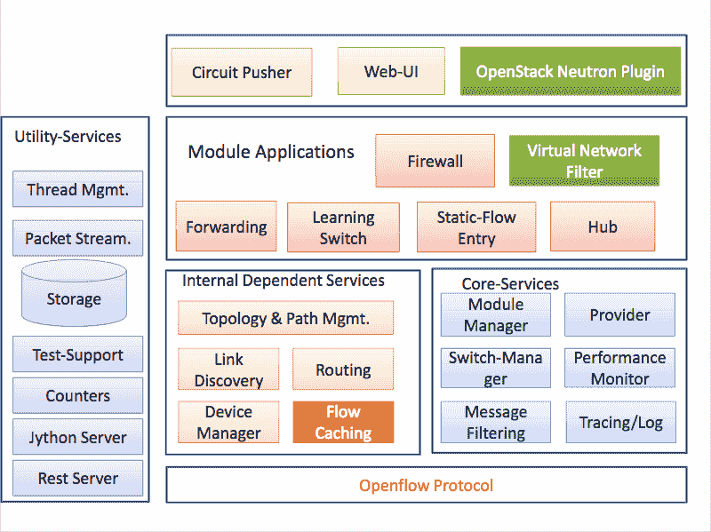
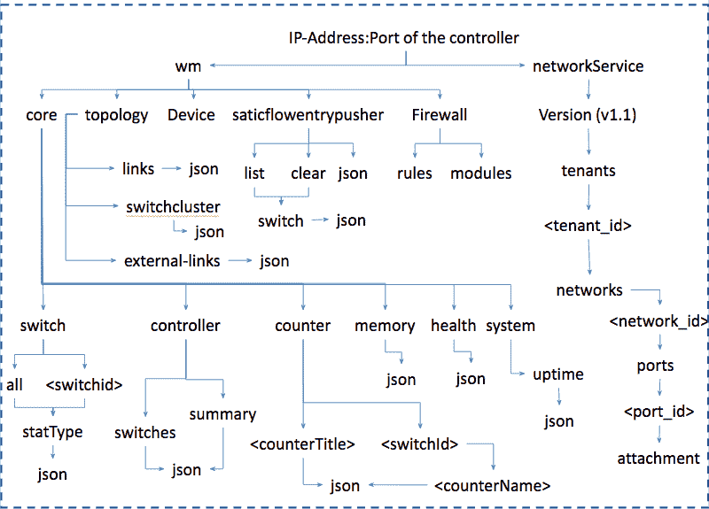
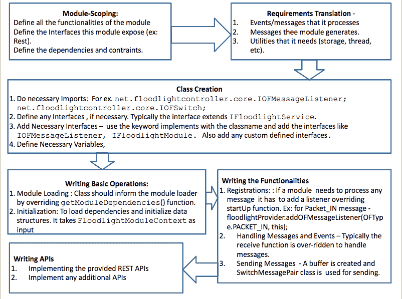

# SDN 系列第五部分:泛光灯，一种 OpenFlow 控制器

> 原文：<https://thenewstack.io/sdn-series-part-v-floodlight/>

这是关于软件定义的网络的系列文章的第五部分。可以找到该系列的其他帖子

[here](https://thenewstack.io/?s=sdn)

.

Beacon 是由斯坦福大学的 David Erickson 开发的开源 SDN 控制器，我们不会在本系列中讨论它。相反，在本部分中，我们将讨论以信标控制器为基础的泛光灯 SDN 控制器。然而，毫无疑问，与 Beacon 相比，泛光灯已经突飞猛进，成为最受欢迎的开源 SDN 控制器之一，下载量超过 15，000 次。泛光灯也被认为在功能和性能方面更好。

泛光灯控制器，一个 Apache 许可的基于 Java 的 OpenFlow 控制器，是[大交换网络](http://www.bigswitch.com/)对开源社区的重大贡献之一。泛光灯的架构是基于大网络控制器(BNC)，该公司的商业产品。任何开发人员为泛光照明控制器编写的应用程序都可以通过 BNC 认证。因此，由于泛光灯是大开关产品的核心元素之一，可以合理地假设该公司会支持它。

在我们深入研究泛光灯控制器之前，我想澄清一下“泛光灯”这个术语，因为它是由 Big Switch 的开源程序使用的。术语“项目泛光灯”是一个总括术语，涵盖多个项目，如泛光灯控制器、Indigo、LoxiGen 和 OFTest。在本文中，泛光灯仅用于指代 SDN 控制器。

就像许多其他控制器一样，当您运行泛光灯时，控制器的北向和南向操作都会激活。也就是说，当您运行泛光灯时，控制器和一组已配置的模块应用程序也将运行。所有正在运行的模块公开的北向 REST APIs 通过指定的 REST 端口变得可用。任何应用程序都可以通过发送 http REST 命令与控制器进行交互(检索信息和调用服务)。另一方面，在南向，泛光灯的提供商模块将开始在 OpenFlow 指定的 TCP 端口上监听来自 OpenFlow 交换机的连接。

泛光灯，目前支持 OpenFlow 1.0。1.3 和 1.4 版本正在开发中。凭借可扩展的 Java 开发环境和企业级核心引擎，泛光灯是一款易于使用且功能强大的 SDN 控制器。在下一节中，我们将讨论架构，然后讨论在泛光灯控制器上编写应用程序。

## 泛光建筑

术语“模块化架构”用于描述泛光灯控制器的架构，如下图所示。核心架构包括各种模块，如拓扑管理、设备/终端站管理、路径/路由计算、web 访问基础设施(管理)、计数器存储(OpenFlow 计数器)和状态存储系统，这些模块由模块管理系统很好地缝合在一起。下面我们将描述控制器架构的一些重要组件。



*图-1 泛光照明建筑*

## **基于 Rest-API 的应用**

泛光灯很少有使用外露 REST APIs 的应用程序。Circuit Pusher 利用泛光灯 rest APIs，通过在构成路径的所有交换机中添加流条目，在任意两个 IP 可寻址设备之间建立路径。除了电路推进器之外，泛光灯还可以使用[中子插件](https://wiki.openstack.org/wiki/Neutron)作为 OpenStack 的网络后端运行。该解决方案有两个主要组件:

实现泛光灯控制器和 OpenStack 中子连接的 RestProxy。

VirtualNetworkFIlter 实现中子 API。VirtualNetworkFilter 模块实现基于 L2 地址的网络隔离，不依赖于 OpenStack-Neutron，可以通过配置文件激活。然而，RestProxy 插件被设计为作为 OpenStack 中子服务的一部分运行。

## **内置模块应用**

泛光灯在其分布中包括多种应用，下面我总结几个。通常，如果开发者对开发 SDN 应用感兴趣，这些应用是他/她了解 API 用法的好地方。这适用于所有 SDN 控制器，而不仅仅是泛光灯。

顾名思义，转发应用程序可以在任何两个可能通过 OpenFlow(或非 OpenFlow)交换机连接的设备之间转发数据包。学习交换机与我们在 NOX/RYU/Trema 中看到的一样，而集线器应用程序只是将任何传入的数据包泛洪到所有其他活动端口。静态流条目推送器只是使用 OpenFlow 的 flow-mod 消息在任何指定的交换机中添加一个 OpenFlow 流条目(匹配+动作)。如上所述，VirtualNetworkFilter 是基于 MAC 地址的网络切片应用。最后，有一个防火墙应用程序来应用 ACL(访问控制列表)规则，这些规则不过是一组条件，用于根据某组策略来控制(允许或拒绝)流量。

## **核心、内部和公用服务**

关于任何 SDN 控制器，我们需要注意的重要一点是，内置服务定义了控制器的功能，这些服务是北向应用程序使用的服务。相应地，泛光灯包括从发现网络状态和事件到启用交换机通信支持到存储、线程和 web-UI 等实用程序的服务。下面我们将总结一些服务

如前所述，泛光灯控制器是 BigSwitch network 的泛光灯项目的一部分。Big Switch 还提供了一个开源代理，名为 Indigo，已经集成到商业产品中。此外，Big Switch 还为开源的 OpenFlow 库生成器 Loxi 提供了多语言支持，以解决 OpenFlow 中多版本支持的问题。

作为一个开发环境，泛光灯完全基于 Java。构建和调试工具是可用的。在接下来的两节中，我们将从开发者的角度讨论泛光灯。

## **泛光灯控制器复位**

泛光灯包括一个 RestAPI 服务器，它使用 Restlets 库。使用 restlets，任何开发的模块都可以通过 IRestAPI 服务公开额外的 REST APIs 通常，依赖 REST server 的模块通过在类中实现 RestletRoutable 来公开 API。控制器本身提供了一组可扩展的 REST APIs 来获取和设置各种类型的信息。REST API 是开发利用泛光灯支持特性的应用程序的推荐接口。

一旦泛光灯启动并运行，就可以使用控制器中已经支持的 API。图-3 总结了泛光灯支持的各种功能。例如，下面的 curl 命令获取连接到 IP 地址为 10.0.0.1 的控制器的交换机。

```
curl http://10.0.0.1:8080/wm/core/controller/switches/json

```



*图-2 泛光灯支架 API 结构。*

## **泛光灯如何写一个模块:**

在我们之前的文章中，在描述基于 SDN 控制器编写应用程序的过程时，我们进行了一个案例研究，并将其描述为一个循序渐进的过程。然而，对于泛光灯来说，存在大量的关于[写入模块](http://docs.projectfloodlight.org/display/floodlightcontroller/How+to+Write+a+Module)和[添加服务](http://docs.projectfloodlight.org/display/floodlightcontroller/How+to+Add+Services+to+a+Module)的文档。因此，在本文中，我们将用一个简单的图来总结整个过程。读者可以阅读[5，6，7]中的一个具体例子。



*泛光灯写模块 Fl 图流程。*

如上图所示，该流程包括界定模块功能，然后将这些要求转化为具体的事件、消息和实用程序。一旦列出了需求，就声明并实现了与这些功能相匹配的类——包括处理消息、事件和实现公开的 API。

总之，受 Beacon 的启发，基于 OpenFlow 的泛光灯控制器由一组丰富的模块组成，其中每个模块都提供一个可以通过简单的 Java API 或 REST API 访问的服务。

斯里达尔于 2007 年获得新加坡国立大学的计算机科学博士学位，于 2000 年获得印度苏拉特卡尔 KREC 大学的计算机科学硕士学位，并于 1997 年 8 月获得印度班加洛尔大学 Tumkur 分校的仪器仪表和电子工程学士学位。他曾担任印度 SRM 研究院的研究主管，意大利都灵理工大学微软创新中心的博士后研究员，以及新加坡信息通信研究院(I2R)的研究员。他从事过各种开发和部署项目，涉及 ZigBee、WiFi 和 WiMax。斯里达尔目前在 NEC 技术印度有限公司担任集团技术专家。斯里达尔的研究兴趣主要在下一代有线和无线网络领域，如 OpenFlow、软件定义网络、基于认知网络的软件定义无线电系统、Hotspot 2.0 和物联网。

<svg xmlns:xlink="http://www.w3.org/1999/xlink" viewBox="0 0 68 31" version="1.1"><title>Group</title> <desc>Created with Sketch.</desc></svg>