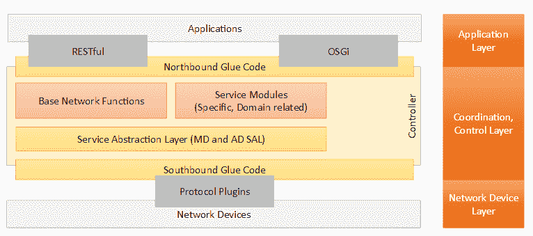

# SDN 系列第六部分:OpenDaylight，文档最多的控制器

> 原文：<https://thenewstack.io/sdn-series-part-vi-opendaylight/>

编者按:这是关于软件定义的网络的多部分系列的第六部分。该系列的其他帖子可以在这里找到[。](https://thenewstack.io/?s=sdn)

模块化应用程序开发是最成功的软件开发实践之一，在这种开发中，一组松散耦合的模块可以集成到一个大型应用程序中。术语“松散耦合”强调了这样一个事实，即模块既相互独立，又可以相互通信。OSGI(开放服务网关倡议)是一个用于 Java 的动态模块系统，它为模块化应用程序开发定义了一个这样的体系结构。我们将在本文中讨论的 SDN 控制器 [OpenDaylight](http://www.opendaylight.org/) (ODL)就是这样一种基于 OSGi 架构的控制器(除了信标/泛光灯)。ODL 是一个开源合作项目，专注于构建一个多厂商、多项目的生态系统，以鼓励创新和开放/透明的 SDN 方法。我们需要看看这些术语，“开放”、“多供应商”、“多项目”、“创新”等等。，详细地去真正体会 ODL 的长处。

ODL 由 [Linux 基金会](http://www.linuxfoundation.org/)管理，拥有广泛的行业支持，会员覆盖 40 多家公司，如思科、IBM、NEC 等。项目侧重于向控制器添加特定的功能。ODL 经常被吹捧为一个旨在“塑造 SDN 未来”的开源框架——主要是因为它为开发者提供了一个贡献、使用甚至构建商业产品的开放平台。正如 Brocade 的 David Meyer 所说:

> OpenDaylight 可以像 Linux 为计算行业所做的那样为网络做贡献。

毫无疑问，ODL 是最成功的开源 SDN 控制器，这要归功于成员公司之间的成功合作和现有成员的出色承诺。成员公司在资金和人力资源方面的承诺是项目成功的主要原因。为了突出参与 ODL 的成员的承诺，最近成立了一个专门的官方安全响应小组，以创建一个正式的内部流程来处理严重漏洞披露后的安全问题。事实上，OpenDaylight 是记录最完整的控制器，拥有众多媒介，如 wiki、IRC、listservs、meetup groups、hackfests、summits 和视频教程，任何人都可以理解和使用，并开始为 ODL 做出贡献。对于初学者来说，视频教程和维基可以作为一个很好的起点。

与我们看到的其他控制器类似，ODL 也支持通过南向协议、一组可编程网络服务、一组北向 API 和一组应用程序进行网络编程。然而，正如我们将在下面的章节中看到的，ODL 在所有这些方面都比其他管制员更好。

## ODL 建筑

考虑到 OpenDaylight 包括多个组件和项目，如果我们首先看一下简化的架构，如图 1 所示，然后看一下详细的架构，如图 2 所示，可能会对读者有所帮助。如图 1 所示，该架构主要包括三层:

1.  构成网络设备层的南向插件和协议。
2.  服务适配和网络功能形成协调和控制层。
3.  构成应用层的北向 API 和应用程序

***图 1:简化的 ODL 架构***

***图 2:ODL 详细建筑***

控制器就像 OpenDaylight 生态系统中的中间件。该框架将需要网络设备服务的应用和与网络设备对话以提取服务的协议粘合在一起。控制器允许应用程序不知道网络设备的规格，从而允许应用程序开发人员专注于应用程序功能的开发，而不是编写设备专用的驱动程序。

图 2 给出了 ODL 架构的详细图片。在本节的剩余部分，我们将描述该架构的所有重要组件。

## 南行协议

南向接口能够支持多种协议(作为单独的插件)，例如 OpenFlow 1.0、OpenFlow 1.3、BGP-LS、LISP、SNMP 等。这些模块被动态地链接到服务抽象层(SAL ),该服务抽象层确定如何满足(由应用)请求的服务，而不管控制器和网络设备之间使用的底层协议。

例如，OpenFlow 插件将包括以下内容:(a)管理与交换机的连接的连接、会话和状态管理器，(b)错误处理机制，(c)处理来自交换机的输入分组的分组处理器，以及(d)一组基本服务，例如流、统计和拓扑。这个 OpenFlow 插件，连同 OpenFlow 协议库，将构成 1.0/1.3 模块的南向。

## 服务抽象层

在 OpenDaylight 中，服务抽象层(SAL)是在服务的消费者和生产者之间实现服务抽象的关键设计。SAL 就像一个由各种模块公布的大型服务注册表，并将它们绑定到需要它们的应用程序。提供服务的模块或生产者可以向注册中心注册他们的 API。当应用程序或消费者通过通用 API 请求服务时，SAL 负责通过将生产者和消费者绑定到由 SAL 代理和服务的契约中来组装请求。SAL 有两种在架构上不同的方法来实现这个注册表:应用驱动的 SAL 和模块驱动的 SAL。在第三节中，我们将详细描述这个服务抽象。

## 服务功能

控制器具有各种基本的网络功能，作为出厂时的一部分。这包括用于拓扑发现和传播的服务、用于管理基本转发规则的转发管理器以及用于识别底层物理拓扑中的网络元素的交换机管理器。SAL 充当服务提供者(如协议插件和基本网络功能插件)和服务消费者(如应用程序)之间代理合同的主动注册中心。这些合同由 SAL 履行，与各自的插件没有任何直接的依赖关系。例如，拓扑服务插件负责发现节点和它们之间的物理路径，以生成图形。这个插件公开了一些函数，应用程序可以使用这些函数来获得物理层的完整视图。此后，应用可以使用流编程器服务来创建跨所有网络设备的流，而不用担心它们的构造或模型，以实现端到端的流逻辑。

图 3 总结了 ODL 的各种基本网络功能。

***图 3–基本网络服务及其部分组件***

## 供应商组件(平台服务)

控制器平台本身包含一组可动态插入的模块来执行所需的网络任务。除了基本网络服务，面向平台的服务和其他扩展也添加到控制器平台中，以增强 SDN 功能。一些面向平台的服务是(a)使用 OpenFlow 实现多租户网络虚拟化应用的 VTN 组件，(b)展示 API 以表达工作负载关系和服务级别的亲和服务，(c)使用 BGP-LS (BGP 协议库和拓扑模型)和 PCEP(路径编程模型)支持流量工程的 BGP-LS/PCEP，(d)为多个实现提供中子 API 处理的 Openstack neutron， (e)基于组的策略(GBP)，其引入了端点组和管理这些组之间的通信的策略(以应用为中心)抽象的新概念，(f)服务功能链(SFC)，其提供了定义网络服务的有序列表(链)的能力，主要用于网络功能虚拟化(NFV)，(g)可用于实现虚拟网络的 LISP 映射服务，以及(h)收集诸如拓扑、统计等各种信息的 SDNi 聚合器。 ，以启用 SDN 控制器间的通信。

正如我们所见，OpenDaylight 提供了各种服务。而很多，如 VTN 经理、SDNI 等。，是专门为服务于它们的北向应用程序而设计的，而其他的，如 OVSDB 管理器，则为其他应用程序提供了通用的特性。所有服务都使用 SAL 层，通过公开它们的接口来注册在其中实现的功能。SAL 负责将来自北向应用程序的特定功能的调用粘合到模块的实现中。

## 北行 APIs

OpenDaylight 控制器的主要架构原则包括应用程序和服务模块化，由服务抽象层(SAL)的实现来管理。控制器公开开放的北向 API，供应用程序使用。有趣的是，OpenDaylight 在北向层同时支持 OSGi 框架和双向 REST APIs。OSGi 框架主要由在与控制器相同的地址空间中运行的应用程序使用，而 REST(基于 Web 的)API 由可以在与控制器相同的机器或不同的机器上运行的应用程序使用。这些应用程序通常实现一个业务逻辑，并可能包含所有必要的算法。正如我们在其他控制器中看到的那样，北向应用使用控制器来收集网络智能，运行算法来执行分析，然后使用控制器来编排整个网络中的新规则(如果有的话)。

## ODL 应用

OpenDaylight 的顶层由控制和监控网络行为的业务和网络逻辑应用程序组成。如图 2 所示，大多数应用程序被映射到相应的平台服务，如 VTN 协调器和 VTN 管理器、SDNI 包装器和聚合器等。此外，北向应用程序包括更复杂的编排应用程序，这些应用程序根据环境(如云和 NFV)的需求设计网络流量。

## ****ODL 服务抽象概念****

抽象是 OpenDaylight 建模的关键理念的一部分。SAL 根据插件提供的服务(服务提供者或生产者)和消费的服务(服务消费者)以及它们之间的接口抽象来区分各种插件。基于这些服务是如何注册、发现和消费的，SAL 框架允许以两种不同的方式实现插件——应用驱动的 SAL (AD-SAL)和模型驱动的 SAL (MD-SAL)。

## 广告 SAL 或应用驱动的 SAL

作为一个框架，OpenDaylight 希望为应用开发者提供的关键是独立于设备规范。对于开发人员来说，能够只关注应用程序逻辑和业务问题，而不是关注特定设备如何运行以及使用什么机制与之交互，这将是非常宝贵的。

这是 AD-SAL 设计要解决的主要问题——通过使用一组提供所有设备功能的通用 API 来提供抽象。设备通过各自的协议模块与 OpenDaylight 控制器对话。协议插件反过来与 SAL 层暴露的 API 通信。SAL 将协议插件使用的语言转换成特定于应用程序的 APIs 同时支持应用程序业务逻辑所需的功能。

 ** *图 4–插件的 AD-SAL 架构***

让我们考虑一个 SNMP 南行插件的例子——如果使用 AD-SAL 方法开发，它将实现控制器期望的各种基本功能，包括提取端口状态信息、交换机健康和 OSPF 拓扑。这些基本功能然后暴露给北向插件开发者。SNMP 协议插件可能不会实现流安装/删除方法，在这种情况下，使用该插件的应用程序将不得不考虑错误响应。此外，SNMP 插件可以导出一些特定的功能，例如带宽监控，这不是控制器最低公分母集的一部分——在这种情况下，北向插件开发者必须直接实现抽象的 Java APIs 来导入功能。

## MD-SAL 或模型驱动的 SAL

如果 AD-SAL 让开发人员独立于处理设备级的复杂性，MD-SAL 则更进一步，允许开发人员在筒仓中工作，不知道提供服务的模块所公开的服务接口的规范。AD-SAL 是为南北透明而设计的，而 MD-SAL 是通过允许开发人员使用通用接口来发现和消费服务，从而将模块水平地粘合在一起。

关键的区别在于提供者和消费者插件如何使用 API。在 MD-SAL 的情况下，提供者(通常是南行插件)创建他们公开的数据或服务的模型。模型采用杨定义的形式。此后，YANG 编译器被用于为消费者创建统一的 API，然后这些 API 成为插件的一部分。这些 API 是工具生成的，允许它们在定义和使用方面有很高的一致性。

** *图 5–插件的 MD-SAL 控制器架构***

因此，OpenFlow 插件将使用包含服务描述的 YANG 模型来定义，例如 packet_in、packet_out 和 packet data delivery。此后，在编译模型时，将为 OpenFlow 插件生成 API 以与 OpenFlow 开关交互并提取数据。还将生成用于访问从北向插件端提取的数据的 API，包括 RPC、RESTful 接口、DOM APIs 和通知监听 API。

SAL 帮助 MD-SAL 生成的插件为设备生成的事件和通知注册感兴趣的消费者(并由南行插件处理)。

## 编写 ODL 应用程序

只有考虑到不同可能性的详细描述才能恰当地描述这一部分。因此，关于这个话题将会有一个单独的帖子发表。

## 承认

我要感谢 Shreyansh Jain 和 Swarvanu Sengupta 分别分享了对服务适配和示例应用程序的精彩描述。

斯里达尔于 2007 年获得新加坡国立大学的计算机科学博士学位，于 2000 年获得印度苏拉特卡尔 KREC 大学的计算机科学硕士学位，并于 1997 年获得印度班加罗大学 Tumkur 分校的仪器仪表和电子工程学士学位。他曾在印度 SRM 研究所担任研究主管，在意大利都灵理工大学微软创新中心担任博士后研究员，并在新加坡信息通信研究所(I2R)担任研究员。他从事过各种开发和部署项目，涉及 ZigBee、Wi-Fi 和 WiMax。斯里达尔目前在 NEC 技术印度有限公司担任集团技术专家。斯里达尔的研究兴趣主要在下一代有线和无线网络领域，如 OpenFlow、软件定义的网络、用于认知网络的软件定义的基于无线电的系统、Hotspot 2.0 和物联网。

<svg xmlns:xlink="http://www.w3.org/1999/xlink" viewBox="0 0 68 31" version="1.1"><title>Group</title> <desc>Created with Sketch.</desc></svg>