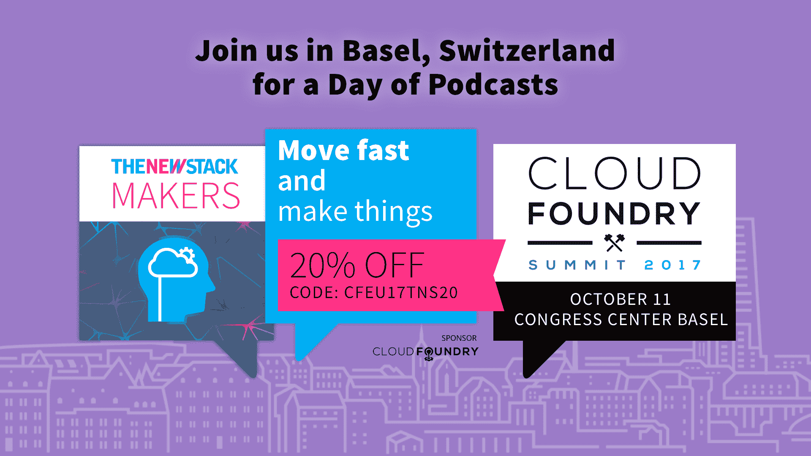

# 寻找最佳敏捷框架:安全、更安全还是其他？

> 原文：<https://thenewstack.io/search-best-agile-framework-safe-less-another/>

一定有什么笑话说敏捷者需要多长时间才能换一个灯泡——这完全取决于他们使用的框架。

我们已经讨论过如何扩展 Scrum 框架，也许是通过创建一个 Scrum 的 Scrum。但是随着敏捷从精益创业一路上升到财富 500 强企业，如此实验性的东西怎么能扩大规模呢？这就是敏捷教练 [Ilídio Faria](https://www.linkedin.com/in/ilidiofaria/) 最近试图做的事情，他在一个大型的敏捷 Slack 社区进行了民意调查，以寻求扩展敏捷的最佳框架、培训和认证的建议。

Faria 希望将敏捷带入一个 600 人的团队，从一个团队到七个以上的团队，因为高层管理希望敏捷与 DevOps 文化同时实施。

“我试图了解我们公司投资培训和认证他们的顾问是否有利可图，”Faria 说。

所以今天我们探索:什么是最好的敏捷框架？或者，真的，能有这种事吗？

## 敏捷框架概述

敏捷并不是一个完全定义好的东西——它是一个[的信仰宣言](http://agilemanifesto.org/)——很多框架和方法论，比如看板和 Scrum，都可以归入它的保护伞下，为各种规模的团队工作。但是有两个官方的敏捷框架经常出现。这场争论，就像许多关注扩展敏捷的争论一样，围绕着这两者，所以首先我们概述一下它们的相似和不同之处。

首先，如果你是第一次接触这个主题，让我们先来看看 Scrum 本身。Scrum 是一个增量的、迭代的敏捷软件开发框架，它将团队组织成 4 到 10 人的更小的团队，然后将代码和活动分解成更小的部分，具有更短的发布周期，通常是两周的冲刺。这是基于用户会不断改变想法的想法，所以你的团队必须为快速变化做好准备，永远不要提前计划太久，并不断发布更新。

有趣的是，这个问题是关于在一个组织内扩展敏捷的，但是只有以 Scrum 为中心的概念作为解决方案出现。肯定还有其他解决方案，但今天我们要讨论这两个大牌。我们将在接下来的文章中讨论其他框架。

### LeSS:大规模 Scrum

> " Scrum 很少应用于许多团队一起开发一个产品."— [官少网站](https://less.works/less/framework/introduction.html)

LeSS (大规模 Scrum)是应用于许多团队的 Scrum，但是他们在一个特定的 sprint 结束时一起工作来发布一个特定的共享产品。

LeSS 认为，在产品开发中没有所谓的最佳实践，只有在特定环境下适用的实践。这是一个比其他框架更灵活的框架，认为称任何东西为“最好”都脱离了动机和背景，扼杀了创新和持续改进。

减去包括以下内容:

*   规则:像在每个冲刺阶段进行一次全面回顾，这些规则是为了保持产品焦点。
*   指南:提供提示，但有了这个想法，它们可以不断改进。(可选)
*   实验:团队可以从中选择一组实验。(可选)
*   原则:贯穿其他三个部分的线索，比如关注产品整体，以客户为中心，关注持续改进和透明度。

这都是关于在更大范围内应用 Scrum 的原则。

当被问及为什么她更喜欢安全、敏捷的蔻驰[时，Sarah Baca](https://www.linkedin.com/in/sarahjbaca/) 说:“从书上来看，它没有像其他框架那样创造所有的废话。本质上是许多独立的团队在一起协调，没有一个项目或组合“工作流”来定义事物并推动它。”

### 安全:可扩展的敏捷框架

> "我们的核心信念很简单:更好的系统和软件让世界变得更美好."—外管局官方网站

[SAFe](http://www.scaledagileframework.com/about/) (扩展的敏捷框架)，最近发布了 4.5 版本，涵盖了三个主要的知识领域:

*   敏捷开发
*   系统思维
*   精益产品开发

SAFe 基于九项原则:

1.  将经济背景应用于所有事情。
2.  运用系统思维，理解一切以复杂的方式联系在一起的事物。
3.  假设可变性，所以保持你的选择开放。
4.  不断反馈，逐步构建。
5.  经常与客户一起评估产品。
6.  限制正在进行的工作，减少批量和积压。
7.  跨领域规划，提高确定性。
8.  注重内在动机。
9.  下放决策权。

普遍的共识是，外管局更多的是一个赚钱的使命，这意味着它取得了更多的商业成功。从他们的网站上可以清楚地看到这一点，该网站提供了更多的推销和承诺，超过 70%的财富 500 强企业现场有认证的安全从业者。

虽然关于定制工作的内容较少，但安全网站承诺通过提供四种“开箱即用”的解决方案来提高产品交付速度。然而，外管局将自己描述为“可扩展和可配置的，外管局允许每个组织根据自己的业务需求进行调整”，适用于中等规模的团队，最多可达数千人。

## 但是敏捷实践者更喜欢哪种框架呢？

SAFe 4 项目顾问 Andrew Leff 说:“我在 SAFe 框架下工作已经有一段时间了，它和任何东西一样都有它的优点和缺点。如果我们从对话中移除赚钱的认证机器，如果一个组织愿意建立学习机构而不是敏捷监狱，SAFe 可以创建联盟以及良好的基础。外管局刚刚发布的修订版，我喜欢外管局 4.5 的方向和更精简的流程。我喜欢他们似乎试图推广的精益画布的感觉，以及更干净的图片。它仍然会感觉很重，因为 [Spotify【型号】](https://thenewstack.io/spotify-learned-flop-app-store/)会感觉有点太松。”

对他来说，LeSS 提供了一个他认为更容易接受的中间立场。

“对我来说，当我在企业层面进行指导时，了解组织真正想要解决的问题，然后尝试如何最好地实现这些目标是非常重要的。有时决策来得太快，因为有人甚至不知道为什么就决定扩大规模。”

认证执业律师[托马斯·凯兹拉尔](https://www.linkedin.com/in/tomas-kejzlar-2281a4b/)表示同意。

“六百人似乎是一项巨大的努力。他说:“这不完全是我想象中的敏捷——小巧、敏捷、适应性强、能够快速运输。”。“我认为整个‘扩展’业务，嗯，大部分只是业务。如果你有几个团队，没有框架，你也可以做得很好，只要使用适合你的框架。即使在此之前，我仍然认为你需要关注团队以及他们如何单独工作，尤其是他们的技术实践。

Kejzlar 和 Leff 都同意，如果你没有首先决定敏捷对你的业务意味着什么，购买框架是一个糟糕的投资。

“组织倾向于尝试并使框架适应现有的糟糕的 Scrum 实践，并相信它将有助于解决问题，而没有理解它将如何进一步放大问题。Leff 说:“了解如何使用扩展框架来实现一致性，并提供更好的机会来帮助解决实际问题，而不是修复症状，这往往是一个错失的机会。“文化以战略为早餐，因此让领导来领导而不是宣称胜利是扩展挑战的一部分，要明白，如果没有检查和适应的愿望，扩展只会成为一系列失败事件。”

> “关注人而不是工作来帮助打破指挥和控制的限制不是一件容易的事情。”—安德鲁·莱夫，敏捷教练

## 本质上不可能有完美的敏捷框架

正如另一位敏捷教练科恩·范德帕施所说，“框架只给出焦点和清晰度，专业性取决于你。”

所以，如果你的团队有很高的成熟度，这就足够了吗？

最初的提问者 Faria 承认“如果一个团队真的是优秀的专业人员，我们可以教他们在没有框架的情况下用敏捷的思维方式进行工作”，尽管他的客户仍然希望购买框架。

敏捷倡导者 Marjan Venema 认为没有最好的框架，只是公司太不安全，在没有其他公司投资的标准化框架的情况下接受敏捷过程。

“所有这些‘最好’的问题都是不安全感的症状。允许人们公开表达他们的想法，不要寻求安全毯，而是解决任何出现的问题——而不是在熊出现之前就射杀它们。这将比任何框架都更有助于你的敏捷之旅。”她继续说道，“毕竟，敏捷就是对变化做出反应，因为你对未来还不够了解。”

最终，真正敏捷的团队会从其他公司的一系列框架和范例中乞求、借用和窃取，然后将所有这些与他们队友的经验和实验相结合。代码和安全最佳实践可以重复，但是当你涉及文化时，每个团队都是独一无二的，这使得每个大规模的敏捷环境都是独一无二的。当然，这使得向大企业推销变得更加困难，这些大企业不想在底线上冒太多风险，而是希望投资于一个已知的解决方案。当然，大规模的敏捷需要大量的时间和金钱，但是它也需要致力于频繁地调整和改变行动过程，以响应团队和用户的需求。

<svg xmlns:xlink="http://www.w3.org/1999/xlink" viewBox="0 0 68 31" version="1.1"><title>Group</title> <desc>Created with Sketch.</desc></svg>