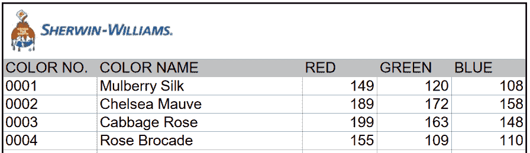

# 第二次是一种魅力:后续测试证明人工智能毕竟可以说出油漆的颜色

> 原文：<https://thenewstack.io/second-times-charm-follow-tests-proves-ai-can-name-paint-colors/>

上周，科罗拉多州的一名研究科学家首次尝试教神经网络如何命名油漆颜色，引起了病毒般的轰动。詹妮尔·谢恩在她的博客上分享了糟糕的初步结果[——例如，提到了“臭豆子”和“银行屁股”之类的名字她最初的结论是，机器学习算法会产生“非常非常糟糕的油漆名称想法。”](https://lewisandquark.tumblr.com/post/160776374467/new-paint-colors-invented-by-neural-network)

但事实证明事情不止如此。她用一组更好的数据再次进行了实验——令人惊讶的是，得到了更好的结果。

最初，她用舍温-威廉姆斯的[7750 种颜料作为她的训练集。](https://images.sherwin-williams.com/content_images/sw-pdf-sherwin-williams-color.pdf)

舍温-威廉姆斯油漆名称

但是早期她怀疑如果她使用不同的参数会有更好的结果。“神经网络擅长学习循环模式，”谢恩[告诉](https://www.digitaltrends.com/cool-tech/ai-paint-names/) Digital Trends，“但由于一个词很少在数据集中出现两次，神经网络没有很好的机会能够确定，例如，天竺葵是一种红色或粉红色的花。”

她找到了调整算法的其他方法。在本周的一次更新中，谢恩指出，有一个变量控制着人工智能反应的“创造力”——“神经网络是否总是在生成文本时选择最有可能的下一个字符，或者它是否会选择列表中更靠后的字符。”

所以周二她开始进行新的实验——并且有了惊人的进步。“事实证明，当我稍微调低音量时，算法的表现会好很多。”

结果看起来一定很神奇，因为现在的名字实际上与舍温-威廉姆斯数据集中的颜色相匹配，人工智能的建议将相关的颜色分组在一起，所以“它逐渐从绿色变成棕色，蓝色变成黄色，等等。并最终覆盖了彩虹，而不仅仅是米色。”

“很明显，它*是*试图给我更好的结果，但我一直搞砸。”

人工智能的新名字有些怪异，而且几乎是恰如其分:

*保时捷灰色
品牌她的
夜红色*

不是所有的都卡住了。人工智能程序还建议使用“史莱姆女王”

但是在更多的实验之后，甚至会有更好的名字出现。她希望名称与实际的颜色相匹配，从她的第一次实验来看，仍有改进的空间。“健康绿色”可能看起来是一个不错的颜色名称——但当它被赋予一种蓝色时就不一样了。

所以她也尝试用不同的代码来表示每种颜色的深浅。特别是 [HSV](https://www.thoughtco.com/what-is-hsv-in-design-1078068) 代码，它反映了每个阴影的色调、饱和度和值，以及 [LAB](http://docs-hoffmann.de/cielab03022003.pdf) 代码，它测量亮度、红色与绿色的数量以及蓝色与黄色的数量。

结果呢？“事实证明，颜色表现对结果的好坏没有太大影响。”还有一种颜色叫做“纠缠粉红”——它仍然是蓝色的。"无论颜色本身是如何表现的，颜色名称都很糟糕."

在某一点上，它建议了一个几乎恰当的名字“玫瑰紫罗兰”但它也暗示了“Flumfy Gray”

但是还有一个实验要做。如果她用完全不同的数据集训练神经网络呢？

所以 Shane 再次进行了同样的实验，使用了另外两家*油漆公司的油漆名称——Behr 和 Benjamin Moore——在她的一个读者在 GitHub 上分享的数据集上训练神经网络。此外，她还提供了漫画 XKCD 开展的一项在线调查的结果，该调查旨在寻找 500 万种颜色的名称。只是算法没变——她还在用开源的神经网络框架 [*char-rnn*](https://github.com/karpathy/char-rnn) (配置 512 个神经元 2 层，dropout 0.8，50 个历元)。*

令人震惊的是，谢恩报告说最新的结果实际上是好的！“几乎每个名字都和它的颜色相匹配(即使它不是你在油漆店里能找到的颜色)。”至少其中一些名字很有诗意:
 *灰糖果
冰霜之石
光明海滩
橙风
石头
香料中的运气
泥巴* 
它甚至建议将其中一种色调命名为“蓝色水”——这是一个完全可以接受的名字(尽管有点功利)。"答案似乎是:更多的数据，对神经网络来说也是如此."

虽然你可能仍然不想用一种叫“水獭玫瑰”的颜色来粉刷你的卧室…

这不是谢恩用神经网络进行的唯一一次实验。她还用它来发明新的鸡尾酒，并为幸运饼干编写基于机器学习的财富。有一次，她用它为新的重金属乐队和超级英雄命名(我最喜欢的名字是“Supperman”)。她甚至尝试写一些搭讪语和敲门笑话。

但是她的绘画实验触动了神经——也许是因为人类发现人工智能最初的失败奇怪地令人安心。

“当机器人接管你的工作时，记住这一点:你可以尝试以命名油漆为生，”Engadget [打趣道。尽管人工智能可能会*生成*一个偶尔可以接受的油漆名称，“人类设计师比神经网络有优势，”谢恩告诉 NBC 新闻，“因为](https://www.engadget.com/2017/05/22/ai-sucks-at-naming-paints/)[他们可以在看到坏主意时识别出它](http://www.nbcnews.com/mach/technology/what-happened-when-algorithm-invented-new-colors-n762121)。”

似乎是为了证明这一点，她用“名人堂”结束了她的最新文章——这是她在每次实验中最喜欢的颜色选择。原来一个神经网络*可以*想出油漆颜色的名称；他们并不总是好的。

 *酸橙粉色
柠檬鼻子
呆呆的棕色
害羞的游泳者* 

无论算法变得多么复杂，仍然有一种粉红色被人工智能命名为“干奶油冻”——还有一种亮蓝色被人工智能命名为“爸爸”。

<svg xmlns:xlink="http://www.w3.org/1999/xlink" viewBox="0 0 68 31" version="1.1"><title>Group</title> <desc>Created with Sketch.</desc></svg>