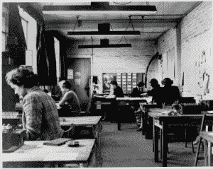
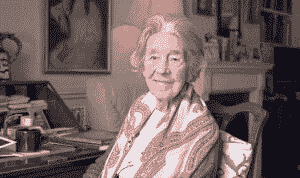

# 密码破译者简·福塞特的秘密生活

> 原文：<https://thenewstack.io/secret-life-jane-fawcett-codebreaker/>

简·福塞特上周去世，她是二战中英国解密精英之一。几十年来，没人知道她是个英雄。她发誓不说出去。她的工作是揭露别人加密的秘密；这是一份她必须保守秘密的工作，甚至对她的家人也是如此。

19 岁时，简收到了一封朋友的来信，鼓励她去布莱奇利公园，这是英国最高机密的密码破译机构，包括数学家艾伦·图灵在内的 12000 人正在这里破译德国军方恩尼格玛机器的秘密信息。战争爆发时，她是一名有抱负的芭蕾舞演员。

简能说一口流利的德语，并想在战争中尽自己的一份力量，于是她加入了她的朋友。她在没有保温材料、光线很差的小屋中工作，和其他 8000 名女性(大多来自英国上层阶级)一起，在摇摇晃晃的支架桌和折叠椅上辛苦地破译信息。

领先的密码破译者梅维斯·贝特和简的朋友[说，本切利](https://www.theguardian.com/world/2016/may/30/jane-fawcett-obituary)是一个“一个有好主意的 19 岁女孩会被鼓励去实现它的地方，远远早于任何官方的女性平等。”

布莱奇利公园的密码破解室

迈克尔·史密斯在他 2015 年的书[“布莱奇利公园的债务和其他故事”](http://www.bletchleyparkresearch.co.uk/debs-of-bletchley-park/?version=meter+at+1&module=meter-Links&pgtype=article&contentId=&mediaId=&referrer=https%3A%2F%2Fwww.google.com%2F&priority=true&action=click&contentCollection=meter-links-click)中描述了这种日常生活。当一个恩尼格玛密码被破解时，密码的钥匙被传递到解码室。福西特和其他密码破译者然后将密钥插入她的 Typex 机器，这是一个英格玛的复制品，并打出编码的信息。

1941 年 5 月，英国海军正在搜寻德国最强大的战列舰“俾斯麦”号。在给一位空军将军的回信中，他的儿子在俾斯麦号上，福塞特读到俾斯麦号正前往布列斯特进行修理。

一天后，美国海军在大西洋发现了这艘战舰，距离布列塔尼海岸约 700 英里，距离人们认为它所在的挪威很远。俾斯麦号于 1941 年 5 月 27 日被英国海军击沉。2000 多名德军阵亡，至今仍被认为是战争的关键胜利。

福塞特在布莱奇利公园工作了五年，在战争结束时转向歌剧事业。没有告诉任何人。布莱奇利公园的每个人都受到英国官方保密法的约束，终身禁止透露任何破译密码的活动。

“我丈夫曾在海军服役，在每个季度都做了这些英勇的事情，所以我们当然都在谈论他和那些拯救了英国——嗯，拯救了世界——的杰出的年轻冒险家，”福塞特夫人去年说。但她从未提及她对战争的贡献。

简·福西特在被认为是英雄后

2014 年，福塞特回到布莱奇利公园，参加一个博物馆的开幕仪式，纪念《密码破译者》的生活和工作。这是她第一次承认自己的贡献。[这么多年过去了，她发现很难再提起这件事。](http://www.post-gazette.com/news/obituaries/2016/05/31/Obituary-Jane-Fawcett-British-codebreaker-during-World-War-II/stories/201605310132)

“所以，当我们所做的一切——我们知道这些都是非常艰苦的工作，而且要求极高——突然显露出来，我们被要求谈论它们时，我们感到非常难以承受。我从未告诉任何人，甚至我的丈夫。我的孙子们非常惊讶。”

战后，在接下来的 15 年里，她继续以歌剧演员的身份演出。随着时间的推移，她开始扮演母亲和保护主义者的角色，致力于拯救维多利亚时代的建筑。她对拯救建筑的热情支持使她被称为“愤怒的福塞特夫人”她甚至在 1976 年获得了英国皇家建筑师协会的荣誉会员资格。

但是她在布莱奇利公园工作的影响可能是她最持久的遗产。

“他们说我们拯救了 4000 万人的生命，因为我们在正确的时间出现在正确的地方，因为我们有工作要做，”[她后来说](http://www.express.co.uk/news/obituaries/674688/Jane-Fawcett-1921-2016-Decoder-trail-Bismark)。“我仍然觉得我们在布莱奇利所做的是我们一生中做过的最有意义的事情。”

你能保守秘密多久？

<svg xmlns:xlink="http://www.w3.org/1999/xlink" viewBox="0 0 68 31" version="1.1"><title>Group</title> <desc>Created with Sketch.</desc></svg>