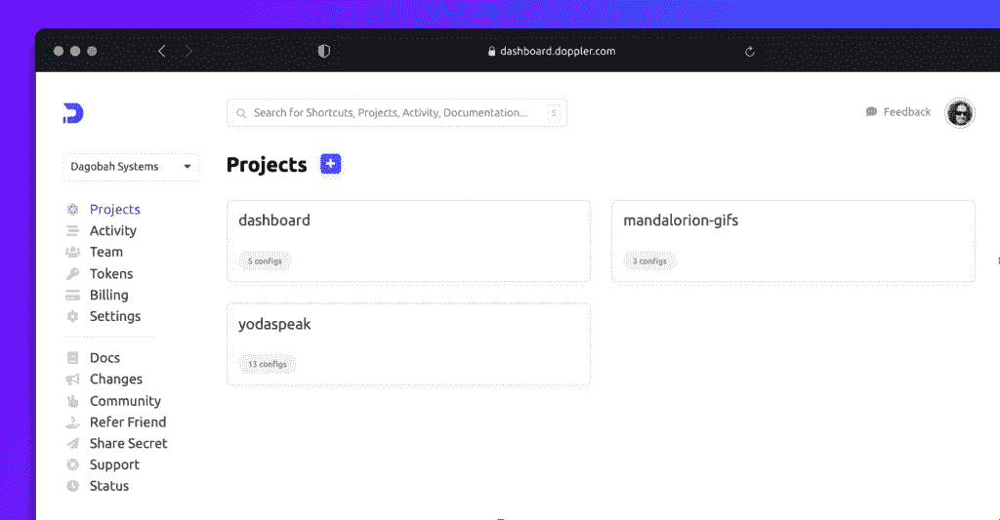
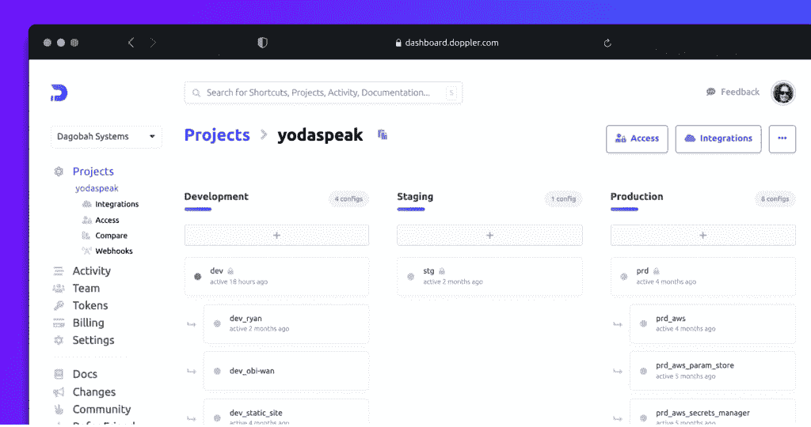
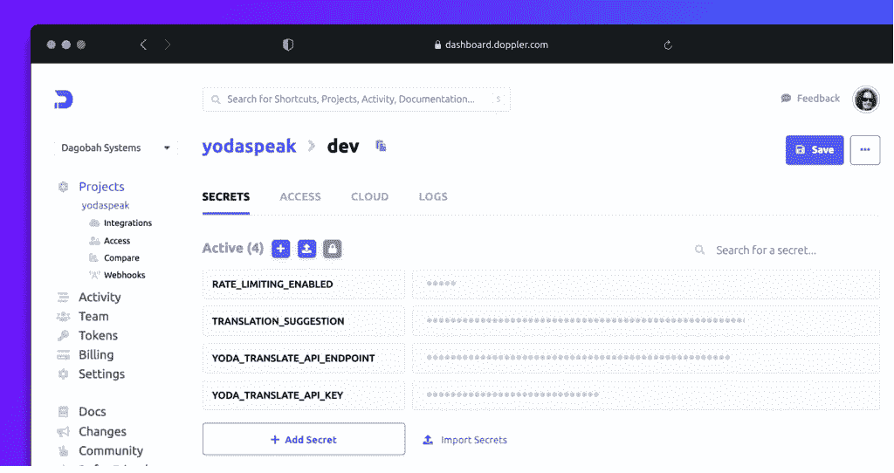
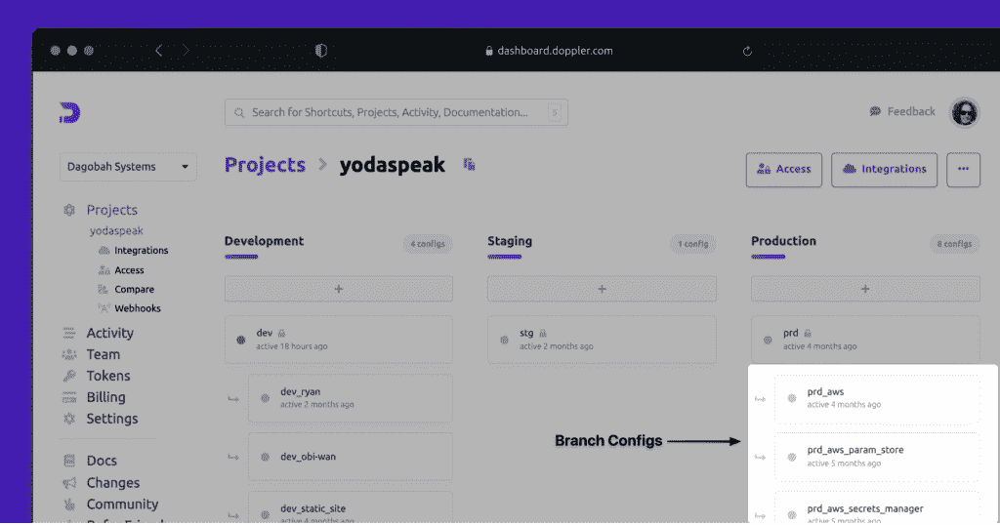
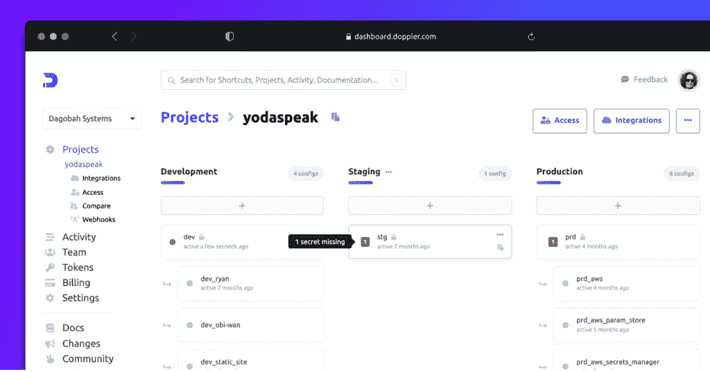
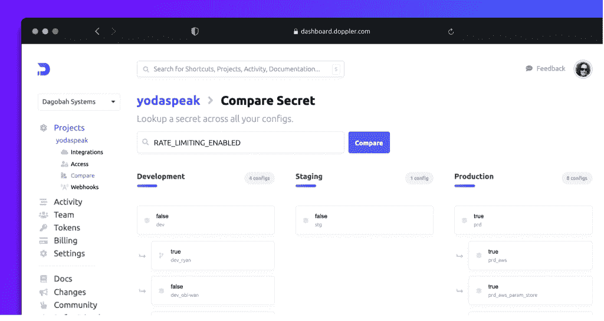

# 秘密管理:多普勒还是哈希公司金库？

> 原文：<https://thenewstack.io/secrets-management-doppler-or-hashicorp-vault/>

[](https://twitter.com/ryan_blunden)

 [瑞安·布兰登

瑞安喜欢将复杂的主题分解成易于理解的教育资源，供任何经验水平的开发者使用。他是 Doppler 的开发者倡导者，他的任务是帮助开发者学习如何安全地管理应用程序秘密。](https://twitter.com/ryan_blunden) [](https://twitter.com/ryan_blunden)

注重安全的开发人员意识到，分散的和临时的凭据存储方法，如。env 文件会带来严重的安全风险，并且很难跨不同环境中的应用程序进行管理。

如果“ **secrets manager** ”这个术语对您来说很陌生，那么它是一个用于存储敏感信息的集中式系统，例如 API 密钥、数据库凭证，甚至文件(例如证书和私钥)。此外，它还负责确保机密在传输过程中和静态时得到加密，以及一系列其他与安全相关的功能，如严格的访问控制和审计日志。

但是哪个秘密经理最适合你和你的团队呢？

一篇博客文章不可能充分比较每个秘密管理者，所以今天，我们将只关注两个:[多普勒](https://www.doppler.com/)和[哈希公司](https://www.hashicorp.com/?utm_content=inline-mention)的[金库](https://www.vaultproject.io/)。

我们开始吧！

## **高层比较或 TL；博士**

这篇文章很长，所以我们将从高层次的比较开始，然后慢慢进入细节。

### **目标受众**

Vault 主要面向安全团队，无疑是市场上最具企业能力和可配置的 secrets manager。

从本质上来说，Vault 是秘密的密钥/值存储库，凭借其令人难以置信的灵活性和可配置性，出现了特定领域的学习曲线，主题包括[秘密引擎](https://www.vaultproject.io/docs/secrets#secrets-engines)、[认证方法](https://www.vaultproject.io/docs/auth/aws)和[访问策略](https://learn.hashicorp.com/tutorials/vault/policies)。

相比之下，Doppler 是为开发人员设计的，同时还包含了安全团队对秘密管理器的期望。它旨在提供开发人员在管理已部署应用程序的秘密时所需的特定功能。

### **主持**

Vault 是[开源的](https://github.com/hashicorp/vault)，可以用几种不同的方式部署，每种方式都有自己的权衡。 [HashiCorp](https://thenewstack.io/mitchell-hashimotos-move-from-cto-garners-r-e-s-p-e-c-t/) 还提供了 [Vault Enterprise](https://www.hashicorp.com/products/vault/pricing) ，一个运行在 [HashiCorp 云平台(HCP)](https://www.hashicorp.com/blog/vault-on-the-hashicorp-cloud-platform) 上的全托管版本。

自托管成本也是一个因素，因为要使 Vault 具有高可用性，需要大量的资源。

相比之下，多普勒是一个完全托管的服务(见[历史正常运行时间这里)](https://www.dopplerstatus.com/)——没有部署。查看 Doppler 的[安全页面](https://www.doppler.com/security)和[相关文档](https://docs.doppler.com/docs/security-fact-sheet)了解更多关于 Doppler 是如何托管和存储机密的。

### **结构化秘密**

Doppler 通过应用程序或微服务(它称之为[项目](https://docs.doppler.com/docs/enclave-project-setup))对秘密进行分组，并为特定环境的值定制一个环境列表。

虽然 HashiCorp 提供了一个非常详细的[参考架构](https://learn.hashicorp.com/tutorials/vault/reference-architecture)，但 Vault 本身对于[密钥路径应该如何构建](https://www.reddit.com/r/devops/comments/ath4vg/structure_for_organizing_secrets_in_hashicorp/)或[是否应该为每个环境存在单独的 Vault 集群](https://www.reddit.com/r/devops/comments/5sfhsr/deploying_vault_one_vault_per_environment_or_a/)基本上没有意见。

Vault 主要由 CLI 和 API 驱动，其 Web 用户界面设计用于管理任务。

Doppler 的不同之处在于，它将 Web UI 仪表板放在了秘密管理工作流程的核心。因此，它使常规任务(如在每个环境中添加、更新或删除秘密)变得简单，只需几次点击即可完成，无需学习新的 CLI 或 API。

### **获取秘密**

Doppler 选择了 CLI 应用程序运行程序，它将秘密作为环境变量注入到应用程序进程中。这确保了应用程序代码不会直接耦合到 Doppler，并且环境变量的额外好处是与语言和框架无关。

使用环境变量的决定部分是由平台通知的，如[亚马逊网络服务](https://aws.amazon.com/?utm_content=inline-mention)’[λ](https://docs.aws.amazon.com/lambda/latest/dg/configuration-envvars.html)和 [Cloudflare Workers](https://community.cloudflare.com/t/introducing-secrets-and-environment-variables-to-cloudflare-workers/152016) ，它们提供了一个键/值存储，以在运行时提供作为环境变量注入的秘密。

环境变量是这些平台的理想选择，因为它们是语言不可知的，不需要特定于平台的 SDK 来获取机密。

Vault 无缝集成了 [Kubernetes](https://www.vaultproject.io/docs/platform/k8s) 、 [Spring](https://learn.hashicorp.com/tutorials/vault/eaas-spring-demo?in=vault/app-integration) ，以及官方支持的 [Go](https://github.com/hashicorp/vault/tree/master/api) 和 [Ruby](https://github.com/hashicorp/vault-ruby) 的客户端库。

使用其他语言、框架或 Vault 平台的开发人员必须在使用 CLI、REST API 或[社区维护的开源库](https://www.vaultproject.io/api/libraries#community)获取机密之间做出选择。虽然这并不太难，但这是团队面临的另一个设计决策，他们可能会从发布新功能中抽出时间。

必须选择用于秘密获取的保险库认证方法，即使启用了认证方法，如[应用程序角色](https://www.vaultproject.io/docs/auth/approle)，也应考虑额外的预防措施，如[保险库响应包装](https://learn.hashicorp.com/tutorials/vault/cubbyhole-response-wrapping)。

Doppler 使用 CLI 令牌进行本地开发，使用个人令牌进行 API 访问，使用[服务令牌](https://docs.doppler.com/docs/enclave-service-tokens)为特定应用和环境提供对机密的只读访问，从而简化了身份验证。

### **集成**

Doppler 认识到，许多平台，如 GitHub、Azure、AWS、GCP 和 Vercel，都有内置的秘密存储解决方案。因此，Doppler 可以配置为将秘密同步到这些存储提供商，专注于成为秘密真相的中心来源，而不管平台或云提供商。

Vault 有一个令人印象深刻的集成列表，主要专注于身份验证和机密存储，而不是将机密同步到外部平台，如 Cloudflare Workers。

### **总结**

Vault 是一个高度可配置的秘密管理器，提供了超过 [20 种与秘密数据](https://www.vaultproject.io/docs/secrets)交互的方式，密钥/值存储只是其中之一。托管选项从免费开源到 HashiCorp 云平台(HCP)上的托管 Vault 实例。

Doppler 是一个完全托管的服务，它采用一种简化的方法，按照开发人员自然想到的方式管理应用程序的秘密，用一个可定制的环境列表将它们组织到项目中。

Doppler 和 Vault 提供了与云提供商的紧密集成，以及选择底层机密存储后端的灵活性，与 Doppler 相比，Vault 提供了额外的选项，如数据库引擎和 Consul。

在任何情况下，最重要的是，保险库和多普勒使不安全的秘密管理做法，如不加密。env 文件成为过去。

这只是一个高层次的总结，所以现在让我们深入探讨一下。

## **跳马入门**

要开始使用 Vault，您需要决定如何托管您的实例。

存在许多选项，例如:

[Vault 的入门指南](https://learn.hashicorp.com/collections/vault/getting-started)建议下载一个预编译的二进制文件，以便在开发模式下运行。虽然它非常适合本地测试，但是您需要部署自己的实例，或者选择一个托管产品(如 HCP)与您的团队一起进行评估。

如果部署 Vault，请确保将其配置为[高可用性(HA)](https://www.vaultproject.io/docs/concepts/ha) ，这需要一个多服务器、负载平衡的集群，具有支持 HA 的后端(例如[三节点 Consul 集群](https://learn.hashicorp.com/tutorials/vault/ha-with-consul)),以及针对故障转移场景正确配置的请求转发和客户端重定向。

初始部署相对简单，但更棘手的是充分维护和支持 Vault 所依赖的所有资源，以及 Vault 本身。

像 [Vault 舵图](https://github.com/hashicorp/vault-helm)这样的解决方案对于建立一个 Vault 实例来说是很棒的，但是将 Vault 的舵图分叉到版本控制内部更改，同时还重新建立和合并上游舵图更新是一项不小的工作量。

如果在本地以开发服务器模式运行 [Vault，您可以使用](https://learn.hashicorp.com/tutorials/vault/getting-started-dev-server)[入门指南](https://learn.hashicorp.com/collections/vault/getting-started)，其中包含一个多小时的教育内容，涵盖了使用 Key/Value v2 secrets 引擎进行秘密存储和检索的基础知识，以及 Web UI 的概述。

这是使用 Vault 的坚实介绍，但您可能需要额外的时间，例如，如果部署开源版本，请熟悉 [Vault 的参考架构指南](https://learn.hashicorp.com/tutorials/vault/reference-architecture)。

开始使用 Vault 需要投入大量的时间和金钱，具体取决于对 Vault 实例的需求。作为一个任务关键型企业应用程序，您需要仔细评估是采用自托管 Vault 还是使用 HCP 等托管选项。

## **多普勒入门**

Doppler 同意这样的假设，即对于一个新的开发工具来说，要获得关注和广泛采用，它必须在很短的时间内(几分钟到几小时，当然不是几周)几乎没有摩擦地展示直接价值。

并且最好没有初始财务支出。更具体地说:

*   注册时不需要信用卡
*   没有需要信用卡才能继续的试用期
*   自由计划中足够的功能来评估真正面向生产的应用程序

多普勒被设计为一种全面管理的服务，具有:

*   一种容错、多基础设施服务，具有主动 DDoS 缓解功能和 99.99%的[历史年度正常运行时间](https://www.dopplerstatus.com/uptime)
*   一个自由层，拥有无限的项目、秘密和用户

对于那些想要一个视觉演示的人来说，看看四分钟的多普勒从本地安装到生产的视频。

开始使用多普勒很简单:

1.  注册创建一个帐户
2.  命名您的工作场所(可以是整个公司或组织单位)
3.  创建项目
4.  输入开发环境的秘密
5.  在本地安装多普勒 CLI
6.  使用 Doppler CLI 在本地运行您的应用程序(将机密作为环境变量注入)

Doppler 被设计为托管服务的好处在于，开发人员需要做的唯一事情就是向项目添加秘密，然后使用 CLI 获取这些秘密。

他们还可以与所有主要的云提供商和平台以及 T2 的 Kubernetes 和 T4 的 Terraform 进行整合。

Doppler 的目标是以最小的摩擦提供最大的价值，并且不需要学习新概念，因为环境变量是语言和框架不可知的。

## **在金库中构建秘密**

需要选择 [KV secrets 引擎版本](https://www.vaultproject.io/docs/secrets/kv)，在具有回滚功能的版本化机密的 v2 优势与由于额外的元数据和版本历史保留而可能降低的性能和更大的数据存储需求之间进行平衡。

另一个关键决策是应用程序将如何访问特定于其运行环境的机密，这归结为三个主要选择:

1.  在路径中包含环境的单个 Vault 实例(例如/**my-app/production/d b-username**)。
2.  每个环境都有自己的 Vault 实例，使路径保持不变(例如， **/my-app/db-username** )。
3.  Vault 的[企业命名空间特性](https://www.vaultproject.io/docs/enterprise/namespaces)，允许每个环境在 Vault 中充当一个独立的 Vault。

Vault Enterprise 客户可能会使用名称空间，而开源部署将需要从其他替代方案中进行选择。

通常情况下，大多数大公司都有安全团队负责制定应用程序部署的安全策略，包括如何访问机密。然后，一个集中的平台或基础设施团队将管理对 Vault 的访问，并为使用机密数据提供实施建议和模式。

开发团队在采用诸如秘密管理器这样的新工具时面临的摩擦越多，一些团队继续使用现有的不安全实践的可能性就越大。环境文件。因此，提前准备好政策、流程和文档以确保尽可能容易地采用是至关重要的。

## **多普勒中的结构化秘密**

Doppler 是一个通用的秘密管理器，为微服务世界而构建，将秘密分组到项目中，每个项目都有一个可配置的环境列表。



每个环境都由一个[根配置](https://docs.doppler.com/docs/enclave-root-configs)和可选的[分支配置](https://docs.doppler.com/docs/enclave-config-branching)组成，支持为特定平台(例如 AWS Lambda vs. Heroku)定制机密，并允许开发人员在本地开发时覆盖根开发配置中的机密值。



授权的团队成员可以添加新的定制环境，如**测试**、 **CI** 或 **QA** 。这不仅有助于组织秘密，而且有助于应用最小特权原则，因为每个拥有**协作者**或**查看者**权限的用户都必须被明确授权访问每个项目和环境。

无论使用哪种 secret manager，按应用程序和环境对机密进行分组都是至关重要的。Doppler 的优势在于内置了这种结构，只需点击几下就可以配置，因为它是专门为开发人员管理已部署应用程序的秘密而设计的。

## **管理金库秘密**

如果在开发服务器模式下使用 Vault，您可能会使用根令牌(提供不受限制的访问)和秘密引擎的 v2，因为这是自动启用的。这使开始变得容易，但不是一个生产就绪的场景。但是，如果您正在进行类似于生产安装的工作，您可以使用【Vault 入门指南中列出的方法或在 HCP 上运行的托管实例。

Vault 主要是 CLI 驱动的，所以 shell 将是您的大多数秘密管理操作发生的地方。

在使用 Vault 的 CLI 创建秘密之前，[采取预防措施，防止带有秘密值的命令被记录在您的 shell 历史记录中](https://learn.hashicorp.com/tutorials/vault/static-secrets#q-how-do-i-enter-my-secrets-without-exposing-the-secret-in-my-shell-s-history)。或者更好的是，使用文件来提供秘密值。

您还必须决定一个秘密是包含一个还是多个键/值对。我建议每个秘密使用一个键/值对，但是这取决于秘密的类型。

现在让我们来看看如何使用 Vault CLI 创建和获取密码。

使用来自[库的静态秘密教程](https://learn.hashicorp.com/tutorials/vault/static-secrets)的样本代码，让我们创建一个 API 密匙作为一个单独的秘密:

```
sh
tee apikey.json  &lt;&lt;EOF
{
"key":  "AAaaBBccDDeeOTXzSMT1234BB_Z8JzG7JkSVxI"
}
EOF

```

**# 2** 创造秘密:

```
sh
vault kv put secret/my-app/development/api-key  @apikey.json

```

**# 3** 删除秘密文件:

**# 4** 取秘:

```
sh
vault kv get  -format=json secret/my-app/development/api-key

```

**# 5** 列出所有正在开发的 my-app 的秘密:

```
sh
vault kv list secret/my-app/development

```

**#6** 删除秘密:

```
sh
vault kv delete secret/my-app/development/api-key

```

使用 Vault CLI 创建、获取和列出机密非常简单，命名空间为 Vault Enterprise 客户提供了按环境划分机密的最佳选项。

## **管理多普勒中的秘密**

Doppler 的目标是为管理秘密创造一个愉快的用户体验。



Doppler 将秘密分组到具有可配置环境列表的**项目**中，例如**开发**(或**开发**)。



[分支配置](https://docs.doppler.com/docs/enclave-config-branching)(上面突出显示)是多普勒特有的概念，其中秘密从它们所属的[根配置](https://docs.doppler.com/docs/enclave-root-configs)继承，允许添加、删除或覆盖秘密值，而不影响根配置中的秘密。

为什么？分支配置的两个最常见的使用案例是:

*   支持部署到不同平台(例如 AWS Lambda 和 Cloudflare Workers)的应用程序，除了在根配置中找到的机密之外，这些平台还需要特定于平台的机密。
*   开发人员需要覆盖根开发配置中特定秘密的值，以便进行本地测试或故障排除。

简而言之，分支配置提供了一个继承模型，其中可以定制机密以适应特定的场景，而不会不必要地复制机密。

多普勒还包括跨环境保持同步秘密变化的功能。

如果在一个环境中添加或删除了密码，而在其他环境中没有，则会显示一个可视指示器



仪表板中还内置了跨环境(用户有权访问)比较秘密值的功能。



现在让我们讨论多普勒的秘密访问模型。

Doppler(与 [Vault 的策略语法相比)](https://www.vaultproject.io/docs/concepts/policies)采用更直接的 [UI 驱动的团队方法](https://docs.doppler.com/docs/workplace-team)。

拥有 **Admin** 或 **Owner** 权限的用户需要明确授予拥有 **Collaboration** 或 **Viewer** 访问权限的用户对**项目**中环境的访问权限。

在很大程度上，这意味着开发人员将被限制在开发环境中，而 SREs 和 DevSecOps 可以访问其他环境来进行跨职能的工作。

虽然 Doppler 的授权后端比 Vault 少，但对 Google Email SSO、 [SAML SSO](https://docs.doppler.com/docs/setting-up-saml-sso) 和 SCIM 的支持使组织能够根据需要在组、团队、组织单位和个人级别授予访问权限，可配置的默认访问级别通常设置为**协作者**或**查看者**权限。

虽然 Doppler 仪表盘是你执行绝大多数秘密管理任务的地方，但是[开源](https://github.com/dopplerhq/cli) [Doppler CLI](https://docs.doppler.com/docs/enclave-installation) 也能够执行大多数秘密管理功能，另外如果你需要的话，还有 [Doppler 的 API](https://docs.doppler.com/reference) 。

Doppler 努力构建一个开发人员友好的 secrets manager，在一个易于使用的 web UI 中提供开发人员和 DevSecOps 需要的功能和工作流，同时仍然提供一个全功能的 CLI 和 API。

## **多普勒 vs 拱顶中的应用程序秘密获取**

虽然 [Vault](https://www.vaultproject.io/api) 和 [Doppler](https://docs.doppler.com/reference) 都提供了用于获取秘密的 RESTful API，但它们对开发人员或应用程序在运行时或部署时访问秘密的期望不同。

我在这里进行的比较是相当高级的，因为团队在与 secrets manager 集成时可能会遇到的困难取决于几个因素，如平台、应用服务器或来自安全和平台团队的实现支持。

如果你没有专门的安全或平台团队，保持事情尽可能简单尤为重要。

如果我们假定大多数组织都会部署应用程序:

*   用不同的语言
*   在不同的云和平台上(例如 AWS、GCP、Azure、Vercel、Netlify、CI/CD)
*   使用不同的包装(例如 AWS Lambda zip 与 Docker image)
*   以及不同的运行时(例如 Python Lambda 运行时与 Docker 中的 Python 以及 Python Cloudflare Worker)

秘密管理器的目标应该是尽可能无缝地为任何语言、平台和运行时工作，理想情况下不需要秘密管理器专用的粘合代码。

Doppler 将自己描述为**通用秘密管理器，**具体来说，这意味着它“普遍”专注于将秘密集成和同步到具有内置应用配置和秘密存储的平台，如 Vercel 和 GitHub Actions，以及其他秘密管理器，如 AWS Secrets Manager。

为什么秘密管理器想要将秘密同步到另一个平台，更不用说另一个秘密管理器了？

我们在部署平台中看到的碎片化只会增加。组织管理跨这些平台的秘密蔓延的最有效方式是，他们的秘密管理者通过集成代表他们控制这种蔓延。

实际上是一个以秘密管理器为中心的星型模型，在可能的情况下将秘密推给提供者，而不是强迫应用程序直接从秘密管理器请求秘密。

或者，用更简单的话来说——为秘密获取提供一条阻力最小的安全路径，该路径尽可能是平台或运行时的本地路径。

[Vault 的 Kubernetes 集成](https://www.hashicorp.com/blog/injecting-vault-secrets-into-kubernetes-pods-via-a-sidecar)符合这种想法，将秘密获取和注入的责任转移到平台层，这样应用程序本身就可以(理想情况下)幸福地保持不知道它的秘密是如何被填充的。

使 Vault 变得困难的是身份验证方法和令牌交付的可变性，这使得应用程序更难防止 Vault 实施细节泄露到其应用程序代码或 CI/CD 作业中。

例如，如果在 Kubernetes 上运行并使用 [Kubernetes 认证方法](https://www.vaultproject.io/docs/auth/kubernetes)，生活会相对简单，但是如果选择更通用的认证方法，如 [App Role](https://www.vaultproject.io/docs/auth/approle) ，您还需要考虑 [Cubbyhole 响应包装](https://learn.hashicorp.com/tutorials/vault/cubbyhole-response-wrapping)以获得更高的安全性。

相比之下，在 Doppler 中，生产环境的授权是使用[服务令牌](https://docs.doppler.com/docs/enclave-service-tokens)来执行的，服务令牌为特定环境提供了对项目秘密的只读访问。

服务令牌可以立即撤销，并鼓励客户为每个环境指定 CIDR 格式的可信 IP 地址列表( [Vault 还支持应用程序角色认证的 CIDR 块范围](https://www.vaultproject.io/docs/auth/approle#further-constraints))。

作为额外的一层保护， [GitHub 官方支持扫描泄露的多普勒服务令牌](https://github.blog/changelog/2020-12-07-github-now-scans-for-leaked-doppler-tokens/)。

## **总结**

[Doppler](https://doppler.com) 和 [HashiCorp Vault](https://www.vaultproject.io/) 都是优秀的秘密管理者，可以让任何开发团队做出不安全的做法，比如使用。env 文件成为过去。

Vault 为机密存储、身份验证、机密访问和托管提供了无与伦比的灵活性。然而，这种灵活性伴随着陡峭的学习曲线，来自安全和平台团队的设计决策和实现支持将非常有利于确保 Vault 被开发团队在组织范围内采用。

多普勒是一个全面管理的**通用秘密经理**。它专为微服务世界而构建，以本机方式将机密组织到项目中，每个项目都有一个可配置的环境列表，使用简化的服务令牌模型在生产环境中进行机密访问。

它使用环境变量的语言和框架不可知方法来提供秘密，并使团队能够在不到一天的时间内从本地开发进入生产。

我强烈建议对这两者进行评估，看看 Vault 提供的灵活性和 Doppler 操作模型的速度和简单性是否最适合您和您的团队。

*我欢迎您的反馈，您可以在 [Twitter](https://twitter.com/ryan_blunden) 上找到我，或者给我发电子邮件到[ryan@doppler.com。](mailto:ryan@doppler.com)*

非常感谢 HashiCorp 审阅了本教程中关于跳马的部分。

<svg xmlns:xlink="http://www.w3.org/1999/xlink" viewBox="0 0 68 31" version="1.1"><title>Group</title> <desc>Created with Sketch.</desc></svg>