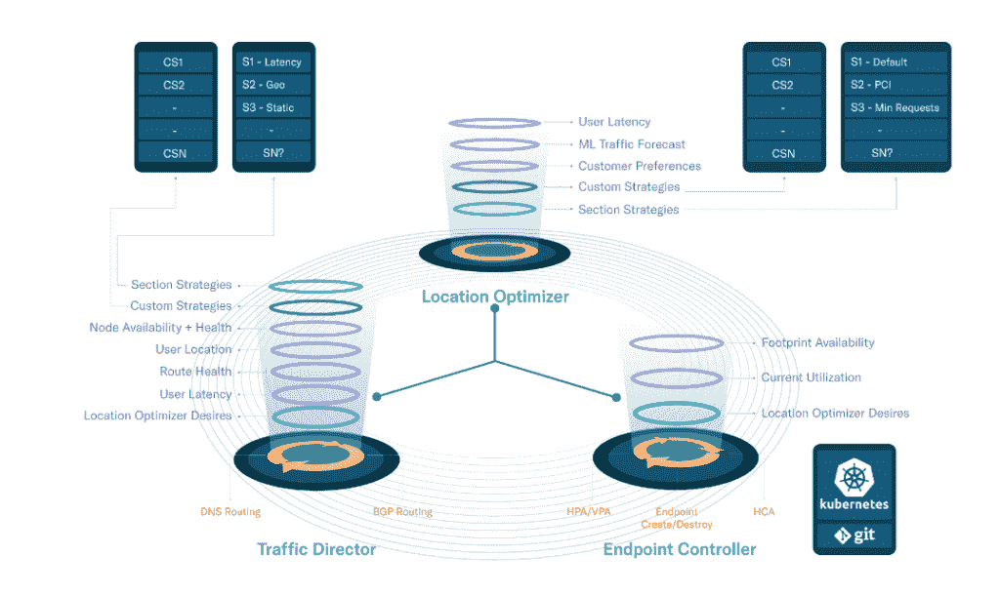

# 部分，以开发人员为中心的内容交付网络

> 原文：<https://thenewstack.io/section-the-developer-focused-content-delivery-network/>

在为澳大利亚电子商务公司 GraysOnline 工作时，当时的首席信息官 Stewart McGrath 和开发经理 Daniel Bartholomew 发现性能、安全性和可扩展性至关重要。但是，在尝试将应用程序的一部分移近用户时，他们发现内容交付网络(cdn)带来了三个挑战:

*   他们是固定网络，每个人都坚持他们的位置更好，
*   他们将用户锁定在一套独立的专有软件中，
*   他们从网络的角度接近这个领域，将开发者完全排除在外。

这是他们创建[部分](https://www.section.io/)的动力，这是一个以开发者为中心的平台，用于将应用程序的各个部分移近边缘。

“我们认为，如果我们不能为开发人员提供像他们使用云时一样简单易用的体验，那么将服务转移到边缘对内部组织来说就没有意义，”McGrath 说。“如果开发人员或运营团队不具备简单性、灵活性和可观察性，他们需要能够将其软件部署到这些边缘位置，然后在这些位置管理软件，并了解软件在这些位置发生了什么。走到边缘根本就不可行。”

> 对于缓存、web 应用防火墙、bot 阻止、优化和 API 认证，开发和运营团队不应感到被锁定在任何一个反向代理软件堆栈中。相反，他们应该能够选择最适合他们网站的工具。

这些年来，越来越靠近用户的应用程序部分已经发生了变化，最初只是将图像移动得更近，而应用程序逻辑、安全性和持久性数据存储则从某个集中的位置提供。他说，现在公司发现他们也想把这些部分移得更近。

“现在我们谈论的是从运营角度来看，他们不将核心应用程序逻辑和持久数据存储移至终端用户附近的唯一原因，让他们跟上映像和安全性的速度，声称这是尝试处理分布式部署计划和分布式数据复制问题的复杂性，”他说。

随着网站变得越来越臃肿，公司仍在努力提供客户期望的性能。尽管在一篇博客文章中，麦格拉思认为传统的内容分发网络不能足够快地创新，但市场和市场 T2 的报告预测全球内容分发网络市场将从 2020 年的 144 亿美元增长到 2025 年的 279 亿美元。

## 多重“边缘”

一般来说，人们谈论“边缘”是指他们的基础设施停止的地方——无论是云玩家、电信公司还是其他什么——他们对代码的控制不再是交付给最终用户的一部分。但是，McGrath 解释说，边缘也可能是内部位置或设备。

在《福布斯》的一篇文章中，分析师贾纳基拉姆·MSV 进一步打破了 ARM 芯片和远程传感器的“边缘”。同时，Canonical 的 Ammar Naqvi 解释了为什么 Kubernetes 是边缘计算的核心。

“当我们考虑每一个边缘层时，我认为它们都是运行部分应用程序的相关位置，这取决于不同时间点的应用程序和用户。因此，在内环中运行一些应用程序逻辑可能是合适的。然后是外环中应用程序逻辑的其他部分，作为面向最终客户的内聚步骤或边缘方法的一部分，”McGrath 说。

[https://www.youtube.com/embed/mDFvDj6D60Y?feature=oembed](https://www.youtube.com/embed/mDFvDj6D60Y?feature=oembed)

视频

根据 McGrath 的说法，Section 的技术本质上是一个平台，可以在任何可以访问互联网的 Linux 机器上运行一个存在点(POP)。

它的存在点是 Docker 支持的 Kubernetes 集群，它称之为边缘模块。还有模板模块——its 提供预打包模块，这些模块来自安全供应商，如 [Signal Sciences](https://www.signalsciences.com/) 、 [Wallarm](https://www.wallarm.com/) 和 [ThreatX](https://www.threatx.com/) ，以及视频和图像管理供应商 [Cloudinary](https://cloudinary.com/) ，以及 A/B 测试和优化解决方案 [SiteSpect](https://www.sitespect.com/) 。该公司提供了它所谓的开发人员存在点，让开发人员在他们的代码投入生产之前看到它们将如何工作。

但是客户可以自带模块，只要能把自己的软件打包到 Docker 容器中。它只要求容器使用 HTTP 协议接收和传输流量，并以其平台可以接受的格式生成诊断和错误日志。

在内部，其交通监控功能基于[石墨](https://graphiteapp.org/)和[Grafana](https://grafana.com/)；用 [Elasticsearch 和 Kibana](https://www.elastic.co/kibana) 测井；用[清漆](https://varnish-cache.org/)进行缓存。

## 技术不可知

麦格拉思说，大约五年前，公司创始人将公司从澳大利亚搬到了科罗拉多州，并在博尔德定居——这是基于公司蓬勃发展的技术环境。

他认为，开发和运营团队不应该感到被锁定在任何一个反向代理软件堆栈中，用于缓存、web 应用程序防火墙、bot 阻止、优化和 API 认证。相反，他们应该能够选择最适合他们网站的工具。

当开发人员使用 Section 的平台时，他们实际上是在使用 Git 存储库，与其他 CI/CD 工作流基本相同。该平台负责任何代码变更的部署。

“由于我们处于 DevOps 世界，我们不仅需要考虑应用程序开发生命周期和 CI/CD 工作流，还需要考虑边缘应用程序的可观察性和管理，”McGrath 说。因此，一个强大的遥测系统将所有分布式节点上发生的事情的信息带回一个集中的存储库，并且在一个事务的大约 30 秒内，操作工程师可以在日志记录框架中非常详细地看到该事务中发生的事情。

虽然 [Cloudflare](https://www.cloudflare.com/) ，传统的 cdn 以及云产品，如[亚马逊网络服务](https://aws.amazon.com/?utm_content=inline-mention)、[前哨](https://aws.amazon.com/outposts/)和[波长](https://aws.amazon.com/wavelength/)，都在这个领域投入了大量精力，但 McGrath 坚持认为，他们还没有像 Section 那样解决分布式应用部署问题。此外，包括收购了 NGINX 的 F5 Networks 在内的公司也纷纷涌入反向代理领域。[trae fik](https://thenewstack.io/traefik-a-dynamic-reverse-proxy-for-kubernetes-and-microservices/)；以及 Fanout 的开源[图钉](https://thenewstack.io/fanout-open-sources-reverse-proxy-server-real-time-api-push/)。

展望未来，该部门将重点关注名为 Adaptive Edge 的基于机器学习的技术，该技术可以预测客户在任何时间点的工作负载，以获得最佳性能和最低成本。它还专注于更多的基础架构位置，并进一步解决边缘的持久数据存储读取延迟的挑战。

<svg xmlns:xlink="http://www.w3.org/1999/xlink" viewBox="0 0 68 31" version="1.1"><title>Group</title> <desc>Created with Sketch.</desc></svg>