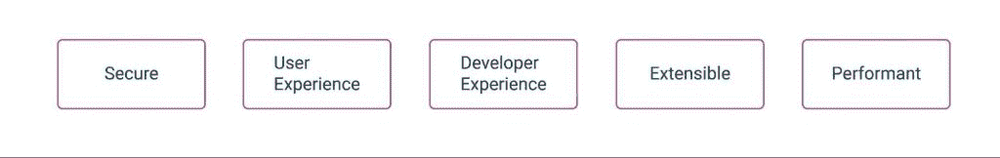
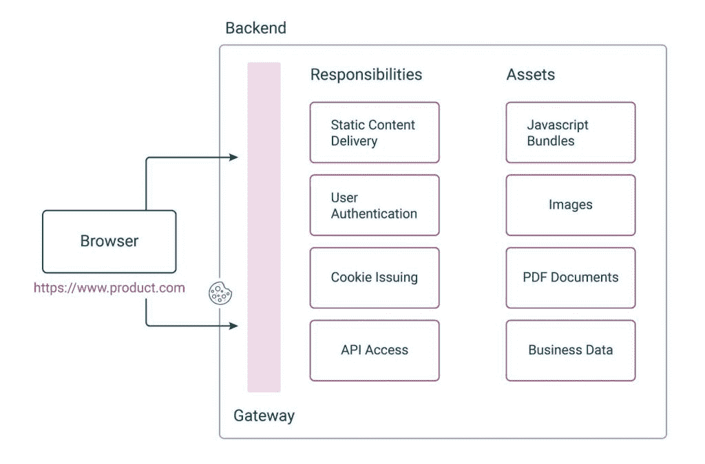
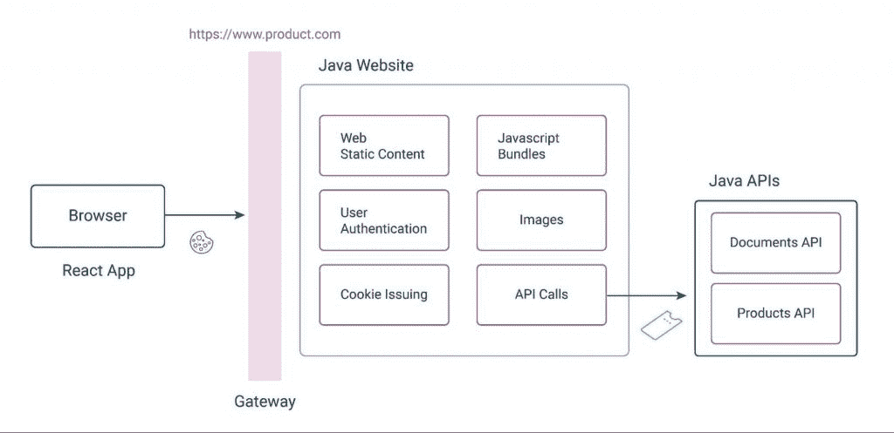
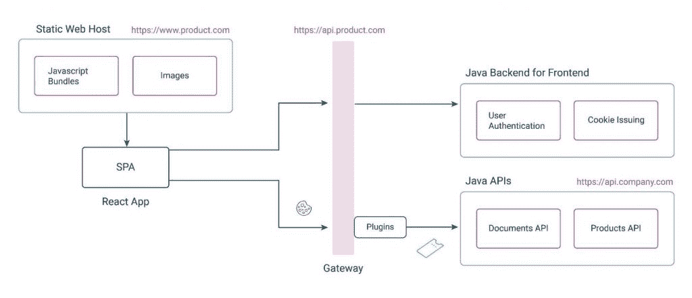
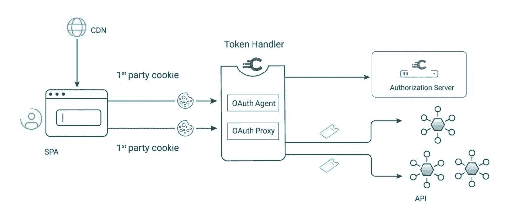
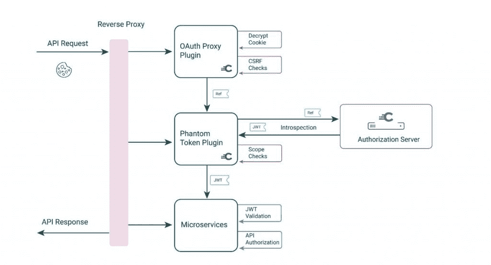
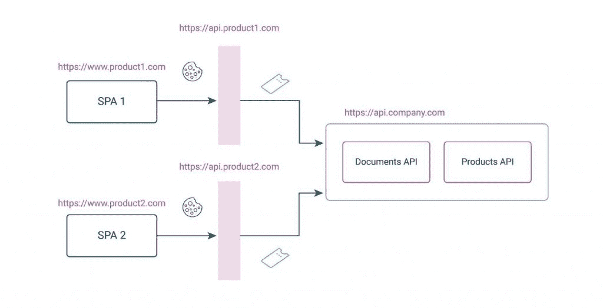

# 用 API 驱动的后端保护网络

> 原文：<https://thenewstack.io/secure-the-web-with-an-api-driven-backend-for-frontend/>

加里·阿彻

加里是 Curity 公司的产品营销工程师。20 年来，他一直担任首席开发人员和解决方案架构师。

构建和保护基于浏览器的应用一直是一个挑战。如今的开发要容易得多，技术选择也比十年前好得多。浏览器供应商和一些伟大的 JavaScript 和 CSS 框架之间的不兼容性也减少了，这使我们能够构建现代的前端 web 体验。

然而，浏览器安全性仍然是 web 开发中一个具有挑战性的领域。像[跨站点脚本(XSS)](https://cheatsheetseries.owasp.org/cheatsheets/Cross_Site_Scripting_Prevention_Cheat_Sheet.html) 这样的威胁是一个主要问题，必须遵循安全的开发生命周期来防止它们。还必须实现健壮且可扩展的用户认证，包括为您的技术堆栈使用安全库。对于那些只想专注于业务功能的公司来说，所有这些努力都是很困难的。

## 关键要求

以下是软件公司的架构师和工程师在构建 web 应用程序时通常希望达到的一些行为:

*   web 应用程序必须被认为是安全的，并通过任何安全审查。
*   必须为最终用户提供高度互动和快速的体验。
*   Web 开发人员必须解放出来，专注于用户界面。
*   web 应用程序中的代码和它们调用的 API 必须可靠且易于扩展。
*   web 应用程序必须为全球所有用户提供良好的性能。

为了交付满足这些需求的 web 应用，企业通常选择构建单页面应用(SPA)。然而，spa 的安全性是一个复杂的话题。在这里，我将展示 API 驱动的方法如何为满足上述所有目标提供额外的选项。

## 安全性最佳当前实践

如今，web 安全通常通过 OAuth 2.0 和 T2 OpenID Connect 来实现，这有助于将困难的安全工作外包给身份和访问管理(IAM)系统。这使得用户能够以多种方式进行[认证](https://curity.io/product/authentication-service/ways-to-authenticate/)，之后令牌被返回给 web 应用。在数据访问期间，浏览器调用 API，这些 API 验证 JWT 访问令牌，然后使用[范围](https://curity.io/resources/learn/scope-best-practices/)和[声明](https://curity.io/resources/learn/claims-best-practices/)授权对资源的访问。

在针对基于浏览器的应用程序的 OAuth 2.0 中，当前的最佳实践是避免在浏览器中直接返回令牌，因为这会带来额外的攻击媒介。相反，应该开发一个额外的应用程序 cookie 层，并且推荐后端对前端(BFF)。然后，浏览器在数据访问请求中发送最新、最强的基于浏览器的 cookies，其属性如下:

*   仅限 HTTP
*   把…加密
*   SameSite =严格
*   安全的
*   Domain=www.product.com
*   路径=/

即使您的 web 应用程序还没有使用 OAuth，在浏览器中只使用安全 cookies 也是一个最佳实践。这篇文章并不是针对 OAuth 技术公司的。相反，它专注于管理某些 web 技术问题，以获得最佳的整体结果。

## 前端的网站后端

管理 cookie 责任的传统方式是实现一个网站。如果一家公司使用 Java 作为他们的后端 API，他们也可以选择 Java 作为他们的网站，设置如下:

然后，web 后端会发布 cookies，但也会引入一些更广泛的问题，这些问题会违背前面提到的关键要求:

*   开发人员不能只在 React 中开发，因为他们需要运行 Java 后端来检索静态内容。他们可能还需要编写后端代码来将请求路由到 API。
*   使用网站堆栈可能会导致可用性问题，如导航过程中丢失 cookies 或会话过期时突然重定向。让前端和后端技术在这样的领域可靠地交互可能是一场斗争。
*   React 应用程序不能在没有 Java 运行时的情况下部署，这可能会将部署选项限制为容器或虚拟机。

网站栈可以为开发人员提供一种快速入门和实现工作登录的方法。然而，开发生产力等领域中的一些更深层的需求可能要到很久以后才会变得明显。

## API 驱动的前端后端

下面显示了一个替代部署，其中 web 和 API 的关注点被更加清晰地分开，Java 仅用于 API 职责。为了使安全 cookies 在前端正常工作，BFF 必须在与 web 源相同的父域中运行:

在这个设置中，BFF 是一个实用程序 API，它运行在同一个站点上，但是与前端有不同的来源。BFF 在认证期间协助前端，并在认证完成后发布 cookies。这种设置适用于所有现代浏览器，因为它们都支持[跨来源请求共享(CORS)](https://developer.mozilla.org/en-US/docs/Web/HTTP/CORS) :

然后只为 API 子域发布 Cookies，其属性如下:

*   仅限 HTTP
*   把…加密
*   SameSite =严格
*   安全的
*   Domain=api.product.com
*   路径=/

Cookies 不用于静态 web 内容的请求，静态 web 内容不需要保护，在网站中也不安全。但是，在 API 驱动的设计中，任何您认为机密的东西，包括包含私人数据的 PDF 文件等资产，都必须由 API 而不是 web 主机来提供服务。

## Web 部署

一旦这种设置到位，web 开发人员就可以专注于 UI，并且像 [webpack dev server](https://webpack.js.org/configuration/dev-server/) 这样的组件可以用于在开发期间提供静态内容，BFF 远程运行。这避免了在本地计算机上运行后端组件的需要。

在生产中，您可以在任何地方部署不安全的 web 资源，例如云提供商的内容交付网络(CDN)。这使您能够以低成本将静态内容推送到许多全球托管服务器。

## Web 性能

对于静态不安全的网页，服务器端呈现(SSR)是一种有价值的技术，可以实现快速的初始页面加载，并确保良好的搜索引擎优化(SEO)结果。这包括在构建和部署应用程序时将 HTML 和数据捆绑在一起。然后，用户从服务器下载静态 HTML 文档，这些文档缓存在浏览器中。

单页应用程序中的安全视图通常需要不同的设计。这是因为用户通常需要看到个性化的数据，然后浏览器页面必须动态更新。从浏览器到 API 的快速 Ajax 调用通常是最好的管理方式。然后，可以将安全 SPA 的 Web 资源部署到 CDN。在某些设置中，通过确保所有位置的 web 下载具有相似的延迟，这可以大大提高远程用户的性能。

## 令牌处理程序模式

在 Curity，我们为前端开发了一个 API 驱动的后端，可以由 OAuth 2.0 和 OpenID Connect 保护的 spa 使用。该解决方案首先包含一个名为 OAuth 代理的实用 API，它有助于启动身份验证流程。

然后，代理发布包含不同类型 OAuth 令牌的单独 cookie，并使用小的不透明令牌,这些令牌适合浏览器和 HTTP 服务器的 cookie 大小限制。cookie 存储的使用也使 BFF 保持无状态，并且易于管理。

在 API 请求期间，OAuth 代理网关插件用于以高性能的方式将 cookies 转换为 JWT 访问令牌。jwt 然后被转发给 API，在那里它们被用于授权:

OAuth 代理和 OAuth 代理只需要部署，不需要开发。它们处理棘手的安全管道，包括 OpenID 连接、cookie 发布和 CORS。所有这些都简化了 web 应用程序和 API 中的代码。

## 扩展架构

但是，Cookies 增加了部署的复杂性，尤其是当您有多个 web 应用程序时。一个 API 驱动的前端后端迫使你尽早考虑你当前和未来的部署，以识别 URL、域和子域。

对于任何使用 cookies 保护应用程序的 web 架构，您都需要为每个 web 应用程序选择不同的 API 路径。这确保了如果用户登录多个应用程序，web 应用程序 1 的 cookies 永远不会被 web 应用程序 2 发送。这最好在网关级别进行管理，下图显示了实现有效路由的一种方法:

当考虑您的 web 架构和 API 驱动的前端后端时，从设计您部署的域开始，看看这种类型的解决方案是否适合您。在这个设计过程中包含开发域，以便为您的 web 开发人员提供一个优秀的设置。

## 结论

为浏览器开发并满足您的基本需求是一项挑战。作为 web 安全设计的一部分，请遵循当前的最佳实践，将令牌放在浏览器之外，并且只使用最新、最安全的 HTTP 专用 cookies。为每个 web 应用程序的前端实现一个后端，以发布安全 cookies，并旨在分离 web 和 API 问题。此外，遵循安全开发生命周期和 OWASP 指南来缓解[十大 web 安全风险](https://owasp.org/www-project-top-ten/)。

以下安全性资源提供了关于保护 web 应用程序以获得最佳整体架构的更多信息，同时将安全性排除在应用程序代码之外。还有一个端到端代码示例，您可以在任何基于标准的 IAM 系统上运行:

<svg xmlns:xlink="http://www.w3.org/1999/xlink" viewBox="0 0 68 31" version="1.1"><title>Group</title> <desc>Created with Sketch.</desc></svg>