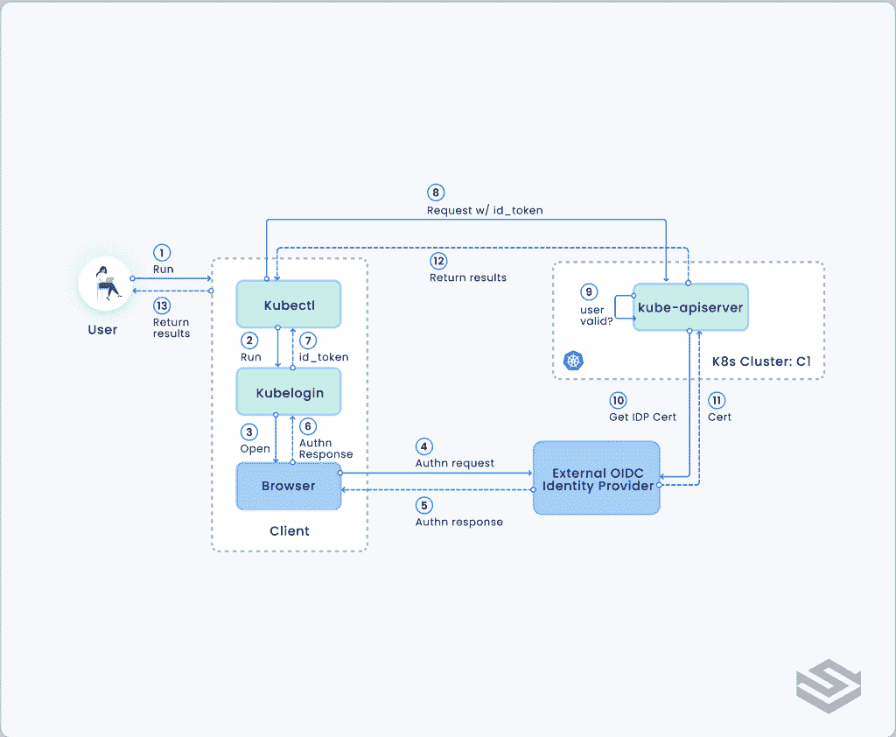
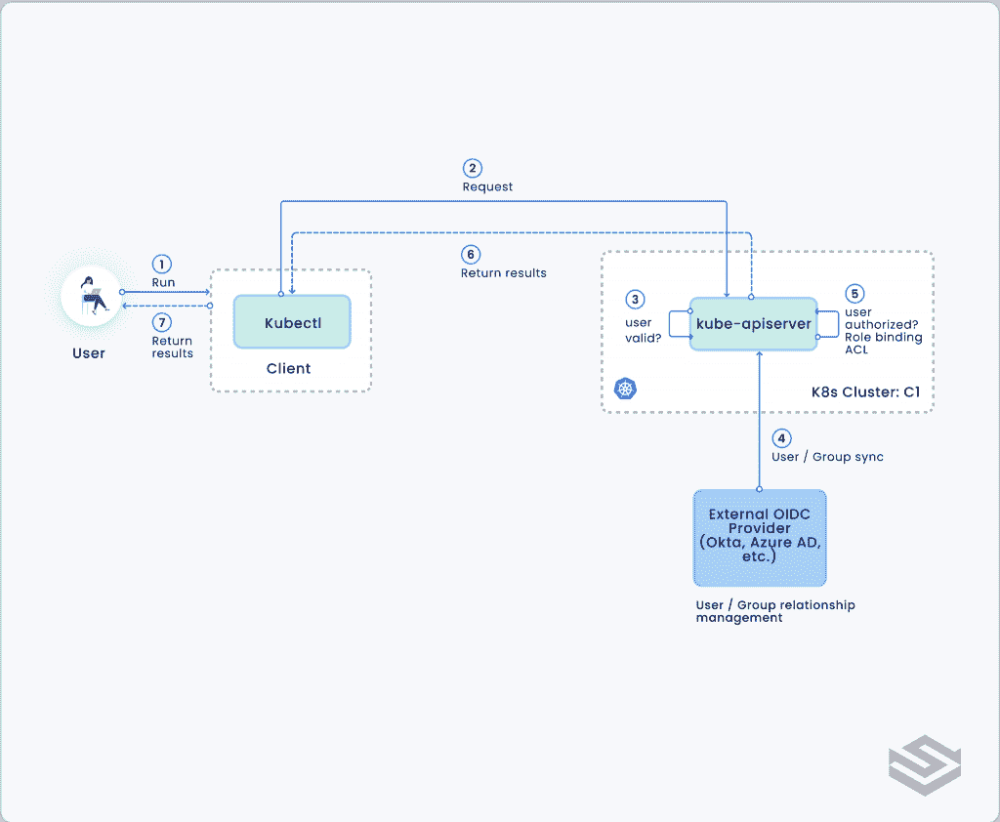
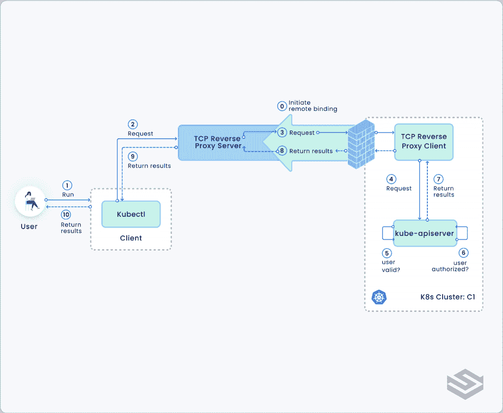
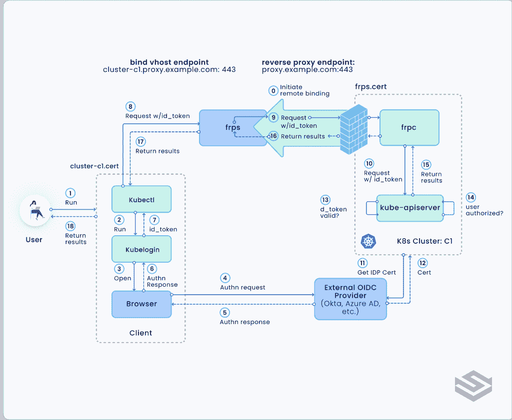

# 从任何地方零信任地安全访问 Kubernetes

> 原文：<https://thenewstack.io/secured-access-to-kubernetes-from-anywhere-with-zero-trust/>

控制 K8s 工作负载的访问、认证和授权至关重要，但尽管 Kubernetes 对于云原生工作负载越来越受欢迎，这仍然是一项艰巨的任务。

在本文中，我们将分解这个问题，展示如何通过应用基本的最佳实践和添加一些流行的开源工具，在您的 [Kubernetes 集群](https://thenewstack.io/why-cloud-native-systems-demand-a-zero-trust-approach/)中实现零信任安全的理想。

## 步骤 1:使用令牌和 MFA 的零信任身份验证

 [天力福

Tenry 在科技行业和软件开发领域拥有 20 多年的经验。在共同创立 Spectro Cloud 之前，他领导了思科多云管理和私有云产品组合的架构，这是他之前的合资企业 CliQr Technologies 被收购的结果。过去的经验包括 VMware 和 McAfee。他在可扩展分布式系统、企业系统管理和安全性领域拥有超过 18 项专利。他是一个铁杆音响发烧友，喜欢和家人一起徒步旅行。](https://www.linkedin.com/in/tenryfu/) 

在[零信任安全](https://thenewstack.io/what-is-zero-trust-security/)中，所有绑定到 K8s 集群的用户和服务帐户都必须在执行 API 调用之前进行身份验证——不存在帐户有权访问的隐式信任。

开箱即用，Kubernetes 支持多种身份验证策略:

*   **基于凭证的**认证(HTTP 基本认证、LDAP 等。)
*   **基于证书的**认证(客户端证书)
*   **基于令牌的**认证(无记名/Oauth2 令牌、OIDC 令牌、Webhook 令牌等。)

基于凭证和基于证书的身份验证都很容易实现，但有一个主要缺点:它们要求用户将凭证或客户端证书放在`kubeconfig`*文件中，这实际上将信任和安全攻击转移到了`kubeconfig`*文件。如果用户 A 的`kubeconfig`文件被泄露或被恶意用户 B 访问，用户 B 可以完全访问用户 A 的 K8s 集群和资源。许多臭名昭著的数据泄露案例都是由配置或证书文件中错误配置的权限引起的。**

 **基于凭据或基于证书的身份验证的另一个缺点是，可能很难添加多因素身份验证(MFA ),这是一种常见的身份验证安全最佳实践。

基于令牌的身份验证则不同。它涉及到与外部身份提供商(IDP)如 Okta、Azure AD 或 PingIdentity 进行身份验证。一旦通过身份验证，客户端(在本例中为 *kubectl* )将获得一个访问令牌，在某些情况下还会获得另一个刷新令牌。这些令牌具有可配置的到期期限(通常不到一小时)，并且可以在到期前刷新。重要的是，大多数国内流离失所者都有全面的 MFA 支持，客户无需做任何额外的工作。使用外部 IDP 进行身份验证和授权的另一个优势是，可以在 IDP 端轻松收集所有访问日志。

坏处呢？基于令牌的身份验证在最初设置时更加困难，需要安装客户端插件和一些 kubeconfig 配置更改，这比基于凭据和基于证书的身份验证更加复杂。

**建议:**采用基于令牌的认证系统可能需要更多的工作来实现和创建外部 IDP 依赖，但这是值得的。这是给 Kubernetes 带来真正的[零信任安全](https://thenewstack.io/what-is-zero-trust-data-protection/)的唯一途径。

## 步骤 2:基于组权限的零信任授权

身份验证使用户能够访问 K8s 集群；授权决定了每个用户在获得访问权限后可以做什么。

在零信任安全模型中，经过身份验证的用户只有在拥有执行所请求操作的必要权限时才能获得授权。对于发出的每个请求，这个模型都需要指定用户名、动作和 Kubernetes 集群中受影响的对象。

Kubernetes 支持多种授权方法:

*   **基于属性的访问控制(ABAC)** ，它基于用户和资源属性的组合来授权访问。这也可以称为访问控制列表(ACL)。
*   **基于角色的访问控制(RBAC)** ，基于用户在组织中的角色授权访问，角色代表用户被允许执行的权限集合。

这两种授权模式并不相互排斥。许多企业实际上使用 RBAC 来控制基于角色的通用权限，并在必要时使用特定资源对象上的附加 ACL 来增强这些控制。

不管您采用哪种授权模型，一个常见的最佳实践是基于`groups`而不是特定的`users`进行访问控制。角色和 ACL 被分配给一个或多个用户组；反过来，用户被分配到一个或多个组；授权将在运行时解析为有效的角色和 ACL。这样，用户和组成员可以与角色和 ACL 策略分开管理，使组成员成为授权和访问控制的唯一来源。这对于基于令牌的身份验证特别有效，因为外部 IDP 本身支持用户组成员资格管理。

**建议:**选择 ABAC、RBAC 或两者兼而有之，但要坚持基于组的访问控制策略，将外部 IDP 作为身份验证和授权的唯一来源。

## 步骤 3:用 TCP 反向代理保护 Kubernetes API 服务器访问

您可能已经实现了零信任身份验证和授权，但是您仍然需要从网络的角度保护 Kubernetes API 服务器访问。

在某些设置中，例如当 K8s 运行在虚拟私有云、防火墙后的内部部署或防火墙和 NAT(网络地址转换)设备后的边缘位置时，几乎不可能将 Kubernetes 访问直接暴露给公共互联网。但这并没有涵盖大多数 K8s 部署。今天，大量的 K8s 实例是公开可访问的，正如[你可能在最近的新闻报道](https://www.darkreading.com/application-security/more-than-eight-in-10-kubernetes-api-servers-exposed-to-the-internet)中听到的。

理论上，您可以故意以这种方式向任何人开放访问，因为 Kubernetes 本身已经通过身份验证和授权得到了保护。但是很少有 K8s 管理员会承认将 K8s 访问直接暴露给公共互联网是安全的，仅仅依靠认证和授权来保护它。明智的做法是采取进一步的预防措施来限制攻击面，并避免针对 K8s 本身潜在零日漏洞的利用。这种情况以前发生过，而且肯定会再次发生。

为了能够从任何地方安全地远程访问 Kubernetes 集群，您可以设置一个可公开访问的 TCP 反向代理服务器。

通过让 K8s 集群上的代理发起到保留代理服务器的 TLS 连接，将本地 API 服务器的端口绑定到反向代理服务器的远程 vhost URL，来建立这个反向代理隧道。由于 TLS 连接是由防火墙后的代理发起的，因此它只需要一个传出的 internet 连接，而不必修改任何防火墙规则来打开任何端口。如果 TCP 反向代理设置为使用众所周知的端口，如 443 (HTTPS 端口)作为其端点，它通常不会有任何问题通过防火墙连接，就像浏览器试图通过防火墙访问 HTTPS 网站一样。所以现在可以通过反向代理服务器的 vhost URL 访问 K8s API 服务器。

为了保持额外的安全层，反向代理服务器的 vhost URL 可以配置为要求特定于群集的客户端证书来建立连接。这个客户端证书可以嵌入到`kubeconfig`文件中，以访问 K8s 端点。请注意，由于我们使用基于令牌的身份验证和授权，客户端证书仅用于安全地建立到反向代理服务器的 vhost URL 的 TLS 连接，而不是对 K8s API 服务器的实际身份验证和授权，因此攻击面仅限于拥有客户端证书或`kubeconfig`文件的用户，以便能够连接到反向代理服务器的 vhost URL。通过要求 K8s cluster-admin 为远程故障排除会话手动打开此反向代理隧道，并在会话结束后或经过一段固定时间后关闭隧道，可以进一步减少攻击面。

另一种进一步减少攻击面的方法是完全避免暴露客户端证书和`kubeconfig`。相反，用户可以通过基于 web 的终端访问 K8s 集群，该终端使用户能够运行`kubectl`命令——客户端证书永远不会暴露给用户。

请注意，当使用 TCP 反向代理服务器进行远程访问时，访问日志很容易保留在反向代理服务器上，而不需要存储在群集上。可以在 Kubernetes 集群上启用附加的操作审计日志，以提供集群内执行的操作的跟踪记录。

**推荐:**千万不要将 K8s API 服务器直接暴露在公共互联网上。如果需要远程故障排除，请考虑使用访问受控的 TCP 反向代理设置。

## 用 kubelogin 和 frp 组装东西

让我们更详细地看一个这些最佳实践的例子。在下面的设置中，我们使用两个开源项目， [kubelogin](https://github.com/int128/kubelogin) 和 [frp](https://github.com/fatedier/frp) ，与 Okta 或 Azure Active Directory 等标准外部 OIDC 提供商合作，以实现从任何地方对 K8s 集群的端到端安全访问，并实现零信任身份验证和授权。

数据图表显示了以下步骤:

1.  *FRPC* 客户端发起到 *FRPS* 服务器组件的远程绑定。FRPS 托管在公共云中，可以通过公共互联网使用其端点 URL proxy.example.com 进行访问。为了确保安全性，frps.cert(自签名)与 *FRPC* 客户端打包在一起。集群 C1 API 服务器现在可以通过 cluster-c1.proxy.example.com 的 FRPS 访问了。
2.  用户向本地`kubectl`*发出运行命令。*
**   *T1 作为 [client-go 凭证插件](https://kubernetes.io/docs/reference/access-authn-authz/authentication/#client-go-credential-plugins)。**   `Kubelogin opens the browser to connect to the external IDP for authentication.``*   The browser sends an authentication request to the OpenID connect (OIDC)-enabled IDP. The IDP performs authentication and may further enforce MFA.*   If authenticated, the IDP returns the authentication response.*   The browser passes the authentication response back to `kubelogin`。*   `Kubelogin`从认证响应中提取`id_token`*(和`refresh_token`*)。*****   `Kubectl can now send the request along with `id_token`*到 FRPS vhost url，在`kubeconfig`*文件中列为 K8s 端点。`Kubeconfig`*还嵌入了特定于 cluster-c1 的客户端证书，以允许其连接到 FRPS vhost 端点。***``****   该请求被传递给 FRPC 客户端。*   该请求被进一步传递到`kube_apiserver`*。***   如果`kube_apiserver`*没有缓存的 IDP 证书，它将从外部 IDP 获取证书。***   IDP 根据请求返回其证书。*   `Kube_apiserver`使用 IDP 证书来验证`id_token`及其到期时间。如果有效，用户通过身份验证。*   `Kube_apiserver`根据操作和资源检查用户的角色和权限。一旦授权，`kube_apiserver`*执行动作并返回结果。***   返回的结果被传递给 *FRPC* 客户端。*   *FRPC* 客户端将返回结果转发给 *FRPS* 服务器。*   *FRPS* 服务器将结果返回给`kubectl`。*   `Kubectl 向用户显示结果。`******`**`*

 ``**`## 大规模安全的多集群管理

如果使用零信任身份验证和授权来保护 K8s 访问对于单个 K8s 群集来说已经足够复杂，那么想象一下当管理数百甚至数千个这样的群集时您将面临的挑战，尤其是如果所有这些群集都位于不同的边缘位置，例如每个零售店一个群集。

这就是需要现代企业多集群管理平台的地方。我们的调色板平台专注于解决像这样的大规模管理挑战。它不仅简化了安全性，还简化了全堆栈集群生命周期管理、第 2 天操作(如操作系统修补、治理、监控等)的各个方面。要了解更多信息，请访问 spectrocloud.com。

<svg xmlns:xlink="http://www.w3.org/1999/xlink" viewBox="0 0 68 31" version="1.1"><title>Group</title> <desc>Created with Sketch.</desc></svg>`**``**