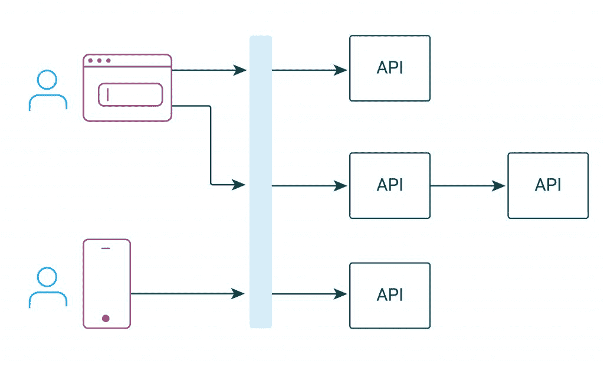
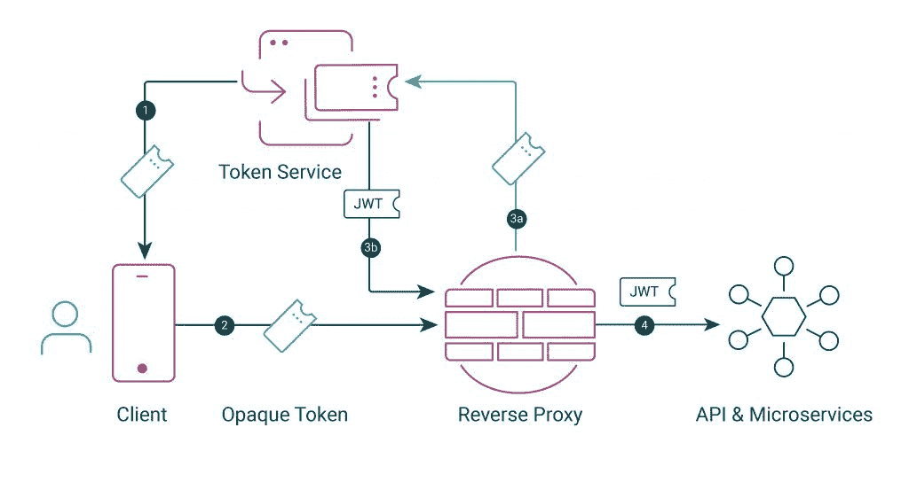
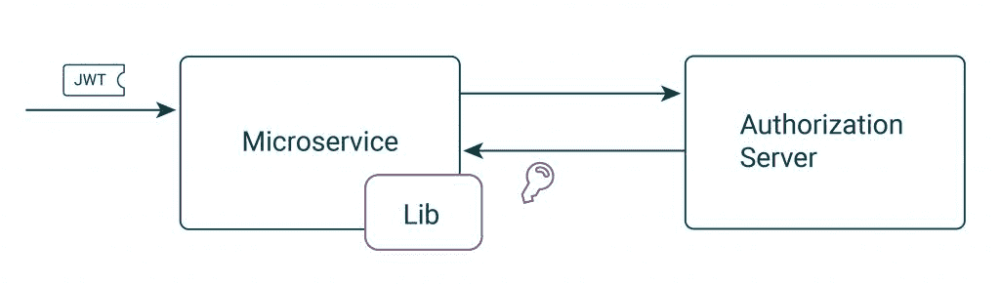
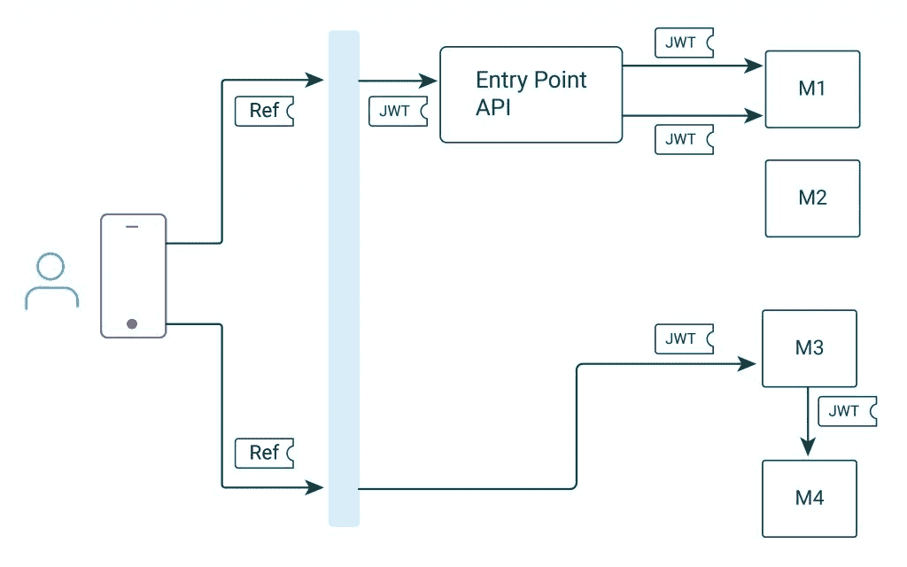
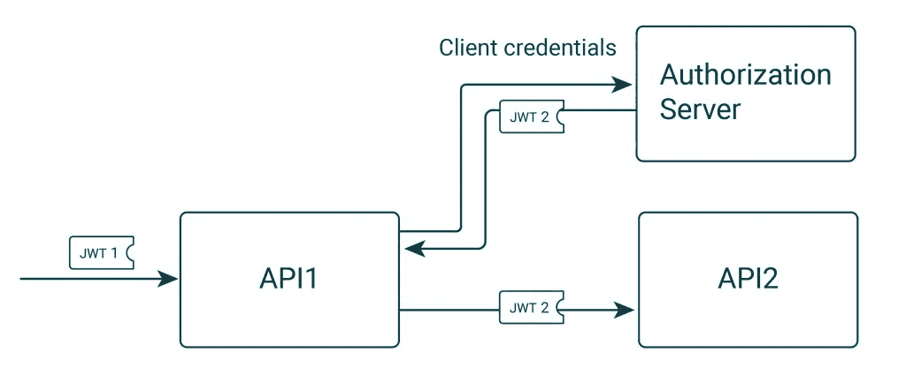
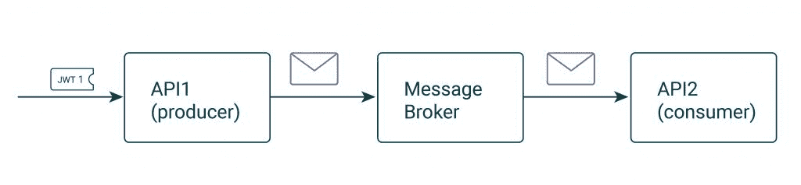
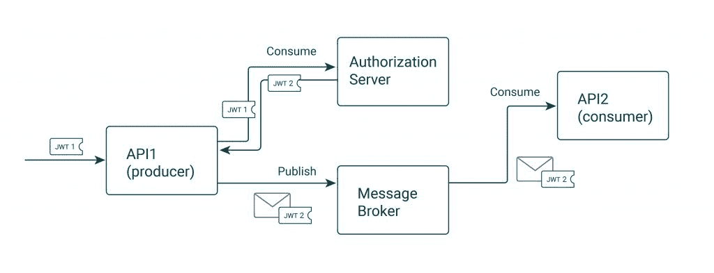
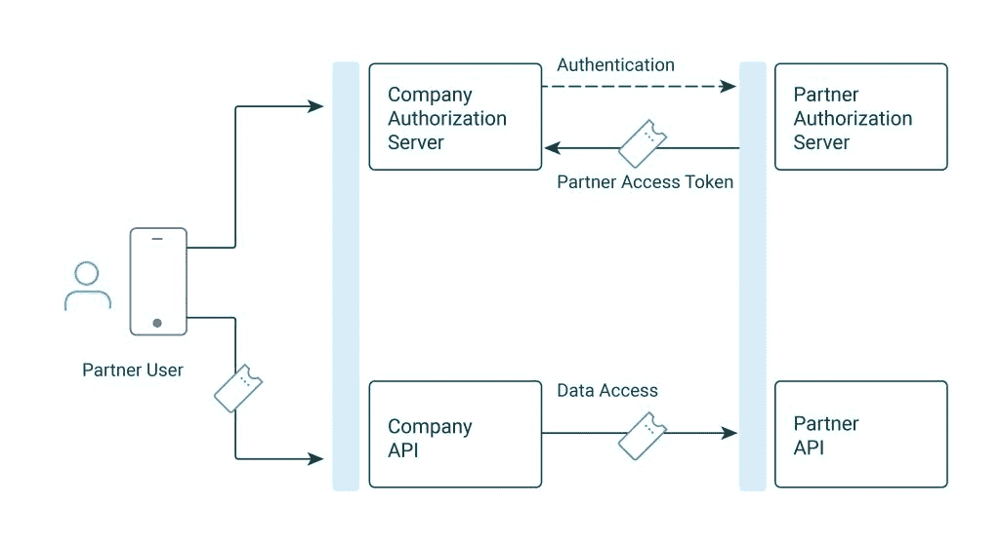
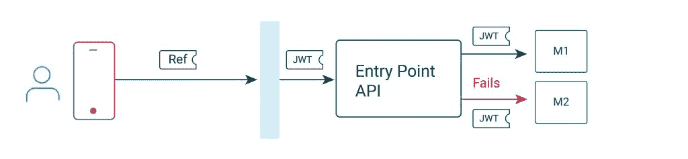

# 安全地扩展现实世界后端平台中的无数 API

> 原文：<https://thenewstack.io/securely-scaling-the-myriad-apis-in-real-world-backend-platforms/>

如今，保护 API 的最标准方式是通过访问令牌，它使用 JSON Web 令牌(JWT)格式。尽管有许多关于接收和验证 jwt 的在线教程，但这些教程通常不会传达如何在更大范围内管理安全性。在本文中，我将解释如何将 jwt 的使用扩展到真实世界的后端平台，那里有许多 API 和客户端。



## OAuth 安全框架

 [加里·阿彻

加里是 Curity 公司的产品营销工程师。20 年来，他一直担任首席开发人员和解决方案架构师。](https://www.linkedin.com/in/gary-archer-6b3613153/) 

保护 API 中的数据和保护调用 API 的客户端的现代标准是许多专家已经审核过的 [OAuth 系列规范](https://curity.io/product/conformance/)。这些提供了许多可以用来满足客户用例的安全设计模式。

OAuth 的核心是授权服务器，它位于您的 API 旁边。它处理实现规范、存储秘密、实现用户和客户端认证、发布令牌、审计和其他安全工作。

本质上，您可以将授权服务器看作是一个专门的 API，您可以插入其中，而不是自己构建。它最好与您的其他 API 一起部署，以便它们可以在需要时有效地与之交互。

## 反向代理

API 使用的 jwt 不应该直接返回给 internet 客户端，因为它们是可读的，可能会泄露敏感信息。相反，将不透明的访问令牌返回给不透露任何数据的客户端会更安全。对于基于浏览器的应用程序，建议更进一步，避免为 JavaScript 代码提供任何标记。处理这些问题最好由运行在 API 前面的组件来管理，而不是在 API 代码中。



API 和授权服务器通常都连接到敏感的数据源。因此，在这些组件前面放置一个反向代理或网关是托管的最佳实践。然后，反向代理可以运行插件，以高性能的方式执行实用程序作业，如令牌转换。这确保了质量安全，同时也简化了 API 中的代码。然后，他们可以专注于他们的主要安全职责，即授权数据请求。以下链接提供了关于这些模式的更多详细信息:

## API 授权

在每个单独的 API 中，实现授权有三个级别。首先，根据 [JWT 最佳实践](https://curity.io/resources/learn/jwt-best-practices/)对收到的访问令牌进行数字验证，之后您可以信任令牌的 JSON 有效负载中的数据。

JWT 数字验证包括使用一个[安全库](https://curity.io/resources/guides/libraries/api)，它将从授权服务器下载令牌签名公钥，将它们存储在内存中，然后用它们来验证 JWT 的加密签名。键查找很少发生，不会对 API 性能产生负面影响。



下一个授权步骤是使用 [OAuth 作用域](https://curity.io/resources/learn/scopes-and-how-they-relate-to-claims/)进行入门级检查，以防止明显无效的请求。最后，使用[基于声明的授权](https://curity.io/resources/learn/what-are-claims-and-how-they-are-used/)来拒绝或过滤对资源的访问。这可以扩展到任意复杂的业务规则。

理解 jwt 的一个关键点是，它们是可以数字验证的，不容易受到中间人攻击。当处理与安全相关的标识符时，将它们包含在 JWT 中，而不是包含在标题或 URL 路径段中，因为它们可能会在运行中被更改:

```
GET  /api/users/23/purchases
GET  /api/partners/407

```

## 多个 API

有许多方法可以在 API 之间路由请求，我看到的一个有趣的选择是应用程序有时使用专门服务于特定客户端的入口点 API。这可能用于聚集对核心微服务的调用，将 UI 问题排除在微服务之外，或者减少暴露于互联网的 API 端点的数量。



在旧的体系结构中，授权通常只发生在外围，比如上面的入口点 API。如今，由于基于云的托管和网络内部的潜在威胁，建议使用 jwt 来实现零信任[架构](https://curity.io/resources/learn/zero-trust-overview/)。

零信任包括将 JWT 转发给每个相关的 API 或微服务。然后，每个 API 必须以数字方式验证最终用户身份，并根据与该 API 功能相关的范围和声明执行自己的授权。

## 可扩展索赔

在 JWT 被验证之后，声明是授权的主要组成部分。这些价值通常来源于您的业务数据，正如在[声明最佳实践](https://curity.io/resources/learn/claims-best-practices/)中进一步解释的那样。因此，授权服务器允许您在需要时定制 jwt 是很重要的。

尽管转发 jwt 是最常见的设置，但在某些情况下，API 本身必须充当 OAuth 客户端并获得另一个访问令牌，其范围和声明更适合目标 API:



[客户端凭证流](https://curity.io/resources/learn/oauth-client-credentials-flow/)通常是 OAuth 流开发人员了解的第一个机器对机器通信。尽管乍一看这似乎非常简单，但是几个相关的 OAuth 流也应该被视为安全工具箱的一部分。关于[令牌共享](https://curity.io/resources/learn/token-sharing/)、 [JWT 断言](https://curity.io/resources/learn/jwt-assertion/)和[冒充方法](https://curity.io/resources/learn/impersonation-flow-approaches/)的文章提供了进一步的细节。最终结果是，每个目标 API 都可以根据自己的需求来授权请求。

## 安全事件

如今，当 API 接收到更改数据的命令时，它们通常会立即执行工作，并触发一个其他 API 可以订阅的事件。这使用了异步消息传递系统，从而使 API 代码更简单、更具解耦性。

然后可以在将来的某个时候处理该事件，但是可能需要访问该事件发布时的原始身份。但是，在默认情况下，很容易丢失身份信息，这带来了安全风险，消费者会在普通消息中收到无法验证的数据:



这是可以使用不同的令牌向消费者传递可验证身份的另一种情况。新令牌应该有足够长的生存期来处理事件，但范围要缩小。有关该主题的更多信息，请参见【OAuth 2.0 批处理。



## 合作伙伴 API

大多数真实世界的软件平台也会与来自业务合作伙伴或第三方提供商的外部 API 进行交互。一个好的授权服务器和对 OAuth 标准的理解也将提高这种“联合”的能力

下面显示了一个有趣的用例，一个合作伙伴用户被授权登录该公司的应用程序。然后，合作伙伴授权服务器可以充当身份提供者，根据合作伙伴的安全策略和熟悉的凭证对用户进行身份验证。然后，公司的 API 可以使用来自业务伙伴的[嵌入令牌](https://curity.io/resources/learn/token-sharing/#embedding-a-token)来调用合作伙伴 API。



还有许多其他的可能性，一旦您将 OAuth 和 OpenID Connect 集成到您的业务中，所使用的设计模式和授权服务器的特性将使您能够进一步扩展安全架构。

## 可靠的客户

我们总结的 API 流程需要从可靠性的角度进行设计，因为其中一个组件可能会出现临时故障，原因可能是通信故障、应用程序错误、JWT 到期或其他原因:



在构建微服务的公司中，不同的 API 使用不同的数据存储，他们已经在使用一些技术来确保重试不会复制任何数据。创建数据时的一个选项是用户应用程序发送一个生成的唯一标识符，如果需要从客户端重试请求，该标识符将保持不变。然后，API 可以使用这个标识符来检查资源是否已经存在。

JWT 库将允许 API 在验证访问令牌时使用时钟偏移，并且有可能为下游 API 配置稍高的时钟偏移。但是，不建议依赖到期时间，因为 JWT 验证失败可能有多种原因。在某些设置中，这可能是由负载平衡故障转移等基础设施事件引起的。

相反，建议实现标准的到期处理。在这种情况下，从客户端重试通常是最有弹性的选择。这可以通过遵循这些简单的编码规则来管理，这些规则很容易扩展到许多组件:

*   当请求由于缺少、无效或过期的访问令牌而未能通过 JWT 验证时，API 会返回 401 HTTP 状态代码。

*   API 客户端通过尝试刷新访问令牌来处理 401 响应，然后使用新令牌重试一次请求。

## 结论

JWT 接入令牌传达数字身份。API 首先使用安全库来验证 JWT。然后，令牌的作用域和声明用于执行真正的授权工作。这种处理速度很快，并且可以跨许多 API 扩展，从而实现零信任 API 平台。

使用具有良好可扩展性的授权服务器和对插件具有良好支持的反向代理。此外，确保 API 可以接收带有自定义范围和声明的 jwt。然后，您将拥有坚实的安全基础。

OAuth 最适合用作工具箱，在这里您可以根据自己的用例调整规范。为了帮助解决这一问题，我们提供了[安全资源](https://curity.io/resources/)，这些资源根据独特的客户使用案例来解释安全性。通过正确的设计，只需要简单的代码就可以保护一个 API 平台。

<svg xmlns:xlink="http://www.w3.org/1999/xlink" viewBox="0 0 68 31" version="1.1"><title>Group</title> <desc>Created with Sketch.</desc></svg>