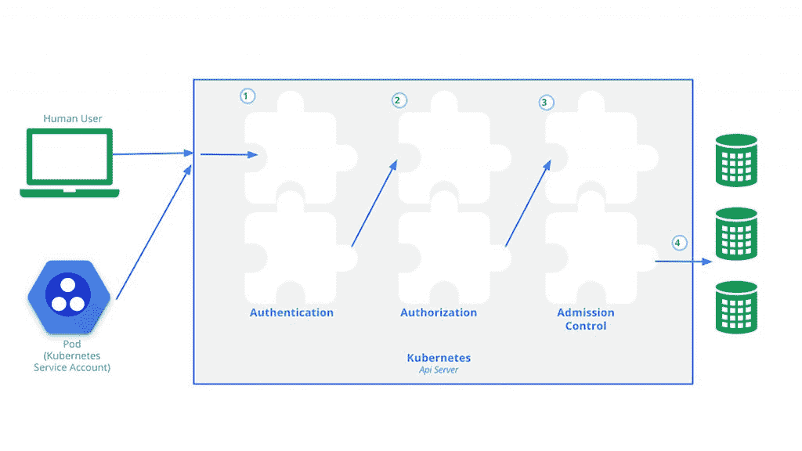

# 零信任安全访问 Kubernetes 环境

> 原文：<https://thenewstack.io/securing-access-to-kubernetes-environments-with-zero-trust/>

现代 IT 环境正变得日益动态化。例如，Kubernetes 正在拓展许多 IT 组织的可能性。

开源技术在自动化部署、可伸缩性和容器化应用程序管理方面的优势有很多。特别是，IT 团队正在利用其强大的功能、效率和灵活性来快速开发现代应用程序并大规模交付。

 [凯尔·亨特

凯尔是拉菲系统公司的产品营销主管。他在信息传递和定位、竞争差异化、走向市场战略和思想领导力方面有着出色的表现。](https://www.linkedin.com/in/kylehunter) 

然而，在 Kubernetes 环境中确保强化安全实践的过程是一个越来越大的挑战。随着越来越多的开发和生产 Kubernetes 集群分布在内部数据中心、多个公共云提供商和边缘位置，这种相对较新的动态运营模式为控制访问带来了极大的复杂性。

由于大多数团队在多个地点运行多个集群(通常是带有管理界面的不同版本)，企业 IT 需要考虑需要不同访问级别的开发人员、操作员、承包商和合作伙伴团队。

考虑到 Kubernetes 的分布式和扩展性，它必须尽一切可能确保访问安全，以避免正在发生的[错误](https://techgenix.com/5-kubernetes-security-incidents/)。下面，我们将看看如何应用 Kubernetes 零信任原则来保护整个环境，为容器提供零信任安全性。

## **对 Kubernetes 集群的零信任访问**

作为一种自动假设在网络中和网络之间运行的所有人、系统和服务都不可信的安全模型，零信任正成为防止恶意攻击的最佳技术。基于认证、授权和加密技术，零信任的[目的是持续验证安全配置和状态，以确保整个环境的信任。](https://thenewstack.io/what-is-zero-trust-security/)

下面是对 Kubernetes 如何工作的基本理解 *:*

*   每个集群的 Kubernetes 控制平面的核心是 Kubernetes API 服务器。
*   API 调用用于查询和操作所有 Kubernetes 对象的状态。
*   Kubernetes 对象包括名称空间、pod、配置图等等。

控制对 API 使用的访问是管理 Kubernetes 访问和实现零信任的关键功能。保护 Kubernetes 集群访问安全的第一步是使用传输层安全性(TLS)保护进出 API 服务器的流量。

图片来源:kubernetes.io

实现零信任的 API 服务器最佳实践:

*   到处启用 TLS。
*   为 API 服务器使用私有端点。
*   对 API 服务器使用第三方身份验证。
*   关闭对 API 服务器的防火墙入站规则，确保它被隐藏并且不能从互联网直接访问。

在保护传输层之后，Kubernetes 还包含了必要的挂钩，以实现零信任并控制每个 Kubernetes 集群的 API 服务器访问。这些挂钩代表了 Kubernetes 强化安全态势的四个关键领域:

1.  证明
2.  批准
3.  准入控制
4.  日志记录和审核

## 【Kubernetes 认证

对于零信任，所有绑定到 Kubernetes 集群的用户级和面向服务的帐户都必须在执行 API 调用之前进行身份验证。Kubernetes 广泛提供安全模块和插件，以确保该平台能够与团队首选的认证系统一起有效运行:

*   HTTP 基本身份验证
*   认证代理(支持 LDAP、SAML、Kerberos 等。)
*   客户端证书
*   不记名代币
*   OpenID 连接令牌
*   Webhook 令牌授权

身份验证的常见最佳做法包括启用至少两种身份验证方法(多因素身份验证或 MFA)以及定期轮换客户端证书。

## **授权给 Kubernetes**

允许每一个经过身份验证的用户或服务帐户在 Kubernetes 集群中执行任何可能的操作的问题必须得到缓解。零信任的概念是，只有经过身份验证的用户拥有完成所请求操作的必要权限，请求才能被授权。对于发出的每个请求，这个模型都需要指定用户名、动作和 Kubernetes 集群中受影响的对象。

Kubernetes 支持多种授权方法，包括:

*   基于属性的访问控制，即 ABAC，基于用户、环境和资源属性的组合来动态授权访问。
*   基于角色的访问控制，即 RBAC，根据用户在组织中的角色(如开发人员、管理员、安全人员等)来授权访问。

组织最常使用 RBAC，因为它的实用性允许更容易的管理控制，并提供大多数用例所需的粒度。在行业内，以最少的权限启用 RBAC 是很常见的。

ABAC 可以提供额外的粒度，但需要额外的时间和资源来正确定义和配置。但是，使用 ABAC 方法对问题进行故障诊断可能更具挑战性。因此，以最少的特权启用 RBAC 是很常见的。

## **对 Kubernetes 的准入控制**

准入控制器提供了一种实现业务逻辑的方法，以改进 Kubernetes 的零信任方法。准入控制器的目的是使系统能够自动处理创建、修改、删除或连接到 Kubernetes 对象的请求。为了满足您的组织的需求，启用多个准入控制器可能是必要的，如果其中任何一个控制器拒绝了特定的请求，系统也会自动拒绝它。

如今，各种各样的内置准入控制器为团队执行策略和实现各种操作提供了大量的选择。动态控制器能够快速修改请求，以符合已建立的规则集。例如，ResourceQuota 准入控制器观察传入的请求，并确保它们不违反在名称空间的 ResourceQuota 对象中列出的约束。更多信息见[使用许可控制器](https://kubernetes.io/docs/reference/access-authn-authz/admission-controllers/)。

## 【Kubernetes 的日志记录和审计

审计功能是 Kubernetes 安全状态的基础，它提供了集群中执行的操作的跟踪记录。这些功能可以跟踪任何用户、应用程序和控制平面本身的任何操作。

有四种不同类型的审计级别:

*   无-不记录此事件
*   元数据–日志请求元数据
*   请求–记录事件元数据和请求
*   request response–记录事件元数据、请求和响应

除了指定审计级别，团队还可以控制审计事件的记录位置。当日志后端将事件写到集群的本地文件系统时，webhook 后端将审计事件发送到外部日志系统。

## **扩展零信任架构**

虽然上述不同的方法和实践提供了创建零信任环境的能力，但是当 Kubernetes 的足迹扩展到几个集群之外时，正确地配置和调整这些单独的元素就变成了一个更大的挑战。当涉及多个工作负载和 Kubernetes 发行版时，事情变得特别复杂。这一挑战并不新鲜，但如今许多公司都面临着这一挑战。

例如，让我们考虑一个场景，其中一家公司正在管理 100 个 Kubernetes 集群，从开发到 QA，从准备到生产，这些集群需要在地理上靠近其全球客户群，以便应用程序能够处理实时视频和音频数据流。

在确保用户安全访问 Kubernetes 集群方面，该公司可能会遇到三个问题:

1.  假设这家公司有几百名开发人员和几十名 IT 操作人员，从每个集群中手动添加和删除用户的艰苦任务可能会产生比它解决的问题更多的问题。
2.  如果(或者更有可能是在)事故发生时，采取补救措施所需的时间至关重要。如果访问方法需要那些解决问题的人花几分钟时间才能登录到受影响的集群，问题可能会成倍增加。
3.  由于日志数据分布在 100 个集群中，因此获得审计和合规性报告的整体视图可能是不可能的。

## **平台团队的考虑事项**

企业平台团队的众多目标之一是帮助一个全球分布的 IT 团队从一个中心位置管理跨其所有集群的用户访问。目的是有效地保护和管理对 Kubernetes 基础设施的访问，同时使审计日志记录和合规性报告更加简单。

平台团队应该考虑对 Kubernetes 实施零信任，以确保前面描述的最佳实践得到应用和执行，从而确保整个 Kubernetes 环境的安全。通过消除在每个集群上手动应用最佳实践的需要，IT 组织可以以更低的风险大规模运营 Kubernetes。

以下是平台团队在为 Kubernetes 设计零信任时需要考虑的三个好处:

1.  **让 RBAC 变得超级灵活**:如果一个团队成员改变了角色，访问权限应该自动更新，这样就不会有人拥有过多或过少的访问权限。
2.  **快速简化访问**:通过安全单点登录为授权用户提供无缝访问，消除对任何集群的延迟访问。
3.  **即时场景的凭证**:授权用户的服务帐户应该在具有“即时”访问权限的远程集群上创建，并在用户注销后自动删除，从而消除过期凭证的可能性。

随着 Kubernetes 集群和容器化应用程序数量的增加，一个组织越来越多地暴露于安全风险中，而这些风险在只运行一两个集群时并不明显。因此，平台团队需要在整个 Kubernetes 基础设施中为集群和应用程序提供集中的企业级安全和控制。

<svg xmlns:xlink="http://www.w3.org/1999/xlink" viewBox="0 0 68 31" version="1.1"><title>Group</title> <desc>Created with Sketch.</desc></svg>