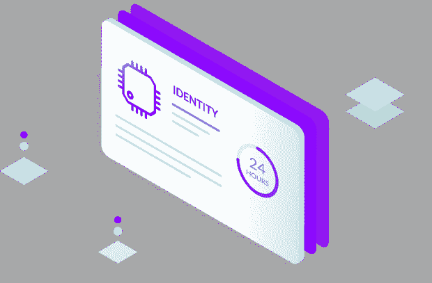
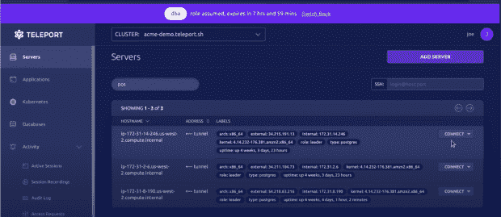
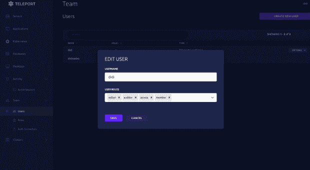

# 使用 Teleport 保护对基础设施的访问

> 原文：<https://thenewstack.io/securing-access-to-your-infrastructure-with-teleport/>

缺乏访问控制和监控给公司带来了巨大的安全风险，并使他们面临数据泄露，这可能会给他们带来数百万美元的损失。

多年来，公司一直依赖传统方法，如虚拟专用网络、密码、私钥、基于角色的访问控制分段等。，作为保护其基础架构的一种形式，但这些方法通常是劳动密集型的，很容易遭到破坏，并且不适应未来。

黑客的进步需要加强你的安全游戏，这就是为什么推荐使用像 Teleport 这样的访问控制系统，它遵循最小特权的[原则。](https://fedtechmagazine.com/article/2021/07/zero-trust-architecture-depends-granular-role-based-access-management)

在本文中，我将重点介绍使用 [Teleport](https://goteleport.com/?utm_campaign=eg&utm_medium=partner&utm_source=Edidiong) 安全地访问和监控您团队的基础设施(虚拟机、Kubernetes 集群、数据库 Windows 服务器)的不同方式，这样可以加快您团队的开发工作流程、生产力和安全性。

## **使用 SSO 管理对 Kubernetes 集群的访问**

 [艾迪翁·阿西克波

Edidiong 是尼日利亚拉各斯的一名开发人员倡导者。她热衷于通过技术文章、视频和社交媒体分享她的 DevOps 知识。Edidiong 在世界各地的技术活动中发表了 100 多次演讲，并在非洲开发人员社区的建设中发挥了重要作用。她是经过认证的 Kubernetes 应用程序开发人员和开源贡献者。](https://www.linkedin.com/in/edidiong-asikpo/?originalSubdomain=ng) 

使用默认方法，您通常需要创建一个 Kubernetes 角色对象，并将您的队友分配给它。Teleport 使您能够做到这一点，但它更进一步支持使用这些 [SSO 提供者](https://goteleport.com/docs/enterprise/sso/)中的任何一个来实现单点登录(SSO)认证方案，从而消除了每次有新成员加入公司时为您的 K8s 集群创建单独用户的需要。

使用 Teleport 在您的基础设施上实现 SSO 认证有很多好处。我最喜欢的包括:

*   使开发团队只需点击一下鼠标就能快速访问并邀请队友加入他们的 Kubernetes 集群。这提高了安全性，并最大限度地减少了对登录凭证(如密码)的窃取，因为开发团队不再需要使用密码或私钥来访问他们的 Kubernetes 集群。
*   减轻系统管理员管理 SSH 密钥或本地密码的负担。
*   作为开发团队成员入职、调动和离职的合规流程。例如，让我们假设 Alice 最近作为软件工程师加入了滴滴公司。由于 Didi 组织使用 Teleport，并且已经将其基础设施连接到 GitHub SSO 提供商，他们将能够将她添加到 GitHub 上的 *team-a-access* 角色，这将自动为她提供必要的权限，以完成她在公司基础设施(K8s 集群)上的任务。如果 Alice 从 A 队转到 B 队，她将很快从 GitHub 上的*A 队-访问*角色中移除，并被添加到*B 队-访问*角色中，从而失去给予 A 队成员的所有权限。当 Alice 离开公司时，她将从 GitHub 上的*B 队-访问*角色中移除，导致她在几秒钟内失去对 Kubernetes 集群的访问。如果没有 Teleport，Didi 组织将花费更多时间来执行所有这些操作，因为这需要编写 YAML 配置文件、在 CLI 上运行命令、更新大量记录等。，所有这些都可能导致无效的访问控制管理。

了解更多有关 Teleport 用户如何通过 GitHub 或其组织的单点登录( [SSO](https://goteleport.com/docs/enterprise/sso/) )登录任何基础设施(服务器、Kubernetes 集群、数据库、web 应用程序和 Windows 桌面)的信息(如果使用企业版)。

## **网飞给你的 Kubectl 高管**

Teleport 的建立是为了促进基于身份的安全。这意味着与指定身份不匹配的人将无法访问您的任何基础架构，从而消除安全威胁并降低违规的影响。

这种安全方法的一个好处是，您可以知道访问过您的 Kubernetes 集群的每个人的身份，还可以看到集群上出于安全或调试目的而执行的交互。

例如，假设您的一个队友(Paul)对 Kubernetes 集群进行了一些更改，然后立即出去吃午饭，却没有意识到他所做的更改对 Kubernetes 集群产生了负面影响。您会得到关于这个错误的通知，而不是惊慌失措，您将前往您的 Teleport 仪表板，查看集群的审计日志，并确定在 Kubernetes 集群上执行的操作。

有了这些新信息，您知道 Paul 的更改可能导致了问题，但是您想要确认，因此您前往 Paul 活动的会议记录，查看他到底做了什么，并做出必要的更改来解决问题。很酷，对吧？我知道！有了 Teleport，调试和分析 bug 比以往任何时候都容易。

对于上下文，Teleport 的可见性有三种格式；会话记录、审核日志和实时视图。

*   会话记录将显示开发者或服务帐户的每个`kubectl`会话。
*   统一审核日志在一个位置显示所有集群中的所有事件。
*   实时视图显示所有在线集群、活动的`kubectl`会话和访问请求。

## **RBAC 和 ABAC 与最小特权原则**

[基于角色的访问控制(RBAC)](https://digitalguardian.com/blog/what-role-based-access-control-rbac-examples-benefits-and-more) 和[基于属性的访问控制(ABAC)](https://www.okta.com/blog/2020/09/attribute-based-access-control-abac/) 是两种最流行的实现访问控制的方式。RBAC 根据个人在组织中的角色允许或限制对基础架构的访问。相比之下，ABAC 根据特定属性(时间、位置等)限制或批准请求。)的个人。

正如上面添加的链接中所强调的，RBAC 和 ABAC 有它们的好处，但它们也有某些缺点。比如说；

*   RBAC 可能会授予个人过多的访问权限，从而违反最小特权原则，并可能暴露敏感信息；也可能会过于严格，从而导致人们手动请求访问权限，然后手动授予或拒绝访问权限，从而导致组织的角色数量和工作量增加。
*   使用 ABAC，您可以为开发人员设置访问权限，使其只能在上午 9 点到下午 5 点之间访问基础架构或某些资源。但是，如果晚上 10 点发生网络攻击或漏洞，该怎么办呢？开发人员将无法访问解决问题所需的资源，或者可能不得不手动请求访问，而应该授予他们访问权限的人可能不在、正在睡觉或不在。

传送不仅让你更容易融合 RBAC 和 ABAC 的优点。它还解决了它的缺点，包括允许您在使用 RBAC 或 ABAC 时在基础设施上实现最小特权原则的特性。

例如，当以默认方式使用 RBAC 时，您必须随时根据任何数据或组织结构的变化主动更新策略，因为 RBAC 不会对任何组织结构的变化进行预测。但是当用传送实现 RBAC 时，你不需要担心 RBAC 的面向未来的限制，因为你可以在一段时间内授予对某些资源的访问权，而他们对该资源的访问权将在这段时间过后终止。

## **基础设施的一次性权限提升**

使用 Teleport，开发团队可以升级他们对基础架构内特定角色或资源的请求，以确保他们不会因为没有获得修复 bug 所需的必要资源而感到沮丧。

我发现传送的一次性特权升级有很多吸引人的地方。举几个例子；

*   它允许通过 Slack 和其他支持的 ChatOps 工具批准或拒绝访问请求的能力。您唯一的选择是使用 CLI 或编写 YAML 文件的日子已经一去不复返了。
*   启用双重授权(这意味着至少需要两个人批准对敏感资源的请求)的能力，以防止可能危及您的基础架构的网络钓鱼攻击。例如，如果 Paul 想要获得 dbadmin 角色的访问权限，他会转到他们的 Teleport 仪表板，选择`dbadmin`，添加请求的原因，然后单击**发送请求**按钮。安全团队(让我们称他们为 Didi 和 Alice)将收到 Paul 在 Slack 上发出的关于该访问请求的通知，审查然后批准或拒绝该请求。
*   您的基础设施上的每个访问请求都会被捕获，以后可以通过单击 Teleport 仪表板上的**审计日志**进行查看。这对调试来说是极好的。

## **总结**

Teleport 不仅使您能够创建对基础设施的安全访问，它还:

*   采用新的方法，使紧张的访问控制管理过程变得更容易(例如 SSO 实现)。
*   为您的所有基础设施充当一站式商店(您可以在您的传送仪表板上看到一切)。
*   让您完全了解基础架构上发生的一切，从而简化调试和数据违规管理。
*   允许用户快速请求访问其基础架构，允许管理员授予短期访问权限。

如果您的团队的访问控制挑战让您夜不能寐，或者变得过于劳动密集型，那么 Teleport 可能是您所需要的。我建议您查看他们的[案例研究页面](https://goteleport.com/case-study/)，因为它将帮助您了解各公司如何在众多领域使用 Teleport，并发现它如何在您的领域发挥作用。

<svg xmlns:xlink="http://www.w3.org/1999/xlink" viewBox="0 0 68 31" version="1.1"><title>Group</title> <desc>Created with Sketch.</desc></svg>