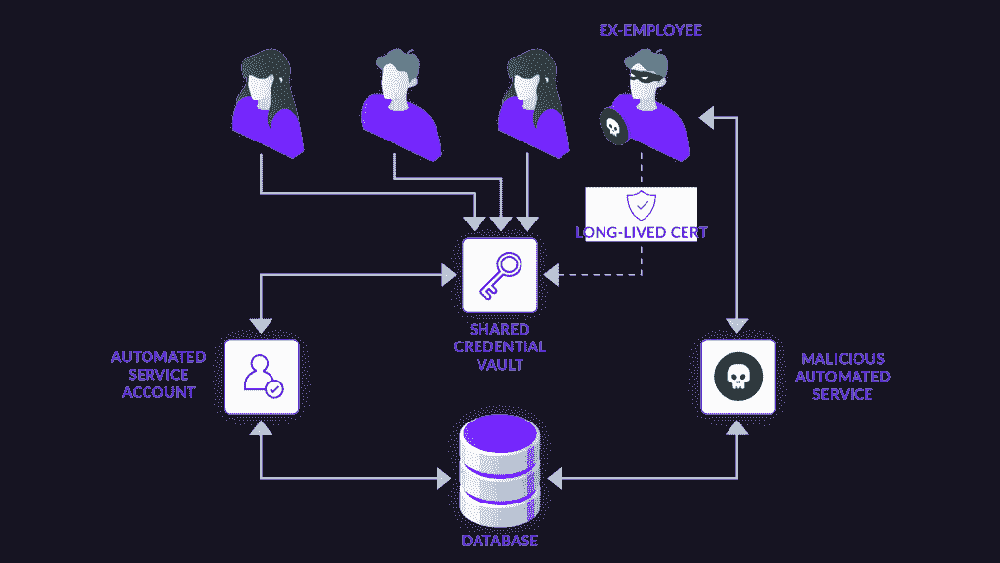
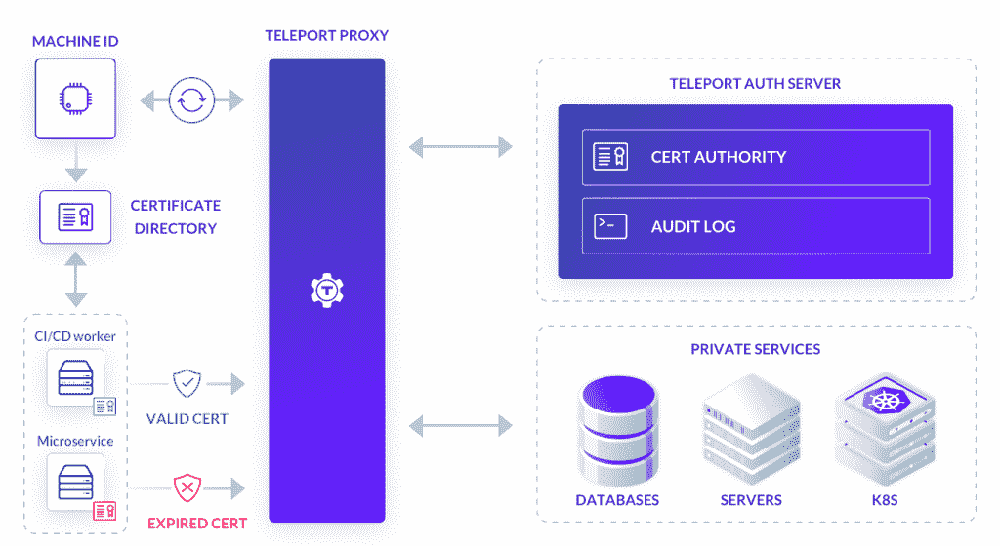
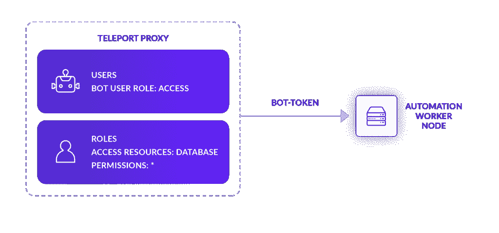
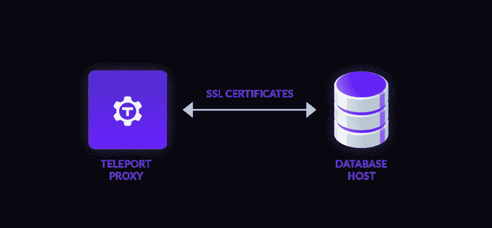
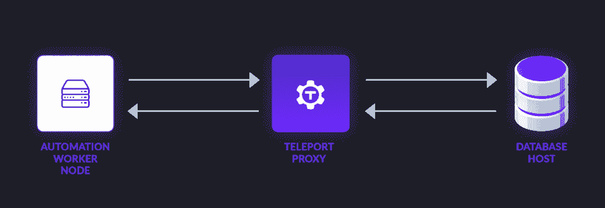

# 保护自动化数据库访问

> 原文：<https://thenewstack.io/securing-automated-database-access/>

在我做软件工程师的这些年里，我见过不少不同的 CI/CD 凭证管理方法，从安全的到糟糕透顶的都有。

我遇到的一个常见问题是“一劳永逸”的方法。在这种方法中，工程团队使用像 lastpass 或 1Password 这样的凭证管理器来存储不同自动化服务使用的长期共享凭证。这些可能是密码、API 令牌、证书、SSH 密钥等。—所有人都生活在一个中心位置。然后，当部署自动化服务帐户时，它们向 vault 服务器发出请求，然后 vault 服务器返回密钥。

这样，凭证就不必存储在 git 存储库中，或者——但愿不会——存储在贴在监视器上的便笺条上。虽然从表面上看，这似乎是一种安全的做法，但将这些凭证存储在保险库中会带来一系列问题。



## **共享访问的麻烦**

 [肯尼斯·杜梅斯

Kenneth 于 2022 年 4 月加入 Teleport，此前他曾在 Pivotal 和 VMware 开发 Kubernetes 构建解决方案。目前，他正致力于让开发者采用 Teleport，这是一个开源的安全访问控制平台。他主要花时间制作书面和视觉内容，并在美国各地参加不同的会议，学习和教育各种云安全技术。](https://www.linkedin.com/in/kenneth-dumez-086b84220/) 

共享凭证的最大问题可能是这些令牌几乎总是长期存在的。在某些情况下，它们甚至是永久性的，没有自动失效日期。

这使得工程师的凭证管理更加容易，因为他们不必轮换这些密钥和重新部署自动化管道，而这会导致生产停机。

无论多么容易，这都不好。由于其长期存在的性质，如果这些凭据中的任何一个泄露出去，攻击者都可以无限期地使用它们来授予对安全系统的访问权限并造成严重破坏。

如果没有频繁的轮换，前员工仍然可以存储这些凭据，从而使您面临潜在的泄露风险。如果没有对不同的自动化服务进行良好的监控和审计，就很难准确确定哪个 cred 已经暴露，从而增加了灭火的响应时间。

## **反思自动化访问**

当然，这个问题不是自动化独有的；人类工程师面临着完全相同的问题，也有共同的管理凭证。对于人类来说，这些问题已经在很大程度上通过基于身份的访问控制来解决:将一名人类工程师，如“爱丽丝·史密斯”所说，绑定到一组基于角色的访问控制(RBAC)角色，迫使她通过单点登录(SSO)进行认证，例如 Okta，以访问共享资源集。在 Teleport 为人类开发开源安全访问工具时，我们想:“如果我们能够为 CI/CD 环境中的每个微服务、机器人和资源提供相同的基于身份的访问，会怎么样？*就这样 [MachineID](https://goteleport.com/use-cases/machine-to-machine-access/) 诞生了。*

 *通过 MachineID，我们旨在改变您对自动化访问的看法，为整个基础架构中的每个资源和 bot 分配映射到特定 RBAC 角色的唯一 ID，并使用以细粒度可配置方式自动轮换的短期 X.509 证书来验证每个请求。因为每个资源都有自己的身份，这使得在一个中心位置审计跨各种资源的所有不同机器人的活动成为可能。

以前，如果您真的想保护数据库，您可以配置自己的证书颁发机构(CA ),每当您想添加服务或用户时，它都会签署和颁发 SSL 证书。然而，这是极其昂贵的，我见过公司有整个团队致力于这种系统的维护和保养。相比之下，Teleport 充当其自己的 CA，允许自动化服务帐户使用短期 SSL 证书与数据库连接，其中包含数据库凭证和配置。



## **MachineID 演示**

作为如何使用 Teleport MachineID 配置本地 MySQL 数据库的示例，我们在这里创建了一个小演示。这个演示是由 Instruqt 支持的，它直接从你的浏览器为你设置一个沙盒环境。

让我们浏览一下您在演示中可以看到的内容。

对于这个例子，我们将假设我们有三个节点:传送代理、我们的 MySQL 数据库服务器和我们将在其上运行我们的自动化服务帐户的机器。

**第一步:创建传送机器人用户**

在这一步，我们将创建我们的传送机器人用户。我们将使用这个 bot 用户为我们的自动化服务分配一个身份，配置 RBAC，并允许我们审计 bot 的所有活动。一旦我们创建了这个用户，我们将使用 MachineID 配置我们的 bot 服务，使用一个短期令牌连接到 Teleport 代理。



**第二步:配置数据库**



一旦我们有了我们的 bot 用户，我们将配置我们的 MySQL 数据库服务器，使用从 Teleport 代理生成的 SSL 证书连接到 Teleport。首先，您必须将代理生成的 SSL 数据库证书导出到数据库主机。然后要配置 MySQL 使用这些证书，将导出的证书的路径添加到您的 MySQL 配置文件中，`mysql.cnf`如下:

```
```
[mysqld]
require_secure_transport=ON
ssl-ca=/path/to/server.cas
ssl-cert=/path/to/server.crt
ssl-key=/path/to/server.key
```

```

此外，您的 MySQL/MariaDB 数据库用户帐户必须配置为需要有效的 X509 客户端证书，方法是在数据库用户上添加`REQUIRE SUBJECT`字段。这将允许我们以后用我们的自动机器人帐户远程访问我们的数据库。

**步骤 3:启动 MachineID 服务并连接到数据库**



最后，我们将在 bot 机器上启动 MachineID 服务，打开一个通过传送节点到数据库的代理隧道，并实际检索一些数据。配置完成后，您可以设置自动化服务，以您认为合适的方式安全地访问和修改数据库中的数据。所有这些活动都集中记录在 transport 节点中，为您的 bot 帐户提供易于跟踪的审计跟踪。

其工作方式是通过一个叫做`tbot`的轻量级代理。`tbot`是一个小的二进制程序，与标准的传送安装捆绑在一起。这个二进制文件与传送代理通信，以便于数据库证书的自动重新发布。在机器人用户使用第一步中的一次性加入令牌连接后，这些证书将机器人用户的身份和数据库凭证直接加入其中。一旦`tbot`被认证，它将不断地从传送代理接收这些终端用户访问证书的重新发布。

## **结论**

当考虑自动化数据库访问时，找到一个在出错时最小化爆炸半径的解决方案非常重要。无论这个解决方案是你在内部从头开始创建的，还是开源的 Teleport MachineID，对你的人类开发人员和你的机器人开发人员进行同等程度的问责是非常关键的。🤖

<svg xmlns:xlink="http://www.w3.org/1999/xlink" viewBox="0 0 68 31" version="1.1"><title>Group</title> <desc>Created with Sketch.</desc></svg>*