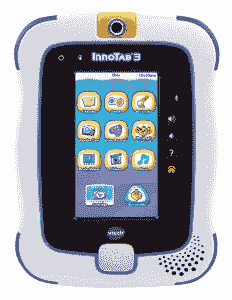

# 保护易受攻击的互联网

> 原文：<https://thenewstack.io/securing-internet-vulnerable-things/>

一种是你可以看到并使用的电脑(桌面工作站),另一种是小巧的电脑，通常功能较弱，嵌入在你的日常设备中。这些隐藏的带有小型微控制器的神奇绿色电路板在关键系统中不知疲倦地日夜工作——宇宙飞船、你的洗衣机，是的，甚至是自愿挤奶系统！

几十年来，这些系统一直至关重要，但在过去十年左右的时间里，让这些微型嵌入式设备相互通信的技术出现了爆炸式增长。Kevin Ashton 创造了“物联网”这个术语——日常生活中的嵌入式设备网络，可以根据你的要求进行对话、交流和决策。

从那以后，物联网和核心嵌入式领域之间的界限变得越来越模糊。从一个非常专注的领域工程，到部分由[后现代黑客文化](/tag/off-the-shelf-hacker/)和芯片制造商的技术推动推动的巨大现象。它们更容易访问，支持过多的工具，总体上是对创造性思维的一种祝福。嵌入式设备制造商已经开始专注于相互对话的设备——一辆汽车可以根据你手机上的播放列表知道你的音乐选择，或者一所房子可以根据你的智能手表通知感知你的情绪。事物之间的联系越来越紧密。

我们正在让我们的设备和生活变得无障碍，但我们让它们变得安全了吗？

## 物联网不安全的原因是什么？

传统上，未连接的设备的攻击面有限。服务工程师对心率监护仪的串行控制台访问是最大的漏洞。信任来自个人，嵌入式系统[安全事件](https://en.wikipedia.org/wiki/Stuxnet)被隔离到制造工厂和通过[工业控制系统](https://en.wikipedia.org/wiki/Industrial_control_system)如 SCADA 连接设备的工厂。

然而，随着当今设备的互联，攻击面和潜在受害者的数量大幅增加。就在我们说话的时候，这些设备将你的数据泄露给网络上的恶意客户端。数据泄露的点可能不是设备本身的实际安全漏洞，而是它们所连接的众多安全漏洞中的一个。

普林斯顿大学的研究人员最近发现相框会泄露你的活动，IP 摄像头会让其他人窥探你。Mattel 最近在它的一个 Wi-Fi 连接玩具熊中发现了一个漏洞，它知道你孩子的名字。这种事件绝不是孤立的。 [Shodan](https://www.shodan.io/) 是一个搜索引擎，致力于寻找这种易受攻击的互联网连接设备！一个非常随意的搜索就可以很容易地将你指向位于数千英里之外的一个受到松散保护的婴儿监视器的数据流。

但是，正如 Shodan 的人[指出的](https://twitter.com/shodanhq/status/628256550033952769)，有人需要有一个网络界面来调整他们的汽油发动机参数，正如你在图片中看到的。

## 行动（或活动、袭击）计划

随着物联网领域的扩展，我们需要拿出可行的解决方案来保护事物。嵌入式设备的安全缺陷并非闻所未闻。2014 年,《连线》杂志发表了一篇[报道](http://www.wired.com/2014/04/hospital-equipment-vulnerable/)关于侵入医院设备有多容易。我们需要确保这不再容易，尤其是在这个时代，这些缺陷可以大规模侵犯隐私。

3D Shodan 搜索界面。

### 标准化

在工程中，标准保持一致性和兼容性。它们还确保对于一个给定的域，总是保持某个最低要求。有些细节就像医院里设备使用的油漆纹理一样。IEEE 编制了一份设备制造商可以遵循的物联网相关标准清单。ISO 也已经开始了制定标准的工作。这些标准旨在涵盖从架构规范到安全需求的所有细节。

然而，制造商和消费者应该理解使用非标准产品的含义。截至目前，标准和无认证产品充斥市场。一个价格低至 25 美元的 IP 摄像头可以被一个潜在的易受攻击的应用程序[控制，这个程序被侧装到你的安卓手机上](https://en.wikipedia.org/wiki/Sideloading)是一个完美的灾难配方。

### 认证和审计

廉价物联网产品继续涌入市场的主要原因是认证过程中的成本削减。证书颁发机构可以确保供应商保持制造和安全标准。他们花时间和精力测试设备的漏洞。不受监管的网络贸易的激增(这并不是坏事)加上消费者对最新、最便宜、可以将他们的生活连接到互联网的需求，迫使物联网供应商抄近路，绕过认证。知名物联网设备可能同样容易受到攻击，但不受监管的街头小贩和季节性制造商的几率非常高。

## 能做些什么？

美国联邦追踪委员会[发布物联网制造商指南](https://www.ftc.gov/news-events/press-releases/2015/01/ftc-report-internet-things-urges-companies-adopt-best-practices)敦促他们遵守标准。加拿大隐私专员似乎也[注意到了这件事。尽管世界各地的政府都开始意识到这种威胁，隐私专家警告用户只信任来自已知供应商的经过认证的安全产品。供应商需要增加支出，让可信机构对其物联网设备的安全性进行审计和认证。像](https://www.priv.gc.ca/media/sp-d/2015/sp-d_20151112_e.asp) [Digicert](https://www.digicert.com/internet-of-things/) 这样的公司已经提供物联网认证，供应商可以积极使用。你可以把它想象成把你的信用卡信息交给一个随机网站上的随机文本框，而不是你的 SSL 认证的可信银行网站。购买之前，查找供应商的历史和他们的产品。看看产品是如何设计的，以前的型号是否有已知的缺陷。

礼貌:伟易达

还记得去年玩具制造商伟易达的数据泄露事件吗？它暴露了大约 500 万父母和 20 万孩子的个人身份信息。它还包含了从 KidConnect 服务中泄露的父母的图片和音频对话，kid connect 服务将儿童玩具平板电脑上的音频对话和图片存储到 VTech 服务器上。

不安全的设备本质上是一场等待上演的噩梦。不同的国家有不同的法律和法规，试图确保在严重违反安全的情况下，有人可以被追究责任。

但最重要的是，消费者应对任何安全威胁(无论是政府还是黑客)的最大武器是加密。简单来说，加密一切。你的存储驱动器，你的手机，照片和对话。保证他们的安全。不要信任多个第三方来保存你的数据。有越来越多的推动，加密不再是任何详细的技术术语。看看 Linux 基金会的[让加密](https://letsencrypt.org/)项目。

我们应该永远记住——当我们拥抱物联网和日益增长的机器对机器世界时——我们一方的轻微和毫无防备的疏忽会导致我们的隐私被侵犯，而设备链上薄弱的物联网节点可能是导致这种情况的原因。保持安全。

特征图片:[一艘货船控制系统仪表盘](https://twitter.com/shodanhq/status/676479794104635392)，来自 [Shodan](https://www.shodan.io/) 搜索引擎。

<svg xmlns:xlink="http://www.w3.org/1999/xlink" viewBox="0 0 68 31" version="1.1"><title>Group</title> <desc>Created with Sketch.</desc></svg>