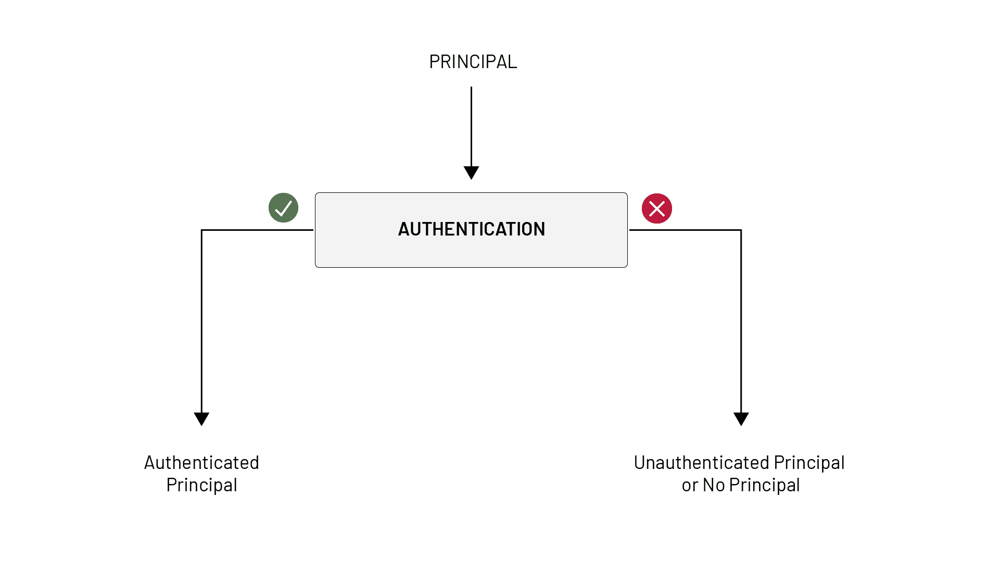
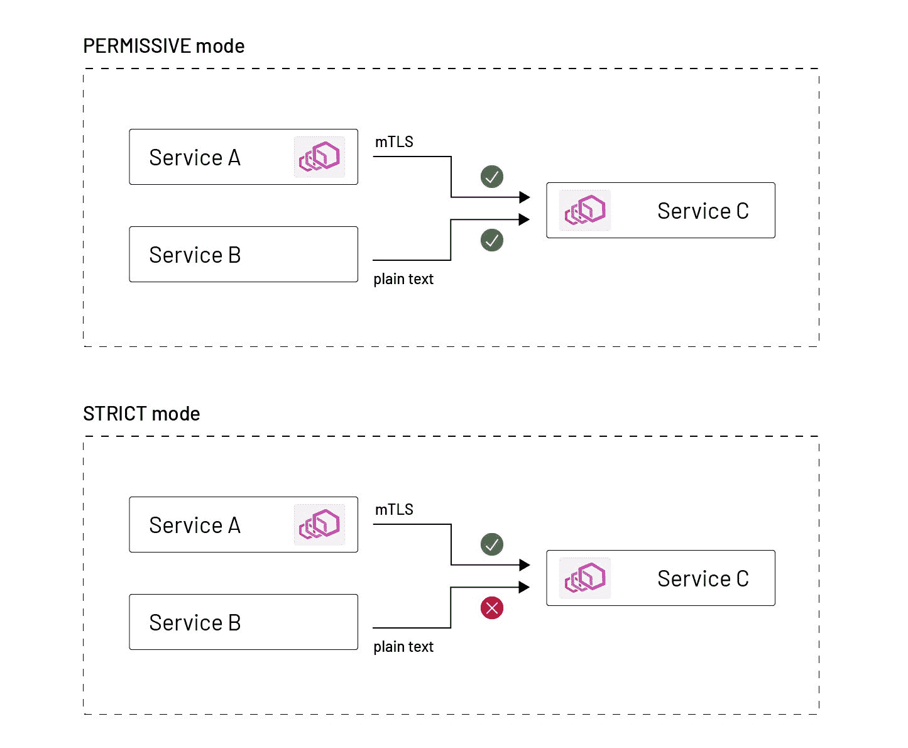
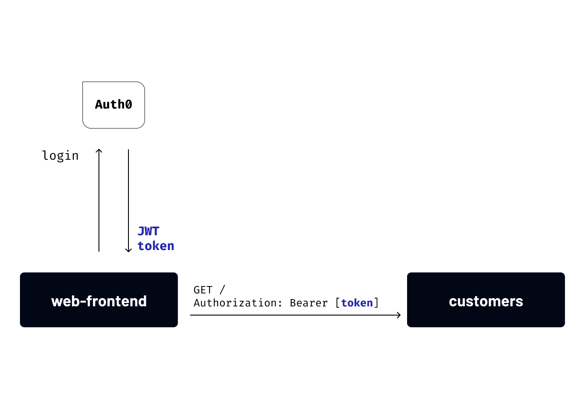
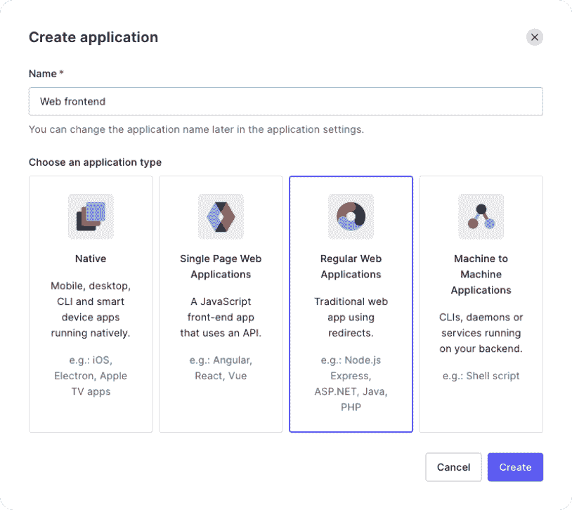
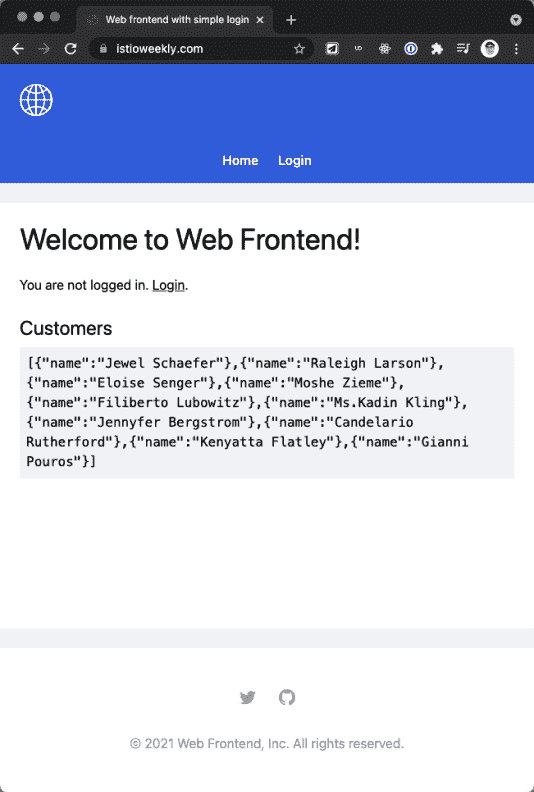

# 使用 Auth0 保护 Istio 工作负载

> 原文：<https://thenewstack.io/securing-istio-workloads-with-auth0/>

[](https://www.linkedin.com/in/pjausovec/)

[Peter Jausovec](https://www.linkedin.com/in/pjausovec/)

[Peter 是 Tetrate 的软件工程师和内容创建者，擅长分布式系统和云原生解决方案。他是关于 cloud native、Kubernetes 和 Istio 的书籍和博客的作者，也是 Istio Fundamentals 的创始人，这是 Tetrate Academy 提供的关于 Istio 的免费入门课程。](https://www.linkedin.com/in/pjausovec/)

[](https://www.linkedin.com/in/pjausovec/)[](https://www.linkedin.com/in/pjausovec/)

Istio 附带了几个定制资源定义，用于配置用户和服务到服务的身份验证以及授权策略。本文试图解释 Istio 中的访问控制，身份验证和授权意味着什么，以及不同的 Istio 资源如何协同工作来回答访问控制问题:主体可以对对象执行操作吗？

如果我们把上面的问题转换到 Istio 和 Kubernetes 的世界，那就是“服务 X 可以对服务 Y 执行一个动作吗？”

这个问题的三个关键部分是:主体、动作和对象。在 Kubernetes 中，主体和对象都是服务。假设我们谈论的是 HTTP，那么这个动作就是一个`GET`请求、一个`POST`、一个`PUT`等等。

认证(authn)和授权(authz)怎么样？

### 关于认证

**认证**是关于主体的，或者在我们的例子中是服务的身份。身份验证是验证某种凭证并确保该凭证有效且可信的行为。一旦执行了身份验证，我们就有了一个经过身份验证的主体。下次旅行时，当你向海关官员出示护照或身份证时，他们会对其进行鉴定，以确保你的证件(护照或身份证)是有效和可信的。



在 Kubernetes 中，每个工作负载都被分配了一个惟一的身份，用于与其他工作负载进行通信。身份以服务帐户的形式提供给工作负载。服务帐户是运行时中存在的身份窗格。

Istio 使用来自服务帐户的 X.509 证书，它根据名为 [SPIFFE](https://spiffe.io/) (面向所有人的安全生产身份框架)的规范创建一个新身份。

证书中的身份编码在证书的主题备用名字段中，如下所示:

sp iffe://cluster . local/ns/<pod namespace="">/sa/</pod>

这将我们带到第一个 Istio 资源，即 [PeerAuthentication](https://istio.io/latest/docs/reference/config/security/peer_authentication/) 资源。PeerAuthentication 资源控制工作负载之间的通信。使用 PeerAuthentication，我们可以配置工作负载通信时使用的相互 TLS (mTLS)模式。

当两个服务试图通信时，mutual TLS 要求双方互相提供证书，这样双方都知道他们在与谁通信。如果我们希望在服务之间启用严格的相互 TLS，我们可以使用 PeerAuthentication 资源将 mTLS 模式设置为 strict。

然而，Istio 还支持一种优雅的模式，在这种模式下，我们可以选择同时加入一个工作负载或命名空间。这种模式称为许可模式。安装 Istio 时，默认启用许可模式。在允许模式下，如果一个客户端试图通过 mutual TLS 连接到我，我将为 mutual TLS 服务。如果客户端不使用相互 TLS，我也可以以纯文本的方式进行响应。我允许客户做或不做 mTLS。使用这种模式，您可以在您的网格中逐渐推出相互 TLS。



下面是一个 PeerAuthentication 资源的示例，它在默认名称空间中为所有工作负载启用严格的 MTL:

```
apiVersion:  security.istio.io/v1beta1
kind:  PeerAuthentication
metadata:
  name:  default
  namespace:  default
spec:
  mtls:
    mode:  STRICT

```

快速回顾:PeerAuthentication 讨论工作负载或服务如何通信；它没有说任何关于终端用户的事情。那么我们如何认证用户呢？

### 请求认证

我们可以使用名为 [RequestAuthentication](https://istio.io/latest/docs/reference/config/security/request_authentication/) 的资源来实现。

RequestAuthentication 用于最终用户身份验证，它验证附加到请求的凭据。请求级身份验证是通过 JSON Web 令牌(JWT)验证完成的。

因此，就像我们使用 SPIFFE 身份来认证服务一样，我们可以使用 JWT 令牌来认证用户。

让我们用下面的例子来解释 RequestAuthentication 资源。

```
apiVersion:  security.istio.io/v1beta1
kind:  RequestAuthentication
metadata:
  name:  httpbin
  namespace:  default
spec:
  selector:
    matchLabels:
      app:  httpbin
  jwtRules:
  -  issuer:  "testing@secure.istio.io"
    jwksUri:  "https://raw.githubusercontent.com/istio/istio/release-1.10/security/tools/jwt/samples/jwks.json"

```

上面的 RequestAuthentication 适用于默认名称空间中设置了`app: httpbin`标签的所有工作负载。

对这些工作负载的任何请求都需要一个 JWT 令牌。RequestAuthentication 资源配置如何使用在 *jwksUri* 字段中设置的密钥对令牌及其签名进行身份验证。如果对选定工作负载的请求不包含有效的 JWT 令牌，也就是说，如果令牌不符合这些规则，请求将被拒绝。另一方面，如果我们根本不提供令牌，请求就不会被认证。

一旦我们有了一个经过认证的主体，那么我们就可以讨论原始访问控制问题的第二部分:“对一个对象执行一个动作”。这就是授权的意义所在。

### **关于授权**

**授权**正在回答问题的访问控制部分。是否允许经过身份验证的主体对对象执行操作？用户 A 可以向服务 A 的 path/hello 发送 GET 请求吗？

请注意，尽管主体可以通过身份验证，但它可能不被允许执行某个操作。您的公司 ID 卡可能是有效和真实的，但我无法使用它进入另一家公司的办公室。如果我们继续之前的海关官员比喻，我们可以说授权类似于护照上的签证章。

这就把我们带到了下一点:没有授权的身份验证，反之亦然，对我们没有多大帮助。为了进行适当的访问控制，我们两者都需要。我举个例子:如果我们只认证主体，不授权，他们可以为所欲为，对任何对象执行任何操作。相反，如果我们授权了一个请求，但我们没有对它进行身份验证，我们可以假装成别人，再次对任何对象执行任何操作。

### 授权策略

有了经过身份验证的主体，我们现在可以基于它来决定限制访问。为此，我们引入了授权策略。

在 AuthorizationPolicy 资源中，我们可以利用来自 PeerAuthentication 策略和 RequestAuthentication 策略的主体。注意，如果您想对一个对等点而不是用户进行检查，您可以使用“principals*”*字段，而不是“requestPrincipals *”*

利用这个原则，我们可以决定什么是允许的，什么是不允许的。

最常见的授权策略如下所示:

我们将授权策略应用于默认名称空间中匹配选择器标签的所有工作负载(设置了 app:httpbin 标签)。

在 rules 部分，我们说我们允许来自具有任何(["*"])请求主体集的源的调用。

注意，我们不检查任何特定的请求主体，我们只关心请求主体是否被设置。我们也可以设置一个特定的 requestPrincipal。

利用这个授权策略，结合 RequestAuthentication 资源，我们可以保证只有经过身份验证的请求才能到达 httpbin 工作负载。

让我们来分解不同的场景，看看这两种资源是如何协同工作的:

1.  **请求中没有令牌:**请求不会被认证，也不会有主体集。这不满足我们在 AuthorizationPolicy 中设置的 requestPrincipals 规则，因此请求被拒绝。
2.  **请求中的无效令牌:**如果请求包含无效令牌，认证将失败(RequestAuthentication)，甚至不会到达 AuthorizationPolicy。
3.  **请求中的有效令牌:**如果令牌有效，认证成功，将设置请求主体。因为我们只允许带有请求主体集(AuthorizationPolicy)的调用，所以请求将到达工作负载。

## 策略和请求身份验证正在进行

让我们用一个简单的例子来看看 AuthorizationPolicy 和 RequestAuthentication 资源的运行情况。此示例假设您在集群上安装了 Istio，并且默认名称空间标记为 sidecar injection。

我们将使用一个 web 前端，它具有与 [Auth0](https://auth0.com) 集成的登录功能。此外，web 前端调用名为“customers*”*的第二个工作负载来检索客户列表。我们将使用 AuthorizationPolicy 和 RequestAuthentication 来只允许对客户工作负载的经过身份验证的调用。如果用户没有登录，对客户工作负载的请求将会失败。



### 正在配置 Auth0

前往 Auth0 创建您的帐户。在注册过程中，系统会提示您选择一个租户域。请注意，您不能更改租户名称，但您始终可以创建其他租户。

我选择了“istioweekly”作为我的租户名称，我的完整租户域名是[https://istioweekly.us.auth0.com](https://istioweekly.us.auth0.com)**。**我们将在用户登录时使用该 URL。将完整的租户域值存储在`ISSUER_BASE_URL`环境变量中。

按照以下步骤创建新的应用程序:

1.  在 Auth0 仪表板中，单击侧栏中的应用程序链接
2.  点击**创建应用**按钮
3.  将应用程序命名为“Web 前端”
4.  对于应用程序类型，选择“常规 Web 应用程序”
5.  点击**创建**



在应用程序详细信息页面中，单击**设置**选项卡，并将客户端 ID 和客户端密码值保存在以下环境变量中:

```
export CLIENT_ID=<value from Auth0>
export SECRET=<value from Auth0>

```

在设置标签上，向下滚动到应用程序 URIs 部分。为了让登录和注销功能正常工作，我们必须设置允许的回调 URL 以及允许的注销 URL。

因为我们将在 Kubernetes 集群中运行应用程序，所以 URL 将是外部 IP 地址或为解析 IP 地址而设置的域名。我将使用`istioweekly.com`域名，并将允许的回拨 URL 设置为 https://istioweekly.com/callback，允许的注销 URL 设置为[https://istioweekly.com](https://istioweekly.com)。

(注意:设置 SSL 证书和域超出了本文的范围。你可以在 Istio 入口网关视频中查看 [SSL 证书，了解更多相关信息。)](https://www.youtube.com/watch?v=nYJJ57WCkxE)

我们还必须创建一个 Auth0 API，它公开身份功能并支持 OAuth、OpenID connect 和 SAML。我们将从 web 前端应用程序中使用的 SDK 间接使用这个 API。

1.  从 Auth0 仪表板，展开侧边栏中的**应用程序**
2.  点击**API**链接
3.  点击**创建 API** 按钮
4.  将 API 命名为“Webfrontend API”
5.  使用“https://web-frontend”作为标识符。请注意，这可以是任何其他唯一值。这个标识符对应于我们在配置 web 前端时将使用的受众。
6.  选择 RS256 作为签名算法
7.  点击**创建**创建 API

### 配置 Web 前端应用程序

配置 Auth0 后，我们现在可以设置以下环境变量并配置 web 前端应用程序:

我们将在 Kubernetes secret 中存储 Auth0 secret 和客户机 ID，在 ConfigMap 中存储其余的配置:

```
kubectl create secret generic webfrontend-auth0  \
  --from-literal=CLIENT_ID=$CLIENT_ID  \
  --from-literal=SECRET=$SECRET

kubectl create configmap webfrontend-auth0  \
    --from-literal=ISSUER_BASE_URL=$ISSUER_BASE_URL  \
    --from-literal=AUDIENCE=$AUDIENCE  \
    --from-literal=BASE_URL=$BASE_URL

```

配置就绪后，我们可以为 web 前端和客户应用程序创建 Kubernetes 部署和服务。

```
kubectl apply  -f  https://raw.githubusercontent.com/peterj/simple-login/main/k8s/deploy.yaml

```

接下来，更新您想要在 Gateway 和 VirtualService 中使用的主机，并部署它们。

请注意，您也可以使用外部 IP。在这种情况下，只需用“*”替换主机字段，删除 TLS 设置并将端口更改为 80:

将上述 YAML 保存到 gateway-vs.yaml，并通过运行
`kubectl apply -f gateway-vs.yaml.`创建资源

要访问 web 前端，您可以使用域名或获取入口网关的 IP 地址，如下所示:

```
export GATEWAY_URL=$(kubectl get svc istio-ingressgateway  -n  istio-system  -o  jsonpath='{.status.loadBalancer.ingress[0].ip}')

```

如果你导航到 GATEWAY_URL，你会看到一个类似下图的页面。



请注意，在客户标题下会显示一些数据。这是来自客户的工作量。显示这些数据是因为我们没有部署任何需要用户登录才能显示这些数据的资源。

我们现在可以创建适用于我们部署的客户工作负载的 RequestAuthentication 资源。使用这个资源，我们将要求所有请求都有一个符合规则的 JWT 令牌。

对于发行者，我们使用登录 Auth0 时创建的租户域。对于 jwksUri，我们指向托管在同一个租户域中的 jwks.json 文件。

将上述 YAML 保存到`request-auth.yaml`并用`kubectl apply -f request-auth.yaml`创建。如果我们重新加载页面，我们不会看到任何差异。我们将得到与先前相同的响应。这是因为我们还没有设置任何授权策略，也就是说，我们还没有决定委托人是否可以访问客户的工作负载。

为了进行授权，我们需要部署如下所示的授权策略资源:

将上述 YAML 保存到`authpolicy.yaml`，并使用`kubectl apply -f authpolicy.yaml`创建策略。有了授权策略，我们现在实际上检查调用者是否经过了身份验证。我们通过`requestPrincipals`字段来完成这项工作，并检查是否设置了任何值。

如果我们再次重新加载页面，您会注意到以下错误:

```
Error:  Request failed with status code  403

```

该错误由客户的工作负载返回，403 HTTP 状态代码意味着对资源的访问被禁止。如果您直接请求客户的工作负载，您会收到一条消息，说“RBAC:拒绝访问”

这是有道理的，因为我们还没有证明我们是谁——我们还没有附上 JWT 令牌。

让我们现在尝试登录。单击登录链接，注册一个帐户或使用现有帐户登录。登录后，您将被重定向回主页。这一次，您会注意到与之前显示的相同的客户数据。这是因为现在我们通过了身份验证，并且因为我们有一个访问令牌，所以我们被授权调用客户工作负载。

如果您查看源代码，您会注意到，每当我们调用客户工作负载(来自 routes/index.js)时，我们都会将访问令牌附加到请求上:

## 结论

这篇博文解释了授权和认证之间的区别，以及如何将这些概念用于 Istio 资源。我们已经展示了如何设置 Auth0 租户，使用它来验证用户，然后使用 RequestAuthentication 和 AuthorizationPolicy 允许/拒绝对集群中运行的服务的访问。

### **资源**

<svg xmlns:xlink="http://www.w3.org/1999/xlink" viewBox="0 0 68 31" version="1.1"><title>Group</title> <desc>Created with Sketch.</desc></svg>