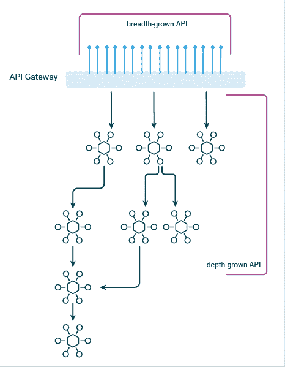
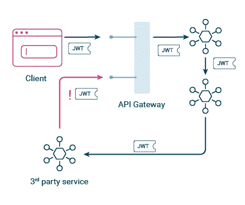
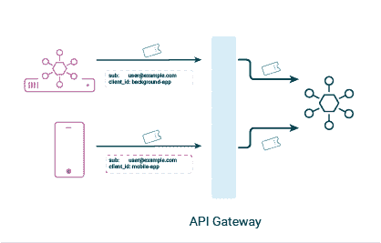
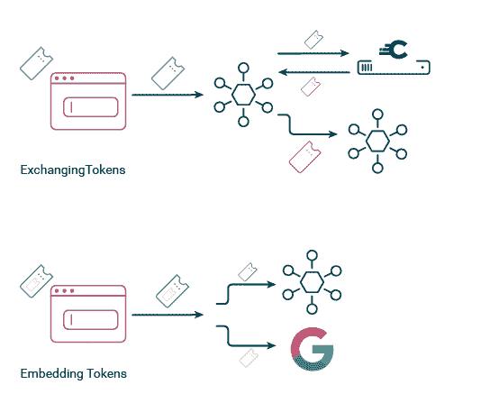

# 保护大型 API 生态系统

> 原文：<https://thenewstack.io/securing-large-api-ecosystems/>

Michal Trojanowski

Micha 是 Curity 公司的产品营销工程师。他是一名拥有 10 多年 web 技术工作经验的开发人员。从事不同的项目使他能够学习不同的语言，观察不同的设计模式——也涉及到 API。

如今，API 无处不在——这是毫无疑问的。然而，和几乎所有产品一样，随着 API 的发展，它们的许多方面变得越来越复杂。公司通常使用足够小的 API，以便于管理和保护。然而，对于许多其他人来说，API 的前景正在呈指数级增长，引入了新的挑战需要考虑。

值得注意的是，这种扩张可以发生在不同的方向。例如，API 在严重依赖微服务的公司中进行深度扩展。对公开的端点的一个请求最终被转发到许多不同的服务，或者是并行的(当一个服务聚集来自其他几个服务的数据时),或者是链式的(当一个服务调用另一个服务时，后者又调用另一个服务),以此类推。API 还可以在广度上扩展。有时，一个 API 通过一个入口点公开数十甚至数百个端点。

随着 API 复杂性的增加，安全解决方案往往过于简单，不足以保护更大的生态系统。尽管许多公司已经通过使用 OAuth 发布的访问令牌完善了他们的 API 安全性，但是单独使用 OAuth 和访问令牌对于大型 API 环境来说可能是不够的。通常，为 API 发布的所有访问令牌都具有相同的属性，这意味着一个令牌的持有者与另一个令牌的持有者具有相同的特权。这可能会导致一些问题。

## 广度发展的 API 的问题

如果一个 API 公开了许多端点，问题是这样一个访问令牌的持有者可以成功地调用任何端点。通常，当适当的授权检查到位时，这种令牌的持有者将不能检索不同用户的信息。尽管如此，这样的承载可能能够调用您可能不希望它们调用的端点。例如，应该只允许读取用户数据的客户端(可能因为记录的端点只允许读取访问)开始调用端点来更新用户数据。

一些公司试图通过引入限制访问令牌功能的范围来解决这个问题。这是一种可能的解决方案，但可能会产生其他问题。对于大型 API，通常很难开发出一套好的范围来将功能划分到逻辑组中。还需要管理作用域和它们对应的端点。大型 API 容易出现范围爆炸，这种情况下会创建太多的范围。这使得访问控制难以管理，并使用户感到困惑，他们可能不了解客户端的权限。

当作用域允许访问 API 的大部分时，可能会出现与前面描述的相同的问题:客户端可能会调用给定作用域的资源，即使您不希望它这样做。

## 深度开发 API 的问题

一些 API 具有“深度”架构设计，在处理一个请求的过程中会调用许多服务。当一个令牌用于保护所有下游服务时，可能会出现以下情况:

1.  服务 A 用从调用者那里收到的访问令牌调用服务 B。
2.  服务 B 可以使用令牌正确地向调用者授予授权。
3.  现在，服务 B 还可以调用 API 中的任何其他端点，并执行只有原始客户端才被允许执行的操作。

如果请求中的下游服务包含基础设施之外的第三方服务，这种情况会变得特别危险。在这种情况下，不仅令牌离开了您的基础设施，而且它现在在第三方的手中，第三方可以使用它来调用您的 API。

## 改变光学系统

考虑访问令牌及其内容被感知的方式。(这本身不是一个安全问题，但它可能会影响架构选择)。使用访问令牌，我们经常试图辨别调用 API 的用户是谁，以及该用户是否经过身份验证(登录)。但是，我们应该记住，不同的客户端可以调用 API。即使用户已经同意客户端以他们的名义操作，用户也可能根本不操作客户端—例如，这可能是一个后台进程。

记住这一点，访问令牌不应该被认为与用户的浏览器会话相似。在处理访问令牌时，您不应该关心身份，而是让访问令牌回答持有者可以用这个访问令牌做什么，或者以哪个用户的名义执行操作。

例如，用户可能同意某个应用程序聚合他们的日历。该应用程序将在后台从后端服务调用日历 API。因此，日历 API 不应该仅仅基于访问令牌的主题声明来假定用户的身份。API 应该知道用户可能没有启动每个请求，即使它们都包含用户的凭证。

## 可能的解决方案

### 基于声明的授权

范围是访问令牌中常用的一种声明类型，但它们不应该是授权决策的唯一来源。受众声明(“aud”)是另一个系统可以用来轻松限制 API 访问的声明的好例子。通过受众声明，API 可以检查访问令牌是否针对特定受众，并拒绝针对不同受众的令牌。授权服务器能够根据身份验证过程中的复杂信息发布声明。然后，每个 API 都可以使用这些声明来做出高级授权决策。

例如，先前描述的日历 API 可以使用带有关于客户端的信息的声明来知道请求是来自后台服务还是用户操作的移动应用。

您可以阅读更多关于设计作用域和声明的最佳实践(T2)的信息，或者查看如何在 Curity Identity Server 中发布复杂的声明(T4)。

### 实现令牌共享方法

至关重要的是，在大型 API 中，尤其是那些大型的深度 API，令牌不能在所有调用来处理请求的服务中重用。团队应该考虑以最适合当前情况的方式实现[令牌共享](https://curity.io/resources/learn/token-sharing/)。

这通常意味着实现令牌交换，这是一种使服务能够基于其当前访问获得新访问的标准。令牌交换限制了下游服务可以使用令牌执行的潜在操作。然而，对于一些公司来说，嵌入访问令牌也可能是一个可行的选择。

### 管理授权复杂性

在大型 API 生态系统中，管理授权规则可能会变得很棘手。每个服务——不管它是处理传入的请求还是被另一个服务调用——都应该知道要考虑哪些声明，以及基于这些声明应该允许哪些操作。这种错误会导致函数级授权被破坏，这在 2019 年被列为 OWASP 十大 API 漏洞之一。

为了解决这个问题，公司可以实施[授权管理系统](https://curity.io/resources/learn/entitlement-management-system/)来帮助管理授权的复杂性，并通过集中处理授权规则来提供关注点分离。[开放策略代理](https://curity.io/resources/learn/opa-integration/)是开源授权引擎的一个例子。

## 结论:如何保护 API

安全性总是很重要并且很难实现，API 也不例外。在保护 API 时，适用于小型部署的解决方案可能无法满足大型生态系统的需求。安全特征也不应该仅仅针对所讨论的产品类型。

仅仅因为 API 推荐而实现一个特性可能并不总是足够的。在做出架构决策时，还应该考虑操作的规模，因为它会使某些功能对系统或多或少变得重要，或者引入对更内在配置的需求。在设计 API 时，公司应该考虑这些要点，以便从可用选项中恰当地选择正确的安全解决方案。

<svg xmlns:xlink="http://www.w3.org/1999/xlink" viewBox="0 0 68 31" version="1.1"><title>Group</title> <desc>Created with Sketch.</desc></svg>