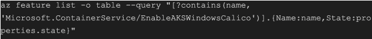
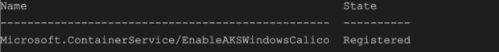
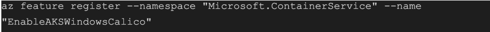
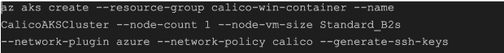
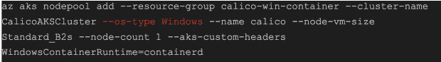
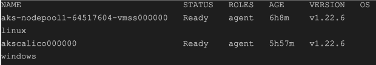
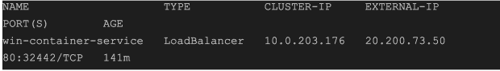
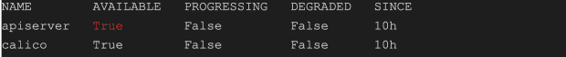

# 保护 Windows 工作负载

> 原文：<https://thenewstack.io/securing-windows-workloads/>

容器是打包应用程序的好方法，只需要最少的库。它保证您将拥有相同的部署体验，无论容器部署在哪里。

 [礼萨·拉姆赞普尔

Reza 是 Tigera 的开发者倡导者，致力于促进 Calico 项目的采用。在加入 Tigera 之前，Reza 是一名系统工程师和网络管理员。](https://www.linkedin.com/in/rramezanpour/) 

容器编排软件通过为大规模创建容器准备必要的基础，进一步推动了这一点。

Linux 和 Windows 支持容器化的应用程序，并且可以参与容器编排解决方案。

有大量关于 Linux 容器和容器编排的指南和操作方法文章，但是当涉及到 Windows 时，这些资源变得稀缺，这可能会阻止公司运行 Windows 工作负载。

这篇博文将探讨如何建立一个基于 Windows 的 Kubernetes 环境来运行 Windows 工作负载，并使用 [Calico 开源](https://link.tigera.io/ueQ2x)来保护它们。在本文结束时，您将看到将您当前的 Kubernetes 技能和知识应用到混合环境中是多么简单。

## Windows 容器

容器类似于轻量级包装技术。每个容器将一个应用程序打包在一个与底层主机共享其内核的隔离环境中，使其受到主机操作系统的限制。如今，每个人都熟悉 Linux 容器，这是一种在隔离环境中运行基于 Linux 的二进制文件的流行方式。

但是，Windows 还提供了一个容器解决方案，允许用户在一个隔离的环境中打包基于 Windows 的应用程序。根据应用程序的框架和 API 调用，您可以从 Microsoft 提供的几个基本映像中进行选择，以创建 Windows 容器。这些基础映像的范围从 Windows APIs 和服务的完整实现，到占用空间小的最小版本。值得注意的是，这些基本映像的内部版本号必须与您的主机 Windows 内部版本号相匹配，才能在您的操作系统上运行它们。

## 容器编排

创建容器映像后，您将需要一个容器编排器来大规模部署它。Kubernetes 是一个模块化容器编排软件，它将管理运行此类工作负载的普通部分。

为了让这篇文章更有趣，我将分享在 Azure 中设置混合 Kubernetes 集群所需的所有命令。你可以从 Azure 门户网站打开你的云 Shell 窗口，如果你想继续的话，可以运行命令。

如果您没有付费订阅的 Azure 帐户，请不要担心。您可以注册一个[免费 Azure 账户](https://azure.microsoft.com/free/)来完成以下步骤。

## 资源组

要在 Azure 中运行 Kubernetes 集群，必须创建共享相同生命周期的多个资源，并将它们分配到一个资源组。资源组是一种在 Azure 中对相关资源进行分组的方式，以便于管理和访问。请记住，每个资源组必须有一个唯一的名称。

下面的命令在澳大利亚东部的*位置创建一个名为`calico-win-container`的资源组。请随意将位置调整到不同的区域。*

`az group create --name calico-win-container --location australiaeast`

## 窗户印花棉布

[Calico for Windows](https://link.tigera.io/ueQ2v) 正式集成到 Azure 平台，[Calico for Windows](https://link.tigera.io/ueQ2v)正式集成到 Azure 平台，所以每次添加 Windows 节点，都会附带一个预装版本的 Calico。要对此进行检查，使用以下命令确保`EnableAKSWindowsCalico`*处于*注册*状态:
*

 *预期产出:

如果您的查询返回一个未注册状态，u 使用以下命令为您的帐户启用 AKS Calico 集成:

在`EnableAKSWindowsCalico`注册后，您可以使用以下命令将 Calico 集成添加到您的订阅中:

`az provider register --namespace Microsoft.ContainerService`

## 集群部署

**注意:** Azure 免费账号无法在繁忙地点创建任何资源。如果你面临这个问题，请随时调整你的位置。

Linux 控制平面是运行 Kubernetes 系统工作负载所必需的，Windows 节点只能作为参与工作节点加入集群。

## Windows 节点池

现在我们有了一个正在运行的控制平面，是时候向我们的 AKS 集群添加一个 Windows 节点池了。

**注意:**使用`windows`作为`*--os-type*`参数的值。

## 导出群集密钥

Kubernetes 实现了一个 API 服务器，它提供了一个 REST 接口来维护和管理集群资源。通常，要使用 API 服务器进行身份验证，您必须提供证书、用户名和密码。Azure 命令行界面(Azure CLI)可以为 Azure Kubernetes 服务(AKS)部署导出这些群集凭据。

使用以下命令导出凭据:

`az aks get-credentials --resource-group calico-win-container --name CalicoAKSCluster --admin`

导出凭证文件后，我们可以使用 kubectl 二进制文件来管理和维护集群资源。例如，我们可以通过使用操作系统标签来检查节点上运行的是哪个操作系统。

`kubectl get nodes -L kubernetes.io/os`

您应该会看到类似于以下内容的结果:

## Windows 工作负载

如果您还记得，Kubernetes API 服务器是我们可以用来管理或维护工作负载的接口。

我们可以使用相同的语法为新的 Windows 节点创建部署、pod、服务或 Kubernetes 资源。例如，我们可以使用之前在部署中使用的同一操作系统选择器[来确保 Windows 和 Linux 工作负载部署到各自的节点:](https://github.com/frozenprocess/wincontainer/blob/dda5586780ab2b02ff90fda3a4177d62e7bdcba2/Manifests/00_deployment.yaml#L23-L24)

`kubectl apply -f https://raw.githubusercontent.com/frozenprocess/wincontainer/main/Manifests/00_deployment.yaml`

因为我们的工作负载是由微软创建的 web 服务器。NET 技术，部署 YAML 文件还封装了一个[服务负载平衡器](https://github.com/frozenprocess/wincontainer/blob/dda5586780ab2b02ff90fda3a4177d62e7bdcba2/Manifests/00_deployment.yaml#L36-L38)来将 HTTP 端口暴露给互联网。

使用以下命令验证负载平衡器是否成功获取了外部 IP 地址:

`kubectl get svc win-container-service -n win-web-demo`

您应该会看到类似的结果。

在浏览器中使用“EXTERNAL-IP”值，您应该会看到一个包含以下消息的页面:

完美！我们的豆荚可以和互联网交流。

## 保护 Windows 工作负载

Kubernetes 网络策略资源的默认安全行为允许所有流量。虽然这是在真实场景中设置实验室环境的一个很好的方法，但是它会严重影响集群的安全性。

首先，使用以下清单来启用 API 服务器:

`kubectl apply -f https://raw.githubusercontent.com/frozenprocess/wincontainer/main/Manifests/01_apiserver.yaml`

使用以下命令获取 API 服务器部署状态:

`kubectl get tigerastatus`

您应该会看到类似于以下内容的结果:

Calico 提供了两种安全策略资源，可以覆盖集群的每个角落。我们将实施一项全球政策，因为它可以限制互联网地址，而无需在政策中明确写入每个 IP/CIDR 这一令人生畏的程序。

`kubectl apply -f https://raw.githubusercontent.com/frozenprocess/wincontainer/main/Manifests/02_default-deny.yaml`

如果你回到你的浏览器，点击**重试**按钮，你会看到容器被隔离，不能启动与互联网的通信。

**注意** ***:*** 工作量的源代码在这里有[。](https://github.com/frozenprocess/wincontainer)

## 打扫

如果你一直在关注这篇博文，并在 Azure 中做了实验部分，请确保你删除了这些资源，因为云提供商将根据使用情况向你收费。

使用以下命令删除资源组:

`az group delete -g calico-win-container`

## 结论

这篇文章列举了运行容器化环境的许多原因。如果你想提供大规模的服务，或者你喜欢敏捷的环境，我推荐你去看看 Tigera 的认证课程。

Calico 课程是自定进度、循序渐进的教程，帮助您准备在不同的云平台或本地测试环境上构建容器化的环境。除此之外，您还将了解 Calico 集成和安全措施，帮助您从头到尾构建一个安全的环境。

准备好成为 Azure 专家了吗？ [*现在报名参加我们的印花布蔚蓝课程*](https://link.tigera.io/ueQ2o) *。*

<svg xmlns:xlink="http://www.w3.org/1999/xlink" viewBox="0 0 68 31" version="1.1"><title>Group</title> <desc>Created with Sketch.</desc></svg>*