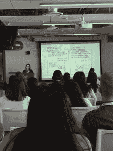
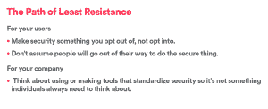

# 安全债务是工程师的问题

> 原文：<https://thenewstack.io/security-engineers-problem/>

AirBnBSecurity 的 Keziah Plattner。

上个月在旧金山 Twitter 总部举行的 WomenWhoCode Connect 活动上，与会者了解到，就像组织可以积累技术债务一样，他们也可以积累所谓的“安全债务”，如果他们没有相应的计划。

甲骨文首席安全官玛丽·安·戴维森在与[妇女之声](https://www.womenwhocode.com/)的 Zassmin Montes de Oca 关于开发者安全的主题演讲中强调,[安全必须是软件开发过程的每一步。](https://www.linkedin.com/in/mary-ann-davidson-235ba/)

过去，除了银行之外，几乎所有人都忽视了安全性。但是安全性比以往任何时候都更加重要，因为有太多的接入点。我们已经进入了物联网时代，小偷只需黑进你的冰箱就能知道你不在家。

Davidson 在 Oracle 负责保证工作，“确保我们将安全性融入到我们构建的所有东西中，无论是内部部署的产品，还是云服务，甚至是支持团队在客户站点构建的设备，并向我们报告数据，帮助我们进行诊断，所有这些东西都必须融入安全性。”

普拉特纳在#WWCConnect 与一群人交谈

AirBnB 的 Keziah Plattner 在她的分组会议上呼应了这一观点。“大多数开发人员不认为安全是他们的工作，”她说，“但这必须改变。”

她分享了工程师的四个基本安全原则。首先，安全债务是昂贵的。有很多关于技术债务的讨论，她认为安全债务应该包括在这些讨论中。

“这种历史态度是‘我们以后再考虑安全问题’，”普拉特纳说。随着公司攫取软件效率和增长的唾手可得的果实，他们忽略了安全性，但是最初不安全的设计可能会在未来几年造成问题。

她说，很难给现有的脆弱系统增加安全性。即使您知道安全漏洞在哪里，并且预算了时间和资源来进行更改，重新设计一个安全的系统也是非常耗时和困难的。

因此，她说，从一开始就在你的设计中建立安全性是很关键的。将安全性视为要避免的技术债务的一部分。涵盖所有可能性。

普拉特纳认为，最重要的是，很难让人们改变自己的行为。没有人会自愿改变，她说，即使你指出新的行为更安全。我们都点点头。

Davidson 说，工程师需要开始思考他们的代码可能会受到怎样的攻击，并从这个角度进行设计。她说她只有两条规则。第一条是永远不要相信任何未经验证的数据，第二条是看第一条。

“人们总是这样做。他们说，我的客户把数据发给了我，所以不会有问题。不，不，不，”她笑着说。

普拉特纳说，安全的第二个关键是“永远不要相信用户”

戴维森换了一种说法:“我的工作是成为一名职业偏执狂。”她一直担心有人会如何入侵她的系统，即使是无意的。这不是学术性的，最近已经有通过物联网设备的拒绝服务攻击。

## 小鲍比桌子

普拉特纳说，如果你的安全计划的一部分是信任用户做正确的事情，那么无论你有什么其他安全措施，你的系统本质上都是不安全的。

她解释说，适当地净化所有用户输入非常重要，展示了 XKCD 漫画，其中一位母亲清除了整个学校的数据库，因为她儿子的中间名是“DropTable Students”

所以净化所有用户输入。检查。

她展示了一个 JavaScript 开发者在开源上使用 **Eval** 的例子。“一个好的基本规则是‘永远不要使用 eval()’，”她提醒道。 [eval()](https://developer.mozilla.org/en-US/docs/Web/JavaScript/Reference/Global_Objects/eval) 函数计算 JavaScript 代码。"如果你这样做，你就是在向随机的用户开放你的系统."

Davidson 警告说，她的偏执延伸到了在文档中对示例代码进行安全性测试。“因为我们都知道没有人会复制样本代码，”她笑着说。她强调任何代码都应该接受安全检查。

让它变得简单

普拉特纳的建议三:让安全变得简单。她建议说，走阻力最小的路。

在外部，让用户选择退出安全而不是选择加入，或者，更好的是，让它成为强制性的。她说，改变人们的行为是科技领域最难的问题。一旦用户习惯了以不安全的方式使用你的产品，让他们在未来做出改变是非常困难的。

在公司内部，她建议开发标准化安全的工具，这样就不是单个开发人员需要考虑的事情了。例如，将数据加密为服务，这样工程师就可以调用服务来加密或解密数据。

她说，确保你的公司专注于良好的安全卫生。在全公司范围内养成良好的安全习惯。

你只有在最薄弱的环节才是安全的，所以每个人都有良好的个人安全卫生以及良好的公司安全卫生是很重要的。

在甲骨文，他们已经解决了这个问题。Davidson 说，她厌倦了向那些大学毕业却完全没有接受过安全培训的工程师解释安全性，所以她在 Oracle 编写了第一个编码标准。现在有数百个页面，有许多贡献者，还有一些必修课。他们有符合安全要求的指标，并对其进行衡量。这些课程不仅面向工程师，也面向文档作者。“这是一种文化，”她说。

如果不提及密码，关于安全性的讨论会安全吗？普拉特纳说，虽然每个人都应该使用一个好的密码管理器，但它们应该是工作中强制性的，以及双重认证。

她说，基本密码原则应该是每个工程师清醒生活的一部分。密码中最重要的是它们的长度和熵——尽可能随机地收集击键。一个健壮的密码熵检查器对此非常有用。她推荐 Dropbox 开源熵检查器 [zxcvbn](https://blogs.dropbox.com/tech/2012/04/zxcvbn-realistic-password-strength-estimation/) 。

普拉特纳说，另一个技巧是在认证用户输入时故意使用一些缓慢的东西，如 [bcrypt](https://en.wikipedia.org/wiki/Bcrypt) 。这种缓慢不会困扰大多数合法用户，但会激怒试图强行输入密码的黑客。

戴维森说，所有这些都增加了任何想进入技术安全领域的人的工作保障。我们把更多的代码放在更多的地方，她说，这造成了系统性风险。“我认为，只要我们继续在技术领域做有趣的事情，没有人会找不到安全方面的工作。”

通过女性编码的特征图像。

<svg xmlns:xlink="http://www.w3.org/1999/xlink" viewBox="0 0 68 31" version="1.1"><title>Group</title> <desc>Created with Sketch.</desc></svg>