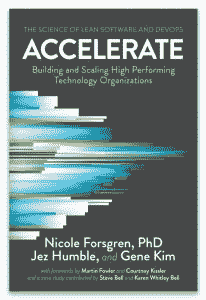

# 在 DevOps 世界中真正重要的安全指标

> 原文：<https://thenewstack.io/security-metrics-that-actually-matter-in-a-devops-world/>

[Capsule8](https://capsule8.com/?tns) 赞助本帖。

 [梅格·奥利里

Meg 是 Capsule8 的 CMO，加入该团队后，她在公司和代理机构的沟通和营销岗位上工作了十多年。在加入 Capsule8 之前，Meg 共同创立了 InkHouse Marketing+Media，该公司仍然是美国发展最快的机构之一，在波士顿和旧金山设有办事处。在她职业生涯的早期，Meg 在 RSA 担任过各种营销和产品管理职务。](https://capsule8.com/?tns) 

“DevSecOps”最近进入了安全词汇，用来描述 DevOps 和安全实践的混合——正如我们将在下面看到的，这是有充分理由的。

最常见的是，DevSecOps 专注于将 DevOps 狭义地解释为构建/交付管道的自动化。因此，DevSecOps 的典型概念集中于软件开发生命周期，试图在设计过程中尽可能早地进行测试，以保护整个系统的完整性和性能。

更广泛的解释是 DevSecOps 的角色是一种思维模式和实践。通过这种方式，它超越了仅仅是安全自动化，并表现为一种为业务产生有价值结果的文化。

对于 DevSecOps 来说，这提出了一个问题:如果 DevOps 优先考虑软件交付性能，那么安全性应该优先考虑什么来支持这一点？

在本帖中，我们描述了您需要哪些特定的安全指标来帮助，而不是减慢您组织的业务流程。

## 衡量安全性的四个基本原则

 在衡量安全性时，有四条基本原则需要牢记在心，这些原则摘自 Nicole Forsgren 等人所著的开创性著作[【Accelerate】](https://itrevolution.com/book/accelerate/)[【optimal devo PS metrics】:](https://itrevolution.com/book/accelerate/)

1.  **在全球层面衡量，而不是团队层面。**安全团队或任何团队的最终目标是帮助企业实现其目标。这就是为什么在组织层面上拥有安全指标是重要的——以避免孤立的思维，并总是优先考虑业务需求而不是团队需求；
2.  **衡量结果与产出。**衡量纯粹的工作成果是不够的，因为它与有形的成果无关。例如，测量工作的小时数或进行的测试并不一定代表进步。重要的是那些时间和测试是否减少了攻击面或恶意事件的发生率；
3.  **不要关注静态指标来达到某种神话般的“成熟门槛”**相反，在抽象的“成熟”概念之上，优先考虑建立弹性这意味着，安全的目标是提高整个组织从*不可避免的*漏洞和攻击中做出响应和恢复的能力，而不是采取部署众多增量解决方案的“掩护我的基地”的心态；
4.  不要只见树木不见森林。如果你过于关注单个的安全组件，你会忽略这些组件对整个系统的影响。

## 哪些安全指标真正重要？

在深入我们的列表之前，重要的是要认识到**大多数安全指标都是偏向于供应商的**，尤其是那些支持特定于 DevSecOps 的指标的指标。安全测试市场的一个不幸的副产品是，我们很少看到单个安全产品之外的指标——原因很简单，供应商不会向您销售他们自己的产品无法测量的指标。

**但是不要搞错了:*你就是你所衡量的*。**这就是为什么企业应该谨慎选择符合其安全目标的正确指标——不管他们的企业是否采用 DevOps 原则。因为如果你为一个狭窄的目标进行优化，你最终会得到一个狭窄的计划。

## 三个高影响力的安全指标

一般来说，支持软件交付性能的安全度量可以分为三个主要类别:

1.  **部署指标**测量部署过程的健康状况，并提供应用程序稳定性的领先指标。
    **部署度量的例子:**部署时间、部署频率、部署成功/失败、修复失败的发布所花费的时间，以及环境配置偏差。
    **该类别中的精英执行者可以按需部署；**
2.  **交付周期指标**衡量组织响应变更和交付业务价值的能力(即设计和交付所需安全功能所需的时间)。
    **提前期指标示例:**个人生产率/速度、返工时间、周期时间、价值实现时间趋势。
    **这一类别的精英执行者通常平均提前期为< 1 小时；**
3.  **平均修复时间(MTTR)指标**衡量威胁修复和服务恢复的速度。快速修复安全实例的能力与工程性能高度相关。
    **MTTR 指标列表:**分诊时间，调查时间，补救时间；这个类别的精英表演者的 MTTR 少于 1 小时。

## 不要试图衡量失败

**平均故障时间(MTTF)** 是安全团队应该 ***而不是*** 衡量的一个指标。失败是不可避免的，拥有一个激励避免失败的指标在最好的情况下是不现实的，在最坏的情况下是适得其反的。它将注意力从真正有助于在组织内补救威胁和建立弹性的指标上转移开。

## 相反，衡量权衡…

安全性的提高几乎总是伴随着权衡——无论是更多的摩擦还是更高的时间或金钱成本。

**这里有一个基本的例子:**每个新版本的安全补丁数量的减少可能会被员工使用安全工具的时间的增加所抵消。当你把目光投向安全团队之外时，新增加的安全特性可能会把痛苦外包给组织的其他部分。

制定度量标准来衡量部署新安全解决方案的影响，迫使团队认真评估新版本的好处是否真正超过其成本。

显然，用于衡量权衡的指标类型将高度依赖于个人情况。但是团队可以从问自己几个基本问题开始:

*   相对于解决问题，你的团队花了多少时间在产品维护上？
*   支持票的增加是否表明对新安全策略的困惑？
*   是团队主动来找你，还是有回避的证据？

## …并考虑系统复杂性

整个系统的复杂性带来了超出任何单个组件的新的风险水平。这些系统性风险需要在组织的安全战略中加以考虑。

例如，组织可以从量化和平衡系统的短期和长期压力开始:

*   **短期压力:**活跃事件、最后审查、审计、新漏洞；
*   **长期压力:**员工流动、产品类型/系统数量、使用的安全工具数量、预算削减。

## **安全指标只是开始**

最后，在我们集体兴奋地在 SDLC 早期进行测试时，我们也必须假设在运行时出现故障，以便实现弹性安全策略。如果不了解生产中的事件，就很难创建一个持续的反馈循环来强化您的容器映像——当然更难持续改进非微服务系统的安全性。一旦为生产实现了适当的安全度量，它们就可以为改进预发布测试提供有价值的反馈。更重要的是，他们甚至可以确保安全性促进业务发展，而不是阻碍业务发展。

来自 Pixabay 的 Dominic Alberts 的专题图片。

<svg xmlns:xlink="http://www.w3.org/1999/xlink" viewBox="0 0 68 31" version="1.1"><title>Group</title> <desc>Created with Sketch.</desc></svg>