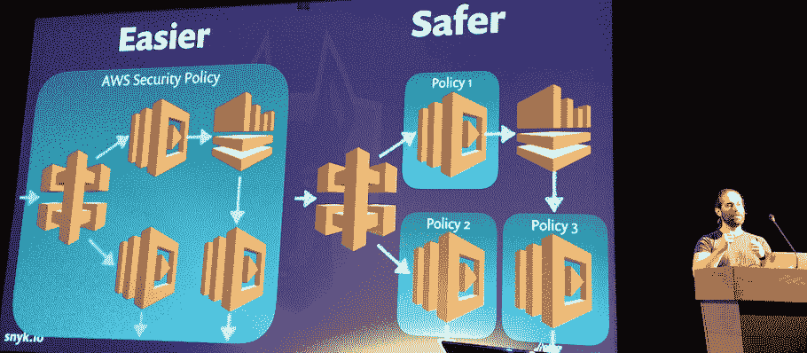
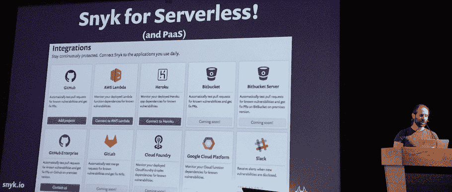

# 无服务器安全:什么变好了，什么变坏了？

> 原文：<https://thenewstack.io/security-serverless-gets-better-gets-worse/>

新兴的[无服务器](/category/serverless/)计算架构缓解了一些面向服务器的安全风险，但它也需要新的威胁分析和预防， [Snyk](http://snyk.io) 首席执行官兼联合创始人[盖伊·波德贾尼](https://twitter.com/guypod)最近在奥斯汀的 Serverlessconf 会议上表示。

在他的演讲中，Podjarny 将无服务器安全威胁分为三类:在无服务器环境中威胁减少(但仍然存在)，威胁保持不变，以及由于不必管理服务器而带来的新风险。

## 1.降低服务器级别的风险

### 易受攻击的操作系统依赖性

有了无服务器，不再需要单独维护补丁和保护服务器。自 2014 年 的 [Shellshock 漏洞以来，一些操作系统推出了自动补丁更新，尽管许多企业的 IT 系统管理员仍然对允许他们的操作系统自己做出那些决定保持警惕。这可能意味着一些漏洞没有被注意到。](https://thenewstack.io/responding-to-shellshocks-chaotic-impact-on-new-stack-ecosystems/)

在无服务器环境中，这种风险被消除了。“大多数成功的利用是因为补丁没有更新，这是管理问题，而不是技术问题，”Podjarny 指出。

***解决方案:** Podjarny 说要选择一个你可以信任的无服务器平台，通过保持补丁最新来维护和保护服务器。*

### 拒绝服务

在无服务器中，拒绝服务攻击的可能性较小。“不再有长期存在的服务器需要关闭，”Podjarny 说。虽然循环查询或大量 API 调用可能会作为拒绝服务威胁而被删除，但 Podjarny 警告说，在无服务器工作流中，仍然会发生功能执行，从技术上讲，外人可能会对您的工作流进行并发执行调用，最终可能会创建一个“ [billing DoS](https://thenewstack.io/zombie-toasters-eat-startup/) ”，要求您为无服务器系统中发生的执行次数付费。

***解决方案:**有关如何更好地管理此计费 DoS 风险，请参见下面的权限。检查您的无服务器提供商的并发执行限制，看看这是否达到了最大值，这是您可以承受的成本吗？*

### 长期受损的服务器

Podjarny 解释说，在大多数情况下，安全攻击不是孤立的事件。他说，通常发生的情况是，攻击者可能会在服务器上安装一个代理，然后把它留在那里。一旦它被忽视了一段时间，它就会引入更多的安全代码来推进下一步，如此类推，直到组织受到危害。

在无服务器中，这不太可能发生，因为它是一个无状态的体系结构系统。在计算处理的每个实例之后，服务器被重置，因此代理不能保持和继续前进。

然而，无服务器的一个潜在风险是，当一个进程启动时，需要创建容器，然后进程需要运行，然后容器再次关闭。像 OpenWhisk 这样的服务正在试图减少这种情况。“第一次从 cold 调用 Docker 容器需要大约 300 毫秒，”IBM 云平台副总裁[杰森·麦基](https://www.linkedin.com/in/jrmcgee/)说。"下次你在 OpenWhisk 中调用时，我们可以重用现有的预热过的容器."波德贾尼指出，这种情况可能会让那些特工继续前进。

***解决方案:**检查您的无服务器平台是否重用容器，以及对任何预热的容器进行了什么安全分析。*

## 2.无服务器安全风险:与服务器相同

因此，虽然无服务器显著减少了一些顶级威胁，但在一些领域，无论有无服务器，情况都是一样的。

无论有无服务器，管理权限策略、保护静态数据和评估应用层漏洞的最佳安全实践都是一样的。

### 权限策略

谁能调用你的功能？谁能访问你的函数的代码？如果你的功能受损，它能做什么？”波德贾尼问道。这就是“账单 DoS”风险最大的地方。在维护服务的情况下，大量执行功能的成本可能会转嫁给无服务器架构师。在服务被关闭的情况下，这可能是因为未支付的账单，或者由于执行过多而达到了付费账户的上限。

例如，在 [AWS](https://aws.amazon.com/serverless/) 中，在 API 网关放置一个单一的权限策略可能很有诱惑力。Podjarny 建议政策应该在功能层面上。

***解决方案:**“每个策略应该有很小的权限，解释可以做什么，”Podjarny 建议道。虽然权限蔓延相当普遍，但最好从每个功能的窄粒度权限策略开始，尽管正如 Podjarny 指出的那样，“很少有人应用这种级别的最佳实践。”*

### 保护静态数据

在无服务器架构中，状态存储在服务器之外。换句话说，敏感数据存储在某个地方的机器上。同样，可以围绕谁可以访问这些数据以及出于什么原因访问这些数据来设置粒度权限。

***解决方案:** Podjarny 建议加密所有敏感数据，并对每个函数使用单独的数据库凭证。Podjarny 说，虽然理想情况下，你还可以监控哪些功能正在访问哪些数据，但目前在无服务器生态系统中，可用来做这件事的工具“相当轻”。*

### 代码和应用程序依赖关系中的漏洞

也许无服务器环境中最大的威胁之一来自应用程序依赖性和代码，包括无服务器架构师编写的专有代码和第三方服务中包含的代码(见下文)。

Podjarny 敦促说，无服务器不能保护应用层。因此，将安全性引入持续集成和部署工作流至关重要。像 Podjarny 的 Snyk 这样的产品提供了管理应用依赖风险的工具。Snyk 正在利用社区研究和他们自己在发现未知漏洞方面的工作，建立一个包含依赖关系中所有已知漏洞的数据库。他们的工作流程是寻找软件包中的漏洞，然后与供应商或代码创建者一起通过一个负责任的披露流程，然后发布漏洞的详细信息，以便他们的用户可以警惕其无服务器工作流程中的风险。Snyk 从解决开发期间易受攻击的依赖性开始，这种经验的大部分被带到了无服务器领域。

“从安全角度来看，我们盲目消费开源代码，”Podjarny 说。“没有工具来跟踪您正在使用的东西，并且它存在问题，您无法理解当这些代码在生产中运行时会发生什么。”Podjarny 说，在大多数情况下，通过操作系统管理服务器依赖关系的某些实践已经发展起来，但是在无服务器的情况下，这种管理者已经不存在了。

***解决方案:**创建所有应用依赖项的清单，并使用监控工具来保持对任何已知漏洞的了解。*

## 3.无服务器中增加的安全风险

当然，Podjarny 指出，如果攻击者有一条路被切断，他们不会耸耸肩继续前进。“当你消除了一个攻击媒介，攻击者就会寻找另一种攻击方式，”他说。因此，虽然无服务器不一定会产生新的安全问题，但它可能会引起一些领域的关注。以下是一些例子:

### 第三方服务

在无服务器的工作流中，更有可能使用一系列的此类服务。当在无服务器设计模式中使用第三方 API 和函数时，Podjarny 建议问:“你共享什么数据，第三方服务保护得怎么样？传输中的数据安全吗？”Podjarny 说，虽然使用 API 密钥来访问第三方服务是很常见的，但通常不太可能考虑该服务如何对您的系统进行认证。"你在验证 HTTPS 证书吗？"波德贾尼问道。

***解决方案:** Podjarny 说，如果你信任从第三方电话收到的响应，你必须四处提问，你需要检查漏洞是否可以通过第三方作为后门进入你的工作流程。“始终使用密钥管理服务而不是 GitHub repo 来管理您的秘密和 API 密钥，”Podjarny 建议道。*

### 攻击面

“无服务器更精细、更灵活，但这为攻击者创造了更多的机会，让他们做你不打算用额外的灵活性来做的事情，”Podjarny 说。基本上，在无服务器架构中，没有边界。

Podjarny 说，理想情况下，应该有工具来监控个人功能和完整的无服务器工作流，但这一领域的工具尚未完全成熟。

***解决方案:** Podjarny 说和有权限一样，需要独立测试每一个功能的安全漏洞。使用权限策略来限制对功能的访问。随着系统的增长和处理边缘情况，总是会引入权限蠕变，但是不要扩展超出实际需要的功能。*

### 膨胀

在无服务器的刺激下，以最低的成本轻松部署成为可能。那么为什么不创建大量的函数呢？Podjarny 说这经常发生在开始使用无服务器的热情中。但是每个功能都会带来风险，这是攻击者攻击您系统的新机会。即使在“NoOps”这片乐土上，这仍然是一笔管理开销。与此同时，管理成千上万功能的工具系统还没有发展起来。

***解决方案:**在部署任何新功能之前，都要仔细考虑。为功能组创建单独的网络和功能。跟踪您已经部署的内容。Podjarny 还提出了一种混沌猴子式的方法，不时地减少当前函数的权限，看看这是否会影响系统效率。它可能指向权限级别设置过宽的区域。同样，保留依赖项清单并监控它们对于管理膨胀是必不可少的。*

担心无服务器比任何其他架构方法更不安全是没有根据的，但是威胁是真实的。在许多情况下，当前的最佳实践——尤其是使用权限策略——仍然有效，但总体而言，无服务器意味着攻击媒介从最上层的服务器级转移到最底层的应用层。不幸的是，这通常意味着要管理更大的范围。在去年的第一届无服务器会议上， [Ben Kehoe 指出](https://thenewstack.io/irobot-confronts-challenges-running-serverless-scale/)安全提供商在无服务器生态系统中有很大的市场机会。今年，正如 Guy Podjarny 所展示的那样，情况依然如此。

<svg xmlns:xlink="http://www.w3.org/1999/xlink" viewBox="0 0 68 31" version="1.1"><title>Group</title> <desc>Created with Sketch.</desc></svg>