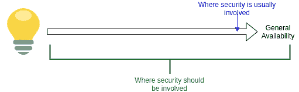

# 作为内部顾问的安全团队

> 原文：<https://thenewstack.io/security-teams-as-internal-consultants/>

 [蒂姆·塞勒维奇

蒂姆是 Linux 基金会的培训项目主任，他在那里担任主任、内容创作者和导师。随着技术变革的速度不断加快，Tim 努力提供学习和成长的技能，以应对明天的挑战以及今天的任务。他花了 20 多年的时间进行技术培训。蒂姆是康奈尔大学的毕业生。](https://www.linkedin.com/in/serewicz/) 

一个老生常谈的话题是，IT 安全团队被视为不受欢迎的员工的仓库，他们总是说不。当这种情况发生时，整个组织都会受到影响。那些在项目中工作的人避免涉及安全团队，因为他们认为他们制造了障碍并且没有增加价值。只有当项目准备好发布时，才勉强包含安全团队；也就是说，如果他们被包括在内的话。到了这个阶段，通常需要进行大量的更新来提高安全性，其中大部分可以在项目早期用更少的时间和成本来避免或修复。整个组织都深受其害，因为最有才华的团队成员，那些最有潜力在安全领导角色中取得成功的人，因为害怕损害他们的声誉而回避安全团队。当最终意识到对安全性的需求时，唯一的答案似乎是昂贵的外部咨询。

改变和改进文化对任何组织来说都是一项艰巨的任务，但在这种情况下，有一条改进的道路。首先，你必须打破那种认为安全只是安全团队的责任，产品是产品团队的责任的心态。您需要培训和装备安全团队来理解和精通整个软件开发生命周期，因为安全问题可能在生命周期的任何一点出现。整个组织中的一些顶级技术人员致力于安全性也很重要。如果它被视为一个死胡同，你将最终与一个黯淡无光的安全团队，因此，黯淡无光的安全。最难的部分是处理那些不愿意改进的人，因为文化可能会接受这种心态，因为以前的仓储。

第二阶段是确保“不”永远不是第一反应。每一个询问都应该得到这样的回答，“是的，这就是我如何帮助您改进产品和安全性的方法。”安全团队不应被视为路障，而应被视为开发和运营团队的资源。一旦发生这种情况，安全团队将成为整个组织可靠的内部顾问。

下一阶段是对组织的其他成员进行安全基础和安全实践早期实现的培训。这一阶段将持续进行，既要处理人员流动，也要鼓励那些不关注这个话题的人考虑安全问题。每个人都需要明白，即使他们的头衔中没有“安全”一词，他们仍然有责任确保开发和运营活动的开展着眼于安全最佳实践。安全不应该是在项目结束时才想到的，也不应该转嫁给其他人；它需要在过程的每一步都根深蒂固。

虽然外部顾问对解决特定问题很有用，但只有在问题出现或项目结束时才雇用他们，会使组织容易受到利用。它们的使用也可以最小化内部安全团队的感知价值，强化仓库的陈词滥调。当您考虑聘用顾问的高成本时，为整个团队提供安全最佳实践培训的时间和费用就变得很划算了，而且这还没有考虑到通过将安全最佳实践纳入技术开发、部署和管理的所有阶段而降低风险的好处。

## 提高安全性的资源

当团队认识到他们最好的顾问是安全团队中的那些人，以及安全在整个组织中的重要性时，他们会很乐意在从想法到发布的每个步骤中都包括他们。从 Linux 基金会的免费安全软件开发培训系列开始是一个很好的起点，其中包括:

侧重于安全的进一步培训包括:

这些课程旨在帮助参与软件开发生命周期的每个人了解为什么安全性很重要，以及在每个阶段插入安全性的最佳实践。通过采取措施确保团队中的每个人都关注安全的基本知识，并且他们相信专业安全团队的专家会在需要时提供更高级的支持，您可以降低受攻击的风险，同时显著提高发现问题和恢复系统的能力。

<svg xmlns:xlink="http://www.w3.org/1999/xlink" viewBox="0 0 68 31" version="1.1"><title>Group</title> <desc>Created with Sketch.</desc></svg>