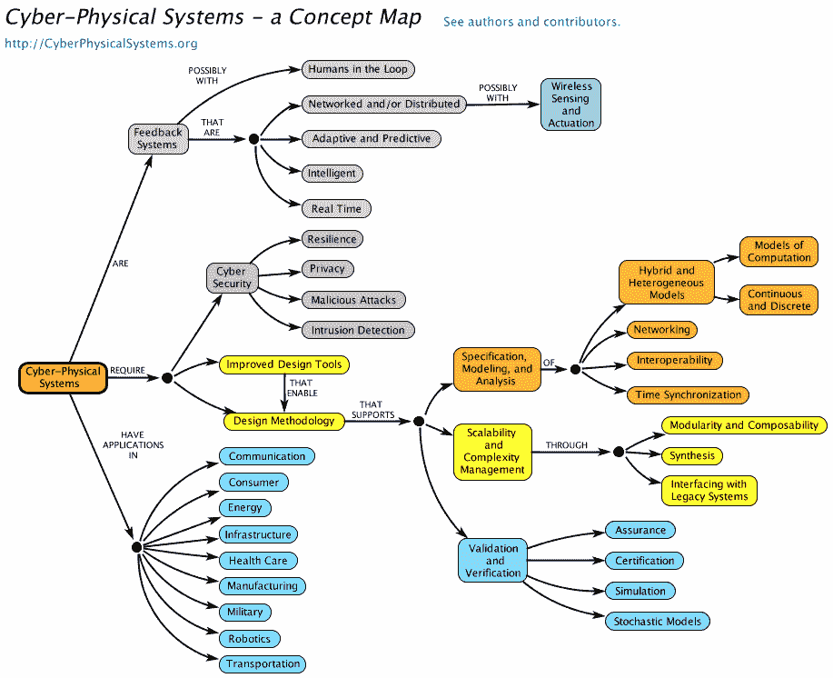

# Dyn 的 DDoS 攻击揭示了物联网的安全困境

> 原文：<https://thenewstack.io/security-weak-points-iot-deployments/>

上周五导致 Twitter、GitHub、Spotify 和其他公司瘫痪的大规模互联网服务中断是由对支持这些公司的 DNS 服务提供商 [Dyn](http://dyn.com/) 的大量请求引起的。所有这些请求是从哪里涌来的？[黑掉了闭路电视摄像机、数码录像机和其他物联网设备](https://krebsonsecurity.com/2016/10/hacked-cameras-dvrs-powered-todays-massive-internet-outage/)。

物联网已经到来。这带来了巨大的安全问题。

即使在中断之前，物联网安全也是一个话题，至少在上个月在旧金山举行的 Stream Conf 2016 的一个有见地的小组讨论会上是这样。

物联网不再只是一个关于未来技术的流行语，它已经无处不在。英特尔安全部门副总裁兼首席技术策略师 Scott Montgomery 在小组讨论会上解释道:[中等价位的汽车通常是一个原始设备制造商，拥有 300-350 个支持 IP 的设备，来自 40-50 家不同的公司。](https://www.linkedin.com/in/scott-montgomery-48b814)

他解释说，这种供应链在任何植入芯片的设备中都是遗传的。不管你愿不愿意，你肯定会继承你所有合作伙伴的供应链。

可怕的部分？汽车制造商负责支持 IP 的设备的最终使用案例，而不是单独测试构成交付系统的每个内部组件。因此，如果其中一个芯片不安全，您的整个系统就会变得脆弱。

例如，三星和其他制造商正在制造联网家用电器，如冰箱和炉灶。如果这些冰箱上的芯片被攻破，所有连接的设备都被关闭？三星将有成千上万的消费者带着成吨的腐烂食物，还有一场公关噩梦。

托管应用提供商 PubNub 的创始人兼首席执行官 Stephen Blum 在小组讨论中总结道:假设你在现场部署的每一个芯片都将完全可供任何有权使用的人使用。

它应该没有秘密，没有隐藏的访问，没有任何东西的钥匙。芯片部署在哪里并不重要。“对于芯片，”他说，“物理访问是完全访问。”

保护笔记本电脑和物联网设备有什么区别？

安全策略师比利·里奥斯在同一个小组上说，这种差异归结为两件事。

连接是一个问题，因为任何带有物联网芯片的设备现在都可以连接到互联网上——机车、喷气式轰炸机和你的恒温器现在都连接起来了。

第二个区别是物联网的功能。里奥斯为之做过一些工作的美国国防部称这些设备为网络物理系统。[信息物理系统](http://cyberphysicalsystems.org/)会导致某样东西的物理变化。这就是物联网的意义——引起或跟踪物理变化。这使得它们在不安全的时候很可怕。

来自“网络物理系统”网站。

里奥斯说，他的公司发现的最常见的错误是不应该出现的东西。有时它像使用脏话的错误消息一样有趣，但有时它真的像基础设施的凭证一样严重。

他把它分解为:“如果你认为仅仅因为你的软件在一个芯片上，他们就不能把它从那里取出来，那你就错了。如果你认为有人永远无法理解你的自定义垂直，你错了。如果你认为没有人会发现你在那里的隐藏账户来进行调试或访问你不希望你的客户访问的某些功能，你肯定错了。”

当然这对于公司来说很重要，但是没有必要保护一个你写的快速程序，并把它放到 GitHub 上来打开和关闭你的灯，对吗？你只是在你的公寓里使用它。

不对。

里奥斯强调，每样东西都需要保护。你写的软件会放在你没有想到的地方。例如，当他被国防部聘请来确保洲际弹道导弹(ICMB)系统的安全时，他发现导弹已经将现成的部件嵌入到广泛的定制软件中。

开灯或关灯的奇怪代码？它可能会被送进医院或矿井，在那里它控制着生死存亡。

编写了最终出现在洲际弹道导弹中的软件的开发人员肯定没有办法知道他们的代码会出现在那里(可能仍然不知道)。

Blum 插话说，如果你认为你不必保护低安全性的东西，黑客会寻找任何方法进入你的系统。他们会使用任何不安全的设备来访问你的系统，然后用它来破解你系统中的高安全性项目。

## 天哪，蝙蝠侠，我能做什么？

幸运的是，小组成员给出了很多建议。

按照蒙哥马利的说法，最便宜的低鸣挂果仍然是设备的数据级证书。这不是一个完整的解决方案，但这是一个良好的开端，并且令人担忧的是，有多少设备没有安装它。

下一步是确定设备应该做什么。然后将其活动和权限仅限于此。常规的、例行的许可经常被忽视。

Montgomery 说:“如果你的默认设置是始终对你的设备拥有根级权限，我们会在报纸上看到你的。”

他说，最大的问题是工程师没有考虑周全，所以他们最终像美泰一样有芭比娃娃[可以监视孩子](https://www.newscientist.com/article/2107918-are-smart-toys-spying-on-kids-and-stealing-their-imagination/)和菲利普斯一样有灯具[包含安装在某人房子内的照明系统的基层许可](http://www.extremetech.com/electronics/163972-philips-hue-led-smart-lights-hacked-whole-homes-blacked-out-by-security-researcher)。

“仅仅因为你用根级别的权限开始编程，并不意味着你应该以这种方式发布它，”他说。

布鲁姆说，保护数据的最好方法是关闭设备，这样就不会有数据传输。因此，如果设备不需要 24/7 开机，请将其配置为不总是开机。之后，接受信号的点需要最强的安全性。

他建议公司创建一套工具，帮助你阻止你的工程团队建立对远程系统的访问。

里奥斯表示，选择正确的框架有巨大的优势。他见过的最成功的故事来自那些使用像 [SQL 注入](http://www.w3schools.com/sql/sql_injection.asp)这样的成熟框架的人。保护是内置的，你会自动受到保护。

他说，从长远来看，投资于你的更新故事至关重要。你将更新设备，所以如果你建立一个强大的更新机制，从长远来看，这将保护你。

如需额外的安全措施，请查看美国美国联邦贸易委员会的这份[优秀指南](https://www.ftc.gov/system/files/documents/reports/federal-trade-commission-staff-report-november-2013-workshop-entitled-internet-things-privacy/150127iotrpt.pdf)。

[英特尔](https://www.intel.com/content/www/us/en/it-management/intel-it/it-managers.html)是新堆栈的赞助商。

特征图像:流会议的安全面板。

<svg xmlns:xlink="http://www.w3.org/1999/xlink" viewBox="0 0 68 31" version="1.1"><title>Group</title> <desc>Created with Sketch.</desc></svg>