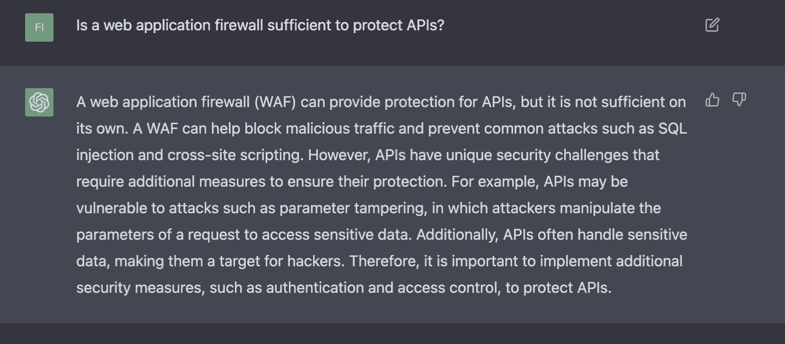

# 使用 ChatGPT 的安全性:当 AI 遇到你的 API 会发生什么？

> 原文：<https://thenewstack.io/security-with-chatgpt-what-happens-when-ai-meets-your-api/>

自从最近发布 [ChatGPT 的免费研究预览](https://thenewstack.io/beware-chatgpt-a-language-model-in-the-shape-of-shakespeare/)以来，人们一直在以[新的独特方式](https://thenewstack.io/5-ways-chatgpt-could-supercharge-chatbots/)使用人工智能(AI)和人工通用智能(AGI)，这也促使 AI 相关的网络安全风险问题多于答案。但是，也许在反抗人工智能的行为中，我们展示了什么定义了我们人类:创造力和情商。

人工智能有潜力通过提高业务运营速度、提供宝贵的业务效率以及随着时间的推移避免错误来显著改善日常工作。从开发人员、业务领导或员工的角度来看，这是令人兴奋的。

近年来，我们目睹了人工智能的爆炸式发展，并致力于推动几乎每个领域的新创新，但需要做更多工作来解决随之而来的网络安全问题。2021 年，微软发布了 GitHub Copilot，它使用 OpenAI Codex 将自然语言翻译成代码，并从编辑器中实时建议整个功能。相比之下，ChatGPT 需要一步一步地被提示，以引导它达到预期的结果。

GitHub Copilot 产生和建议的代码不一定是安全的代码，因为它的训练输入没有经过网络安全最佳实践和已知漏洞的验证，如 [OWASP API Top 10](https://owasp.org/www-project-top-ten/) 中列出的那些漏洞。相反，Copilot 接受了大量开源代码的训练，其中一些是安全的，一些根本不安全，这就是为什么从网络安全的角度来看，该产品的人工智能并不总是产生最佳输出。

公司的上市速度变得越来越重要，供应商正在推动创新，以帮助加快开发人员的产出。不幸的是，这有时是以网络安全为代价的。关于企业可以在多大程度上依赖 ChatGPT 进行网络安全工作，以及 ChatGPT 3.5 将如何为下一版本 ChatGPT 4.0 的工作提供信息，还有很多有待了解。甚至 OpenAI 的首席执行官山姆·奥特曼也对这些进步持怀疑态度。

## AI 遇上 API

现在，网络安全领域最聪明的头脑正在设想如何采用更好的人工智能和机器学习(ML)安全。比如 CyberArk 的研究人员，他们最近[发现](https://www.cyberark.com/resources/threat-research-blog/chatting-our-way-into-creating-a-polymorphic-malware)如何轻易地欺骗 ChatGPT 创建多态的恶意软件。

人工智能网络安全问题的核心是 API(应用程序编程接口)的激增。当开发人员在 DeepMind 的 AlphaCode 等新的人工智能系统的帮助下，努力简化和加速架构、配置和构建无服务器应用程序时，随着 ML 负责生成和执行代码，问题出现了。

当我们要求 ChatGPT 为我们编写 API 时会发生什么？那会加快进度吗？

ChatGPT 是根据来自谷歌和 StackOverflow 等公司的数据进行训练的，所以这可能就像是问一个理论上精通所有语言的开发人员，而他没有技术信仰。当然，你可以在谈话中询问细节，把责任推给对方，不仅要有创意，还要能引起争论。

回到我们的例子，我们还要求 ChatGPT 记录 API。

如您所见，该产品远非完美，但它理解意图并产生相关输出的能力令人惊叹。这会取代人类开发人员吗？肯定不会很快。毕竟，推特用户[如何教导](https://thenewstack.io/requiem-tay-reactions-microsofts-teenaged-ai-gone-bad/)微软的人工智能聊天机器人，Tay，脏话和不恰当的回应，以及失败的[荷兰税务局](https://pipedot.org/article/5Z1BH)的记忆仍然历历在目。

随着我们对新语言理解的增加，我们不断发明新的语言，我们将继续更新像 ChatGPT 这样的知识体系来改进自己。

## 维护 ChatGPT 的完整性和准确性

ChatGPT 算法的完整性和准确性是其生存能力面临的一个独特而存在的风险。ChatGPT 的用户将越来越多地把它视为真理的来源。

《应用软件度量》这本书展示了在开发生命周期的早期捕捉错误的成本，以及这些错误出现在编码过程中的什么地方。因此，即使我们从瀑布式开发转向敏捷开发，bug 也是创建软件的自然组成部分。

ChatGPT 也许能够实现特定的功能，但是当我们通过单元测试并将其连接到系统的其余部分进行功能测试时，会发生什么呢？

问题的关键在于，无论是谁或什么创建了输入，我们都需要验证输出。通过[匿名主动测试](https://nonamesecurity.com/active-testing)，我们可以在将 API 代码投入生产之前验证其安全性，从而验证 ChatGPT 模型的有效性。

此外，如果我们采取对抗的方法，并要求 ChatGPT 创建可能以创新方式工作的 [API 攻击](https://thenewstack.io/are-your-development-practices-introducing-api-security-risks/)(即，以前未知的攻击)，我们可以使用 Noname 安全平台来监控实时 API 事务，并当场捕获恶意流量。Noname 的 ML 模型将挑出由 ChatGPT 通知的攻击创建的先前未知和不寻常的流量模式，并将其标记为恶意的。

## 便利与有效的网络安全

AI 代码生成系统，如 ChatGPT 或 Codex，有机会使开发工作变得更容易和更快。然而，在生成安全代码方面，还没有定论。

到目前为止，使用 OpenAI 的 ChatGPT，结果看起来不错，甚至可能工作得很好。也就是说，许多结果并不完美，可能包含初步审查时不明显的缺陷。无论编码者是人工智能系统还是人类，组织仍然需要一种强大的方法来实现应用程序安全，这种方法将捕捉代码中的漏洞，并就如何修复它们提供建议。

即使应用程序安全工具可以教会人工智能系统必要的最佳实践和框架，如 OWASP 十大框架，仍然存在“足够好”与“真正安全”的问题。

就像人类的对手一样，ChatGPT 利用了现有知识的广度，但缺乏人类的创造力。你通过关注网络安全的基础知识来为自己做准备，就像人类演员一样。攻击者只需要一个漏洞就可以获得关键信息——我们准备好把这个责任交给人工智能了吗？

<svg xmlns:xlink="http://www.w3.org/1999/xlink" viewBox="0 0 68 31" version="1.1"><title>Group</title> <desc>Created with Sketch.</desc></svg>