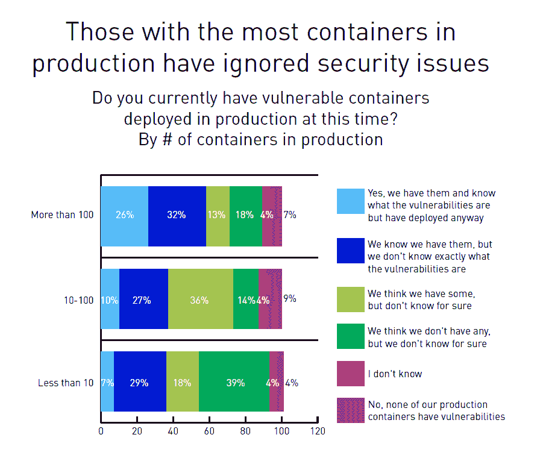

# 随着容器应用的增加，安全担忧也在增加

> 原文：<https://thenewstack.io/security-worries-rise-as-container-adoption-increases/>

根据 [Tripwire 的](https://www.tripwire.com/) [集装箱安全状况](https://3b6xlt3iddqmuq5vy2w0s5d3-wpengine.netdna-ssl.com/state-of-security/wp-content/uploads/sites/3/Tripwire-Dimensional-Research-State-of-Container-Security-Report.pdf)报告，某人对集装箱安全了解得越多，他们就越担心，该报告调查了 311 名管理使用集装箱的环境安全的 IT 专业人员。安全专家的担心是有报酬的，所以 94%的被调查者至少有点担心容器环境并不令人吃惊。引起我们注意的是，42%的受访者说他们的公司因为安全问题推迟或限制了容器的采用。

在生产集装箱的 266 家企业中，47%的企业表示集装箱存在漏洞，而在生产超过 100 个集装箱的企业中，这一比例上升至 58%。随着运行的容器数量的增加，那些“不知道”是否存在漏洞的百分比下降。

> 42%的受访者表示，出于安全考虑，他们的公司推迟或限制了容器的采用。

随着越来越多的工作负载在容器上运行，对容器安全性的审查也在增加，因为越来越多的业务依赖于它们，但担忧也与实际体验有关。事实上，生产超过 100 个集装箱的企业中，有 40%表示他们在去年发生了 6 起或更多的集装箱安全事故，而调查平均值仅为 24%。

对容器安全性的普遍担忧并没有阻止采用的浪潮。我们敢打赌，这种动态将会继续，但结果将会使寻找工具来应对新威胁的安全专业人员感到不安。

通过 Pixabay 的特征图像。

<svg xmlns:xlink="http://www.w3.org/1999/xlink" viewBox="0 0 68 31" version="1.1"><title>Group</title> <desc>Created with Sketch.</desc></svg>