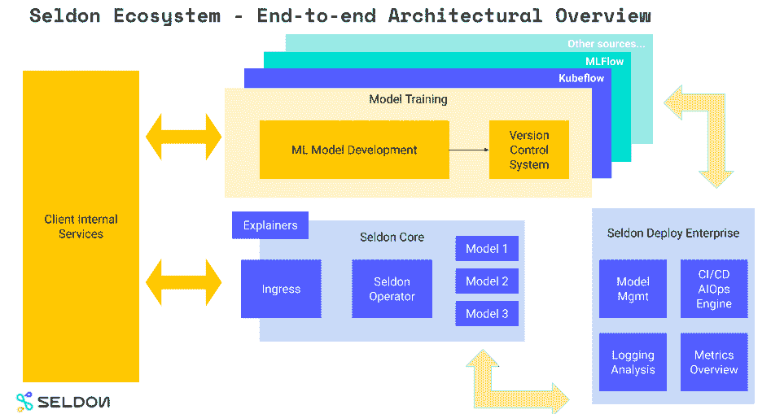
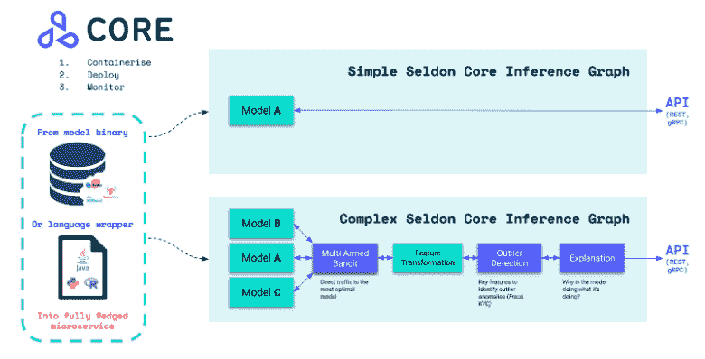

# 塞尔顿:使 ML 部署更容易，保持模型正常运行

> 原文：<https://thenewstack.io/seldon-making-ml-deployments-easier-keeping-models-on-track/>

在建立一个推荐新闻文章的引擎时，谢顿创始人亚历克斯·豪斯利和 T2·克莱夫·考克斯发现，公司面临的最大挑战是建立机器学习的基础设施，而不是开发机器学习的算法。与此同时，他们看到了云和云原生技术越来越受欢迎，所以他们创建了[塞尔顿](https://www.seldon.io/verdict-cto-talk-with-seldons-clive-cox/)来帮助公司部署和管理他们的机器学习基础设施。

它的技术不仅设计用于运行 ML 模型，而且提供治理和监控以确保模型正确有效地运行。

“公司需要知道他们的模型正在按预期运行，客户需要知道它为什么会产生它所做的预测，开发人员需要发现模型是否受到攻击，数据科学家需要知道何时重新训练它，”Cox 在一个带有裁决的 [Q & A](https://www.verdict.co.uk/seldon-cto-clive-cox/) 中说。

早先的 ML 工具是 [Torch](http://torch.ch/) 、 [scikit-learn](https://scikit-learn.org/stable/) 等，后来的 [TensorFlow](https://www.tensorflow.org/) 和 [PyTorch](https://pytorch.org/) 。

“现在所有最好的工具在建模方面都是开源的，但在基础设施方面却很少，”Housley 说。自从这家总部位于英国的公司在 2014 年推出以来， [MLOps](https://thenewstack.io/what-is-mlops/) 空间已经真正起飞。

“下一个大趋势是 Kubernetes 和 Docker 以及 orchestrating containers，它们是我们发现的机器学习模型的完美载体，”Housley 说。Seldon 被设计成与云、工具和语言无关。

“随着我们的发展，我们已经缩小了我们的关注范围。最初，我们看到，对于端到端的 ML 管道，有许多真正大的挑战要克服。这就是大型云供应商和一些早期 ML 平台的目标——端到端 ML 的一站式商店。但我们看到的是，围绕部署的深度 R&D 非常少。这在很多情况下都没有得到充分的服务，因为这是该行业的早期阶段，”他解释道。

“……无论如何，我们的许多核心竞争力都围绕着开发运维领域。我们看到 DevOps 作为一种流程和角色，对应用程序开发越来越重要。许多同类的方法也应该应用于机器学习。因此，我们非常关注管道的这一端。”

## 工具，语言不可知

其初期产品 Seldon [Core](https://github.com/SeldonIO/seldon-core) ，转换 ML 模型(Tensorflow，PyTorch，H2O 等。)或语言包装器(Python、Java 等。)到集装箱化生产休息/GRPC 微服务。它通过添加定制的 SeldonDeployment 资源来扩展 Kubernetes，处理到数千个生产模型的扩展。它支持多种部署模式，包括 A/B 测试、金丝雀部署和多臂土匪，并提供高级功能，包括跟踪、请求日志记录、解释和模型健康的可视化。

其特点包括:

[https://www.youtube.com/embed/TCeGARP_lAk?feature=oembed](https://www.youtube.com/embed/TCeGARP_lAk?feature=oembed)

视频

12 月的 [Core 1.5 版本](https://www.seldon.io/seldon-core-1-5-release/)更新了 Python 包装器，默认情况下允许 REST 和 gRPC 端点以及所有预打包的服务器对所有推理图公开。Istio 和 Ambassador 配置已更新，允许 REST 和 gRPC 配置。

它已经被整合到谷歌的 KubeFlow 项目中，并被整合到包括 Red Hat 和其他厂商的 ML 产品中。该公司正在与包括谷歌、彭博、英伟达、微软和 IBM 在内的公司合作进行 [KFServing](https://github.com/kubeflow/kfserving) 项目，以提供 Kubernetes [定制资源定义](https://kubernetes.io/docs/tasks/extend-kubernetes/custom-resources/custom-resource-definitions/)，用于在任意框架上提供 ML 模型。

*   Seldon [Alibi](https://docs.seldon.io/projects/alibi) 是一个用于机器学习模型检验和解释的开源 Python 库。它集中于分类和回归模型的黑盒、白盒、局部和全局解释方法。
*   [Alibi Detect](https://github.com/SeldonIO/alibi-detect) 是一个开源的 Python 库，用于异常值、对抗性和漂移检测。它专注于表格、文本、图像和时序数据以及图像的在线和离线检测器。

“用户需要了解概念漂移和偏差检测，以确保 ML 解决方案的可靠性和公平性，”剑桥创新资本合伙人 [Vin Lingathoti](https://www.linkedin.com/in/vin-praveenl/?originalSubdomain=uk) 在他的 2021 年技术[预测](http://elitebusinessmagazine.co.uk/technology/item/2021-predictions-what-s-in-store-on-the-technology-front)中写道。"在大规模推广 ML 模型之前，这对于许多组织来说是基本的和强制性的."

去年 11 月，剑桥创新资本(Cambridge Innovation Capital)和 AlbionVC 领投了塞尔顿 710 万英镑(980 万美元)的 A 轮融资，总投资额达到 1370 万美元。

在 IDG 的一篇文章中，塞尔顿工程总监亚历杭德罗·绍切多指出了人工智能/人工智能公司面临的三大挑战:算法偏差、可解释性和问责制。

在 2 月份发布 Deploy 1.0 时，英国律师事务所 Osborne Clarke 的 John Buyers 警告说，“可解释性是一个巨大的、迫在眉睫的监管问题，将会成为一个问题。”

豪斯利解释说:“我们专注于解释和监控，提供健壮的算法，广泛覆盖你需要解释和监控的主要用例。因此，在监测过程中，比如检测异常值，检测模型漂移，当模型与训练数据不同步时，最终会降低模型的性能和输出质量。我们还围绕对抗性攻击检测等问题进行了其他研究，因此也有基于安全的使用案例。”

它的客户包括零售商 H&M、Capital One 和制药公司阿斯利康，后者的明确使命是到 2025 年利用 MLOps 将药物发现周期的研究阶段从 24 个月缩短到 12 个月。

[https://www.youtube.com/embed/iTVY4GI1bhs?feature=oembed](https://www.youtube.com/embed/iTVY4GI1bhs?feature=oembed)

视频

<svg xmlns:xlink="http://www.w3.org/1999/xlink" viewBox="0 0 68 31" version="1.1"><title>Group</title> <desc>Created with Sketch.</desc></svg>