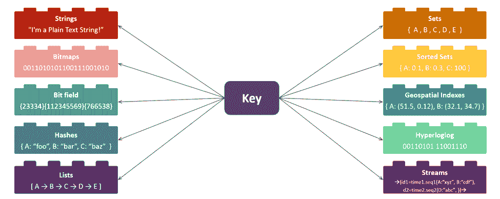

# 为微服务选择合适的数据库

> 原文：<https://thenewstack.io/selecting-the-right-database-for-your-microservices/>

微服务作为基础设施构建模块备受关注，因为它们提供了多种优势，如服务解耦、数据存储自治、小型化开发和测试设置，以及其他有助于加快新应用或更新上市时间的优势。微服务架构的核心原则之一是拒绝单一的应用程序框架，这反过来有利于服务之间的数据共享，而不是使用单个大型数据库。微服务包含独立、自治、专业化的服务组件，每个组件都可以自由使用自己的数据存储。

图一。示例电子商务解决方案中的微服务

## 如何为您的微服务选择合适的数据存储

设计微服务时需要回答的最重要的问题之一是，“如何为每个微服务选择正确的数据存储？”您应该将性能、可靠性和数据建模要求纳入您的选择过程。

### 性能要求

 [Roshan Kumar，Redis 实验室高级产品经理

Roshan Kumar 是 Redis 实验室的高级产品经理。他在软件开发和产品管理方面拥有丰富的经验。过去，Roshan 曾在惠普公司和许多成功的硅谷初创公司工作过，如 ZillionTV、Salorix、Alopa 和 ActiveVideo 等。作为一名热情的程序员，他设计并开发了 mindzeal.com，一个为年轻学生提供计算机编程课程的在线平台。Roshan 拥有美国加州圣克拉拉大学的计算机科学学士学位和 MBA 学位。](https://redis.com/) 

对于微服务，设计每项服务以提供最佳吞吐量非常重要。如果一个微服务成为数据流的瓶颈，那么整个系统可能会崩溃。

1.  **读取性能:**读取性能的常用指标要么是每秒的操作数，要么是运行查询的速度和检索结果的速度的组合。检索结果的速度取决于组织和索引数据的能力。例如，电子商务产品目录微服务可以运行应用多个参数(如产品类别、价格、用户评级等)的查询。您为这种微服务选择的数据库必须首先允许您组织数据以更快地运行查询，然后还能够满足每秒操作数的要求。
2.  **写性能:**这里的简单指标是确定微服务每秒执行的写操作的数量。收集和处理瞬态数据的微服务需要每秒可以执行数千(如果不是数百万)次写操作的数据库。
3.  **延迟:**提供即时用户体验的微服务需要低延迟的数据库，将微服务部署在其数据库附近将最大限度地减少网络延迟。
4.  **资源效率:**反映微服务及其敏捷性的设计原则，数据库占用空间必须最小，同时保持按需扩展的能力。
5.  **供应效率:**微服务组件需要可用于快速开发、测试和生产，要求任何数据库服务支持每秒数百个实例的按需创建。

*对于读写操作，这些是典型的每秒操作数:

*   非常高—超过一百万
*   高—介于 50 万到 100 万之间
*   中等-介于 10，000 和 500，000 之间
*   低-小于 10，000

*对于延迟，典型的数字是:

*   低—少于 1 毫秒
*   中等—1 到 10 毫秒
*   高—大于 10 毫秒

### 数据建模要求

微服务相对于整体架构的优势在于，每个服务都可以选择适合自己数据模型的数据库。微服务架构可以采用基于键值、图形、层次、JSON、流和搜索引擎等的数据模型。在我们的示例电子商务解决方案中，数据建模需求可能如下表所示:

### 数据的性质

并非所有微服务都在其生命周期的同一阶段处理或管理数据。对于一些微服务来说，数据库可能是真相的来源，但对于其他人来说，它可能只是一个临时存储。为了更好地了解您的微服务的数据需求，您可以根据数据的处理方式将数据大致分为以下几类:

1.  **瞬态数据**:数据摄取微服务通常会处理事件、日志、消息和信号等信息，然后再将其传递到适当的目的地。这种微服务要求数据存储能够临时保存数据，同时支持高速写入。由于瞬态数据不会存储在其他任何地方，因此您的微服务所使用的数据存储的高可用性至关重要-这些数据不能丢失。
2.  **短暂数据**:提供即时用户体验的微服务通常依靠高速缓存来存储最常访问的数据。缓存服务器就是一个例子，它是一个临时的数据存储，唯一的目的是通过实时提供信息来改善用户体验。

虽然用于临时数据的数据存储不存储数据的主副本，但它必须被设计为高度可用，因为故障可能会导致用户体验问题和收入损失。

1.  **运营数据**:从用户会话中收集的信息——如用户活动、购物车内容、点击、喜欢等。—被视为操作数据。这些类型的数据支持即时、实时的分析，通常由直接与用户交互的微服务使用。对于这种类型的数据，持久性、一致性和可用性要求很高。
2.  **交易数据**:支付处理和订单处理等数据必须作为永久记录存储在数据库中。使用的数据存储必须采用经济高效的存储方式，即使交易量在增长。

在图 1 所示的电子商务解决方案示例中，您可以对微服务及其各自的数据处理需求进行分类，如下表所示:

对数据的另一个重要要求是找出两个或多个微服务是否需要共享一个公共数据集。所有类型的数据都可能发生这种情况—短暂的、暂时的、操作性的或事务性的。在这种情况下，如果您将您的微服务设计为访问一个公共数据库，您可能会回到 monolith 架构，并失去微服务的灵活性和本地数据访问优势。在微服务架构中，您可以通过利用消息传递系统，或者通过采用具有“无共享”架构的多主、主动-主动分布式数据库，来实现数据库之间的数据共享。后者将为您的微服务提供本地数据副本，并将所有更新聚合到后台。

## 选择数据库以满足您的需求的挑战

市场上有超过 [300 个数据库](https://db-engines.com/en/ranking)，为您的微服务选择合适的数据库听起来可能是一项艰巨的任务。您可以从列表中找到提供您需要的所有特性和功能的数据库。然而，挑战在于找到一个不仅满足您的标准，而且轻量级的数据库。为了实现高效的流程编排和管理，微服务通常采用轻量内存的容器化方式。

操作上的考虑经常驱使架构师满足于所有用例的最小公分母——通常是关系数据库。关系数据库的缓慢性能不适合依赖于以亚毫秒级延迟访问数据的微服务，并且不允许数据模型的灵活性。然而，在每秒的读/写操作数量方面的性能与关系数据库相当。

## 微服务数据库的最高标准

对于您的数据库来说，最重要的标准之一是灵活的部署模型，它可以实现:

*   在您自己的数据中心，无论是内部(虚拟机或裸机)还是云中
*   在容器化的环境中，由 Kubernetes 或其他容器编排者编排
*   在像 PCF 或 OpenShift 这样的云原生/PaaS 环境中

理想情况下，您将拥有一个多租户解决方案，可以隔离微服务之间的数据，并允许您调整数据库，以在性能和数据一致性/持久性之间保持平衡。以下是几个标准:

### 高性能、低延迟

您为微服务选择的数据库应该[在更高的吞吐量(每秒操作数)和更低的延迟方面超过市场上其他流行的 NoSQL 数据库](https://redis.com/docs/nosql-performance-benchmark/)。理想情况下，其数据库架构应该能够在仅使用两个商用 [云实例](https://cloudplatform.googleblog.com/2015/04/a-guy-walks-into-a-NoSQL-bar-and-asks-how-many-servers-to-get-1Mil-ops-a-second.html)的情况下，每秒至少执行一百万次读/写操作，同时确保数据也是持久的。

图二。Redis 企业绩效图表

#### **Redis 作为多模式数据库**

为了提高效率和可伸缩性，最好拥有一个带有大量内置模块的多模型数据库。它应该建立在开源的基础上，并支持所有的数据结构——字符串、散列、列表、集合、排序集、地理空间索引、超级日志、位域、流等。—因此，微服务设计人员可以使用最适合其性能要求的数据结构来组织数据。

图 3。Redis 中的内置数据结构

Redis 简化了您的应用程序和数据架构。它还将您的多语言架构(如下所示)简化为简单的流线型架构，如图 4a 所示。

图 4a。微服务—意大利面条式架构

图 4b。多模式数据库体系结构

### 具有自动故障检测的高可用性

对于您的微服务来说，拥有一个始终可用的高度可靠的数据库非常重要。该架构还应该提供对使用它的微服务完全透明的自动故障检测和零停机扩展。

图 5。Redis 企业架构实现高可用性

如图 5 所示，该架构由一个类似容器的 Redis 企业节点集群组成，其中每个节点都有一个构建在开源 Redis 分片之上的企业管理层。管理层有一个集群管理器、集群存储库、看门狗实体和 UI/CLI/API 接口来管理资源供应、故障转移和其他几个集群操作。数据层包括在群集的每个节点上运行的零延迟代理，以及群集节点之间的无盘复制。如果出现节点故障，节点将通过选择辅助数据库作为新的主数据库来建立仲裁。[架构](https://redis.com/redis-enterprise/technology/highly-available-redis/)支持跨机架、区域和地域的故障转移。

### 众多耐用性选项

您可能需要考虑耐久性选项，从每小时的快照到每秒或每次写入的日志更改。应该将数据库配置为具有内存复制和持久性的组合，以帮助您针对微服务处理的数据类型(短暂的、暂时的、操作性的或事务性的)优化微服务的性能。

图 6。强大的持久性配置，在具有“等待”的辅助节点上提供复制和持久性(每次写入 AOF)

#### **跨微服务同步数据**

尽管面临诸多挑战，但整体架构确实保证了一件事:数据一致性。在微服务方法中，您可以使用消息流或消息总线在微服务之间共享消息。然而，如果您想要在不同的微服务之间共享数据集，您将需要一个无冲突的解决方案来确保数据集保持同步和一致。

1.  **微服务之间的共享数据集** —当您有一个微服务的多个实例，每个实例都有自己的数据库时，基于 CRDTs 的主动-主动分布式数据库特别方便。每个微服务可以执行具有本地延迟的读/写操作，而数据库执行解决冲突的繁重任务。

图 6。强大的持久性配置，在具有“等待”的辅助节点上提供复制和持久性(每次写入 AOF)

基于 CRDT 的分布式数据库提供强大的最终一致性和因果一致性，同时保持本地响应时间(即使在地理分布的场景中)。即使在网络分区期间，当数据中心之间的网络延迟非常高时，甚至在主动-主动服务器之间没有仲裁的情况下，数据库也可用于更新。

使用 CRDTs，每个微服务都可以连接到分布式数据库的本地实例。底层的 CRDT 技术将自动确保数据的所有副本最终在所有微服务中收敛到相同的一致状态。

1.  **微服务之间的数据传输** —理想情况下，应该有三种简单的方法将数据从一个微服务传输到另一个微服务:
    1.  **发布/订阅:**该技术采用发布-订阅模型在微服务之间进行异步通信。
    2.  **列表:**列表数据结构支持异步数据传输的阻塞调用。
    3.  **有序集合:**这种数据结构适用于时序数据，但不支持异步数据传输。
    4.  **流:**流数据结构结合了发布/订阅、列表和排序集的优点。它允许异步数据传输，支持多个客户端的连接器，并对连接丢失保持弹性。

### 运营您的微服务

最后，评估您的解决方案的部署和编排选项也很重要，以确保所有微服务都在同构环境中部署和管理。要寻找的一些关键标准包括:

1.  **多租户支持:**一个多租户解决方案，其中端点是在集群内部创建的数据库实例。多租户还可以非常高效地创建数据库，每秒钟可以创建数百个实例。
2.  **作为容器的可用性:**作为容器部署并由编排工具管理的微服务提供了很高的运营效率，但是将数据库部署为容器可能会很棘手。然而，如果数据库已经是应用程序堆栈的一部分，那么将数据库用作容器是一种流行的选择。
3.  **分层编排:**Kubernetes 和 BOSH 等流行的编排系统是为管理大量应用程序组件而构建的，但如果您的应用程序需要一个有状态的、持久的、高度可用的数据库层，这些系统是不够的。您的数据库应该与这样的编排器集成，并提供自己的内部编排工具，以确保有状态、持久的 Redis 数据库层所需的高可用性。
4.  **Kubernetes 支持:**您还可以在您的 Kubernetes 环境中[编排一个](https://redis.com/blog/running-redis-enterprise-kubernetes-service/) [容器作为云原生数据库服务](https://redis.com/blog/running-redis-enterprise-kubernetes-service/)。
5.  **云/内部部署选项:**无论您的微服务是在私有云环境、内部部署还是在云中运行，灵活的部署选项都可以让您的微服务尽可能靠近数据。

## 结论

微服务架构提供了整体架构无法提供的灵活性和敏捷性。另一方面，为每个微服务建立专门数据库的想法可能会导致多语言系统，随着时间的推移，势必会变得昂贵和难以操作。最终，您需要一个具有高可用性和耐用性选项的高速、多模式数据库，这对您的微服务至关重要，使您能够摆脱整体架构，同时避免多语言系统。

<svg xmlns:xlink="http://www.w3.org/1999/xlink" viewBox="0 0 68 31" version="1.1"><title>Group</title> <desc>Created with Sketch.</desc></svg>