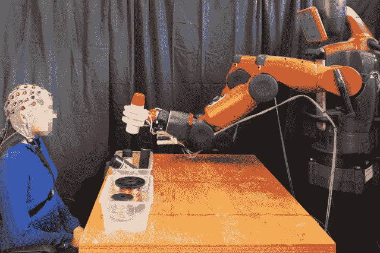
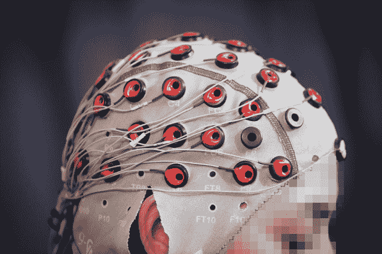

# 一个由人脑通过心灵感应控制的自我修正机器人

> 原文：<https://thenewstack.io/self-correcting-robot-thats-telepathically-controlled-human-brain/>

在一个日益自动化的世界里，有许多可能的方法让机器人和其他机器执行我们的命令。例如，机器人可以通过语音命令来控制，但当然，这意味着这些机器需要配备某种精通自然语言处理的人工智能。但是，正如我们许多人从使用智能手机上的数字助理的亲身经历中所知，这种方法可能不可靠，令人沮丧。

因此，科学家们正在探索机器人控制的替代方案，例如[脑机接口](https://thenewstack.io/control-robotic-arm-mind-using-machine-learning/) (BCIs)，它在大脑和外部机器之间建立了直接的通信链接。来自麻省理工学院[计算机科学和人工智能实验室](https://www.csail.mit.edu/) (CSAIL)和[波斯顿大学](http://www.bu.edu/)的一组研究人员最近创建了这样一个界面，允许人类利用机器学习和来自 [Rethink Robotics](http://www.rethinkrobotics.com/) 名为 Baxter 的商用[协作机器人](https://thenewstack.io/collaborative-robots-will-help-human-workers-not-replace/)用意念控制机器人。

在团队论文中概述的实验[中，合作机器人 Baxter 的任务是将喷漆罐和电线卷分类放入两个独立的箱子中。该团队的界面包括人类受试者将脑电图(EEG)帽戴在头上，将他们连接到一个封闭的反馈回路系统，其中也包括机器人。该系统允许人类在机器人排序出错时，仅通过思维实时提醒机器人，甚至引发机器人的“尴尬”反应，如视频所示。](https://groups.csail.mit.edu/drl/wiki/images/e/ec/Correcting_Robot_Mistakes_in_Real_Time_Using_EEG_Signals.pdf)

[https://www.youtube.com/embed/Zd9WhJPa2Ok?feature=oembed](https://www.youtube.com/embed/Zd9WhJPa2Ok?feature=oembed)

视频

该系统读取并作用于大脑中一种叫做错误相关电位(ErrPs)的特定电活动。当一个人意识到自己犯了一个错误时，这种特殊的大脑信号就会爆发。这些电脉冲被 EEG cap 拾取，并在 10 到 30 毫秒内，被机器学习算法分类和解码为简单的机器人控制命令，这些命令会促使 Baxter 停止并自我纠正。

“想象一下，能够即时告诉机器人做某个动作，而不需要输入命令，按下按钮，甚至说一句话，”CSAIL 主任[丹妮拉·鲁斯](https://www.csail.mit.edu/user/876)说。“像这样的简化方法将提高我们监管工厂机器人、无人驾驶汽车和其他我们尚未发明的技术的能力。”

与其他现有的脑机接口相比，该团队的方法有一些明显的优势，这些接口通常需要训练人类操作员以某种方式调整他们的大脑信号，以便从系统中获得响应。一个例子是一个连接到 BCI 的人类受试者，在精神上想象一个光标向计算机屏幕上的目标移动。该系统的软件将解释这些脑电波，并将这种思维转化为屏幕上的可见活动。这种技术的一个主要缺点是它需要高度的专注、持续的视觉刺激和额外的训练。相比之下，该团队的目标是开发一种更直观的控制方法。

“当你观察机器人时，你所要做的就是在精神上同意或不同意它正在做的事情，”鲁斯说。“你不必训练自己以某种方式思考——机器会适应你，而不是相反。”

为了提高机器人的响应精度，并抵消 ErrP 信号的固有弱点，该团队还将注意力转向了他们所谓的“二次误差”。当机器人没有正确响应操作员的初始反馈时，这些信号出现在人类操作员的大脑中，并且比初始错误相关的大脑信号更容易识别。

虽然这个额外的功能还不能在这个模型中实时使用，但该团队相信，一旦它被集成到系统中，它将提高系统的性能，将准确率提高 90%，并在人类和机器人之间建立持续的通信。

该团队还认为，该系统可以超越双重的“是或否”的区分，以包含多种选择，因为 ErrP 信号的“错误”可以在相对的层次上进行分析，以便从许多答案或行动中得出最“正确”的答案或行动

像这样直观的脑-机接口很有希望创造出控制机器人的系统，这种系统几乎不需要训练就能使用。这样一个易于使用和立即响应的界面在工厂环境中是有价值的，毫无疑问，这将方便患有疾病的人，他们使用某种假肢，但患有疾病或受伤，无法用他们的声音控制他们的设备。事实上，这种研究表明，用你的思想控制机器人的想法听起来不像过去那样遥不可及，而且可能有潜力成为一项广泛应用的技术，我们可能会看到它集成到我们的汽车、家庭和工厂中。

图片:CSAIL /波士顿大学

<svg xmlns:xlink="http://www.w3.org/1999/xlink" viewBox="0 0 68 31" version="1.1"><title>Group</title> <desc>Created with Sketch.</desc></svg>