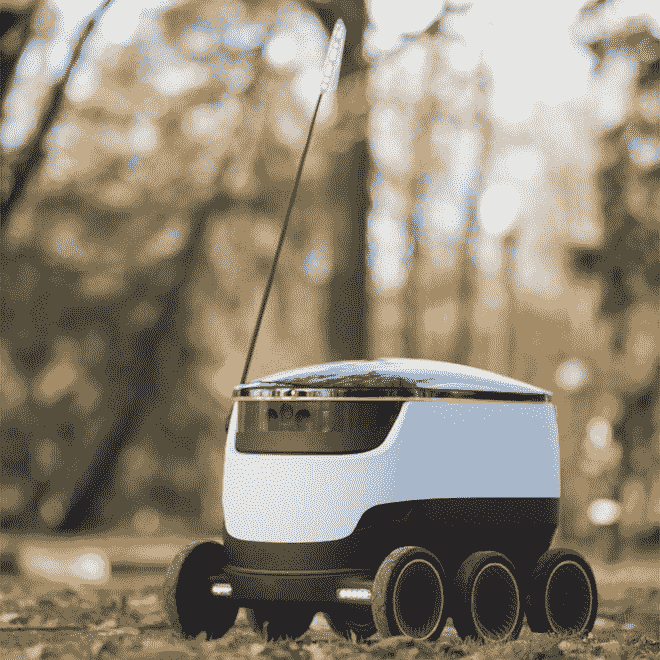
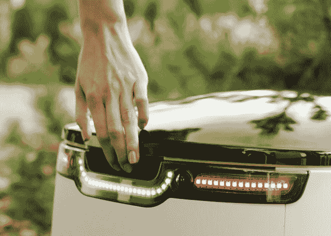
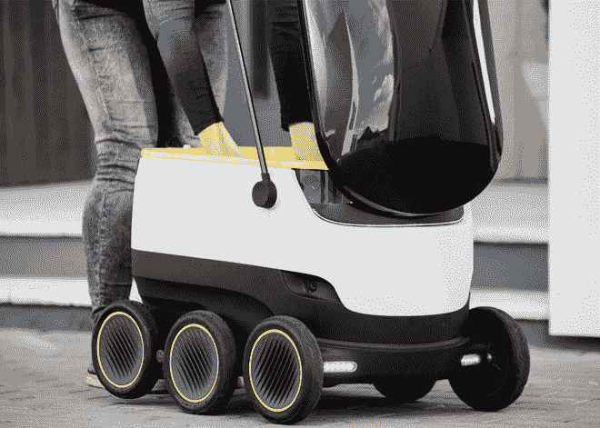
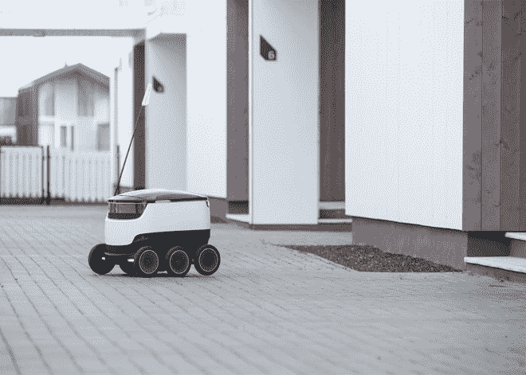

# 无人驾驶的杂货店送货机器人已经准备好开到你家门口了

> 原文：<https://thenewstack.io/self-driving-grocery-delivering-robots-ready-roll-door/>

假日季的准备工作可能会很疯狂，还会伴随着最后一分钟去商店买一些被遗忘但必要的东西的麻烦。虽然总是有送货上门的选择，但大多数消费者知道这可能相当昂贵。无人机送货可能会降低成本，在过去几年里，像亚马逊、T2、谷歌和 T4 这样的公司都在尝试无人机送货。

但无人机运输仍有监管障碍需要克服，这导致一些人打赌地面自主机器人可能是更合适的替代选择。

欧洲创业公司 [Starship Technologies](https://www.starship.xyz/) 就是这样一家押注机器人的公司。该公司由 Skype 联合创始人 Janus Friis 和 Ahti Heinla 创建，在伦敦、芬兰和爱沙尼亚设有办事处，明年将在英国和美国推出一个试点项目，以测试这些机器在将食品杂货或包裹送到客户家中方面的表现。

[https://www.youtube.com/embed/yL2MZDTVjKU?feature=oembed](https://www.youtube.com/embed/yL2MZDTVjKU?feature=oembed)

视频

## 重量轻，由应用程序操作，比无人机送货更安全

机器人本身是一个无害的小漫游车，配备有六个轮子、导航传感器、GPS 系统、摄像头和避障软件。它由廉价的现成组件制成，由一个仅消耗 50 瓦的电动马达驱动，设计用于携带 9 公斤(19 磅)的东西，满载时仅重 20 公斤(44 磅)。

凭借每小时 4 公里(每小时 2.4 英里)的相当平稳的最高速度，机器人撞上某人并伤害他们的可能性更小——这是与无人机相比的一个主要优势，无人机可能在极小的机会下发生故障并从空中掉下来落在某人的头上。相比之下，Starship 的机器人将沿着之前以高分辨率绘制的路径和街区行进。机器人也有远程操作员作为备份，他们可以通过摄像头监控事情，并在出现任何问题时进行控制，比如有人决定偷机器人或其内容。

【T2

这个想法是让机器人在商店或仓库周围 3 英里的范围内运作，让它们在 30 分钟内送货。客户通过应用程序下订单，选择对他们来说方便的时间段，跟踪机器人的进度，当机器人到达时，订单只能由下订单的客户通过使用应用程序解锁隔间来安全地检索。零售商也可以使用机器人作为一种方式，让潜在客户试穿:如果他们喜欢，他们会留着它；如果没有，他们可以把它送回商店。

## “最后一英里”问题

Starship 估计，通过解决所谓的“最后一英里”问题，这些流动的微型车辆可以将运输物流成本降低 10 至 15 倍。送货上门的大部分成本来自最后几英里，Starship 认为，通过使用机器人，成本可以大幅削减，使其“几乎免费”Heinla 说:“我们的愿景围绕着三个零——零成本、零等待时间和零环境影响。

> 我们希望像 Skype 对电信行业那样，对本地送货服务采取同样的做法。

“随着电子商务的持续增长，消费者希望有更方便的送货选择，但价格要适合他们。最后几英里通常占总运输成本的大部分。我们的机器人是专门使用手机和平板电脑可负担的技术设计的——它符合目的，并允许将节省的成本转移给客户。”

当然，搬运货物的机器人并不新鲜，已经成功地应用于[医院](http://www.roboticsbusinessreview.com/article/blue_collar_delivery_robots_making_gains_in_u.s._hospitals)、[酒店客房服务](http://recode.net/2015/09/26/robot-room-service-savioke-aims-to-forge-new-business-model-for-robotics-video/)和仓库。因为所有这些地面机器基本上都是用类似的原理设计的，所以想象自动送货机器人上街并不是什么难事。另一方面，这种新场景肯定会带来封闭环境中不存在的不可预见的复杂挑战——比如穿越繁忙的十字路口——因此 Starship 的系统无疑更适合郊区环境，而不是人口稠密的城市。无论如何，如果该公司的试点项目进展顺利，我们可能有一天不得不向人类送货员和邮政工人告别，因为这些机器人将接管带来便利和“几乎免费”的送货上门。

图片:[星舰科技](https://www.starship.xyz/)。

<svg xmlns:xlink="http://www.w3.org/1999/xlink" viewBox="0 0 68 31" version="1.1"><title>Group</title> <desc>Created with Sketch.</desc></svg>