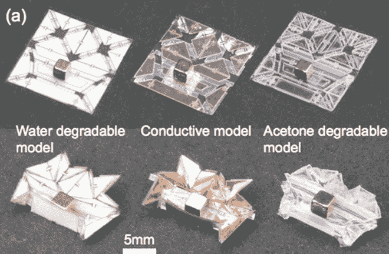
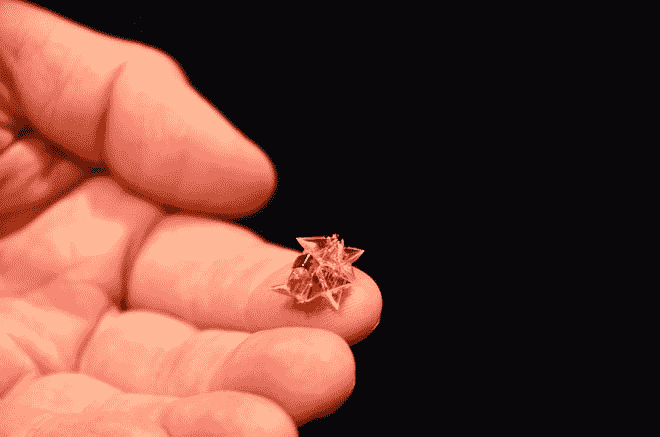
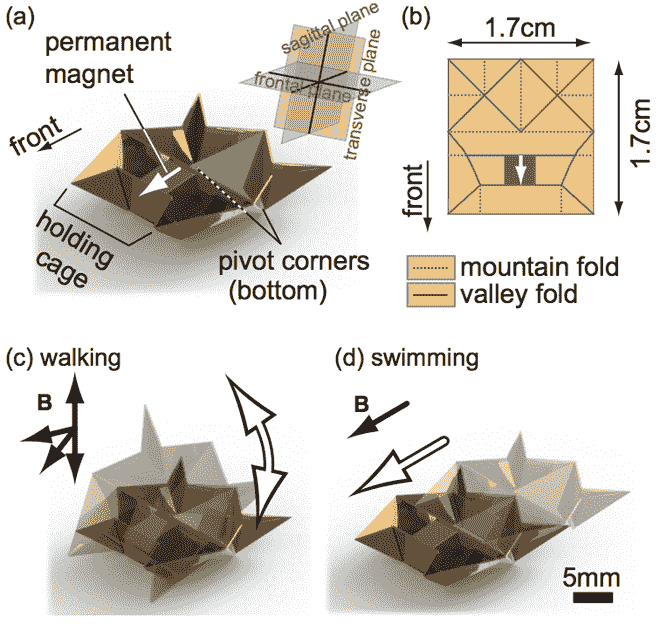
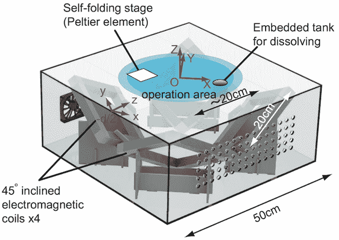
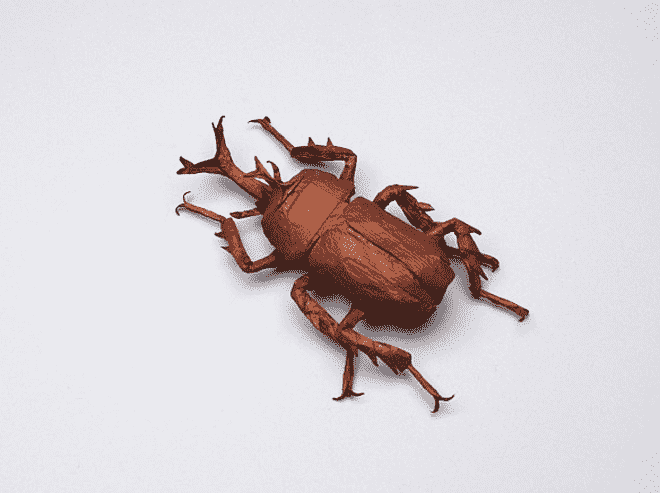

# 自动折叠迷你折纸机器人是未来的纳米外科手术

> 原文：<https://thenewstack.io/self-folding-mini-origami-robots-are-the-nanosurgeons-of-tomorrow/>

折纸艺术，或者以其日语绰号“折纸”而广为人知，可能自公元一世纪纸被发明以来就一直存在。乍一看，折纸似乎是年轻人和老年人放松的爱好，但其谦逊而深刻的基本概念已被用于教育；数学；医学；建筑；以及机械、土木和航天工程。

现在，来自麻省理工学院和慕尼黑工业大学的研究人员创造了他们所谓的“[无束缚、自我折叠的折纸机器人](http://shu21th.sakura.ne.jp/file/ICRA2015v26Final.pdf)”，它可以行走、游泳、挖掘，甚至当它接触到某些液体时会溶解掉。虽然以前的机器人已经展示了类似的能力，但这个微型的自我折叠机器人是第一个可以完全消失的机器人。了解它的实际应用:

https://www.youtube.com/watch?v=f0CluQiwLRg

最近在 ICRA 召开的国际机器人和自动化会议上，这款不用电池的微型机器人仅 1.7 平方厘米，重 0.31 克。它配备了一个钕磁铁，它会随着周围产生的磁场而移动。它由折叠的聚氯乙烯(PVC)制成，夹在由聚苯乙烯或纸制成的激光切割结构层之间。

## 4D 印刷的更便宜、更快速的替代品？

研究人员正在探索折纸结构作为 4D 印刷的替代方案，因为这些自动折叠机器人只需要一台激光切割机，甚至是一台便宜的乙烯切割机就可以创建。这种方法可以提供一种低成本和更快速的制造机器人的方法，使用二维板材快速创建紧凑和轻便的三维形状。

机器人开始处于展开、平放的状态。当它被放在加热元件上时，它会在大约一分钟内折叠成形。这种自折叠特性是通过激光切割机在结构层中进行精确切割而实现的；夹在中间的 PVC 是热敏的，受热会收缩。根据这项研究，使用的自折叠纸能够同时双向折叠 100 多次。

【T2

在围绕其自身的磁体折叠后，现在的三维形式由一组四个电磁线圈推动运动，这些线圈产生 15 赫兹的定向但快速交变的磁场，使其振荡并向前移动。运动由 Arduino Esplora 控制，它处理调制磁场梯度所需的计算。

除了行走和转弯，该机器人还可以攀爬、搬运相对于其自身重量较重的负载、推动物体、挖掘和游泳，这要归功于其船形的身体。

但最令人印象深刻的是，当它由聚苯乙烯制成时，当它浸入丙酮罐中时，机器人可以慢慢解体，只留下磁铁，有效地“删除”自己。这对于许多医学应用来说是一个特别有益的属性；首席研究员鸣瀬·宫下解释说，这些机器人有朝一日可能成为一支纳米外科大军，它们可以进入人体并修复它，然后“删除”自己

> 没有人愿意吞下一个电池和一个马达。[所以]我们正试图使材料智能化或自主化。(通过这些机器人)我们完成了从出生到生命、活动和生命结束的循环。这个圈子是封闭的。

## 折纸机器人可能如何进化

虽然这个机器人看起来似乎很简单，但人们必须看看现代折纸术的显著发展，看看这项发明会走向何方。以今天所谓的“[折纸数学](https://en.wikipedia.org/wiki/Mathematics_of_paper_folding)、“[计算折纸](http://www.computerworld.com/article/2564259/app-development/computational-origami.html)”和折纸大师[吉泽章](https://en.wikipedia.org/wiki/Akira_Yoshizawa)开创的现代创新，或者物理学家[罗伯特·朗](http://www.langorigami.com/)创造的令人难以置信的超现实自然折纸形式为例，人们可以开始想象这些自我折叠的动画折纸机器人有朝一日可能进化到何种复杂程度。

罗伯特·朗用一张纸折叠而成。

当然，道路上仍有坎坷，最明显的是如何减少或消除电子部件，尤其是如果机器人将用于人体内。在这种情况下，除了仔细选择安全和适合任务的材料之外，驱动和控制将是另一个挑战。研究人员的目标是下一步将“自折叠传感器”集成到机器人中，给它更多的自主权。因此，虽然我们不知道这个巧妙的小机器人未来的迭代会是什么样子，但这仍然是一个简单但令人印象深刻的概念，结合了传统知识和尖端思想。点击阅读更多研究[。](http://shu21th.sakura.ne.jp/file/ICRA2015v26Final.pdf)

图片来自鸣瀬·宫下、史蒂文·吉特隆、马文·鲁德斯多弗、辛西娅·r·桑和丹妮拉·鲁斯的作品“一个不受束缚的微型折纸机器人，可以自我折叠、行走、游泳和降解”。

<svg xmlns:xlink="http://www.w3.org/1999/xlink" viewBox="0 0 68 31" version="1.1"><title>Group</title> <desc>Created with Sketch.</desc></svg>