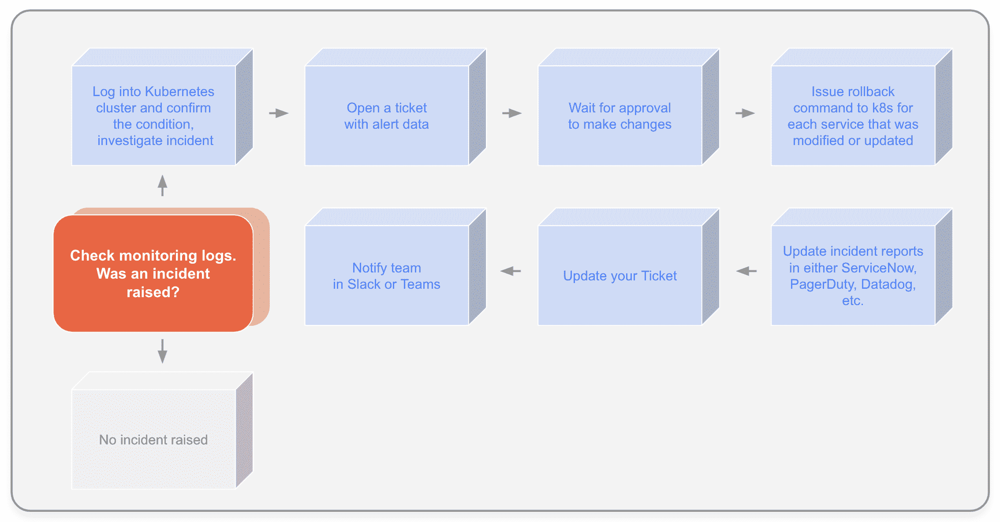
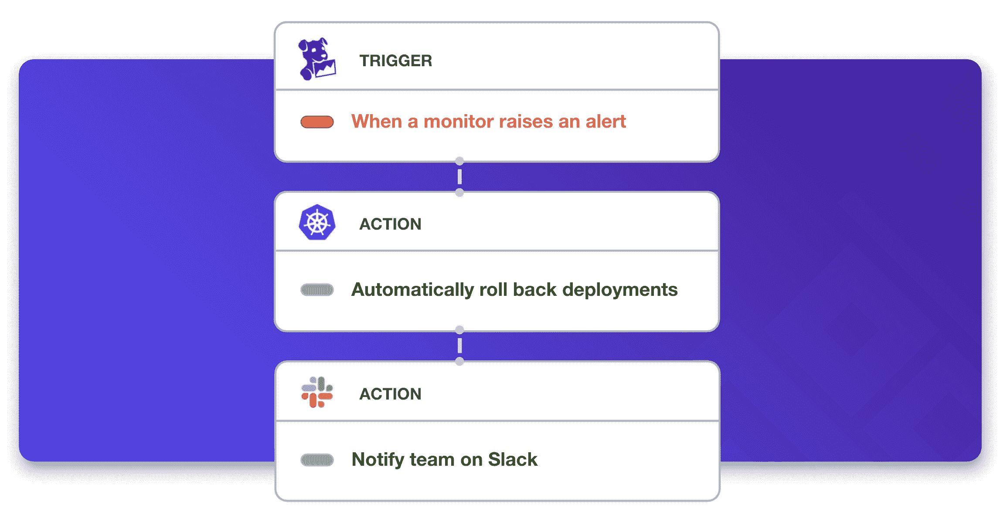

# 可观察世界中的自我修复

> 原文：<https://thenewstack.io/self-healing-auto-remediation-in-the-world-of-observability/>

[Melissa Sussmann](https://www.linkedin.com/in/melissa-sussmann-9b446076/)

[Melissa 是 Puppet 的一名技术传道者，作为产品营销经理和开发工具产品经理，她拥有超过 10 年的领域专业知识和经验。她是一个狂热的攀岩者和园丁。她还喜欢从事兼职项目，比如制造定制电脑和开发加密货币。](https://www.linkedin.com/in/melissa-sussmann-9b446076/)

没有什么比凌晨 3 点起床来解决跨云服务的事件更好的了。您必须匆忙确定范围，聘请合适的专家并跨云进行补救。您的公司希望您减少平均恢复时间(MTTR)，但是他们了解这样的事件响应所花费的辛劳和时间吗？

尽管自动化在企业中迅速发展，但事件响应仍然是一个极其缓慢的手动过程。工程师们最终采用了“数字管道胶带”的方法。这只会扩大 MTTR，并在不知不觉中让企业面临更多风险。自动化事件响应可以创建一个自我修复系统(DevOps 和 SRE 人的天堂)，从而减轻补救负担并加快 MMTR。让我们看一下事件响应的当前状态，以及它如何与自动补救一起工作。

## **事件响应没有跟上**

手动事件响应不再有意义。速度、安全性、弹性和效率是当今每个企业的重中之重。自动化是实现这些目标的一个关键。但是事件响应仍然处于数字黑暗时代。繁重、繁琐的流程和复杂性造成了不必要的站点停机时间。此外，您的客户经历的站点停机时间越长，导致的损耗就越大。

这也意味着工程师花费太多时间维护现有系统，这限制了他们的创新能力。手动流程不可重复、不可扩展或不可审核。此外，许多公司选择具有高代码技能要求的工具，这进一步限制了平台团队自动化的容易程度。

如果您今天正在处理这一问题，那么这一事件响应流程看起来再熟悉不过了:

单击查看全尺寸图像(在新标签中打开)

请注意这种辛苦、等待他人回复的需要以及更新报告和发出通知所花费的时间。这需要太多时间。

## **自动补救流程是什么样子的**

当云团队第一次决定自动化事件响应时，他们通常采用 DIY 方法。然而，这也带来了同样的缺点，即手工劳动、时间密集和临时的、不可重复的脚本。一个统一的自助式自动化平台使创建自动化的能力大众化，并集成了您的组织已经在使用的各种工具和 API。平台使云团队能够实施可重复、一致、可审核的工作流，这正是自动化补救所需要的。

那么，您的平台团队会遇到什么情况呢？

在自修复自动补救事件响应系统中，一个事件触发自动的、记录良好的和预测试的修复程序。漏洞会被自动检测出来，在整个云环境中启动安全、可审核、协调的基础架构操作，无需您做出响应。甚至通知也是自动的。再也不用凌晨 3 点排除故障了！

您的团队将体验:

*   更快的 MTTR。
*   减少工作，让他们能够专注于新项目和创新。
*   自动发生的部署回滚。
*   易于创建、可重复、可扩展和可审计的低代码工作流。
*   降低业务和客户体验的风险。

自助服务自动化平台使自动化事件响应变得容易，并让您高枕无忧，因为您知道无论何时事件触发警报，系统都会处理它。该业务将减少 MTTR，增加正常运行时间，并能够减少对维护现有系统的关注，更多地开发新产品。

*请于 9 月 29 日至 30 日在 [Puppetize Digital](https://events.puppet.com/event/puppetize-digital-21/) 了解更多关于事故补救的信息。作为一项免费的虚拟活动，Puppetize Digital 专注于将人置于自动化的中心。*

<svg xmlns:xlink="http://www.w3.org/1999/xlink" viewBox="0 0 68 31" version="1.1"><title>Group</title> <desc>Created with Sketch.</desc></svg>