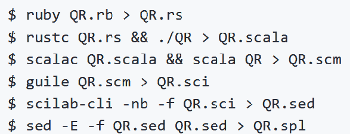
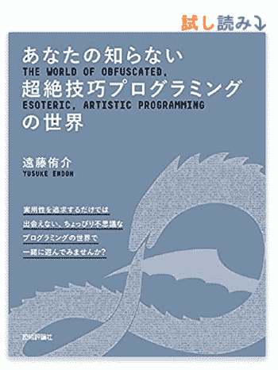
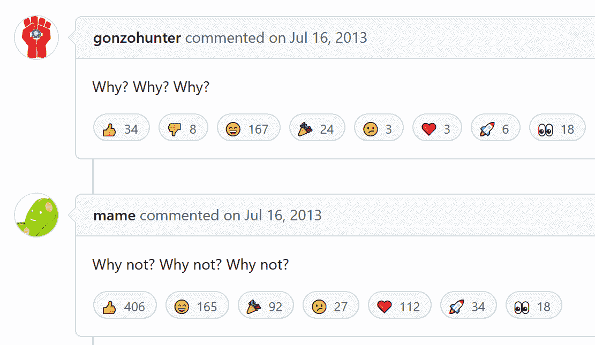

# 自我复制程序？在蒯因的野生世界里玩耍

> 原文：<https://thenewstack.io/self-replicating-programs-at-play-in-the-wild-world-of-quines/>

“谈论软件开发主要是出于实际考虑，”开发者/播客[亚当·戈登·贝尔](https://www.linkedin.com/in/adamgordonbell/)周五在一封电子邮件中告诉我。但是编程也是一种创造性的行为，程序员*的游戏方式也有真正的价值。*

所以在[最近的一个播客](https://corecursive.com/quines-polyglot-code/#justines-trick)中，贝尔花了一个小时讨论一组有趣的幽默古怪的编程，被称为[被诅咒的计算机冰山模因](https://suricrasia.online/iceberg/)。

在其令人捧腹的传说中，收集了令人难以置信的编程现象，即奎因。很简单，quine 是一个程序，它的输出是……程序的完整文本。

但这很快导致了一种文化观察。在听说这可能会令人困惑——并提供了创建它们的技巧——贝尔收到了播客嘉宾唐纳德·麦凯[的一个合理的问题，唐纳德·麦凯](https://ca.linkedin.com/in/donald-mckay-62028024)是安大略省一家名为 B 在线学习有限公司的电子学习平台的高级全栈开发者。

麦凯的问题:为什么？“是脑力锻炼吗？一个蒯因有什么实际用途？”

为什么真的。这是一个全世界的开发者都试图回答的问题。但是，除了类似奎因的编程结构的强大而晦涩的应用之外，也许在今天的程序员文化中还潜藏着一些基本的人类冲动。

去探索，去奋斗，去玩耍。

## 编程难题

“一种方式认为它只是一个难题，”贝尔开始了他的播客对奎因的插曲。“你怎么能这样？”

通过努力解决这个难题，人们在这个过程中学到了很多东西。贝尔发现了一个充满蒯因信息的维基百科页面。显然，几种编程语言——包括 Ruby 和 JavaScript——都有一个函数[评估任何代码串](https://en.wikipedia.org/wiki/Quine_(computing)#Eval_quines)。

“我喜欢蒯因，因为它们只是有趣的小谜语，”贝尔在周五的电子邮件中解释道。“它们没有任何实用性，这才是关键所在。”

播客播出后，贝尔发现很多听众都同意。虽然软件开发讨论可能会被实际考虑所主导，“许多人进入技术领域是因为他们喜欢用计算机构建有趣的东西，而奎因可以提醒他们偶尔做一些有趣而无用的事情。”

在播客结束之前，贝尔甚至在讨论所谓的“抗辐射”奎因。由于理论上太阳耀斑可能会改变你的硬盘驱动器，实际上有一种类型的奎因，正如贝尔所描述的那样，“不止一次地对自己进行编码，以便能够对输出进行纠错。”

但是，他警告观众，“事情变得更加复杂。”

## 128 奎因合一

维基百科的蒯因页面也指出了相关的概念[蒯因中继](https://en.wikipedia.org/wiki/Quine_(computing)#Ouroboros_programs)——其中一种语言的程序输出另一种语言的程序，该程序输出(第一语言的)原始程序。

“又一次，这看起来不像是应该可能的事情，”贝尔在播客中惊叹道，“但它只是使用了相同的技巧。”

这导致了有史以来最伟大的奎因，安全地藏身于 Yusuke Endoh 的 GitHub 库中[，他是一名开发者，自豪地将自己称为国际混淆 C 代码竞赛的世界第一选手。(这一说法无法得到官方证实，但远藤已经提交了至少 13 个不同年份](https://github.com/mame/quine-relay)的获奖作品[。)](https://www.google.com/search?client=firefox-b-1-d&q=site%3Ahttps%3A%2F%2Fwww.ioccc.org%2F+Yusuke+Endoh)

Endoh 的知识库拥有一个 Ruby 程序，该程序生成一个 Rust 程序，该程序生成一个 Scala 程序，该程序通过总共 128 种不同的编程语言生成…等等。

第 128 次迭代是用 IBM 有 42 年历史的编程语言 Rexx 编写的程序，它生成原始的 Ruby 程序，以在这 128 种不同的编程语言中再次迭代地生成相同的奎因循环。(尽管存储库的自述文件警告说，您需要安装这 128 种语言的所有编译器和解释器……)甚至还有一个令人望而生畏的列表，列出了运行各种程序所需的 128 个不同的 shell 命令。

当然，自述文件还包括在 Docker 容器中构建和运行映像的说明。

17 名贡献者帮助组装了这个庞大的程序。

源代码中的注释提供了一些有用的背景信息，同时展示了开发人员的幽默感。“好消息:我出版了一本书，[“模糊、深奥、艺术编程的世界”]它解释了如何编写一个蒯因、一个 ASCII 艺术蒯因和一个 uroboros 蒯因，就像这个蒯因继电器一样……坏消息:它是用日语写的。我希望你能把它翻译成英文并帮我赚取版税。

回到播客上，贝尔告诉他的观众“我甚至不知道有*128 种编程语言*。这已经很多了。”但是在他的表演接近尾声的时候，他表达了对这种纯粹的快乐的钦佩。贝尔说，恩多“这样做是为了一些奇怪的审美刺激或什么的……没有人付钱给他。”

在该项目的 GitHub 知识库中隐藏着一种自发的感激之情。自述文件页面的底部有一个常见问题部分，其中第一个问题很简单，“为什么？”

它链接到存储库的“问题”页面，一个名为“gonzo hunter”[的开发人员在 2013 年](https://github.com/mame/quine-relay/issues/11)曾在这里问过这个问题。

远藤回答了一个简单的两个字——“为什么不？”

但是这个问题引发了全世界程序员的纯粹支持——超过 50 个回答，还在继续。在一场即兴的骄傲游行中，这几乎成了对他们来自的文化的庆祝，因为每个人都试图用自己的话来回答这个问题。

来自意大利的开发者[毛里西奥·桑蒂斯](https://github.com/mdesantis)发帖称，“因为它既漂亮又有趣。这是‘书呆子艺术’。”

在阿根廷，Jonathan-R0 写道，“成为第一个。”

来自奥地利的开发者“seclorum”发帖称，“凝视肚脐，看到整个宇宙，立刻会感到满足。”

开发商何塞·莫莱斯重新利用了约翰·肯尼迪关于我们选择登月的理论。“不是因为容易，而是因为难。”

一位名为[李旭升](https://github.com/jeffli678)的开发者发帖称“因为编程的本质是重复。”

Theophanes Raptis 在雅典发帖，“当然是为了好玩！”

在波兰，开发者彼得·布莱克森甚至[用《黑客帝国》中](https://github.com/mame/quine-relay/issues/11#issuecomment-498026102)的一段长长的[引文来回答](https://www.youtube.com/watch?v=ztABYog5x3o)。

来自尼日利亚的开发者 [Gbenga Oladipupo](https://www.linkedin.com/in/gbenga-oladipupo-6137a284/) 发帖称“这是我在 GitHub 上发现的最疯狂的问题。我爱它。”

我最喜欢的回应来自佛罗里达州的开发者 Dustin Oprea。他自己的 [GitHub 简介](https://github.com/dsoprea)以引用开始，“给我看一个我似乎无法解决的问题，我会给你看一个烦恼的家庭和一个浪费的家庭假期。”但是对于为什么的问题，Oprea 提供了一个既鼓舞人心又深思熟虑的答案。

除了挑战之外，他写道，“通常情况下，旅程中产生的经验教训可以应用于其他问题。有时，这是一场没有收获的火车事故。然而，当找到答案时，你可能会找到新的方法来做旧的事情。

“如果答案很优雅，你可以在你的名字旁边加一颗星，证明还有一个问题你从未退缩过，并且回答得很漂亮。”

## 多语言、便携和信任

这一切将走向何方？在稍后的播客中，Bell 谈到了多语言代码——可以用多种语言运行的一段代码(有时会产生不同的结果)。当您考虑空白编程语言时，这变得特别有趣，在这种语言中，只有各种形式的空白被认为是输入。

但是 Bell 甚至发现了一个在线线程，在那里程序员不断尝试[向一段多语言代码](https://codegolf.stackexchange.com/questions/102370/add-a-language-to-a-polyglot)中添加额外的语言——其中每一次后续迭代都会将输出值精确增加 1。到目前为止，他们有多少种编程语言？贝尔报告说，“我发现的东西说，他们有 101。”

与此同时，他指出，开发人员 Justine Tunney 已经用编译后的可执行文件完成了类似的技巧。Tunney 在 LinkedIn 上的简介显示，他在谷歌工作了六年，担任软件工程师和网站可靠性工程师(还参与了包括 TensorFlow 在内的多个项目)。

正如 Tunney 在 Justine.lol 上对[的解释，“有一天，在研究旧代码时，我发现可以将 Windows 可移植可执行文件编码为 Unix 第六版 shell 脚本……一旦我意识到可以创建 UNIX、Windows 和 MacOS 使用的二进制格式的合成，我就无法抗拒将其变为现实的诱惑，因为这意味着高性能的本机代码几乎可以像 web 应用程序一样轻松。”](https://justine.lol/ape.html)

类似奎因的练习可以追溯到很久以前。早在 1984 年，[在接受图灵奖](https://www.cs.cmu.edu/~rdriley/487/papers/Thompson_1984_ReflectionsonTrustingTrust.pdf)时，Unix 先驱 Ken Thompson 回忆道:“在大学里，在视频游戏出现之前，我们会通过摆出编程练习来自娱自乐。最喜欢的事情之一是编写简短的自我复制程序。

"由于这是一个脱离实际的练习，通常的工具是 FORTRAN . "

后来在他的 2021 年播客中，贝尔指出了那次演讲的真正要点:有些编译器以一种几乎类似奎因的模式生成编译器。Thompson 将他的讲座命名为“关于信任的思考”，指出——纯粹是假设——这最终意味着也有可能将无法检测的超级用户密码生成片段隐藏到编译器的二进制代码中，最终编译操作系统代码。

呀！

## 继续奇怪的编程

但是后来在播客中，贝尔似乎发现了蒯因的真正意义。

“它们让我回想起构建有趣事物的时代……那么多关于计算机编程的东西就像是，扩展一些大型服务的最佳方式是什么，或者表示业务需求的最佳方式是什么？或者说我们如何做到真正的敏捷？

“我只想做最酷的东西……我不知道这些东西有什么实用性，但它以一种奇怪的方式变得很美。”

贝尔以对听众的建议结束了他的播客。"所以，如果你在听:建造奇怪的东西."

* * *

# WebReduce

<svg xmlns:xlink="http://www.w3.org/1999/xlink" viewBox="0 0 68 31" version="1.1"><title>Group</title> <desc>Created with Sketch.</desc></svg>