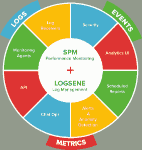

# Sematext 将监控和日志管理集成到一个服务中

> 原文：<https://thenewstack.io/sematext-monitoring-logs-together/>

在电影《蓝调兄弟》中，一家路边低级酒吧的老板娘吹嘘说，她的店有两种音乐:乡村音乐、T4 音乐和西部音乐。在拥挤的基础设施监控和日志记录市场，总部位于纽约布鲁克林的 Sematext 公司有能力同时进行监控和日志管理，以及搜索分析。

“我们监控 Java 应用的指标、基础设施、应用性能……。我们可以捕获哪些组件正在与哪些其他组件进行通信。我们还提供日志管理，以便您可以将日志发送给我们，我们将对它们进行索引，使它们可以为您扩展，然后您可以将这些日志与各种其他指标和事件相关联，”Sematext 创始人[Otis gospodneti](https://twitter.com/otisg)在接受新堆栈采访时说道。“没有其他人真的这么做。”

Gospodneti 声称， [Splunk](https://www.splunk.com/) 进行日志搜索， [New Relic](https://newrelic.com/) 进行度量，尽管 [Datadog](https://www.datadoghq.com/) 最近增加了[应用性能管理](http://www.computerworld.com/article/3121335/application-performance-management/datadog-takes-it-to-new-relic-and-the-other-apm-vendors.html)，但没有一个真正做到了这两点。他指出，结果是，大多数公司使用多种工具来监控和管理他们的基础设施。

Gospodneti 指出，这些都是开源工具，如果公司愿意，可以自己拼凑起来，或者通过 Sematext 来跳过所有这些工作。Sematext 提供了一个单一的用户界面，因此您可以同时看到指标和日志。

Sematext 代理从 [myriad technologies](https://sematext.com/spm/) 收集大量不同格式的信息，使其成为从收集到分析的一站式商店。Sematext 集成了 50 多种其他技术，包括 Elasticsearch、Spark、Storm、Kafka、Cassandra、HBase、Hadoop、CoreOS、Nginx、Redis、MySQL、AWS Elastic Cloud Compute 等等。

Sematext 提供了一个 [Docker 代理](https://sematext.com/docker/)来收集可以用于 [Kubernetes 监控](https://sematext.com/kubernetes/)的信息。“我们集装箱码头代理本身。您可以像部署任何其他容器一样非常容易地部署它。我们有一个 Docker Swarm 的场景，你使用一个命令就可以部署到所有的 Docker Swarm 模式，”Gospodneti 说。

它还充当了 [Swarm3K](https://sematext.com/blog/) 的监控工具，这是一个合作项目，最初试图创建 3000 个节点，但最终形成了一个工作的、地理上分布的 4700 节点 Docker Swarm 集群。

它使用一个代理来监控 Docker 和 Kubernetes。一个代理在一个主机上运行，它将监视该主机上的所有容器。它将监视任何新出现的容器。

“代理知道它收集的数据，所以如果它在收集 Kubernetes 的数据，它会说，‘哦，我知道这些日志是如何构造的。’它从输入的数据中提取并解析出来，以结构化的格式发送给我们，让我们可以构建对用户立即有用的报告。如果我们不这样做，我们就只能发送原始数据。用户会说，‘哦，我有这些日志。日志里的这个东西是什么意思？我该如何构建它，以便我可以构建报告？”他说。

Sematext DevOps 布道者 [Stefan Theis](https://twitter.com/seti321) 在一月份的博客文章中写道[当 swarm 集群中的节点数量发生变化时，监控困难需要手动更新。然而，他在 9 月写道，Docker v1.12 允许 Docker 群体监控的设置完全自动化。](https://sematext.com/blog/2016/01/12/docker-swarm-collecting-metrics-events-logs/)

它的代理收集特定于 Kubernetes 的数据，比如名称空间、pod 名称、图像名称和 UID。

如果 Kubernetes 的核心组件，比如 kubelet、代理和 API 服务器是通过 Docker 部署的，那么 Sematext Docker 代理也会收集 Kubernetes 的核心组件日志。

## 在后台

Sematext 的 [Logsene](https://sematext.com/logsene/) 日志管理技术始于 Elasticsearch-as-a-service，该公司的工具使用幕后的[ELK stack](https://thenewstack.io/comparison-cloud-based-elasticsearch-elk-solutions/)(elastic search、Logstash 和 Kibana)。

“对于使用 Elasticsearch 的用户来说，他们很高兴听到我们公开了 Elasticsearch API。这意味着他们可以使用一系列不同的工具来获取数据，比如 Logstash。因此，所有使用它们的人都必须进行配置，并将它们指向我们，而不是某个本地服务器，这样就可以工作了。他们将数据输入我们的系统，”Gospodneti 解释道。

“这样做的好处是，他们不必管理弹性搜索部分，而这通常是一个棘手的问题。对于伐木业来说，这是需要最多专业知识、最多基础设施和最多资金的行业。所以只要你能指着我们，就不用做什么特别的事。Kibana 还集成到了用户界面中，可以让你看到自己的日志并进行搜索。”

然而，他承认，Elasticsearch 并不是时间数据存储的最佳选择；它使用 HBase 代替度量。

根据[Persistence Market Research](http://www.persistencemarketresearch.com/market-research/it-infrastructure-monitoring-market.asp)的预测，云基础设施监控有望成为全球 IT 基础设施监控市场增长最快的领域，该公司将该领域分为网络、服务器、存储、云和应用程序监控。预计到 2024 年，其监测市场价值将达到 341 亿美元，这有助于解释为什么会有这么多公司加入竞争。

自筹资金的 Sematext 于 2007 年由 Gospodneti 创立，他是 Apache 软件基金会的长期成员，也是 [Lucene](http://lucene.apache.org/core/) (搜索引擎) [Solr](http://lucene.apache.org/solr/) (搜索) [Nutch](https://nutch.apache.org/) (网络爬虫) [Mahout](https://mahout.apache.org/) (机器学习和数据挖掘)开发团队的成员。

Sematext 的客户包括 EMC、彭博、BBC、Tumblr、Shutterstock 和 Salesforce。

*TNS 分析师 Lawrence Hecht 为本文做出了贡献。*

CoreOS、Docker 和 New Relic 是新堆栈的赞助商。

特征图片:[Windmint Twist](https://www.flickr.com/photos/leroy-freakwinter/268233134/in/photolist-pGLnd-6agtWr-hTmhd-9jLbtP-756W6J-q9B6Fk-9AytYy-2k3DcH-9JzSza-8CGAmV-8vtvCJ-67q98N-p5yXSz-3R5daC-473agH-59379K-8DZbDX-9AvyXD-e8Q7XB-6qgHMR-mSNznp-667QDg-bAA1px-bAzYo8-mSQt11-4QG3dJ-P8SU-9vm1YV-amev29-c9rpz1-riw5jR-84t7JF-9Avzmp-6oVq66-9rK4YF-7JeKeS-r3nHnN-qwtXK1-jV4VrK-7DdDuy-cX4c6y-7qpLbV-S4Hx-63CVW-HJmzi-9hwrfv-9NAUQu-jzocR3-5V5g39-3eySXC)BY[Rick](https://www.flickr.com/photos/leroy-freakwinter/)，授权 **[CC BY-SA 2.0](https://creativecommons.org/licenses/by/2.0/)** 。

<svg xmlns:xlink="http://www.w3.org/1999/xlink" viewBox="0 0 68 31" version="1.1"><title>Group</title> <desc>Created with Sketch.</desc></svg>