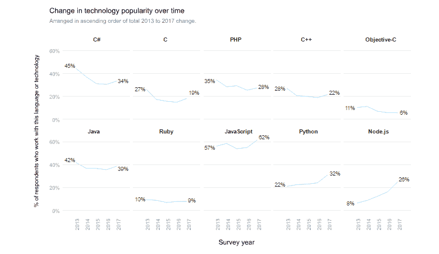

# 停止施压:斯坦福现在提供 JavaScript 课程

> 原文：<https://thenewstack.io/sensing-tectonic-shift-programming-stanford-university-now-offers-javascript-course/>

从今年开始，以培养软件程序员闻名的斯坦福大学决定允许一些计算机科学本科生学习 JavaScript。

令人吃惊的是，尽管 [JavaScript](/tag/javascript/) 已经成为事实上的网络编程语言，但大多数学院和大学还没有将 JavaScript 纳入他们的计算机科学课程。结果是，尽管支付了巨额学费，计算机科学学生不得不自己学习 JavaScript。

斯坦福现在才加入 JavaScript 革命的事实有点不相关，真的，与第二个惊人的事实有关:根据[Stack Overflow 2016 年对全球 56，033 名网络开发人员的调查](http://stackoverflow.com/insights/survey/2016)，不到 35%的专业开发人员拥有计算机科学学位。

斯坦福大学计算机科学系[决定从 2017 年 2 月开始，在该专业基础“编程方法论”课程的试点版本中提供 JavaScript](http://www.stanforddaily.com/2017/02/28/cs-department-updates-introductory-courses/) 。Good ol' CS106 是计算机科学专业的第一门课，自 2002 年以来一直用 Java 授课。今年，为了响应“行业变化和学生反馈”，计算机科学系决定让学生选择参加 Java 或 JavaScript 的 CS106 考试。

斯坦福大学的计算机系请来了退休的退休计算机科学教授埃里克·罗伯茨来领导这项技术教育的突破。这篇文章报道说“Roberts 在过去的五年中一直致力于向 JavaScript 的过渡”并且“已经编写了一本新的教科书，创建了适当范围的作业并且培训了新的教学助理。”CS106 中新的支持 JavaScript 的部分将限制在 100 名学生。其他人可能仍然会用 Java 工作，即使如 Roberts 所说，“Java 正在显示它的年龄。”

有趣的补充说明:当罗伯茨 1990 年来到斯坦福大学时，同样的计算机科学导论课是用 Pascal 语言讲授的。实际上，我们听说这可能是复古技术的回归，而且不仅仅是在你附近的[阿波罗电脑](https://en.wikipedia.org/wiki/Apollo_Computer)上。 [Free Pascal](https://www.freepascal.org/) 是一款开源的 Pascal 编译器，因能与不同的操作系统兼容而备受关注。从 Linux 到 MacOS 到 MS 的一切——包括 DOS 32 和 64 bit——iOS 和 Android，甚至……(等着瞧吧)任天堂 GBA。

开发人员喜欢免费的 Pascal，因为它在应用程序编程(因为它是一种编译语言)、游戏编程(通过 OpenGL)甚至 web 编程方面都有很好的性能，因为免费的 Pascal 可以编译成 Java 字节码。斯坦福大学的教授们在 2032 年更新他们的课程时，可能要记住这一点。

过去五年编程语言的相对流行程度(来源:[栈溢出](https://stackoverflow.com/insights/survey/2017#technology-languages-over-time))。

斯坦福大学终于在 2017 年开始教授 JavaScript，令人抓狂的是:这是世界上最优秀的计算机科学项目之一。(我们提到过斯坦福大学[的学费目前是每季度 15777 美元吗？)大学本应在技术和研究方面处于领先地位，但相反——至少在培养程序员方面——它们似乎很难跟上。例证:这个 JavaScript 试点项目是自 2002 年以来斯坦福大学计算机科学导论课程的第一次重大变革。](https://registrar.stanford.edu/students/tuition-and-fees)

从前面提到的堆栈溢出调查中最终得出的结论可能是，69%的工作软件开发人员是自学的。所以，祝你，斯坦福，采纳 JavaScript，也祝今年春天的 CS106 毕业生好运。

我们其余的人将会在这里享受多年的时光，以及我们因没有获得计算机科学学位而省下的数万美元。

通过 Pixabay 的特征图像。

<svg xmlns:xlink="http://www.w3.org/1999/xlink" viewBox="0 0 68 31" version="1.1"><title>Group</title> <desc>Created with Sketch.</desc></svg>