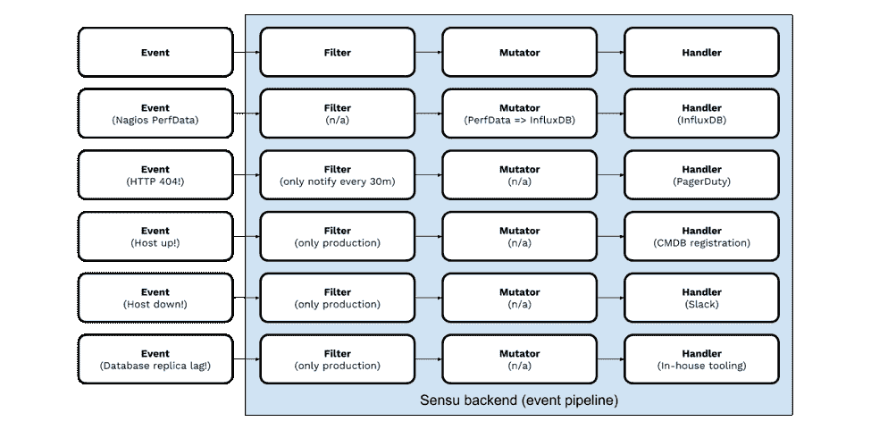
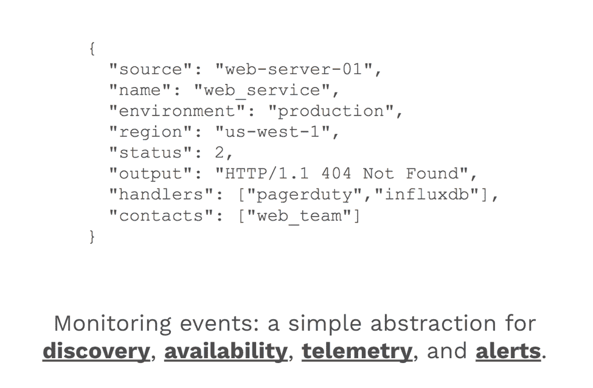
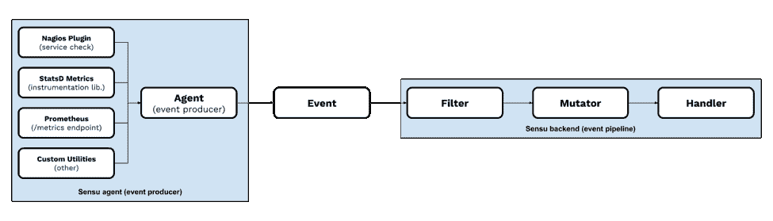
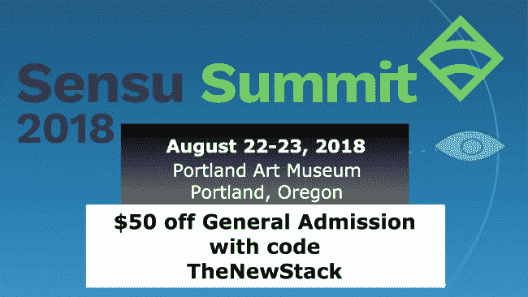

# Sensu:用于监控的工作流自动化

> 原文：<https://thenewstack.io/sensu-workflow-automation-for-monitoring/>

 [凯勒·海利

凯勒·海利是 Sensu 的联合创始人兼首席执行官，他帮助企业解决最棘手的监控挑战。在创建 Sensu 之前，Caleb 是重水运营公司的总裁以及 Novitas Data 的产品开发总监，在那里他重建了他们的软件开发部门，将开发周期从几年缩短到几周，并与几家财富 500 强公司达成了交易。作为俄勒冈州人，Caleb 喜欢为开源项目、品酒以及为波特兰木材队的胜利欢呼。](https://sensu.io) 

几乎整整七年前，马克·安德森解释了为什么软件正在吞噬世界。我们现在生活在他如此准确预测的现实中:每家公司都正在成为(或已经成为)一家软件公司。软件不仅无处不在，而且功能强大，使我们能够解决各种各样的问题。正如 Sensu 联合创始人肖恩·波特(Sean Porter)非常恰当地指出的那样，这个问题也促使我们制造新的问题。在这个依赖软件的世界里，可用性至关重要，停机不仅代价高昂，而且会损害商业信誉。因此，监控系统和应用程序已成为一项核心能力，对业务运营至关重要。“通过监控提高运营可见性”经常被首席信息官和高级运营领导视为重中之重。

监控数据的收集基本上是一个已解决的问题:有太多的实用程序(Nagios 插件、CollectD 插件、Telegraf 插件、StatsD 库、Prometheus exporters，仅举几个例子)能够生成或收集关于您的系统和应用程序如何运行的数据。有趣的地方(也是挑战所在)是将这些数据与您所依赖的系统和工具联系起来。此外，现代基础设施的发展速度越来越快，而速度的加快又进一步加剧了我们利用大量工具连接不同数据的问题。操作员的一生就是成为一名熟练的系统集成商。对此，我最喜欢的比喻是“试图将一个方钉放入一个圆孔”，即，将来自 Kubernetes 等现代系统的数据放入遗留工具(如 Nagios)，或将来自遗留系统的数据(如 SNMP 陷阱或以过时格式收集的指标)放入 InfluxDB 等现代工具。

[https://www.youtube.com/embed/ry55--J4_VQ?feature=oembed](https://www.youtube.com/embed/ry55--J4_VQ?feature=oembed)

视频

“好了大家，听好了。楼上的人给了我们这个，我们必须通过。我们必须找到一种方法，让这个(方形物体)适合这个(圆形物体)的洞，只使用{随机和不相关的部分}。”

我喜欢阿波罗 13 号的这个场景，因为它很好地描绘了我们作为操作员的日常生活。它拥有一切:来自“楼上的人”的自上而下的授权；只有操作员才会真正意识到时间的敏感性(尽管在这个场景中，他们正在处理一个潜在的生与死的情况。技术操作和实际的生死情况不是一回事——我想澄清这一点，并对第一反应人员和现实生活中的 NASA 工程师所做的工作给予赞扬和感谢。);需要解决一个你无法影响的决策所带来的问题(方钉)，需要使用一些现有的工具来解决问题(圆孔)；和有限的资源，有时感觉就像一堆不兼容的零件散落在桌子上。作为运营人员，我们可能对生产中失败的服务的设计或公司对 ServiceNow 的投资没有发言权，但我们确实有责任解决问题，并在组织的其他部门用来跟踪工作的工具中报告我们的进展。

所有这些的解决方案非常简单:从一个工具或系统到另一个工具或系统获取数据最终只是一个工作流。当你开始将这些“圆孔中的方钉”挑战视为可以自动化的工作流*时，结果确实很有影响力。在 Sensu，我们正在彻底改变我们帮助客户思考这些挑战的方式，让他们能够将工作流自动化原则应用到监控中。[七年多来，我们一直致力于实现这一目标](https://blog.sensu.io/five-years-of-sensu-94789997a56b)——通过建立世界上第一条监控事件管道。*

 *它是这样工作的:

我们使用监控事件(例如，可用性和性能数据)，并提供一组简单的构建模块(或核心“原语”)，包括事件过滤器、事件负载变异器、事件处理程序等。这些简单的构建模块使用户能够使用 Sensu 对工作流进行建模和自动化。

通过这种方法，您可以整合数据并集成不同的或不兼容的监控工具，将监控输出(例如来自现代和传统系统的输出)与现有的操作工具(例如 ITSM 系统)连接起来。以下是几个非常简单的例子:

采用基于事件的监控方法是管道方法的关键；它们为**发现**(例如，新设备、计算实例或容器)**可用性**(设备和服务健康信息；例如，“我的服务还在响应请求吗？”)、**遥测**(指标和其他性能数据；例如，“我的服务是否在定义的 SLO 或 SLA 内响应？”)，以及普通的老式**警报**。Sensu 事件只是 JSON 数据，这使得它们对开发者和操作者都是友好的；从世界上任何编程语言将事件推入 Sensu 管道都非常简单(您甚至可以通过一行 bash 将监控添加到您的“作为 cron 作业的夜间备份”中！)

(这是一个伪事件，但所有 Sensu 事件都只是 JSON 数据，非常容易生成)

这个难题的最后一部分是 Sensu 代理，它使得 Sensu 能够广泛适用于多代数据中心和混合云基础架构。Sensu 的代理可以从各种流行的和基于标准的实用程序(包括 Nagios 插件、StatsD 库、Prometheus exporters、SNMP 陷阱、CollectD metrics 等)中使用监控数据事件，并将它们包装在 Sensu 事件上下文中，以便在管道中进行处理。

关于我们正在构建的东西，最令人满意的事情是看到我们的客户如何在现实世界中使用它——在不断增长的全球感官社区中有很多这样的客户！我们的客户正在做一些事情，比如更换他们的 Nagios 系统(如果你在波特兰，本周来参加 [Sensu Summit](https://sensu.io/summit) 听听 Box.com 的迁移故事)；监控短暂的基础设施([见这篇文章](https://wecode.wepay.com/posts/sensu-at-wepay)，我们最近从 WePay 的团队那里发现的)；自动化修复，Demonware 的 Kale Stedman 在 Monitorama 2018 上描述了这一点；以及自动化合规性监控(参见[Paul Czarkowski 在去年 Sensu 峰会上关于 IBM 蓝箱监控的演讲](https://youtu.be/5i07i9iAIvw?t=13m58s))。我们甚至看到了非常先进的工作流，如“企业监控治理”，这是一个复杂的“监控器的监控器”，集成了大型企业“数据湖”存储库和商业智能工作流(我个人对这个特定的工作流非常兴奋，所以如果您有兴趣了解更多信息，[请给我们写信！](https://sensu.io/contact))

如您所见，当一切都是“工作流”时，混合云监控变得更加容易推理这不仅更容易，而且您可以监控什么(以及如何监控)的可能性几乎是无限的。我们很高兴能够继续从我们的客户和社区那里了解他们如何实现监控工作流的自动化。

我将是 2018 Sensu 峰会第一天(8 月 22 日)的闭幕发言人，届时我将更详细地介绍这种“工作流自动化”方法如何为用户提供支持。如果你在城里，请过来——我很想听到你的反馈！

通过 Pixabay 的特征图像。

<svg xmlns:xlink="http://www.w3.org/1999/xlink" viewBox="0 0 68 31" version="1.1"><title>Group</title> <desc>Created with Sketch.</desc></svg>*