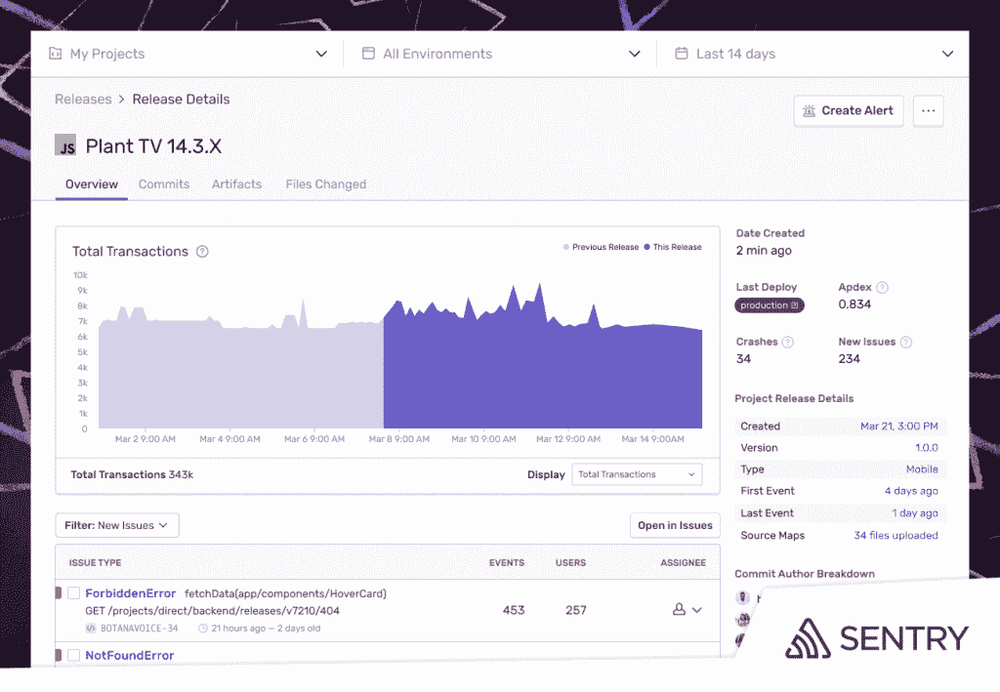
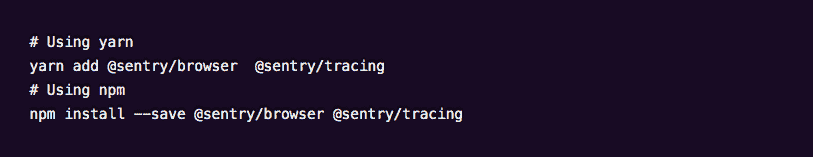

# Sentry 通过早期应用发布监控击败支持票

> 原文：<https://thenewstack.io/sentry-beats-the-support-ticket-with-early-application-release-monitoring/>

应用程序监控平台提供商 Sentry 已经更新了其 JavaScript SDK，以包括发布健康监控包，从而密切跟踪和监控 web 应用程序发布的早期阶段。此更新在单一界面中为开发人员提供了对应用程序问题及其代码发布的健康部分的更好的可见性。

“现在开发团队不需要对支持票或 Twitter 等无关紧要的信号做出反应。他们可以查看 Sentry，快速发现任何新错误以及有多少用户受到影响，并解决关键问题。一些解决方案甚至不需要修改代码，”[哨兵](https://sentry.io/welcome/?utm_content=inline-mention)首席执行官[米林·德赛](https://www.linkedin.com/in/milin-desai-464757)在描述 [JavaScript 扩展](https://sentry.io/for/javascript/)时说。“因为 Sentry 的发布健康报告是关于版本采用情况的，修复可以简单到要求用户刷新他们的浏览器。如果没有这些信息，开发团队将会把一切都回滚，这通常不是一件容易的事。”

德赛表示，考虑到 JavaScript 是“目前最流行的网络前端语言”，此次更新旨在帮助开发者为最终用户提供“无缝产品体验”，但“更难交付”

“当浏览一个网站时，客户并不关心他们点击的按钮是因为错误还是因为低效的代码滞后，”德赛告诉新堆栈。然而，为了解决这些问题，开发人员需要关于他们的代码健康的信息的深度和一致性，这是非常难以获得的。当他们持续或频繁地发布代码时，问题会成倍放大。”

与此同时，Desai 描述了传统上组织如何倾向于大量投资于广泛的发布管理过程，由专门的团队来监控几个不同的输入和指标，以“确保发布进展顺利”

“他们寻找与版本、系统、业务指标(包括活跃用户、登录、收入等)同时出现的支持票高峰。德赛说:“这非常耗时，而且非常被动。此外，对于任何发布可能不好的信号，一般的反应是回滚发布，因为‘出了什么问题？’“为谁?”？，’都还是未知数。如果有人觉得某个版本不好，他们别无选择，只能接受最小公分母，因为他们没有数据来支持任何其他决策。"

与此同时，Desai 描述了工程团队如何在许多不同的平台上提供数字服务和应用，包括 web、移动和本地应用。“在所有这些不同的平台上保持无缝、可靠的用户体验既困难又关键，”德赛说。

在这种充满挑战的背景下，Sentry 的发布健康扩展到 JavaScript 项目，允许开发人员通过观察:用户采用、应用程序使用、崩溃百分比和会话数据来监控发布的健康。当然，主要目标是为开发人员提供对发布性能的更多可见性，以便更快地检测和修复可能会对用户体验产生负面影响的代码错误。

Desai 还指出，解决代码问题通常需要将前端问题与后端代码、第三方 API 或微服务联系起来，“这意味着不能完全跟踪问题或提供完整上下文的工具并不能真正解决崩溃或性能问题。”

“有了 Sentry 的 JavaScript 应用监控功能套件，开发人员不必花费无数时间来执行代码回滚和梳理日志，以找出应用程序性能不佳的原因，”德赛说。“他们可以轻松确定问题是软件缺陷还是低效代码，谁受到了影响，甚至可以确定问题开始时的确切版本。”

最终，Sentry 的监控功能的想法，一般来说，是让开发人员直接看到和访问他们发布的代码，以绕过否则可能会阻碍检测和修复过程的官僚主义因素。德赛说，当然，这种能力现在适用于使用 Release Health 的 JavaScript 开发人员，允许他们使用 application Health insights Sentry 的工具来检测新的错误和受影响的用户数量，以便更快地提供修复。

“随着发布健康功能添加到我们的错误和性能功能中，JavaScript 开发人员现在可以从应用上线的那一刻起就跟踪其应用的健康状况。他们不需要对支持票等无关紧要的信号做出反应，”德赛说。由于 Sentry 的发布健康报告了版本采用情况，该修复甚至可能不需要更改代码，可能只是要求用户刷新他们的浏览器。Release Health 使开发人员能够创建更高效的工作流，为开发人员腾出时间来为业务构建新的、有价值的服务。"

<svg xmlns:xlink="http://www.w3.org/1999/xlink" viewBox="0 0 68 31" version="1.1"><title>Group</title> <desc>Created with Sketch.</desc></svg>