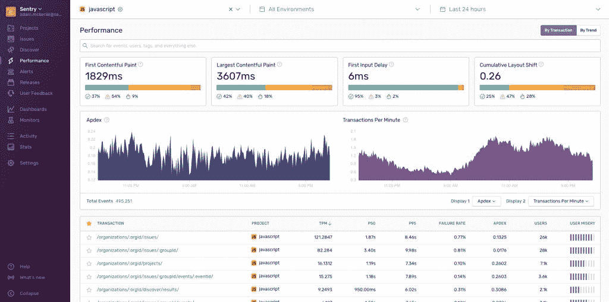
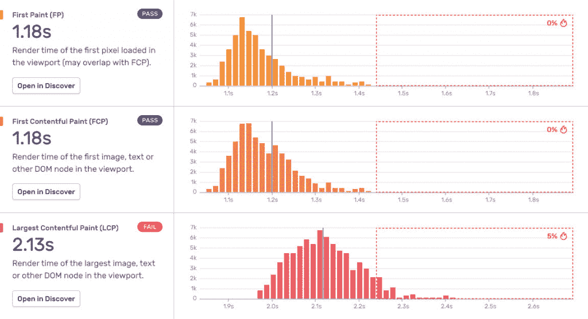

# 哨兵深入挖掘谷歌的网络性能指标

> 原文：<https://thenewstack.io/sentry-digs-deeper-into-googles-web-performance-metrics/>

应用监控平台提供商 [Sentry](https://sentry.io/) 正在基于谷歌最近发布的 [Web Vitals](https://docs.sentry.io/product/performance/web-vitals/) 进一步增强其自身的性能监控堆栈。

Sentry 的应用程序监控旨在查看“一个问题是有意义的错误还是性能问题，并向开发人员揭示他们的代码在用户体验它时的表现，”Sentry 首席执行官[米林·德赛](https://www.linkedin.com/in/milin-desai-464757)告诉新堆栈。“谷歌的 Web Vitals 为行业建立了一个清晰的衡量标准，来衡量什么是‘同类最佳’的性能。我们是首批支持这一性能监控标准的公司之一，并将其集成到我们已经面向解决方案的错误监控中。”

Web Vitals 为评估 Web 和移动应用程序性能提供了一个良好的开端，特别是访问 web 上的应用程序或用户界面(UI)所需的时间。作为一个关键指标，Web Vitals 的可接受页面负载阈值是至少 75%的用户可以在 4 秒或更短时间内下载应用程序的网页或 API。同样，这是帮助深入了解 web 和移动应用程序性能和可访问性的坚实的第一步，但同时，它并没有指出特定用户可能遇到的问题。

Sentry Performance Monitoring 扩展了 Google 的 Web Vitals，延长了 Web 界面或用户界面(UI)对象加载所需的低于标准的 4 秒或更少的时间。该公司表示，它通过监控个人用户的体验以及其他数据点来做到这一点。例如，Sentry Performance 从交易数据的 Web Vitals 中提取的关键指标包括慢速交易如何影响个人用户体验以及慢速交易的频率。

例如，一个大客户可能会报告您的应用程序的事务完成速度和访问速度很差，而 Web Vitals 可能只显示超过 90%的用户的页面加载和事务完成速度非常快。

“从消费产品到金融机构，客户现在都希望获得无缝的产品体验，这是最低要求。但是，虽然对前端体验的期望已经上升，但提供完美体验的开发工具还不完整，”德赛说。“工程团队仍然经常同时使用十几个工具，没有时间使用大量系统图表和后端工具来诊断问题—最终客户不在乎是错误还是低效的代码导致了问题，但开发人员仍然需要一流的产品来解决这两个问题。”

有了 Sentry 的 Web 生命体征性能工具，Sentry 的监控功能就可以扩展到扫描和检测这些问题，显示 Web 生命体征指标背后的详细数据。该公司表示，提供的具体指标包括网络速度、地区和设备。

Sentry 还扩展了其对 PHP、Node、Ruby 和无服务器应用程序的监控能力，反映了该公司如何寻求为特定编程语言特有的代码提供监控能力，这些语言还包括 Python、JavaScript 和其他语言。例如，虽然一些可观察性的支持者可能会认为可观察性平台可能会使监控过时，但 Desai 反驳说，“我们将可观察性视为一个存在了相当长时间的老问题的新术语，但这种趋势仍未解决整个问题，仍然是关于代码健康的问题。”

“Sentry 通过将开发人员和代码引入系统操作栈来帮助完成可观察性的画面，”Desai 说。“在过去几年中，随着数字服务和应用程序数量的不断增加，生成的代码量也在飞速增长，并且会频繁更新。但是当系统、机器和数据库被监控时，代码通常是最少被监控的层。”

德赛说，因此需要代码监控来填补可观测性堆栈的空白。“开发者越来越多地在生产中拥有自己的代码，”德赛说。“将代码的创建者与使用者联系起来将改善应用程序的健康状况，并提供更好的用户体验，确保那些将代码监控纳入其可观察性堆栈的人具有竞争优势。”

Sentry 是新堆栈的赞助商。

<svg xmlns:xlink="http://www.w3.org/1999/xlink" viewBox="0 0 68 31" version="1.1"><title>Group</title> <desc>Created with Sketch.</desc></svg>