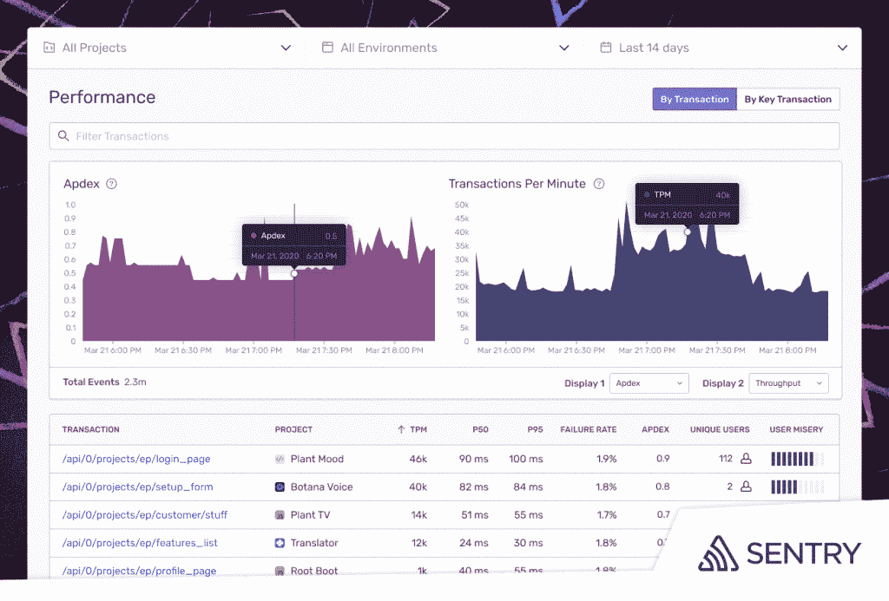
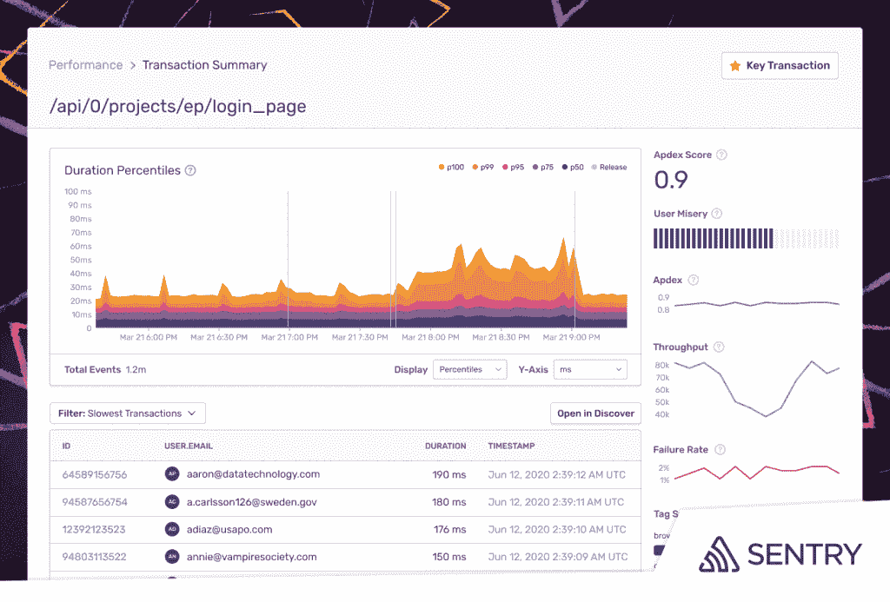

# Sentry 的前端性能监控精确定位缓慢的 API 调用和数据库查询

> 原文：<https://thenewstack.io/sentrys-front-end-performance-monitoring-pinpoints-sluggish-api-calls-and-database-queries/>

作为系统管理员，最糟糕的事情之一就是在周五或周六的半夜收到警报。即使不考虑不断侵入的警报疲劳问题，紧急警报通常也会反映用户正在经历的前端问题。当然，低劣的用户体验也很可能预示着收入的损失，因为用户可以理解地将他们的在线体验带到了别处。

在[“顶级执行机构部署 AIOps 的策略”中，](https://www.dej.cognanta.com/2020/05/04/the-aiops-maturity-research-study-key-findings/)分析公司 Digital Enterprise Journal (DEJ)基于来自 1100 多家机构的 DevOps 专业人员的调查结果进行的一项研究显示，超过 90%的受访者表示，由于应用程序性能速度缓慢，导致收入损失。调查中还报告了因应用程序性能下降导致的每月平均损失 634，000 美元，以及每年用于管理可避免事件的 127 万美元。

主要的要点是，监控平台还必须在前端性能成为真正的问题之前发出性能警报，并告知开发人员必须采取哪些措施来修复代码。

考虑到这些限制，Sentry[扩展了其应用监控平台的功能](https://blog.sentry.io/2020/07/14/see-slow-faster-with-performance-monitoring)，为 Python 和 JavaScript 代码提供前端监控和补救。Sentry 说，实时地，诸如应用程序性能下降的信息被记录下来，并带有潜在的修正，通常只涉及几行代码，直接传达给开发人员。

虽然基础设施监控对于网络、服务器和应用的运营相关性能(如数据库和存储性能)仍然很重要，但开发人员通常很少了解他们的代码对前端性能的直接影响。

Sentry 首席执行官[米林·德赛](https://www.linkedin.com/in/milin-desai-464757)告诉新堆栈:“开发者会告诉你的一件事是，他们不知道他们的代码在生产中表现如何。”。“您一天多次推出代码”,却不知道用户在执行事务时会遇到什么困难，或者应用程序加载速度不够快。

“本质上，我们实时告诉开发者或开发团队，这么多用户在 iOS 版本 13 上遇到了这个问题，而且主要发生在这些国家的用户身上，”德赛说。

一旦开发人员的代码被上传到 Git 并被部署，例如，在测试和 QA 流程完成后，监控工具，如 Sentry 提供的工具，将在代码进入生产时检测错误和冲突。最终，开发人员很可能会收到一张作业单，通常是由运营团队的某个人签发的。然后，开发人员将着手分析和修复糟糕的代码。Sentry 表示，在 Sentry 的新版本中，潜在的错误会在严重的前端问题发生之前被标记出来，而造成前端问题的代码行以及负责用 Python 或 JavaScript 编写的代码的人员或团队会得到沟通。

“我们主要专注于发现软件错误，现在我们将帮助您了解您的端口的性能，”德赛说。有了这个新版本，“开发者现在可以说‘这个最后的 API 调用要花 10 秒钟才能完成，所以我们可能想看看它。’灌输现在被转换成只包含四行或五行代码的可见性。"

Sentry 传达的具体性能监控见解包括:

*   **应用健康洞察**:应用响应时间与实时更新延迟和吞吐量数据的交互，以及对缓慢响应时间、事务增加和错误率的比较，以诊断和修复性能问题。
*   **事务摘要视图**:在合并视图中，事务按最慢持续时间、相关问题和体验缓慢的用户数量排序。
*   **根本原因分析**:通过下钻功能和用户友好的可视化，识别异常值和正常执行交易之间的特征差异。
*   **跟踪利用**:分布式跟踪揭示导致错误或性能问题的数据库查询。
*   **性能警报**:查看崩溃如何影响性能，并设置阈值，以便在性能指标超出预定义的容差范围时发出警报。在跟踪瀑布中深入了解交易细节，直观地突出显示与预期操作和设备数据相关的 API 调用时间，以快速识别哪些 API 调用给客户带来了糟糕的体验。

Sentry 是新堆栈的赞助商。

由[约书亚·厄尔](https://unsplash.com/@huper?utm_source=unsplash&utm_medium=referral&utm_content=creditCopyText)在 [Unsplash](https://unsplash.com/?utm_source=unsplash&utm_medium=referral&utm_content=creditCopyText) 上拍摄的特写图片。

目前，新堆栈不允许直接在该网站上发表评论。我们邀请所有希望讨论一个故事的读者通过[推特](https://twitter.com/thenewstack)或[脸书](https://www.facebook.com/thenewstack/)访问我们。我们也欢迎您通过电子邮件发送新闻提示和反馈: [feedback@thenewstack.io](mailto:feedback@thenewstack.io) 。

<svg xmlns:xlink="http://www.w3.org/1999/xlink" viewBox="0 0 68 31" version="1.1"><title>Group</title> <desc>Created with Sketch.</desc></svg>