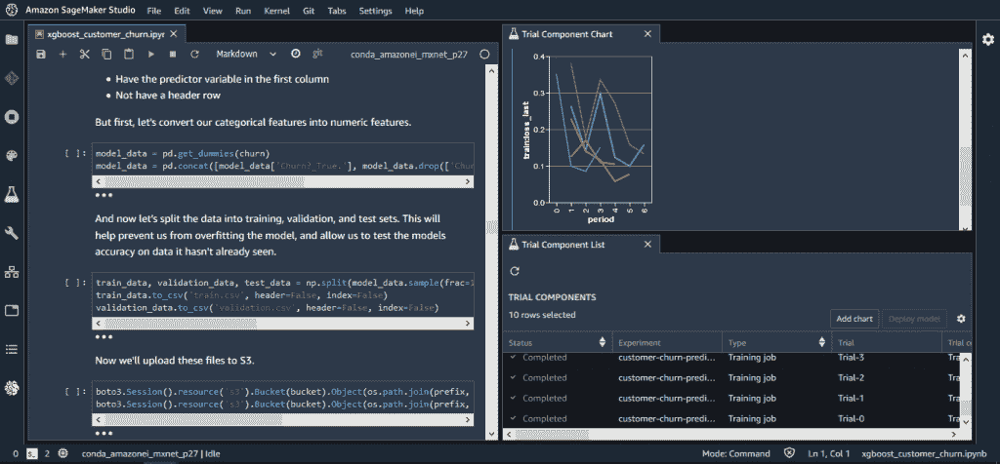

# 系列:近距离观察基于云的机器学习平台

> 原文：<https://thenewstack.io/series-a-close-look-at-cloud-based-machine-learning-platforms/>

本周，新的堆栈启动了一个“深入探讨”系列，研究主要云提供商的机器学习即服务产品，作者是分析师

[Janakiram MSV](https://thenewstack.io/author/janakiram/)

。在这一期中，Janakiram 展示了他的方法并评估了 Amazon Sage Maker。周三回来看看他对 Azure 机器学习服务和谷歌 Vertex AI 的评论，周四再看看他对 IBM 和 Oracle 机器学习平台的看法。

机器学习已经成为公共云提供商提供的关键托管服务之一。ML 即服务(MLaaS)构建在云的基础构建块上，包括计算、存储、网络和数据库。注册 ML 托管服务的客户直接或间接使用附加服务，如对象存储、虚拟机、容器、数据仓库、数据湖和商业智能。意识到这个机会，云提供商已经投资了 ML 平台。

本系列文章将深入探讨顶级公共云提供商的 MLaaS 产品——[亚马逊 Web 服务](https://aws.amazon.com/?utm_content=inline-mention)、[谷歌](https://cloud.google.com/)、 [IBM](https://www.ibm.com/cloud?utm_content=inline-mention) 、[微软](https://azure.microsoft.com/en-us/)和[甲骨文](https://developer.oracle.com/?utm_content=inline-mention)。目标是将托管 ML 服务的组件映射到数据科学家、开发人员和开发人员在构建和部署机器学习模型时使用的典型工作流。本指南不提供对单个玩家服务的评估或比较。

## 机器学习模型的生命周期

在探讨 MLaaS 产品之前，让我先介绍一下数据科学家和开发人员用来构建生产级 ML 模型的广泛框架。在建立了典型的工作流程之后，将 ML 平台的组件分类并映射到每个里程碑就变得很容易了。

无论你是在开发计算机视觉人工智能，对话式人工智能，还是时间序列模型，机器学习都涉及五个阶段:

### 准备

这是建模的第一步，也是最关键的一步。数据科学家识别各种数据源，并定义预处理数据的机制。这包括转换实时接收的流数据，以及处理存储在数据湖和数据仓库中的历史数据。数据标注和要素工程发生在此阶段，这将产生一个准备好的数据集，其中包含定义明确的标注和要素，这对于构建模型至关重要。各种基于云的服务(如对象存储、事件流、数据处理、数据探索)用于准备数据。

### 建设

在这个阶段，开发人员使用他们喜欢的开发工具，如 [Jupyter Notebook](https://thenewstack.io/integrate-jupyter-notebooks-with-github/) 或 PyCharm，用 Python 或 R 编写代码，将算法应用于处理过的数据集。开发人员通常使用原始数据集的较小子集在本地环境或公共云中构建和测试模型。在这个阶段，开发人员、数据科学家和领域专家合作，确保特性工程和选择的算法与业务目标一致。

### 火车

一旦开发者决定并测试了算法或神经网络架构，训练阶段就开始了。在这一阶段，开发人员对影响模型精度和准确性的关键参数进行试验。对于神经网络，超参数调整发生在这个阶段。为了帮助开发者加速训练，ML 平台提供了超参数的自动调整。培训通常在由 GPU 或人工智能加速器驱动的高端虚拟机上进行。公共云提供商利用容器和 Kubernetes 来协调整个 GPU 集群的培训工作。

### 部署

一旦模型完成并冻结，它就作为推理服务部署到生产中。云提供商公开 API，这些 API 抽象了将模型容器化、添加定制推理代码、将容器部署到 VM 或 Kubernetes 集群，并将其安全地公开为 API 端点的过程。开发人员可以调用 SDK 中可用的 API 来将模型从培训转移到部署。

### 经营

模型的生命周期不会随着部署而结束。像任何生产 API 一样，需要监控端点的任何错误。具体到 ML 模型，我们还需要通过模型漂移管理来监控预测的质量。通过不断将预测与预期结果进行比较，我们可以识别模型衰退并自动触发模型训练和部署。模型管理还包括蓝/绿部署等概念，以衡量新旧模型的质量。

在定义了 ML 生命周期管理的关键里程碑和阶段之后，让我们看看公共云提供商是如何实现它们的。

## 亚马逊 SageMaker

于 2017 年推出的[亚马逊 SageMaker](https://aws.amazon.com/sagemaker/) 是当今最全面的基于云的机器学习平台之一。让我们了解 Amazon SageMaker 的关键组件，以及它们如何映射到上一节中讨论的五个阶段。

### 准备

Amazon SageMaker 提供多种服务来帮助数据科学家预处理数据集。但是一个突出的服务是[亚马逊 SageMaker 地面真相](https://aws.amazon.com/sagemaker/groundtruth/)，它具有先进的功能，包括辅助标记功能，包括自动 3D 长方体捕捉和自动分割。它甚至可以基于机器学习模型进行自动标记。

[SageMaker Data Wrangler](https://aws.amazon.com/sagemaker/data-wrangler/) 减少聚合和准备机器学习数据所需的时间。它可以从 S3、雅典娜、红移和 AWS 湖形成等服务中导入数据。

[Amazon SageMaker 特性商店](https://aws.amazon.com/sagemaker/feature-store/)，SageMaker 平台的最新成员，为数据特性提供了一个中央存储库。通过 SageMaker 特性，可以存储、检索、发现和共享特性，以便通过安全的访问和控制在模型和团队之间轻松重用。

### 建设

[Amazon SageMaker Studio](https://aws.amazon.com/sagemaker/studio/) 是一款基于流行的 Jupyter 笔记本电脑的端到端多用户 IDE，用于用 Python 和 r 构建 ML 模型，通过 SageMaker Python SDK，开发人员可以在不离开 IDE 的情况下以编程方式访问 AWS 的各种托管服务。

SageMaker Studio 集成了 150 多种流行的开源模型和 15 种预构建的解决方案，用于客户流失预测和欺诈检测等常见用例。它支持主流的深度学习框架，包括 Apache MXNet、TensorFlow 和 PyTorch。

### 火车

亚马逊 SageMaker 依靠容器和 EC2 实例来训练机器学习模型。开发人员还可以使用来自同一个 Python SDK 的本地计算资源。

SageMaker 实验提供了训练模型的迭代过程。每个实验由输入参数、配置和每次迭代的结果组成。

[SageMaker 调试器](https://aws.amazon.com/sagemaker/debugger/)捕获实时指标，包括影响模型准确性的混淆矩阵和学习梯度。它还可以实时监控和分析 CPU、GPU、网络和内存等系统资源，以提供关于这些资源重新分配的建议。

SageMaker Studio 包括 [JumpStart](https://aws.amazon.com/sagemaker/getting-started/) 和 [Autopilot](https://aws.amazon.com/sagemaker/autopilot/) ，为开发者带来复杂的迁移学习技术。Jumpstart 支持基于视觉和语言的模型，而 Autopilot 适用于以表格格式存储的结构化数据。

### 部署

[SageMaker Pipelines](https://aws.amazon.com/sagemaker/pipelines/) 是该平台的新功能之一，可帮助用户从数据准备到模型部署完全自动化 ML 工作流程。SageMaker Pipelines 附带了一个 Python SDK，它连接到 SageMaker Studio，利用可视化界面以交互方式构建工作流中涉及的步骤。

经过训练的模型可以被部署到维护同一模型的多个版本的注册中心。[推理机 SageMaker Neo](https://aws.amazon.com/sagemaker/neo/) 可用于在云中或边缘设备上部署优化的模型。基于云的模型通过服务于推理请求的 HTTPS 端点公开。

### 经营

[Amazon SageMaker 模型监视器](https://aws.amazon.com/sagemaker/model-monitor/)旨在检测和修复 ML 模型中的概念漂移。它会自动检测部署模型中的概念漂移，并提供详细的警报来帮助识别问题的根源。这些指标可以与 CloudWatch 集成，进行可视化和分析。

在本系列的下一部分，我们将探索 Azure 机器学习服务和谷歌的 Vertex AI 平台。

<svg xmlns:xlink="http://www.w3.org/1999/xlink" viewBox="0 0 68 31" version="1.1"><title>Group</title> <desc>Created with Sketch.</desc></svg>