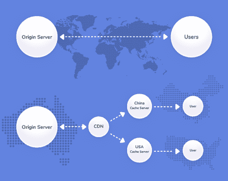
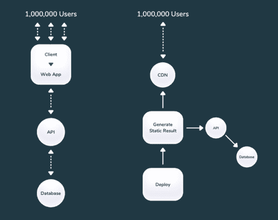
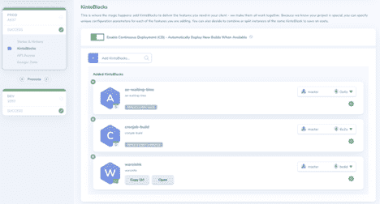

# 免费向数百万用户提供动态内容

> 原文：<https://thenewstack.io/serve-dynamic-content-to-millions-of-users-at-no-cost/>

 [约瑟夫·库珀

约瑟夫·库珀从九岁开始编写代码，创办或合伙了三家盈利的游戏初创公司，并发表了一篇关于优化虚拟世界中的标志和地图的论文。最近，Joseph 带领 Junglee Games 的基础设施、移动和产品工程团队在 4 年内将 MRR 的业务从 5 万美元发展到 MRR 的 500 万美元和 300 多名员工。在游戏之余，Joseph 正在构建 KintoHub，这是一个一体化平台，可以直观地管理任何云上的数据库、后端服务、cron 作业、网站等。](https://www.linkedin.com/in/codingcoop/?originalSubdomain=hk) 

为当今高度互联的世界创建可扩展的内容可能会带来许多惊喜。从疯狂的亚马逊网络服务账单、疲于应付高需求的基础设施团队，到酣睡的个人开发人员服务数百万用户而无需输入一个信用卡号，无所不包。每个人都希望成为后者，但通常不知道在快速发展的软件社区中存在这样的解决方案。

云计算原生计算基金会(CNCF)让每个人都了解我们在做出下一代基础设施相关决策时不得不面对的太多选择，这已经成为我们应该用来构建软件的大量 JavaScript 框架和方法的一个笑话。

没必要这么复杂。例如，KintoHub 的高级后端工程师 Nandi Wong 最近组合了合适的开发工具来建立一个动态网站，免费服务数百万用户。更不用说，[只用了两天就建成了](https://blog.kintohub.com/launch-a-website-with-1m-users-within-2-day-with-0-cost-86936b3e36e)。

[WARS’](https://wars.vote4.hk)最初的目标是聚集并告知公众从医院排队、利用促销医疗用品的商店到受冠状病毒影响的社区警报的一切信息。数据以 PDF、HTML 网站和一些公共 API 的格式在 web 上的众多来源中公开可用，并且需要一些处理来提取准确的信息，以便可以以简单的格式重新分发。该团队希望每隔几分钟更新一次这些信息，特别是因为很多数据都是时间敏感的。

为了在不产生任何成本的情况下向数百万用户提供内容，您必须消除尽可能多的基础设施依赖。大多数软件工程师可能认为向消费者提供动态内容需要数据库和后端 API。不再是了！WARS 使用静态网站生成器和下一代云环境进行免费扩展，而不是以高昂的开发和扩展成本构建一个组合了横向扩展服务、数据抓取 cronjobs、Kubernetes、Redis 缓存、cdn 和数据库的堆栈。

## 静态网站 2.0 简介

第一个选择的工具是 [Gatsby](https://www.gatsbyjs.org/) ，一个被广泛采用的静态网站生成器。静态网站背后的想法是能够快速生成营销、公司、文档或产品信息的内容，而不必运行网络服务器。等等？！服务一个没有服务器的网站…你说的是无服务器吗？**不！**

cdn 将本地内容提供给用户，以便更快地提供内容

Cloudflare 可以在互联网上的数百台服务器上托管您的静态网站文件。这个概念已经存在了一段时间，被称为内容交付网络(CDN ),所有云提供商都提供自己的风格。Cloudflare 提供了一个几乎无限自由的层，只要有很少的限制，就可以愉快地为您的文件提供服务。你仍然需要一个原始服务器来提供初始内容，这些内容通常是在 Github 页面或其他网站提供商上免费托管的。

[盖茨比](https://www.gatsbyjs.org)可以被配置成在构建时以编程方式生成静态网站。使用 [GraphQL](https://graphql.org/) ，它可以查询各种来源，如后端 API 或原始 JSON 文件，以编译将在构建时呈现 HTML 文件时使用的数据集。一旦文件用正确的数据呈现，它们就作为 HTML/Javascript/CSS 保存在可以在线提供的单个文件夹中。WARS 面临的挑战是如何推出一个包含非静态数据的经济高效的网站…

## 提供动态内容的困境

由于 WARS 要求数据每隔几分钟更新一次，这通常会将静态网站作为一个选项。传统上，当用户加载页面时，会对后端服务器发出一个或多个 API 调用，以获取数据并将其插入到页面中，然后为每个唯一用户呈现结果！通常，数据驻留在数据库中，比如 MongoDb、Mysql、Postgres 等。数据源将由另一个服务填充，该服务合法地从各种来源获取最新信息。综上所述，开发、测试和构建您选择的云需要一些时间。

每隔几分钟触发一次新部署，以生成全局静态结果！

使用自动化结合静态网站生成器的概念，您可以每隔几分钟用您想要提供的数据重新生成网站。这意味着会不断触发构建并将其部署到 Cloudflare。这种方法只有在所有用户查看生成内容的单一来源时才有效。如果用户在查看特定的上下文内容，比如他们的账户余额，这种方法就不起作用。

## 组合并简化所有云操作

KintoHub 被选为网站、cronjobs、数据库和后端服务的一体化平台，帮助实现自动化和托管。它从 Github 获取代码，托管一个免费的静态网站，提供 Cloudflare CDN 支持的加密 SSL，并轻松构建和重复触发 Cron 作业操作，强制重新生成和部署 war。在引擎盖下，实际上是由一个简单的 UI/UX 仪表板编排的 Kubernetes 和 Dockerfiles，但发布战争概念的时间加快了很多，因为不必在亚马逊、谷歌、Azure 或 Kubernetes 本身上配置所有移动部分。

两个 Cronjobs 和一个 Gatsby 网站通过 KintoHub `DEV`和“PROD”环境变得简单

## 最后

今天的世界充满了太多的选择，如果你没有每小时学习，测试新技术，也没有随着最新的趋势发展；您的下一个项目可能会导致更高的成本或更慢的上市时间。开源彻底改变了我们协作和共享特性和功能的方式。随着软件行业的发展，企业和个人需要弄清楚如何轻松地整合广泛可用选项的力量，使其更加清晰和即时有用。

希望下面的链接能对这一旅程的永无止境的探索有所帮助。

1.  [盖茨比入门](https://www.gatsbyjs.org/docs/)
2.  开始使用 Kintohub
3.  Github 上的战争[回购](https://github.com/nandiheath/warsinhk)
4.  战争[网站](https://wars.vote4.hk/en)

云计算原生计算基金会是新堆栈的赞助商。

通过 Pixabay 的特征图像。

<svg xmlns:xlink="http://www.w3.org/1999/xlink" viewBox="0 0 68 31" version="1.1"><title>Group</title> <desc>Created with Sketch.</desc></svg>