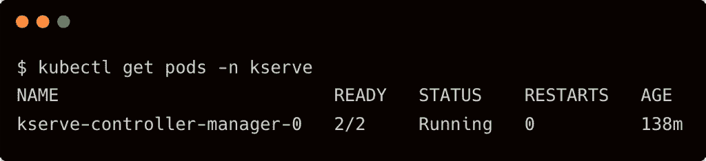

# 在 Google Kubernetes 引擎上使用 KServe 服务 TensorFlow 模型

> 原文：<https://thenewstack.io/serve-tensorflow-models-with-kserve-on-google-kubernetes-engine/>

我在上一篇文章的[中介绍了](https://thenewstack.io/kserve-a-robust-and-extensible-cloud-native-model-server/) [KServe](https://github.com/kserve/kserve) 作为一个可伸缩的、云原生的、[开源模型服务器](https://thenewstack.io/model-server-the-critical-building-block-of-mlops/)。本教程将带你完成在由[英伟达 T4 GPU](https://www.nvidia.com/en-us/data-center/tesla-t4/)支持的[谷歌 Kubernetes 引擎](https://cloud.google.com/compute)集群上安装和配置 [KServe](https://github.com/kserve/kserve) 所需的所有步骤。然后，我们将部署一个张量流模型来执行推理。

## 步骤 1–使用 T4 GPU 节点启动 GKE 集群

假设您可以访问谷歌云平台，运行以下命令启动一个配置为使用一个英伟达 T4 GPU 的 3 节点集群。适当地替换项目、区域和其他值，以反映您的环境。

```
gcloud beta container clusters create  "tns-kserve"  \
--project  "janakiramm-sandbox"  \
--zone  "asia-southeast1-c"  \
--no-enable-basic-auth  \
--cluster-version  "1.22.4-gke.1501"  \
--machine-type  "n1-standard-4"  \
--accelerator  "type=nvidia-tesla-t4,count=1"  \
--num-nodes  "3"  \
--image-type  "UBUNTU_CONTAINERD"  \
--disk-type  "pd-standard"  \
--disk-size  "100"  \
--scopes  "https://www.googleapis.com/auth/devstorage.read_only","https://www.googleapis.com/auth/logging.write","https://www.googleapis.com/auth/monitoring","https://www.googleapis.com/auth/servicecontrol","https://www.googleapis.com/auth/service.management.readonly","https://www.googleapis.com/auth/trace.append"

```


为 GCP 用户添加群集管理角色。

```
kubectl create clusterrolebinding cluster-admin-binding  \
    --clusterrole=cluster-admin  \
    --user=$(gcloud config get-value core/account)

```

安装英伟达 T4 GPU 的设备插件并验证其可访问性。

```
kubectl apply  -f  https://raw.githubusercontent.com/GoogleCloudPlatform/container-engine-accelerators/master/nvidia-driver-installer/ubuntu/daemonset-preloaded.yaml

```

```
kubectl get pods  -n  kube-system  -l  k8s-app=nvidia-gpu-device-plugin

```

创建一个 pod 来测试基于 Nvidia CUDA 映像的访问。

```
apiVersion:  v1
kind:  Pod
metadata:
  name:  my-gpu-pod
spec:
  containers:
  -  name:  my-gpu-container
    image:  nvidia/cuda:11.0.3-runtime-ubuntu20.04
    command:  ["/bin/bash",  "-c",  "--"]
    args:  ["while true; do sleep 600; done;"]
    resources:
      limits:
 nvidia.com/gpu:  1

```

```
kubectl apply  -f  gpu-pod.yaml

```

运行命令`nvidia-smi`测试 GPU 访问

```
kubectl exec  -it my-gpu-pod  --  nvidia-smi

```


基础设施就绪后，让我们继续安装 KServe。

## 步骤 2–安装 Istio

Istio 是 KServe 的必要先决条件。被动服务依靠 Istio 入口来公开 KServe API 端点。有关版本兼容性，请查看文档。

下载 Istio 二进制文件和您的本地工作站，并运行 CLI 进行安装。

```
​​curl  -L  https://istio.io/downloadIstio | sh -
istioctl install  --set profile=demo  -y

```

验证`istio-system`名称空间中的所有 pod 都处于运行状态。


## 步骤 3–安装 Knative 上菜

安装 Knative CRDs 和核心服务。

```
kubectl apply  -f  https://github.com/knative/serving/releases/download/knative-v1.2.0/serving-crds.yaml
kubectl apply  -f  https://github.com/knative/serving/releases/download/knative-v1.2.0/serving-core.yaml

```

要集成 Knative 和 Istio Ingress，运行以下命令。

```
kubectl apply  -l  knative.dev/crd-install=true  -f  https://github.com/knative/net-istio/releases/download/knative-v1.2.0/istio.yaml
kubectl apply  -f  https://github.com/knative/net-istio/releases/download/knative-v1.2.0/istio.yaml

kubectl apply  -f  https://github.com/knative/net-istio/releases/download/knative-v1.2.0/net-istio.yaml

```

最后，为指向 sslip.io 域的 Knative 配置 DNS。

```
kubectl apply  -f  https://github.com/knative/serving/releases/download/knative-v1.2.0/serving-default-domain.yaml

```

确保 Knative Serving 正在成功运行。


## 步骤 4–安装证书管理器

使用以下命令安装证书管理器:

```
kubectl apply  -f  https://github.com/cert-manager/cert-manager/releases/download/v1.7.1/cert-manager.yaml

```


## 步骤 5–安装 KServe 模型服务器

我们现在准备在 GKE 集群上安装 KServe 模型服务器。

```
kubectl apply  -f  https://github.com/kserve/kserve/releases/download/v0.7.0/kserve.yaml

```

```
kubectl get pods  -n  kserve

```



KServe 还安装了一些自定义资源。用下面的命令检查它们:

```
kubectl get crd  |  grep  "kserve"

```


## 步骤 5–配置 Google 云存储桶并上传 TensorFlow 模型

KServe 可以从 Google Cloud Storage (GCS)桶中提取模型，为它们提供推理服务。让我们创建 bucket 并上传模型。

我们将使用我以前的[教程](https://thenewstack.io/take-amazon-sagemaker-studio-lab-for-a-spin/)中的模型，该教程训练了一个 CNN 模型来为这个场景分类狗和猫。你可以从[这里](https://www.dropbox.com/s/714lgcsfrzrfh8b/model.zip?dl=0)下载预先训练好的 TensorFlow 模型。解压缩文件并运行下面的命令来创建 GCS bucket 并上传模型工件。

```
gsutil mb gs://tns-kserve
gsutil iam ch allUsers:objectViewer gs://tns-kserve
gsutil cp  -R  model/  gs://tns-kserve

```


为了简单起见，我们启用了对桶的公共访问。但是您可能希望保护它，并添加服务帐户密钥作为 KServe 访问私有 bucket 的秘密。

## 步骤 6–创建和部署 TensorFlow 推理服务

让我们继续创建一个指向上传到 GCS bucket 的模型的推理服务。请注意，我们使用节点选择器来确保服务利用 GPU 进行加速。

```
apiVersion:  "serving.kserve.io/v1beta1"
kind:  "InferenceService"
metadata:
  name:  "dogs-vs-cats"
spec:
  predictor:
    tensorflow:
      storageUri:  "gs://tns-kserve/model"
      resources:
        limits:
          nvidia.com/gpu:  1
        requests:
          nvidia.com/gpu:  1      

```

等待 KServe 为推理服务生成端点。

```
kubectl get inferenceservice

```


## 步骤 7–使用 KServe 和 TensorFlow 进行推理

在虚拟环境中安装以下 Python 模块:

```
pip install pillow  \
  h5py  \
  tensorflow  \
  requests  \
  numpy

```

使用狗和猫的样本图像执行客户端代码，查看推理的实际效果。

```
import argparse
import json

import numpy as np
import requests
import tensorflow
import PIL
from tensorflow.keras.preprocessing import image

ap  =  argparse.ArgumentParser()
ap.add_argument("-i",  "--image",  required=True,
                help="path of the image")
ap.add_argument("-u",  "--uri",  required=True,
                help="URI of model server")

args  =  vars(ap.parse_args())

image_path  =  args['image']
uri  =  args['uri']

img  =  image.img_to_array(image.load_img(image_path,  target_size=(128,  128)))  /  255.

payload  =  {
    "instances":  [{'conv2d_input':  img.tolist()}]
}

r  =  requests.post(uri+'/v1/models/dogs-vs-cats:predict',  json=payload)
pred  =  json.loads(r.content.decode('utf-8'))
predict=np.asarray(pred['predictions']).argmax(axis=1)[0]
print(  "Dog"  if predict==1  else  "Cat"  )

```


```
python infer.py  \
-u  http://dogs-vs-cats.default.34.126.156.171.sslip.io \
-i  sample1.jpg

```


```
python infer.py  \
-u  http://dogs-vs-cats.default.34.126.156.171.sslip.io \
-i  sample2.jpg

```

关于 KServe 的端到端教程到此结束，它涵盖了探索流行的模型服务器所需的一切。

<svg xmlns:xlink="http://www.w3.org/1999/xlink" viewBox="0 0 68 31" version="1.1"><title>Group</title> <desc>Created with Sketch.</desc></svg>