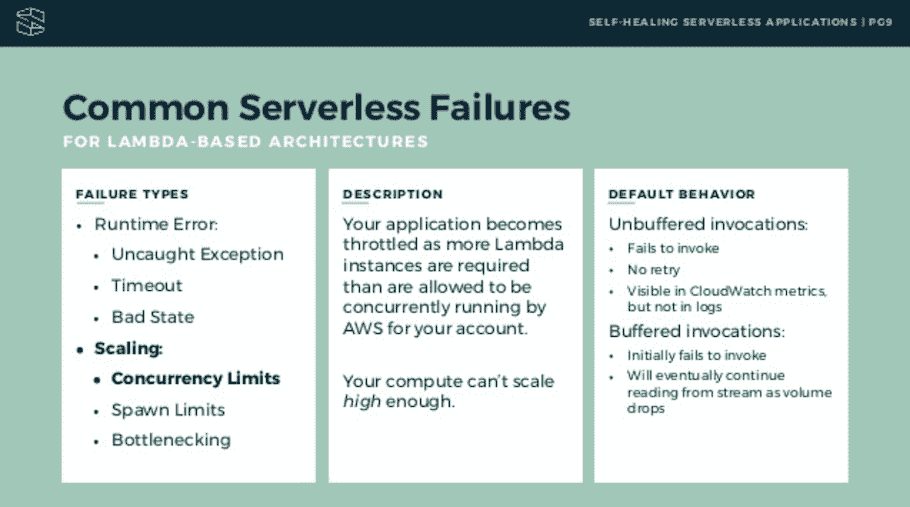

# 无服务器分析:指标、收集和可见性

> 原文：<https://thenewstack.io/serverless-analytics-metrics-collection-and-visibility/>

无服务器系统中的分析包括三个部分:

*   要收集哪些数据和指标
*   如何收集数据
*   如何解释和使用数据。

让我们看看这三个。

## 在无服务器系统中收集什么数据

无服务器管理软件 [Stackery](https://www.stackery.io/) 的首席执行官兼联合创始人内特·塔加特表示，在管理无服务器应用和架构时，需要收集三种类型的指标。

### 表演

在无服务器系统中收集的第一组数据反映了该架构的功能即服务性质。这里的想法是检查单个函数的性能。“例如，函数运行需要多长时间，”塔加特说。“有些是在 AWS CloudWatch 中默认获得的，但也有许多应用性能管理(APM)供应商，如 [IOpipe](http://iopipe.com) 能够帮助创建更精细的数据。”

### 描摹

塔加特解释说，在无服务器中，它不仅仅是一组正在运行的功能。也许更重要的是，后退一步，看看数据如何在整个应用程序中流动。毕竟，在一个无服务器的系统中，一个事件可能触发一个功能，例如，执行某种数据转换活动，然后结果被用来触发另一个动作，等等，通过一个完整的工作流。

“它帮助您将一个服务层发生的事件与另一个服务层联系起来。您需要能够一路映射无服务器系统的数据流。塔加特说:“AWS 的 x 射线确实提供了一些，但对于追踪分析来说， [Epsagon](https://epsagon.com/) 是想到的公司。

### 错误

此外，还有误差指标要衡量，这些可以采取两种形式:

*   **运行时错误**是指您的代码中有一个 bug，因此无服务器应用程序会在应用程序执行到某个点时中断或失败
*   **基础设施端错误**是指 AWS/无服务器提供者端存在底层错误。这可能只是因为函数超时时间范围设置得太短，或者因为存在调用错误，或者因为 Lambda 无法运行。

在今年的 [GlueCon](https://gluecon.itglue.com/) 大会上，塔加特发表了关于解决无服务器系统中的错误的演讲，他主张有必要开发自我修复系统，这种系统不仅能识别错误何时发生，还能在生产中开始自我修复。

基础设施端错误的一个例子是并发限制。塔加特给出了一个无服务器应用程序被节流的例子，因为根据所有者的 AWS 帐户，需要的 Lambda 实例比允许并发运行的多。在这些情况下，事件将无法被调用，如果没有缓冲，将不会重试，并且在 CloudWatch 指标之外的日志中不可见。

## 如何在无服务器系统中收集数据:日志记录

“日志记录在无服务器中是独一无二的，”塔加特说。“您确实在无服务器应用程序中获得了一些可见性，但是您会想要显示有意义的日志信息。作为软件开发行业，我们习惯于有状态资源，在这种情况下，您可以随时连接到服务器并询问服务器上的日志是什么。然后，你可以将它们发送到 CloudWatch 或 Loggly 之类的网站，并在那里进行查看。但是在无服务器的情况下，如果您不使用系统来收集日志，那么在该功能运行之后，您就无法收集关于发生了什么的数据。”

塔加特说，无服务器要求在开发周期就计划好指标收集。虽然这通常可能是一个令人向往的最佳实践，但在无服务器的情况下，它成为了*必需的*最佳实践。其他无服务器行业领导者，如[慈善专业人士](https://twitter.com/mipsytipsy)[蜂巢](https://honeycomb.io)的，也提倡在开发周期中进行仪器设计，以便能够[在生产环境中继续测试无服务器应用](https://thenewstack.io/serverless-testing-in-production/)。

## 如何在无服务器系统中解释和使用数据:可见性

塔加特认为，所有这些围绕分析的工作都是由于大规模分布式应用的无服务器和软件设计带来的组织安排的关键转变。

他解释说:“所有这些分析工作——确定指标、收集和持续日志记录——都基于一个想法:我们要求开发人员做运营工作。在业外人士看来，开发者的所作所为可能看起来像是魔术。开发人员编写一些代码，应用程序有一些很棒的新功能。但实际上，来自运营部门的工程师和来自应用开发部门的工程师是不同的学科，就像心脏和脑外科医生一样。因此，这里的转变是从 10 名运营工程师可以访问云帐户，到数百名开发人员可以访问。这会改变你的组织。如果工程师是负责任的，他们需要数据，并且需要将数据放在上下文中。过去，对于一个单一的应用程序，你只有一组日志。在无服务器模式下，你拥有分布式应用，数百个函数各自创建自己的日志系统。您如何在整个架构中关联这一点？”

塔加特举了一个有 Lambda 函数支持的 API 的例子。如果无服务器工作流中的 API 获得了过多的流量，或者如果 API 消费者达到了他们的服务限制，则 Lambda 函数永远不会被调用。因此，如果一个开发人员正在查看 Lambda 上的日志，他们看不到任何问题。塔加特说，具有应用程序开发技能的开发人员可能不具备在整体架构的上下文中查看数据的操作技能，这就是为什么 Stackery 建立了一个用户界面来帮助开发人员可视化他们的数据和无服务器系统，以帮助他们简化学习曲线。

“分析的可见性部分非常重要，”塔加特说。“开发人员需要访问日志，他们需要在他们正在构建的体系结构的上下文中将其可视化。开发人员应该能够访问这些信息，而且在很多方面都是新的。这是我们作为一个行业谈论了十年的真正的 DevOps。无服务器强制执行 DevOps，因为开发人员必须进行检测，以便在运行时实现可观察性。”

## 分析挑战

所有这些都指出了管理大规模分布式应用程序、开发运维、微服务的公司以及现在在其系统中引入或包含无服务器架构的公司所面临的一些潜在挑战。

在过去，工程副总裁可能会去他们的运营团队询问数据，了解应用程序性能不佳或崩溃的原因，或者基础架构成本高于预算的原因。现在，运营团队已经被无服务器和云工程所取代，这更普遍地将责任推给了开发团队。因此，现在有 200 名开发人员在工程副总裁的领导下工作，而不是 10 名运营专家，每个人都负责收集他们正在工作的系统元素的数据。组织如何确保该环境中跟踪和错误的一致性和可审核性？

反过来，这一挑战也暴露了一个更基本的问题:组织结构本身。“我们谈论了很多关于无服务器的可扩展性，当我们谈论它时，我们是在谈论基础架构，我们真正要问的是能否处理大量请求？我们应该讨论的是我们如何管理组织的可伸缩性。您如何确保团队到位来管理增长？你需要某种治理。我们在传统基础架构中使用标准是有原因的，认为我们不需要无服务器的相同管理级别的想法是不正确的。如果有什么，我们需要更多，因为我们正在向更多的工程师开放我们的系统来管理，”塔加特说。

## 走向无服务器分析的标准化和自动化

塔加特表示，改善分析的核心是标准化和自动化的需求。塔加特主张将无服务器作为构建自我修复应用程序的机会，这意味着制定政策和标准化流程，以便在构建过程中自动添加规范。塔加特说，这是 Stackery 所做工作的核心，他看到越来越多的注意力转向建立组织系统，以支持那些管理数百名开发人员并确保一致性的工程副总裁。

这种想法是为了摆脱旧的现实世界，在旧的现实世界中，工程师构建一个函数，并在企业生产帐户中发布一个 Lambda，在它失败的那一天(这是经常发生的情况)，工程师正在度假。如果组织引入了标准化，如果每个资源都有发货日志并正在收集指标，而不是跟踪哪个工程师构建了该功能并了解他们做了什么，则组织可以通过解决失败、表现不佳或成本激增的原因来直接解决问题。

“在构建自我修复应用程序时，你需要在应用程序中设计弹性。在开发应用程序时，你要提前考虑当它失败时，你将如何自动恢复和处理失败，”塔加特鼓励道。

Stackery 是新堆栈的赞助商。

专题图片:照片由[阿尔方斯·莫拉莱斯](https://unsplash.com/photos/yyql_hMRVBw?utm_source=unsplash&utm_medium=referral&utm_content=creditCopyText)在 [Unsplash](https://unsplash.com/search/photos/insight?utm_source=unsplash&utm_medium=referral&utm_content=creditCopyText) 拍摄。

<svg xmlns:xlink="http://www.w3.org/1999/xlink" viewBox="0 0 68 31" version="1.1"><title>Group</title> <desc>Created with Sketch.</desc></svg>