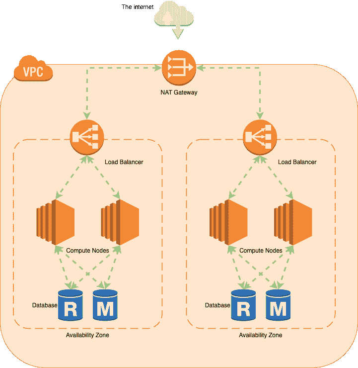
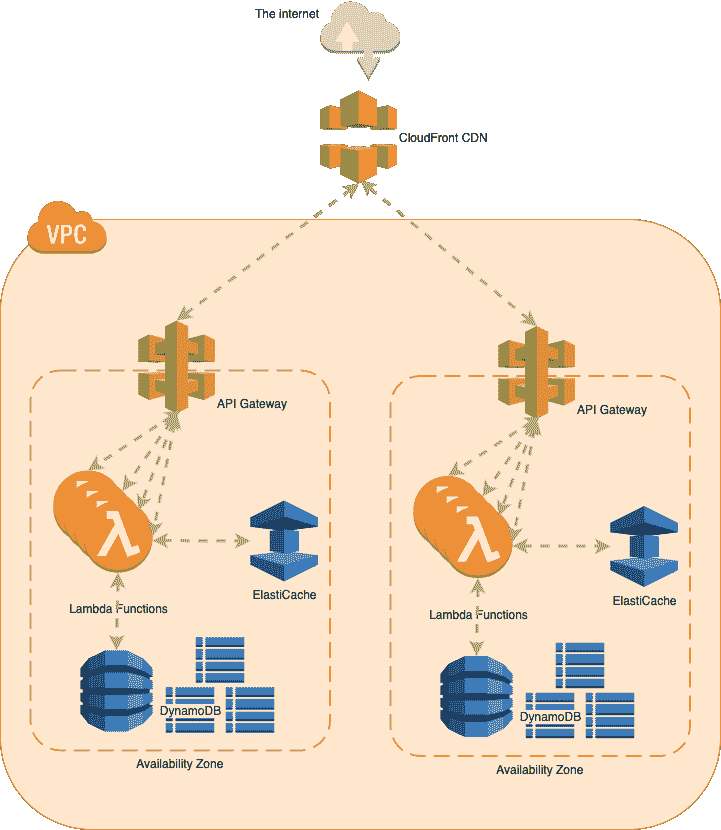

# 无服务器和需求高峰

> 原文：<https://thenewstack.io/serverless-and-demand-spikes/>

[桑德拉](https://www.thundra.io/)赞助了这篇文章。

 [埃姆拉·萨姆丹

艾姆拉是桑德拉公司的产品副总裁。他热衷于无服务器、可观测性和混沌工程。](https://www.linkedin.com/in/emrahsamdan/) 

在现代企业所处的这个非常时期，无缝扩展数字基础设施以满足多变需求的能力一如既往地至关重要。然而，精益和分布式工程团队会发现很难维持基础设施管理的传统“现场”操作模型。

本文探讨了无服务器技术作为灵活和可伸缩基础设施的潜在解决方案，可以通过一个精干和灵活的工程团队有效地进行远程管理。在查看了传统整体架构的可扩展性限制后，我们将描述无服务器提供显著优势的四个关键领域:将关注点分离到微服务、支持 DevOps 自动化、轻松的可扩展性和成本效益。

有关这些问题的更多详细信息，我们邀请您到[下载我们的白皮书](https://www.thundra.io/whitepaper/serverless-and-demand-spikes)。

## 传统基础设施:整体建筑

图 1:传统的单片应用程序

如图 1 所示，整体架构包括一个计算节点集群，每个计算节点代表一个逻辑服务器，带有必须修补和维护的操作系统。Ansible 或 Chef 之类的配置管理工具可以在一定程度上实现自动化，但是环境需要管理额外的基础设施和代码。要全部或部分更新核心应用程序，您必须关闭部分设备——这是一项危险且容易出错的任务。

为满足用户流量的突然增加而进行扩展要么是一个影响用户体验的漫长过程，要么是一个成本高昂的过程，因为预计到需求高峰，必须过度调配基础架构。并且在分布式系统中正确地实现并发性是一项重要的任务，随着系统的增长，这项任务会变得更加困难。垂直扩展(增加更多 RAM/CPU)是有限的，水平扩展(增加更多节点)增加了复杂性。另外，必须特别注意[数据库层](https://www.marklogic.com/blog/relational-databases-scale)。

传统的计算设备还带来了更沉重的管理和运营负担，这是一个更精简的分布式工程团队难以管理的。

## 关注点分离:进入微服务

图 2:微服务应用

在微服务架构中，核心应用程序的功能被分解为独立的无状态组件，这[为整个系统和单个模块提供了可扩展性](https://dzone.com/articles/benefits-amp-examples-of-microservices-architectur)。这种模块化体系结构使识别、隔离和修复瓶颈变得容易，而不会影响应用程序性能。借助 AWS managed Lambda 服务生态系统，工程团队还可以轻松扩展数据库(DynamoDB)、缓存(ElastiCache)或计算本身(Lambda)，而无需复杂的自动化逻辑。最后但并非最不重要的一点是，通过将计算层划分为独立的无状态功能，应用程序再也不必为了部署新功能而“停机维护”。

## 工程文化:建设卓越运营

管理整体系统基础设施通常基于系统管理员方法。服务器退役以处理修补、部署或故障排除。同时，新容量通过配置管理和自动扩展实现了一定程度的自动化，但您需要不断测试和配置，以保持最新、兼容的操作系统映像。

然而，sysadmin 模型在过渡到分布式和更精简的工程范例时面临着严峻的挑战。例如，可能无法协调所有人对用户流量意外激增的响应。

相比之下，无服务器应用程序堆栈非常适合在 DevOps 文化中工作的分布式团队。 [12 因素原则](https://12factor.net/)从最初的设计规范开始就是首要考虑因素。一切都是自动化的，配置存储在代码中。不需要手动干预或配置来扩展平台以处理数百万个请求；并发性和可伸缩性是电池包含的特性。

## 扩展和并发:满足需求

为了满足动态需求，应用程序基础设施必须从一开始就构建，重点关注可伸缩性和并发性。传统计算资源可以提供这两者，但从历史上看，这需要巨大的工程努力，包括脆弱的黑客攻击，最终导致系统不稳定。它们也带来了相当大的资源调配和容量规划挑战。

云计算及其按需、按使用付费的服务模式彻底改变了软件行业，将容量管理从底层基础设施的管理中分离出来。然而，云计算模型并没有解除工程团队管理可伸缩性的责任。 [EC2 自动扩展组](https://www.logicworks.com/blog/2017/12/common-mistakes-misconceptions-auto-scaling-aws/)的设计更注重高可用性和弹性，而不是对流量激增的实时动态响应。即使自动伸缩与 Amazon CloudWatch 指标相关联，也必须仔细规划和管理可伸缩性，以满足应用程序性能和 UI 需求。

云计算也不是数据库层扩展和并发的灵丹妙药。确保数据的一致性、高可用性和高性能需要昂贵的工程努力和不断玩弄[上限定理](https://www.ibm.com/cloud/learn/cap-theorem)。

相比之下，实现无服务器计算资源，如 AWS Lambda，让软件工程师外包操作问题，而不是专注于提供功能和优质的用户体验。有了 Lambda，你不必[配置或管理扩展](https://aws.amazon.com/lambda/faqs/)。它由 AWS 自动处理，并提供功能上无限的容量。AWS 还提供了一个强大的托管资源生态系统来支持无服务器计算基础架构。

对于数据库层，DynamoDB 是一个完全托管的 NoSQL 数据库，提供按需容量定价以及高性能的自动伸缩。借助 ElastiCache、CloudFront 和 API Gateway 等服务，敏捷的开发团队可以在运营可用性和基础设施工程方面投入最少的情况下部署一系列复杂的服务。

## 成本效益:按需付费

即使有了现代的云扩展能力，工程组织在处理需求激增和容量分配时，也经常发现自己陷入进退两难的境地:保持整个实例群完全扩展，这可能会产生巨大的使用费用，或者保持小规模，并尝试规划和设计扩展策略和自动化来应对需求激增。

无服务器模式的主要优势之一是其经济高效的计费模式。大多数无服务器函数(包括 Lambda)只对执行时间计费——通常以毫秒为单位。相比之下，标准 EC2 实例以整秒计费，启动时间最少为 60 秒。

如果一个功能或应用程序功能完全执行的时间从不超过 150 毫秒，那么将它隔离在一个无服务器的功能中并仅在需要时执行它将会更具成本效益。软件公司和工程团队通过使用无服务器基础设施节省了高达 90%的基础设施成本的例子不胜枚举。

无状态、无服务器基础架构的运营开销只是基于服务器的模型的一小部分，因为没有要修补的操作系统，没有要连接防火墙的网络端口，也没有要填充日志文件和堆栈转储的存储设备。

## 利用无服务器来满足需求

无服务器技术提供商提供高度可扩展、高度并发的计算生态系统，所有这些都在一个灵活的、基于使用的计费模型中。当企业面临对其数字服务的不可预测和前所未有的需求以及流动和分散的劳动力时，他们可以通过选择实施技术和文化来获得更好的服务。

亚马逊网络服务是新堆栈的赞助商。

通过 Pixabay 的特征图像。

目前，新堆栈不允许直接在该网站上发表评论。我们邀请所有希望讨论故事的读者通过[推特](https://twitter.com/thenewstack)或[脸书](https://www.facebook.com/thenewstack/)访问我们。我们也欢迎您通过电子邮件发送新闻提示和反馈: [feedback@thenewstack.io](mailto:feedback@thenewstack.io) 。

<svg xmlns:xlink="http://www.w3.org/1999/xlink" viewBox="0 0 68 31" version="1.1"><title>Group</title> <desc>Created with Sketch.</desc></svg>