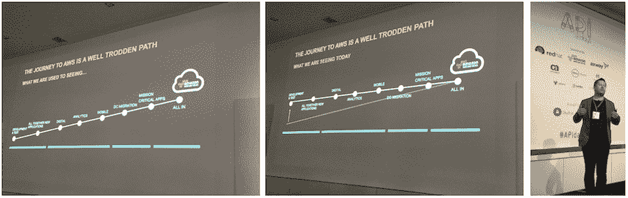
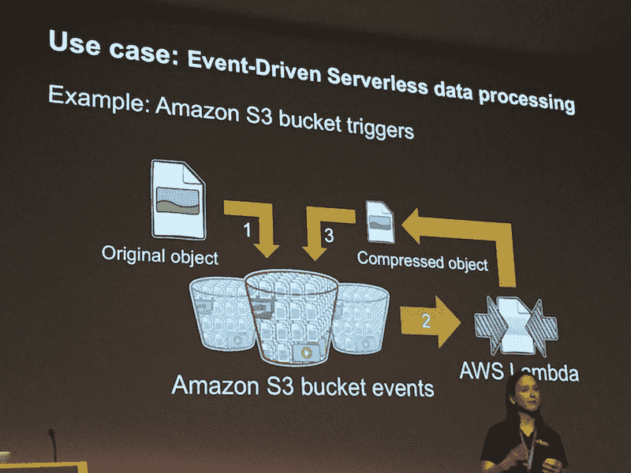
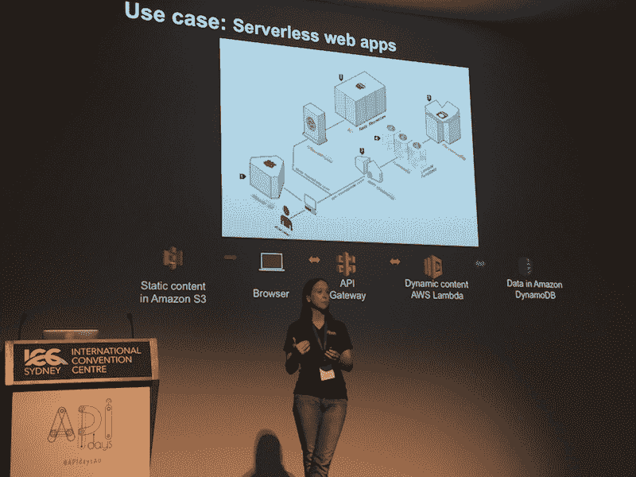
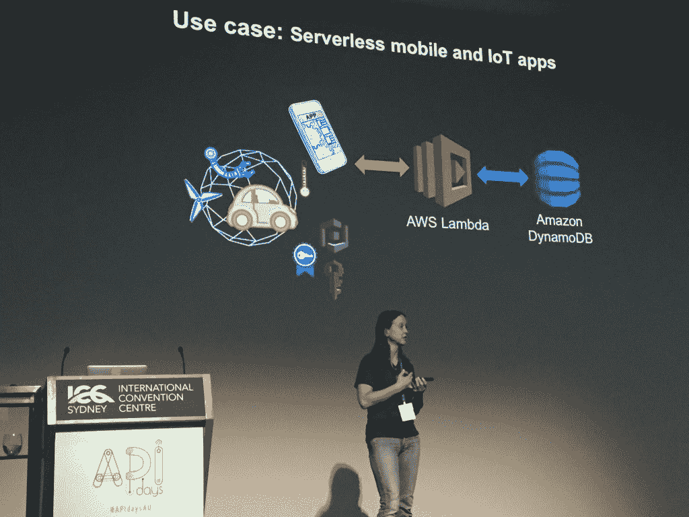
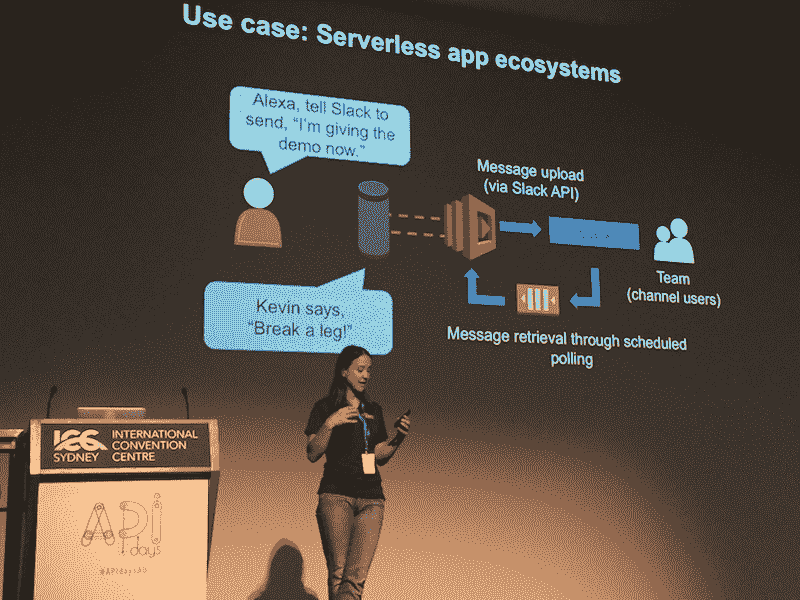
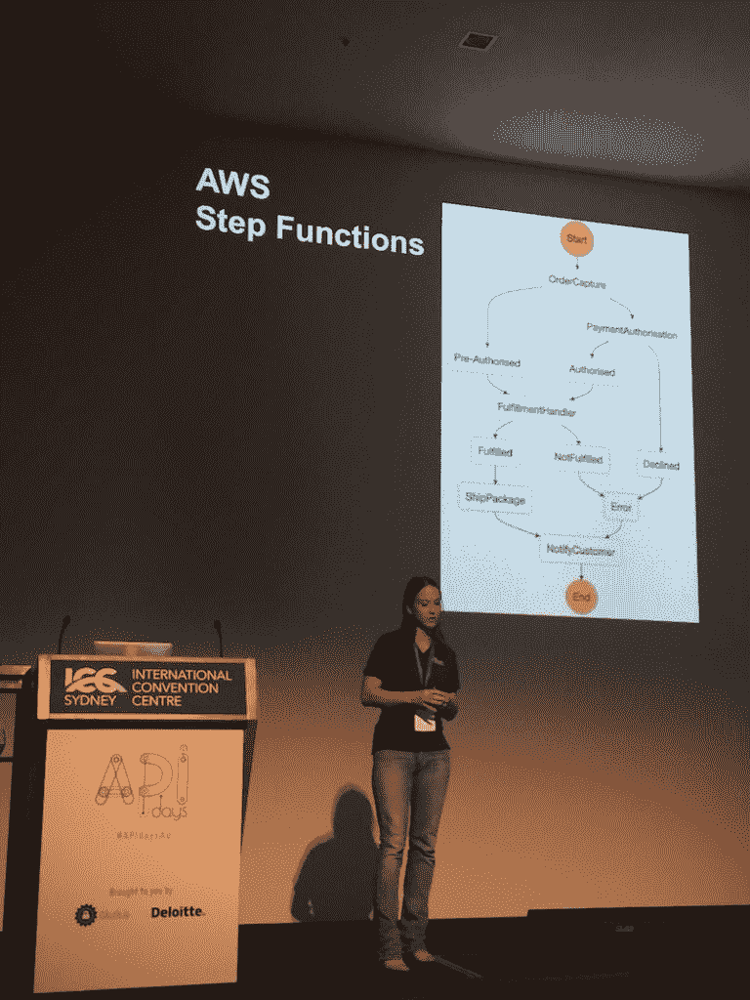

# 无服务器架构:五种设计模式

> 原文：<https://thenewstack.io/serverless-architecture-five-design-patterns/>

根据 AWS 解决方案架构师[卡珊德拉·邦纳](https://www.linkedin.com/in/cassandralbonner/)上周在悉尼举行的 APIdays 澳大利亚会议上所做的报告，亚马逊网络服务看到了其 Lambda 无服务器服务的五种主要使用模式。

总结当前[无服务器](/category/serverless/)技术的成熟度，顾问 [Ken Fromm](https://twitter.com/frommww) 最近在 [一位云专家的中型博客](https://read.acloud.guru/thinking-serverless-how-new-approaches-address-modern-data-processing-needs-part-1-af6a158a3af1#.cwr6goc32) 上写道，无服务器架构允许开发者专注于管理他们的应用和系统需要做的事情，而不是他们后端基础设施的物理能力、限制和复杂性。这使得作业或任务成为无服务器环境中的规模单位。

这意味着，总的来说，任务往往是异步的、无状态的和短暂的，或者如弗洛姆所说:“任务处理本质上变成了容器处理，容器是在一个任务接一个任务的基础上建立和删除的。”

在 APIdays，Bonner 说 AWS 团队认为无服务器包含四个主要原则:

*   简单但可用的原语(即小而可用的构建块)。
*   随使用情况扩展(服务器代表用户自动扩展)。
*   只付费使用(客户只为使用服务的时间付费)。
*   内置可用性和容错能力(即 NoOps)。

在早些时候的 **APIdays** ，[澳大利亚亚马逊网络服务解决方案架构高级经理 Peter Stanski](https://twitter.com/pstanski) 曾表示，澳大利亚和新西兰市场(以及世界大部分地区)AWS 的传统采用路径正在中型企业和企业中发生变化。

在过去的一两年里，初创公司通常从一开始就“全力以赴”，而使用传统系统的成熟企业通常会经历一个过程，即开发和测试概念证明，构建新的应用程序，添加分析，然后开始迁移一些传统应用程序，最后专注于将任务关键型应用程序迁移到 AWS。

斯坦斯基说，今年，各种规模的企业从一开始就倾向于“全力以赴”。他们将着手进行现有传统堆栈的迁移活动，同时直接从他们的云托管服务构建新的应用程序。

Bonner 描述了无服务器应用的类似趋势:虽然新的应用可能是利用无服务器架构构建的，但在大多数情况下，企业采用混合方法，在无服务器环境中构建新功能，然后在现有的应用托管架构环境中编织。

Bonner 指出了一个常见的例子:“我们看到许多客户就是这样开始的:一家企业可能有一个管理图像数据的现有工作流，现在正在添加一个在无服务器环境中运行的图像识别功能，然后将编目的结果通过管道传输回现有的传统工作流，该工作流可能位于用户的云托管环境中。

Bonner 定义的用例的五种无服务器模式是:

1.  事件驱动的数据处理。
2.  网络应用。
3.  移动和物联网应用。
4.  应用生态系统。
5.  活动工作流程。

## 用例 1:事件驱动的数据处理

无服务器环境最常见的应用之一是在事件发生后触发动作。Bonner 给出了一个图像对象被添加到亚马逊 S3 桶的例子。例如，这可能会触发 lambda 函数来运行压缩任务，以便将图像以标准大小的格式重新归档到 S3 中。

这种风格的用例也非常适合混合趋势，即无服务器被用来在更广泛的托管环境中执行特定的功能。

## #2:无服务器网络应用

在无服务器的 web 应用程序中，可能存在确定用户的上下文和个人元素的运行过程的组合，以提供满足用户需求的内容和功能。例如，在这个用例中，静态内容可能存储在 S3 中，以便在浏览器中打开应用程序时显示。

同时，通过应用程序的 API 网关启动处理，以运行确定应用程序用户上下文的 Lambda 函数。静态内容随后通过 lambda 函数生成更多动态内容进行增强，并作为动态数据存储在 [DynamoDB](https://aws.amazon.com/dynamodb/) 中。

## #3:移动和物联网应用

与 web 应用程序用例类似，在无服务器环境中构建的移动和物联网应用程序希望根据其上下文来决定向用户提供什么内容。无服务器身份验证元素用于确保用户(无论是人还是机器)获得适当的授权来访问信息或功能。然后，Lambdas 执行功能并与 DynamoDB 中的数据交互，以满足用户的需求。

## #4:无服务器应用生态系统

在应用生态系统中，应用或工作流是在无服务器环境中创建的，并利用 AWS 功能和产品以及第三方提供商 API 的组合。

邦纳举了一个例子，有人告诉[亚马逊 Echo](https://www.amazon.com/Amazon-Echo-Bluetooth-Speaker-with-WiFi-Alexa/dp/B00X4WHP5E) 他们正在做一个演示，语音数据然后触发 lambda 函数，通过 [Slack API](https://api.slack.com/) 将消息传递给远程团队。然后，无服务器环境中的轮询识别团队何时做出了响应，并发送带有反馈的消息。

## #5:活动工作流程

最近发布的 [AWS 步骤功能](https://aws.amazon.com/step-functions/)现在为无服务器工作流的可能性增加了更多的复杂性。决策树可以在 Step 函数中创建，然后与 Lambdas 和 AWS 产品保持一致，以执行工作流分支操作(尽管亚马逊网络服务在澳大利亚突出 Step 函数令人困惑，因为它在那里还不可用)。

例如，使用发布/订阅消息传递模型，可以通过状态机可视化和绘制所有功能和分布式组件。用户可以通过 Step 函数映射客户入职流程、进入 CRM、购物车订购和订单执行，并自动添加 lambdas 和 AWS 工具，以确保工作流程得以完成。

因此，虽然 Fromm 谈到无服务器主要是异步的、无状态的和短暂的，但是一旦进入更复杂的工作流和应用程序，一些保持状态和进行同步调用的能力就发挥作用了。

Step Functions 提供了状态机，因此 Lambda 函数可以具有某种程度的瞬态，可用于无服务器应用程序可能需要结合同步和异步调用链的业务流程。

但是无服务器的超级用户，如来自 T4 的本·凯霍 认为阶梯函数目前的价格结构太贵了，不能在无服务器环境下的生产中使用。此外，默认节流限制表明，其预期用途并不倾向于涵盖可伸缩但短暂的事件调度。

“我希望状态即服务是一种范式，可以通过 Step 函数或另一种服务，为 FaaS 在无服务器架构中所需的低级、短暂状态工作，” [去年年底在 Step 函数首次发布后写道。](https://serverless.zone/faas-is-stateless-and-aws-step-functions-provides-state-as-a-service-2499d4a6e412#.wnf8htfg1)

## 认证选择

在无服务器环境中，还可以选择最适合无服务器设计模式和正在实现的用例的用户身份验证和身份管理工作流。身份验证方法可能会发生变化，这取决于一个组织中的许多用户是否需要具有不同权限角色的访问权限，用户是否主要是客户，或者合作伙伴是否拥有一些访问权限。

去年 11 月，Jim Tran 和 Justin Pirtle 在 AWS Re:Invent 上的一段视频更详细地描述了无服务器环境中的一些认证选择:

[https://www.youtube.com/embed/n4hsWVXCuVI?feature=oembed](https://www.youtube.com/embed/n4hsWVXCuVI?feature=oembed)

视频

## 成熟的无服务器工具和生态系统

无服务器在成为企业通过云交付的主要力量方面仍有很大进展。

随着无服务器技术的成熟，新项目和混合项目越来越多地采用无服务器技术，随着企业开始选择将现有应用程序迁移到无服务器架构，企业很可能会重复采用云技术，尽管在无服务器领域采用的比例较小。虽然面向大规模业务和企业的任务关键型应用程序可能还没有上市，一些安全功能和整体生态系统工具仍需要成熟，但无服务器的使用案例表明，除了初创公司，无服务器越来越有可能像今天的云一样成为“全方位”的决策。

<svg xmlns:xlink="http://www.w3.org/1999/xlink" viewBox="0 0 68 31" version="1.1"><title>Group</title> <desc>Created with Sketch.</desc></svg>