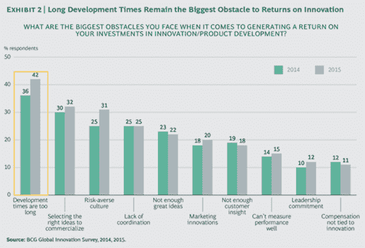
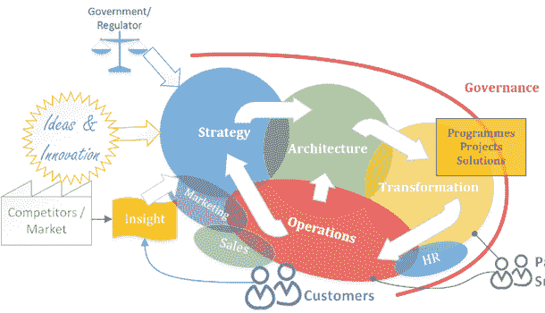
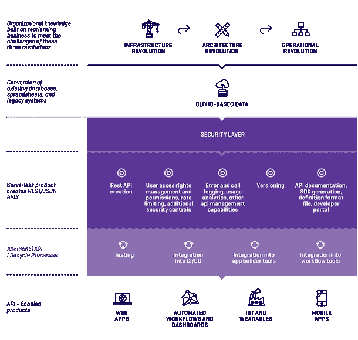
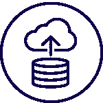

# 通往 NoOps 之路:无服务器计算正在迅速发展

> 原文：<https://thenewstack.io/serverless-computing-growing-quickly/>

无服务器计算准备好成为主流了吗？可以肯定的是，它正在迅速逼近。

2016 年的“无服务器”越来越像容器采用的早期，围绕这种方法的热情和兴奋，生产环境中的用例已经开始被主要企业和寻求敏捷性优势的初创公司记录下来。

当然，可用于驱动无服务器应用程序开发的产品仍处于起步阶段，并且通常缺少一些使开发人员能够快速构建和部署的工具。然而，API 无服务器端市场的成熟预示着在今年剩下的时间里更广泛的应用程序开发将会有所收获。

Docker 花了 24 个月的时间将其容器技术发展成为一个占主导地位的全球架构模型，但已经有迹象表明，无服务器供应商和用户正在将增长时间缩短一半。

> “对我来说，最令人震惊的是每个人的做法似乎都不一样。似乎没有一个大家都在采用的蓝图”——安东尼·斯坦利

下周在纽约举行的一个座无虚席的会议，展示了应用程序开发的无服务器方法已经变得多么先进。

无服务器，或[无状态](https://thenewstack.io/year-ahead-stateless-computing/)，应用开发是一种完全构建在云中的方法，提供运行应用代码或服务所需的基础设施和工具，使开发人员能够专注于创建和部署应用。

ServerlessConf 的联合组织者[来自技术教育机构](https://www.linkedin.com/in/antstanley)[的 Anthony Stanley](https://acloud.guru/) 一位云专家说，规划这次会议提出了许多提案，表明企业已经在生产环境中使用无服务器。他说，对于一个初出茅庐的会议主题，提交的演示文稿总数高于预期，尤其是在生产中运行无服务器的人提交的数量。

“我发现，当组织开始试验无服务器时，转向生产的理由很快就清楚了，”Stanley 说。然而，他也很快承认这是一个新兴的技术领域:

“对我来说，最令人震惊的是每个人的做法似乎都不一样。似乎没有一个蓝图是所有人都在采用的。他说:“我认为趋势将会出现，特别是‘无服务器世界中的运营’，随着用户围绕相关优势和缺陷分享故事，无服务器架构将会更加一致。”

## 走向无服务器的趋势

新的堆栈贡献者和分析师[贾纳基拉姆·MSV](https://thenewstack.io/author/janakiram/)最近记录了推动无服务器应用开发方法的五个关键因素。他指出，当今应用程序开发环境的所有主要主题都在推动向无服务器迁移:云计算的成熟、后端即服务产品、API、容器和微服务的日益成熟，以及首先向 DevOps 的迁移和越来越多地向“NoOps”的迁移，都在创造对无服务器兴趣的完美风暴。

> DevOps 显著增加了开发时间，因为应用程序构建者同时需要管理其服务器基础架构，这让他们不堪重负。

也许关于 NoOps 的最后一点是推动企业采纳的最主要因素。我最近对 API 无服务器架构产品进行了一项研究，该研究由 [Restlet](http://restlet.com) 赞助，引用了无服务器计算系统提供商 [Iron.io](https://iron.io) 的首席执行官 [Chad Arimura](https://www.linkedin.com/in/chadarimura) 的话，他说 DevOps 的问题是“它使开发人员成为运营团队的一部分，这使企业创新和敏捷性嘎然而止。”

去年年底，迈克尔·林格尔、安德鲁·泰勒和哈迪·扎布利特为 BCG Perspectives 发布的一项研究发现，对企业来说，创新的最大障碍是开发时间太长。DevOps 显著增加了开发时间，因为应用程序构建者同时需要管理其服务器基础架构，这让他们不堪重负。

随着企业努力管理新的数字环境，DevOps 的兴起是整个行业正在发生的三管齐下的革命的一部分:

*   一场**基础设施革命**正在将许多企业迁移到云或混合云服务器环境
*   一场**架构革命**催生了 API、容器和微服务，以及使用后端即服务产品来更快地创建功能更丰富的单一用途应用
*   一场**运营革命**随之而来，这些技术革命正在改变企业的组织方式:业务和技术团队更加紧密地合作，每个业务部门都在承担其 it 职责和决策。

企业架构师 Oliver Cronk [在他的 SATO(战略、架构、转型和运营)模型中描述了这个](https://www.linkedin.com/pulse/simple-model-typical-organisation-oliver-cronk?trk=prof-post):

Cronk 模型中最有趣的一个方面是销售和营销的前期布局，围绕组织学习、技术吸收和战略决策推动业务影响。这引起了获奖机构 [BeyondCurious](http://www.beyondcurious.com/) 的首席执行官[尼基·巴鲁阿](https://www.linkedin.com/in/nbarua)的共鸣，她与领先的全球品牌合作，帮助他们转向数字和移动环境。

巴鲁阿说:“企业正被迅速打乱。“为了赢得业务，公司需要更高的智能、移动数据访问能力，以及产品变化频繁的准确信息。销售部门正在做出更多自主的技术选择来帮助他们实现目标。此外，对云、移动和人工智能的更好的可访问性推动了独立于 IT 部门的创新。我们预计这一趋势将在未来几年加速发展。”

因此，销售团队决定采用技术，然后当他们与客户一起使用该技术时，这将推动整个企业的产品创新决策。仅仅六个月到一年前，[是市场营销在主导决策](https://thenewstack.io/fight-api-product-survival-rests-enterprise/)，但 Barua 说，鉴于销售部门的创收角色，他们在推动创新方面拥有更大的自主权，尤其是在面向客户的应用程序开发方面。

## 更广阔的无服务器市场

更广泛的无服务器应用程序开发目前由许多主要供应商平台([IBM open whish](https://thenewstack.io/ibm-launches-bluemix-openwhisk-event-driven-program-service/)、 [Amazon Lambda](https://thenewstack.io/aws-gets-serious-lambda-adds-python-cron-scheduling/) / [无服务器](https://thenewstack.io/serverless-offers-framework-aws-lambda/)、[微软 Azure 功能](https://thenewstack.io/microsoft-draws-line-sand-azure-functions/)、[谷歌云功能](https://thenewstack.io/google-cloud-functions-arrives-challenge-aws-lambda/))和开源框架(如 [Deployd](http://deployd.com/) 、 [Sparta](http://gosparta.io/) 和 [IOpipe](https://github.com/iopipe/iopipe) )组成，无服务器堆栈的其余工具仍在开发中。像 Stamplay 和 Syncano 这样的工具作为新产品展示了很大的前景，它们提供了一个无服务器的微服务编排层，引入了一些功能，如身份验证和用户权限、后端脚本、第三方 API 集成、消息传递和工作队列管理、数据管理以及创建应用程序的通道接口。

Stanley 说，这就是为什么 ServerlessConf 组织他们的计划首先以用例为中心，其次是促进围绕开源工具的讨论:“我们看到的是，实现无服务器架构的最终用户往往比提供平台的供应商更有创造力。因此，我们非常想探索无服务器在生产中的实际应用，以及所有相关的挑战。计划的第二天是关于开源和社区的。有了这样一个快速成熟的新产品，在大规模生产中运行无服务器所需的许多要素都缺失了。我们希望专注于已经涌现的开源项目，以填补围绕这种构建应用程序的新方式的空白。”

这一市场领域轨迹模拟了 Docker 和 Kubernetes 的经验，早期采用者经常创造性地围绕大规模运行容器的一些不足之处进行构建，而在大约一年的时间里，一系列开源产品出现了(许多产品还推出了商业产品)，以帮助新生的生态系统成为今天的典范。

## API 无服务器市场

在无服务器领域，API 无服务器产品是当今最先进的产品。其中许多都提供无服务器堆栈，在一个产品中管理身份验证、API 设计、托管、使用和生命周期需求。如今，市场上的大多数产品都提供可视化创建工具，使具有各种技术专长的用户能够在云存储数据的基础上构建 API，并将其链接到生产应用程序，而无需任何服务器管理。

API 无服务器的当前主要用例有:

**原型制作**新的仪表板和应用程序，然后可以在生产中维护。

**移动现有的传统数据库**企业希望在现有的数据存储基础上创建一个 API，而不会给整体环境带来任何风险。传统数据存储正在被清理，任何机密数据都将被匿名化，并被复制到云存储中，以便可以在其上构建无服务器 API 来支持新的应用程序开发。

**利用企业工业成熟度**方法，企业从构建单一用例 API 中汲取所有知识，并将其重新打包成类似微服务的标准化 API，其中一个(无服务器)API 可一致地用于多个应用。

还有迹象表明，API 无服务器架构正在帮助工业物联网的普及，但在该领域与客户合作的产品供应商谨慎地表示，这在很大程度上仍是一个试点测试平台，预计不会在一年内得到更广泛的普及。

这些 API 无服务器产品最感兴趣的地方是加速开发时间，这一直阻碍着创新。一位调查报告者谈到了系统集成商如何在现场工作，通过首先为业务数据源创建一个无服务器 API，在客户面前构建实时业务智能仪表板。

## 面向企业创新的无服务器？

迈克·阿蒙森认为，这种快速上市的优势对于在整个企业创造创新文化至关重要。今年早些时候，Amundsen(即将出版的 O'Reilly 书籍*微服务架构:调整原则、实践和文化*的合著者)在墨尔本的每日 T2 演讲中认为，企业可以通过让组织内的任何人访问无服务器技术(如亚马逊 S3 存储帐户)来轻松实现创新。

阿蒙森说，创新领导力就是围绕企业设定一些总体界限(以管理风险)，然后鼓励员工拥有“寻找下一个地平线”的自由。他建议企业创造一种文化，让员工不必征求许可就能进行实验，从而实现无计划的创新。

API 无服务器产品(以及将来更成熟的应用程序无服务器产品，如 Syncano 正在提供的产品)可能是下一套工具，企业可以向其所有员工提供这些工具，以帮助推动新产品创建的实验，自动化或增强业务流程，并帮助任何人涉足应用程序原型开发。

通过使用无服务器环境，生产应用程序的成本显著降低，并且消除了通过 API 直接访问遗留数据存储的安全风险，因为它们可以在无服务器环境和基于无服务器环境构建的 API 中复制。

随着基于云的计算和存储成本持续下降，越来越多的企业将遗留数据存储在云中，并且创建了工具，让更少的技术人员来创建应用程序，向无服务器的迁移将加速已经是一股动态增长的力量。

*由 Restlet 主办的研究报告 [**市场扫描:API 无服务器架构**](http://mgboyd.com/api-serverless-architecture-market-scan/) 免费下载。*

<svg xmlns:xlink="http://www.w3.org/1999/xlink" viewBox="0 0 68 31" version="1.1"><title>Group</title> <desc>Created with Sketch.</desc></svg>