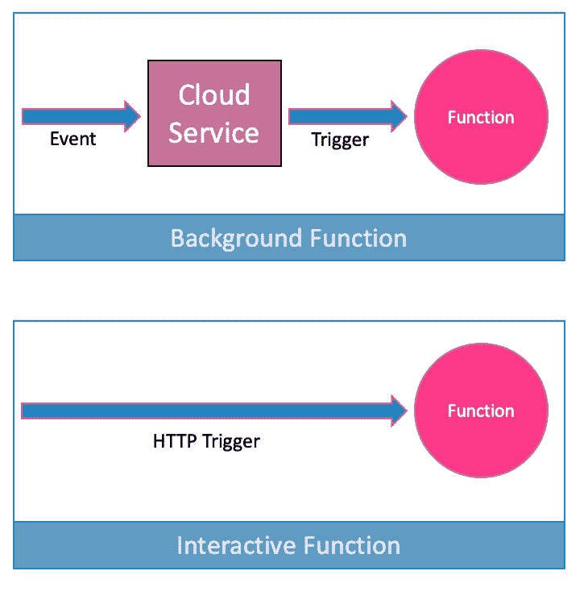

# 无服务器:关于谷歌云功能你需要知道的一切

> 原文：<https://thenewstack.io/serverless-everything-you-need-to-know-about-google-cloud-functions/>

功能即服务(FaaS)是基于无服务器模式的交付模式之一。它使开发人员能够编写和执行代码片段，并使用明确定义的入口点来响应事件。这种调用机制使 FaaS 成为事件驱动计算的理想选择，在事件驱动计算中，代码被执行以响应外部事件。为了交互触发功能，HTTP 端点可以充当触发器。开发人员可以专注于编写细粒度、自治和无状态的功能，这些功能可以组装到应用程序中。每个函数可以代表一个参与调用序列的微服务。

[谷歌云功能](https://cloud.google.com/functions/)是谷歌的一个无服务器计算平台，于 2018 年 8 月正式上市。除了虚拟机和容器，函数还提供了一种在云中执行代码的机制。本文提供了 Google 云功能当前状态的快照。

## 概念和术语

云功能提供了一个逻辑连接层，允许开发人员编写代码来连接和扩展云服务。

一个**函数**是一个简单的、单一用途的代码片段，它与云基础设施和服务发出的事件相关联。

云基础设施和服务引发**事件**以响应状态的变化。例如，向云存储添加新对象会引发事件。

**触发器**将事件连接到云函数。事件的发生与触发器和函数的存在无关。但是将事件映射到函数的是触发器。

可以通过 HTTP 端点交互调用函数。**后台功能**由触发器间接调用。事件应该在后台功能执行之前发生。

### 执行环境和支持的运行时

Google Cloud Functions 是一个无状态的执行环境，这意味着这些功能遵循无共享架构。每个运行的函数一次只负责一个请求。因为并发请求由不同的函数实例处理，所以它们不共享变量或本地内存。

如果你的功能需要维护状态，就需要外化到 Google [云存储库](https://cloud.google.com/memorystore/)、[云数据存储库](https://cloud.google.com/datastore/docs/concepts/overview)、[云扳手](https://cloud.google.com/spanner/)，或者[云 SQL](https://cloud.google.com/sql/docs/) 等服务。

一个函数只能在函数执行期间访问 CPU 和内存资源。在执行期之外运行的代码不能保证执行，并且可以随时停止。开发人员编写标记执行结束的代码以保证优雅的退出，这一点很重要。

函数的执行时间受超时持续时间的限制，可以在部署时指定。一个功能通常在一分钟后超时，但这可以延长到 9 分钟。当函数超过执行超时时间时，将立即返回一个错误状态。正在执行的任何剩余代码都可能被终止。

在执行过程中，一个函数只能写入文件系统的 */tmp* 位置。所有其他目录，包括包含随函数一起上传的文件的目录，都是只读的。

谷歌云功能提供了一个兼容[express js](https://expressjs.com/)(Node.js/JavaScript)和 [Flask](http://flask.pocoo.org/) (Python)的 HTTP 库，用于向公共互联网发出出站呼叫。任何两分钟未使用的连接都可能被系统关闭，任何进一步尝试使用关闭的连接都将导致错误。

默认情况下，Google Cloud 函数使用 Node.js 6 作为运行时环境。其他受支持的运行时包括 Node.js 8、Python 3.7.1 和 Go 1.11，它们目前都处于测试阶段。Node.js 6 基于 Debian 8 操作系统，而 Node.js 8、Python 和 Go 运行时则构建在 Ubuntu 18.04 之上。开发人员可以在创建函数的过程中选择任何运行时。通过包含 *package.json* (Node.js)或*requirements . txt*(Python)文件，可以从运行时请求额外的库。云功能会将这些依赖项作为部署的一部分进行安装。

### 事件和触发器

可以通过以下事件调用 Google Cloud 功能:

*   HTTP(直接调用)
*   云存储
*   云发布/订阅
*   云 Firestore
*   重火力点
*   堆栈驱动程序日志记录(通过发布/订阅)

与事件相关的数据作为参数传递给函数。例如，可以通过请求对象访问标题和正文数据。对于由事件间接调用的后台函数，有一些称为数据和上下文的特殊参数，它们包含源元数据、事件标识符、时间戳和事件类型等细节。

云发布/订阅是云功能最强大的来源之一。任何外部服务都可以很容易地连接到 Pub/Subtopic，这将引发一个事件来触发该功能。物联网核心、云调度器、Stackdriver 等服务可以通过 Cloud Pub/Sub 与云功能轻松集成。

与云功能相关联的 HTTP 端点可以与外部的 [webhooks](https://hackernoon.com/webhook-vs-api-whats-the-difference-8d41e6661652) 集成。这是将第三方服务连接到功能的另一个强大选择。Github webhooks 和 Google Assistant intents 是云函数的 webhook 源代码的经典例子。

[Firebase](https://firebase.google.com/) 值得一提的是它与云功能的紧密集成。可能没有使用谷歌云平台的 Web 和移动开发者可以从 Firebase 创建和使用功能。与数据库触发器类似，Firebase 文档可以在创建、更新和删除操作发生时引发事件。这为 Firebase 带来了无服务器移动后端的强大功能。

## 开发者体验

谷歌云功能通过云控制台和云 SDK 提供给开发者。流行的命令行界面 gcloud 可以用来管理函数。该平台还集成了无服务器框架，该框架提供了一种无缝机制来在多个 FaaS 环境中部署和管理功能。

Cloud Functions Emulator 使得在将代码部署到云之前在本地测试代码成为可能。该工具作为 NPM 模块提供，仅支持 Node.js 6 部署。

在本系列关于 Google 云功能的下一期文章中，我将向您展示如何将云功能与一个物联网用例相集成。敬请期待！

*贾纳基拉姆·MSV 的网络研讨会系列，“[机器智能和现代基础设施(MI2)”](https://mi2.janakiram.com)提供涵盖前沿技术的信息丰富、见解深刻的会议。[注册](https://mi2.janakiram.com/)参加即将举行的 MI2 网络研讨会，深入了解谷歌云功能。*

<svg xmlns:xlink="http://www.w3.org/1999/xlink" viewBox="0 0 68 31" version="1.1"><title>Group</title> <desc>Created with Sketch.</desc></svg>