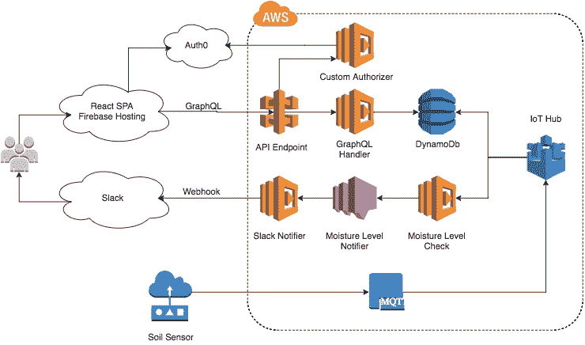

# 无服务器和 GraphQL:新云范式的完美匹配

> 原文：<https://thenewstack.io/serverless-graphql-perfect-match-new-cloud-paradigm/>

当开发人员使用 GraphQL 设计他们的 API 以及使用无服务器架构设计他们的应用程序时，他们可以更容易地向 API 发出查询和函数调用，同时使用无服务器和微服务实现更复杂的业务逻辑。也许这个组合代表了复杂的、基于云的数据架构的完美交付模型。

上个月，无服务器解决方案提供商 [Trek10](https://www.trek10.com) 印第安纳州南本德的 DevOps 主管 Jared Short 在 [Serverlessconf](http://serverlessconf.io/) 发表演讲，主题是直接使用 AWS Lambda 和 AWS API Gateway 构建和扩展单页面应用。在 Trek10 的架构中，内容通过 GraphQL 端点提供，函数解析器与数据存储进行通信。它严重依赖于单页应用程序，因此当出现问题时，例如，图像被设置在错误的位置，有大量的通知来提醒 Short，如 DevOps commander。

[https://www.youtube.com/embed/ZlobbIer58Y?feature=oembed](https://www.youtube.com/embed/ZlobbIer58Y?feature=oembed)

视频

“我们在 Trek10 的部分业务是这种 24/7 管理的创作，我们首先获得所有的警报，”Short 说。“这可能会很痛苦，尤其是如果您没有这些超级可扩展的系统。也许有人搞砸了配置一个自动伸缩组，所以我要醒来，对不对？我从来没有因为 GraphQL、无服务器、单一应用程序设置而醒来。”

## 在无服务器中管理业务逻辑

GraphQL“后端即服务”提供商的联合创始人兼首席运营官 Vince Ning 一直在开发无服务器组件作为补充功能。

“使用无服务器，很难将所有的无服务器功能整合在一起，”宁说。“利用 GraphQL 为您的所有微服务功能提供内聚力，就像它们是一个单片 API 一样。因此，您可以获得最佳的微服务、最佳的计算、效率和性能，同时还可以维护一个连接所有数据的标准 API。”

Ning 提供了一个典型的“创建用户”操作的用例:使用典型的 REST API 架构，您可以创建用户的实例，然后同时发出一个为该用户创建博客的调用。然后，无服务器功能将在事件前后执行一些业务逻辑——例如，在创建用户实例之前验证输入，或者在之后进行确认。

然而，将 GraphQL 和 serverless 一起使用，功能可以异步执行，因此前期和后期活动都通过单个端点提供给客户端。

宁这样描述设计模式:

客户端发出创建用户的 GraphQL 请求。在您的架构中，您设置了预挂钩和后挂钩，作为无服务器工作流的一部分。对于预挂钩，您可能会做一些验证，以确认它是一个电子邮件地址和一些数据清理。Post-hooks 可能包括给用户的确认电子邮件，并在数据项之间建立连接。

“因此,**创建用户**调用进入服务器，你可以传入输入(如用户名和密码),并执行任何定制验证或数据清理的预挂钩功能(例如，使用 RegEx 检查电子邮件地址是否有一个 **@** 和域名)，”宁继续说道。“在它调用那个微服务之后，它将进行实际的**创建用户**变异(即通过 API 写入数据)，并将其保存在数据库中。然后你可以有一个 post-hook 函数——一个 lambda 函数来发送一封带有欢迎邮件的 MailChimp 邮件。发送之后，它将返回一个带有创建用户变异有效负载的响应。这将是三个独立的请求，但它们都是在一个 GraphQL 请求中完成的。”

你可以为这个工作流创建的前挂钩和后挂钩的数量没有限制，宁补充道。比如，要为这个新创建的用户生成一个博客，宁说，“你要创建用户和博客，并创建连接，‘用户有博客’。”在 post-hook 函数中，你可以创建一个用户，创建一个博客，然后创建一个连接。所以，再一次，在一个后钩子函数中，我可以卸载那个逻辑，而不是往返创建两个。"

只有一个调用，它是用有保证的类型安全发出的，而逻辑总是产生预期的结果，宁继续说。“无论你在哪里使用微服务，我们都会向你的客户推荐，所以这是你所说的一种凝聚力的变化。”

Ning 说，就目前而言，定制函数组合是他看到的将无服务器与 GraphQL 结合起来的最流行的用例之一。

“无服务器为您运行流程提供了更大的灵活性。通常，您必须保持 REST API 的通用性，因为您不希望它被定制逻辑所膨胀。人们将无服务器视为解决这一限制的方案。”

## 内容丰富的无服务器平台上的 GraphQL

API 优先的内容管理服务 [Contentful](http://contentful.com) 在某些方面是一个无服务器平台。客户使用 Contentful 存储他们的内容数据，因此他们不必管理服务器。通过 Contentful，开发人员可以访问一个架构，该架构可以根据他们的客户自动扩展，并响应他们的偏好和要求，因此客户可以专注于编写内容。

“我们看到更多的开发者在谈论 GraphQL，并开始看到它的价值，”Contentful 的产品负责人 Peter Sunna 说。它的 GraphQL 库开始只是一个附带项目，但现在已经成为其实验室服务的一部分。在这里，它的开发人员可以测试客户需求的增长是否足以让他们将它的特性与他们的核心特性集结合起来。

“我们一个月前软发布了这个库”，在 Contentful 领导 GraphQL 工作的 [雅各布·elżbieciak、](https://twitter.com/jelzbieciak) 说。“甚至在我们上周正式推出之前，在软件包宣布之前，我就有十几个问题和建议，我们在 NPM 上有 450 次下载。这是来自那些正在搜索“GraphQL”和“Contentful”的心满意足的客户。"

Sunna 告诉我们，从技术上来说，用户可以用 Contentful 的 REST API 来做 GraphQL 的所有事情，其中包括大量的关系查询功能，Sunna 说客户尚未充分利用这些功能。与 Scaphold 不同，Contentful 的 GraphQL 项目直接位于其 REST API 之上。Contentful 的 GraphQL 项目有一个可用的无服务器配置文件，因此它可以部署在 AWS 和 Heroku 这样的基础设施即服务平台上。GraphQL 端点可以作为一个独立的应用程序自动部署，尽管它也公开了一个编程接口，可以在其他无服务器业务逻辑功能的内部或[旁边使用。](https://github.com/contentful-labs/cf-graphql#programmatic-usage)

## 其他 GraphQL 和无服务器项目

Jared Short 告诉 Serverlessconf，通过将第三方供应商的各种功能缝合在一起，作为无服务器供应链的一部分，开发人员可以避免重新发明轮子。宁同意道:在斯卡帕霍尔德，情况确实如此。例如，Scaphold 向 [展示了如何在无服务器环境](https://scaphold.io/community/blog/algolia-powers-thousands-of-scaphold-apps/)中使用搜索 API Algolia。“在几分钟内，”宁说，“你就可以通过 Scaphold 平台上的 GraphQL 获得 Algolia 的搜索体验，而无需自己管理任何基础设施。”

[Graph.cool](http://graph.cool) ，另一个作为服务器的 GraphQL 后端(在 Short 的 Serverlessconf 演示中提到过)，本周推出了新的 [无服务器后端平台](https://www.graph.cool/docs/blog/introducing-the-serverless-graphql-backend-architecture-ahde7paig2/)，建立在无状态、短命计算功能的原则上。其公告指出，“GraphQL API 在传统后端应用程序中扮演着与对象关系映射器相同的角色，重要的区别是 GraphQL API 由前端应用程序和后端逻辑同等使用。”

在物联网领域，像 John McKim 的 [无服务器花园监控系统](https://serverless.com/blog/building-a-serverless-garden/) 这样的实验展示了使用 GraphQL 作为快速积累数据存储的单一端点的潜力，因为它具有恒定的传感器读数。McKim 构建了一个定制的授权器来通过 Auth0 验证 JWT 令牌，并构建了一个 web 客户端来监控他的花园的土壤湿度。在他的博客文章中，他展示了建筑设计:

“我们认为 GraphQL 是一个巨大的东西，”Scaphold 的宁说。“无服务器将是未来的发展方向，所以 GraphQL 和无服务器是天作之合。GraphQL 的目的是整合数据服务，而 serverless 并没有解决数据源分散的问题，所以它们确实是很好的互补。这就是我们想要继续推进的。”

<svg xmlns:xlink="http://www.w3.org/1999/xlink" viewBox="0 0 68 31" version="1.1"><title>Group</title> <desc>Created with Sketch.</desc></svg>