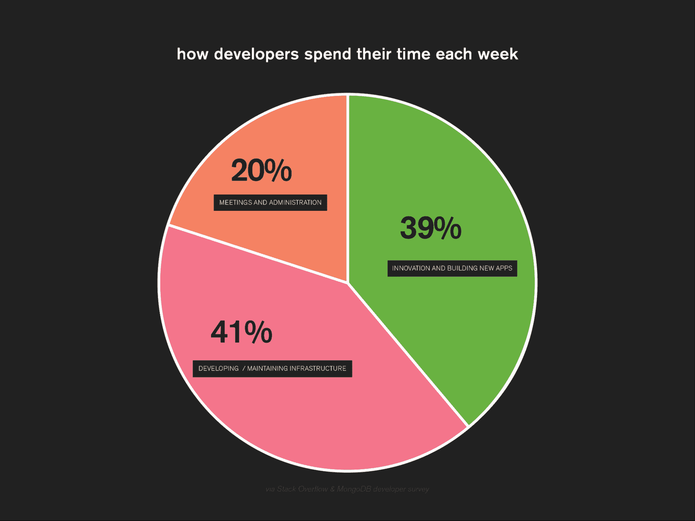

# 无服务器帮助开发人员专注于差异化功能

> 原文：<https://thenewstack.io/serverless-helps-developers-focus-on-differentiating-features/>

开发人员一直在努力将自己从平凡的任务中解放出来，这样他们就可以专注于他们最擅长的事情:编写代码。[根据我们自己的研究](https://www.mongodb.com/blog/post/stack-overflow-and-mongodb-research-unveils-developer-productivity-struggles)，开发人员一天中有 41%的时间花在基础设施维护上，而不是创新或向市场推出新产品。

【T2

在理想世界中，开发人员不会担心非编码任务，如管理主机或容器、供应服务器或任何与裸机有关的任务。这就是我们创建 [MongoDB Atlas 无服务器实例](https://www.mongodb.com/cloud/atlas/serverless?utm_source=the_new_stack&utm_medium=paid_media_content)的原因，它利用了无服务器架构特有的灵活性，并将其与基于文档模型构建的灵活应用数据库平台相结合。

## **什么是无服务器架构？**

 [安德鲁·戴维森

Andrew 是 MongoDB 的云产品副总裁。他之前在谷歌从事全球地图业务，拥有物理学背景，并在南亚生活过。](https://www.linkedin.com/in/andrewad/) 

无服务器计算的兴起可以追溯到 AWS Lambda 等无服务器云功能的引入，它允许开发人员通过简单的 API 调用来启动和停止他们的应用程序。开发人员可以运行代码，而不必为它提供任何硬件。这个概念随后被扩展到堆栈的其他部分，包括数据库。

无服务器架构使开发人员能够在云中构建应用程序，而无需启动服务器。虽然应用程序实际上运行在服务器上，但是服务器的部署和管理是从应用程序开发中抽象出来的。

无服务器架构使开发人员不必考虑服务器配置，例如扩展以满足不断增加的工作负载，或者过度配置并为未使用的资源付费。无服务器架构动态地只使用他们需要的东西，客户只为他们使用的东西付费。

借助无服务器体系结构，基础架构配置决策和容量管理被抽象化。如果开发人员有一个应用程序的想法，无服务器架构免除了他们在第一天就计划所需资源的需要。他们可以选择自己的数据库和开发堆栈，然后开始开发。

一旦应用程序上线并获得客户，开发人员通常必须进行微调，并根据市场或客户需求决定是否需要不断扩大或缩小规模。使用无服务器架构，微调会自动发生，并且总是有足够的资源来满足需求。

无服务器架构有两个定义特征:

1.  弹性扩展—您可以根据您的工作负载进行扩展，包括扩展到零。
2.  基于消费的定价—因为它根据您的需求进行扩展，所以您只需为您使用的东西付费。你不会在闲置的硬件上浪费资源。

无服务器架构降低了应用开发的门槛。而且，随着时间的推移，持续维护和不断优化以确保有足够的资源支持应用程序的需求会减少。

## **无服务器架构的优势**

通过抽象掉硬件层，无服务器架构类似于应用程序开发的 NoOps 方法。开发人员几乎不用担心供应或容量管理，因此可以加快新功能和服务的周转时间。与其说是外包硬件层，不如说是自动化硬件层。

如果这种转变听起来很熟悉，那应该是因为它与组织已经发生的转变相同，组织正在从管理硬件转向实例，并且他们越来越多地用微服务取代整体应用程序，将开发抽象从应用程序转移到服务。无服务器是基础设施管理和软件开发的一种发展，它完全消除了基础设施方面的考虑，并转向以数据和功能为中心的开发思维模式。

在无服务器架构中，该功能通常由事件触发。例如，单个用户登录可以触发多个功能:

1.  登录尝试触发认证功能。
2.  如果成功，它将创建一个登录事件作为输出，该事件将进入一个队列。
3.  从队列中选取该登录事件，触发用户简档功能、报价功能等。

每一个都可以作为事件驱动架构中的无服务器功能来设计和协调。

## **无服务器用例**

无服务器计算非常适合需求突然激增的情况。不经常或不可预测运行的大型工作负载也非常适合无服务器架构。无服务器帮助您避免开发应用程序时自然出现的未知因素，例如当您不知道预期的工作量时。它允许您将应用程序逻辑分解成离散的功能，并在其他服务的工作流中构建一小部分自定义功能。它允许您在托管平台上托管整个应用后端，并将任意数量的终端设备(比如移动设备和物联网设备)连接到该后端。

有些情况下不应该使用无服务器架构，比如您还没有在云中。对于高性能计算，批量配置处理工作负载所需的服务器可能更便宜。长时间运行的功能也会推高无服务器计算的成本。当无服务器体系结构从冷启动开始旋转时，延迟可能是一个问题。

## **结论**

不久前，所有汽车都配备手动变速器。然后，在 50 年代和 60 年代，自动变速器变得更加流行，而手动变速器仍然是越来越少的顽固分子的选择。在不太遥远的将来，可以想象，一旦开发人员意识到开始构建是多么容易，需要的持续维护是多么少，那么无服务器架构就相当于自动传输。你也可以想象一个类似于自动汽车的未来——一个 NoOps 未来——硬件和容量管理完全被抽象掉，开发人员专注于构建功能、微服务和真正的差异化。在此之前，许多组织将继续更多地转向无服务器计算，以实现快速应用程序开发、基于事件的功能和需求激增，而其他组织将坚持使用具有可预测使用模式的工作负载专用容器。

<svg xmlns:xlink="http://www.w3.org/1999/xlink" viewBox="0 0 68 31" version="1.1"><title>Group</title> <desc>Created with Sketch.</desc></svg>