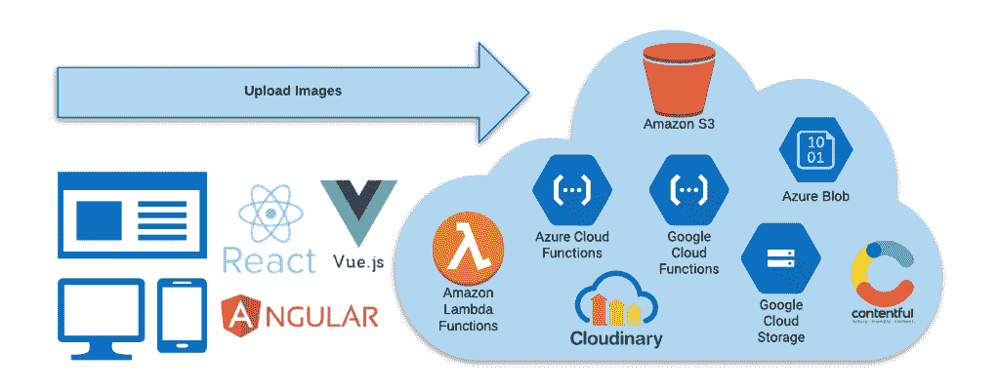

# Angular 和 React 应用程序的无服务器图像上传

> 原文：<https://thenewstack.io/serverless-image-upload-for-angular-and-react-apps/>

您是否曾经在单页面应用程序中实现过图片上传，无论是原生使用 JavaScript 还是使用 React 和 Angular 等框架？对你们大多数人来说，我认为答案是肯定的。然而，曾经有一段时间，这些东西很难实现，特别是更人性化的功能，如拖放，预览，修改图像和上传前的其他任务。

 [阿山·费尔南多

Ashan Fernando 是 99XTechnology 的技术架构师。他经常旅行，与家人和朋友一起享受闲暇时光。写文章和打羽毛球是他的两大爱好。你可以在 Linkedin 上找到更多关于他的细节。](https://www.linkedin.com/in/ashan256/) 

多年来，现代 web 标准和前端框架使得从客户端上传图像变得很容易。随着云服务的进步，例如[亚马逊 S3](https://aws.amazon.com/s3/) 、 [Azure Blob 存储](https://azure.microsoft.com/en-us/services/storage/blobs/)，以及专门的 JavaScript 图像上传服务，例如 [Cloudinary 的](https://cloudinary.com/documentation/javascript_image_and_video_upload)，将图像上传到 web 服务器中的目录由于许多原因正在变得过时。这些无服务器服务不仅提供文件存储，还在实施强大的映像存储后端时处理可扩展性、可靠性和其他挑战。

本文介绍了将图像从单页面应用程序上传到这些不同类型的无服务器服务时常用的技术。

### 通过后端服务器上传图像

如果您一直使用 web 服务器来存储上传的图像，您应该有过编写后端逻辑来接收更新的图像并将其存储在服务器的文件系统上的经历。类似地，您可以编写您的服务器代码来与无服务器图像上传服务通信，以便在后端接收到图像后存储图像。

例如，您可以实现一个后端，一旦接收到图像，它可以将图像上传到像亚马逊 S3 这样的服务。

然而，这种方法有一些缺点。这将增加接收和转发图像的额外资源使用。它影响成本和图像的属性，如大小可能会影响大规模上传性能。另一方面，使用这种方法的主要好处之一是获得一个统一的后端 API 来上传图像和其他功能。

### 直接从浏览器上传图像

这种方法通常用于从浏览器向无服务器图像上传服务上传图像。因为没有中介，所以与以前的方法相比，这是有成本效益的，并且执行得更快。

然而，要直接从单个页面应用程序上传私人内容，需要首先获得一个唯一的用户标识符(例如；签名令牌，Cookie)从图像上传无服务器服务或从后端，以便上传功能仅被认证和授权的人员允许。

### 使用触发器创建缩略图

上传图像时，也可以指示无服务器服务生成缩略图。虽然某些无服务器服务会自动执行此操作，但对于其他服务，则需要自定义缩略图创建。

为了减少同步大规模创建缩略图的开销，一种解决方案是使用图像上传触发器。使用这种方法，一旦图像被上传，它将异步触发一个代码来创建图像的缩略图。如果您使用一种命名约定来链接原始文件和缩略图，那么显示从图像名称派生的缩略图会更容易。这将有助于降低显示相关缩略图的复杂性，而无需查询数据库。

### 处理图像缩略图延迟

当上传图片到后台时，有时会多花几秒钟来生成缩略图。如果您需要在网页组件中上传图像后立即显示缩略图，可以显示加载到浏览器中的大图像，在单页应用程序中使用 CSS 进行缩放。然后，您可以为用户组件初始化实现一个单独的流程，以便下次从无服务器服务加载缩略图。

### 客户端图像预处理

这对于单页面应用程序也是可能的，在单页面应用程序中，图像在被发送到后端无服务器服务之前被处理。这将有助于压缩图像，规模，采取缩略图等。这将减少后端服务在大规模处理图像时的开销。然而，一些无服务器服务已经在后端完成了，这一步不是必需的。

通过 Pixabay 的特征图像。

<svg xmlns:xlink="http://www.w3.org/1999/xlink" viewBox="0 0 68 31" version="1.1"><title>Group</title> <desc>Created with Sketch.</desc></svg>